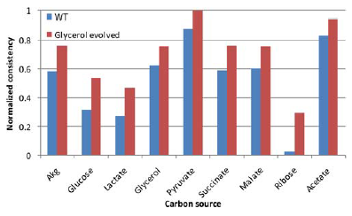
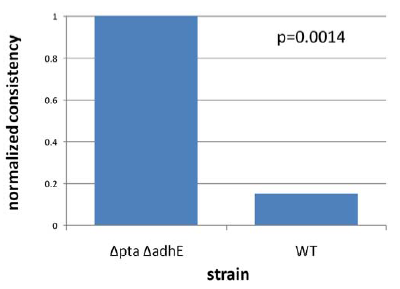
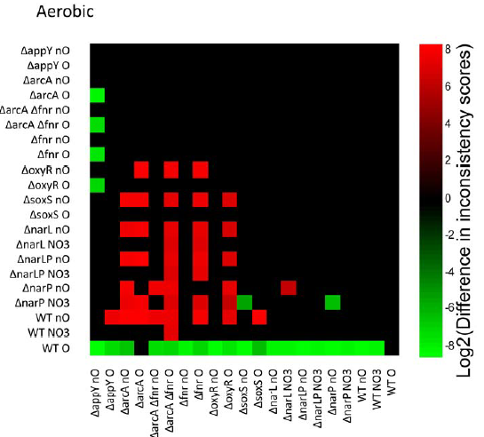
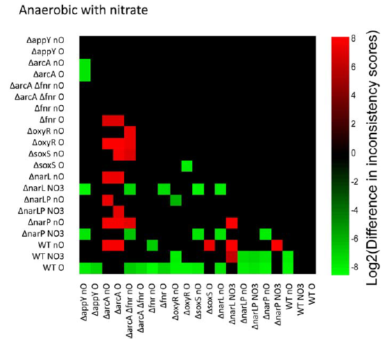

# Context-Specific Metabolic Networks Are Consistent with Experiments (GIMME)

GIMME 알고리즘의 목표는 주어진 조건 하에서 세포가 사용하는 특정한 기능을 반영하는 context-specific metabolic network를 구축하는 것입니다. 이를 위해 유전자 발현 데이터와 대사 재구성, 그리고 하나 이상의 필수 대사 기능(RMF)이 입력으로 사용됩니다. 알고리즘은 이러한 입력을 활용하여 세포가 주어진 기능을 달성하기 위해 사용하는 반응의 부분집합을 예측하고, 이를 통해 생물학적으로 현실적인 metabolic network를 생성합니다.

## Abstract

미생물과 일부 포유류 genome에 대한 세포 대사의 reconstructions이 공개되어 있습니다. 현재까지 이러한 reconstructions들은 "genome-scale"이며, genome annotation에 의해 함축된 모든 반응과 직접적인 실험적 증거가 있는 반응을 포함하려고 노력합니다. 분명히, genome-scale의 reconstructions 중 많은 반응은 특정 조건이나 특정 세포 유형에서 활성화되지 않을 것입니다. 이러한 포괄적인 genome-scale의 reconstructions을 context-specific 네트워크로 조정하는 방법은 특정 상황에 대한 예측적인 인 실리코 모델링을 지원할 것입니다. 우리는 이러한 목표를 달성하기 위한 Gene Inactivity Moderated by Metabolism and Expression (GIMME)라는 방법을 제시합니다. GIMME 알고리즘은 양적인 유전자 expression data와 하나 이상의 예측된 대사 목표를 사용하여 해당 data와 가장 일치하는 context-specific reconstructions을 생성합니다. 또한 이 알고리즘은 특정 대사 목표에 대해 얼마나 consistency 있는 일련의 유전자 expression data인지를 나타내는 양적인 consistency 점수를 제공합니다. 우리는 이 알고리즘이 세균의 적응적 진화, metabolic engineering 균주의 합리적 설계, 그리고 인간의 골격근세포에 대한 생물학적 실험과 직관과 일치하는 결과를 생성한다는 것을 보여줍니다. 이 작업은 expression 프로파일링 data가 있는 조건에 특화된 제약 조건 기반 대사 모델을 생산하기 위한 진전을 나타냅니다.

## Introduction

일반적으로, genome-scale의 metabolic network는 특정 생물체의 모든 알려진 대사 유전자와 반응을 포함하도록 재구성됩니다. 이러한 reconstructions은 따라서 언제든지 생물체에서 작동하는 대사 반응의 superset입니다. 세포에서 어떤 효소가 활성화되는지를 결정하는 과정은 종종 제약 기반 연구에서 간과됩니다. 특히, 특정 시간에 활동할 가능성이 있는 효소들의 부분 집합을 선택하는 세포 내의 전사 조절 과정이 흥미롭습니다.

대사의 전사 조절에 대한 지식은 다양한 소스에서 나옵니다. low level에서는 일부 대사 유전자의 전사를 제어하는 규제 단백질들을 알 수 있습니다. high level에서는 유전자 expression data가 특정 시간에 무엇이 전사되고, 따라서 어떤 효소가 아마도 세포에서 활성화되어 있는지를 보여줍니다. 이러한 두 가지 유형의 지식은 주어진 조건 하에서 metabolic network를 세밀화하는 데 사용될 수 있습니다.

특정 상황에서 유전자 expression을 조절하는 방법을 연구하는 세 가지 방법이 있습니다. 

첫째, **전사 조절 네트워크(TRN)가 있는 경우**, **셀의 전사 상태를 특정 입력에 대해 계산할 수 있습니다**. 그러나 genome-scale의 TRN은 없습니다. 심지어 대장균의 경우에도 이중 간섭 실험에서 현재 약 1/4 또는 1/3 정도의 TRN만 알려져 있다고 추정되고 있습니다. ChIP-chip data 및 기타 접근 방법은 더 포괄적인 재구성을 가능하게 할 것입니다. 

둘째, **TRN이 없는 경우**, 생리적 목적을 달성하기 위해 생물체가 최적의 반응 세트를 선택한다는 가정에 기초한 최적화 절차가 사용되었습니다. 그러나 이러한 문제에 대해 여러 가지 해결책이 있으며, flux data가 없는 경우 내부 반응이 어떻게 사용되는지 결정할 수 있는 진짜 방법은 없습니다. 또한, 목표를 명시하는 것은 'user-bias'를 도입하며, 그러한 목표가 실제로 진정한 생리학적 상태와 관련이 없을 수 있습니다.

규제를 연구하는 세 번째 접근 방법은 사용 가능한 expression 프로파일링 data에 의존합니다. **condition이 examined되는 상황에서 이러한 data를 사용할 수 있다면, genome-scale의 재구성에서 고려된 ORF의 expression을 직접 조사할 수 있습니다.** metabolic network 재구성은 다른 상태의 유전자 expression data와 결합하여 생물체의 규제 원칙을 식별하는 데 사용될 수 있습니다. 경로 기반 분석 방법은 여러 유전자의 expression 상태에 기초하여 반응 경로 전체의 사용을 예측하는 데 사용될 수 있습니다. 유전자 expression data는 이전에는 효모에 적용되어 유전자별로 어떤 반응이 비활성일 수 있는지 예측하는 데 사용되었습니다. 더 최근에는 유전자 expression data가 기본 모드로 해석되어 접근 방식이 더 기능적인 관점으로 전환되었습니다.

이러한 방법의 결과는 사용된 expression data의 품질에 의존합니다. expression data는 노이즈가 많으며, 칩의 수천 개 지점의 형광 강도를 mRNA 분자 수의 반정량적인 측정값으로 변환하는 다양한 방법은 동등한 결과를 내지 않습니다. 중요한 것은 노이즈 때문에 많은 거짓 양성을 포함하지 않고 현재 mRNA 전사체의 포괄적인 세트를 정의하는 것은 불가능합니다. 실제로, 한 마디로 말할 수 있습니다. (1) 이 몇 가지 mRNA는 세포에 거의 확실히 존재합니다. 또는 (2) 이 많은 mRNA 중 일부는 세포에 있을 수도 있습니다. 경로 기반 방법은 특정 경로에 할당된 모든 mRNA가 함께 존재하거나 없다고 가정함으로써 노이즈 문제를 피하려고 시도합니다. 이는 편향적이고 인위적인 경로 정의에 의존하며, 경로 내에서 작용하는 반응은 그 경로 외부에서도 작용할 수 있으므로 이러한 가정의 사용을 제한합니다.

우리는 여기서 expression data를 목적 함수와 결합하여 잠재적으로 노이즈가 있는 data에도 불구하고 기능적 모델을 생성합니다. 우리는 세포 내와 인간 세포 모두에서 대사 반응을 제한하기 위해 genome-scale의 transcriptomic data의 사용을 설명하며, context-specific metabolic network를 재구성하고 비교할 수 있도록 합니다. 우리는 세포의 가정된 기능적 상태와 유전자 expression data의 consistency을 양적으로 정의하여 생리학적 data와 일치함을 입증합니다. context-specific metabolic network는 다양한 세포 유형과 그에 상응하는 대사 과정으로 인해 인간 대사를 정확하게 모델링하는 데 거의 필수적일 것으로 예상됩니다.

## Results/Discussion

### GIMME Algorithm


```
Figure 1. GIMME 알고리즘의 흐름도 도식 표현. 
        
GIMME 알고리즘은 세 가지 입력을 받습니다: 
1. gene expression mapped to reactions(또는 다른 데이터 유형) 
2. a metabolic reconstruction 
3. 하나 이상의 RMF(Required Metabolic Functionalities). 

metabolic reconstruction은 데이터 세트를 통해 매핑되며 사용할 수 없는 반응을 제거하고 reduced model을 생성합니다. 필요에 따라 반응을 다시 삽입하여 RMF(성장 및/또는 ATP 생산과 같은)를 달성합니다. 
결과적으로, 데이터와 최소한의 불일치를 가진 기능적이고 context-specific 모델이 생성됩니다. consistency 점수는 데이터와의 불일치를 양적으로 측정하여 데이터와의 최소 플럭스 합을 보여줍니다. 
```

GIMME 알고리즘은 context-specific metabolic network의 구성 방법을 의미하며, Figure 1에 설명되어 있습니다. 알고리즘의 입력으로는 다음이 필요합니다: 

1. 일련의 gene expression 데이터, 
2. genome-scale reconstruction, 
3. 세포가 달성하기로 가정되는 하나 이상의 Required
Metabolic Functionalities(RMF). 

초기 테스트 결과 (Figure에는 표시되지 않음)는 단백질체 데이터가 expression 프로파일링 데이터로 대체될 수 있음을 시사합니다. 

이 세 가지 입력이 주어지면, 알고리즘은 네트워크 내에서 활성화될 것으로 예측되는 반응 목록과, gene expression 데이터와 가정된 목표 기능 간의 불일치를 양적으로 분류하는 inconsistency scores (IS / inconsistency score)를 생성합니다.     
이 inconsistency scores는 정규화된 consistency 점수(NCS \ normalized consistency score)로 변환되어 **각 gene expression 데이터 세트가 특정 대사 기능과 얼마나 잘 일치하는지 상대적으로 비교할 수 있게 합니다.**    
간단히 말해, 지정된 cutoff 아래의 mRNA 전사체 수준에 해당하는 반응은 일시적으로 **비활성화**됩니다.     
세포가 이러한 반응 중 적어도 하나 없이 원하는 기능을 달성할 수 없는 경우, 선형 최적화를 사용하여 다시 활성화할 가장 일관된 반응 집합을 찾습니다. Figure 2에 설명된 것처럼, 각 반응이 재활성화되어야 하는 필요한 플럭스와 cutoff로부터의 거리의 곱으로 inconsistency scores가 계산됩니다. 작은 inconsistency scores는 데이터가 RMF와 더 일치함을 나타냅니다. 

GIMME 알고리즘은 다음의 두 단계 절차를 통해 최소한의 inconsistency scores를 가진 네트워크를 생성합니다:

(A) 각 RMF를 통한 최대 가능한 플럭스를 찾습니다(모든 반응의 사용을 허용합니다).
(B) RMF를 특정 최소 수준 이상에서 작동하도록 제한합니다(일반적으로 [A]에서 발견된 최대의 백분율) 및 양적 데이터 세트와 가장 잘 일치하는 사용 가능한 반응 집합을 식별합니다.

Part A는 플럭스 균형 분석(FBA)을 통해 달성됩니다. Part B는 다음과 같은 선형 프log래밍 문제의 해결을 포함합니다:


    Figure 2. inconsistency scores의 계산. 

    각 반응의 inconsistency scores는 cutoff로부터의 편차를 반응을 통한 필요한 플럭스와 곱하여 계산됩니다. 
    이 예에서 녹색 반응은 cutoff인 12보다 높은 데이터를 가지고 있습니다(이는 매개변수입니다; 텍스트 참조). 빨간색 반응은 cutoff 아래의 데이터를 가지고 있습니다(11.4 및 8.2). 
    각 반응에 해당하는 inconsistency scores의 계산은 플럭스에 cutoff로부터의 편차를 곱하여 숫자로 표시됩니다. 이러한 값들은 모두 inconsistency scores를 증가시키며, 이는 데이터가 라크테이트에서의 성장 목표와 덜 일치한다는 것을 의미합니다.
    더 큰 필요한 플럭스와 cutoff로부터의 더 큰 편차는 모두 inconsistency scores를 증가시킵니다. 전체 inconsistency scores는 모든 개별 반응 점수의 합입니다.


수식에서, $\mathbf{x}_i$는 각 반응에 매핑된 normalized된 gene expression 데이터입니다. $\mathbf{x_{cutoff}}$는 사용자가 설정한 cutoff로, 이 cutoff를 초과하는 반응은 확실히 존재합니다. 이 cutoff를 초과하는 반응에는 inconsistency scores에 기여하지 않습니다.    
S는 반응을 열로, 대사물질을 행으로, coefficient를 elements로 하는 coefficient 행렬입니다.    
v는 각 반응을 통한 플럭스 흐름을 양적으로 설명하는 플럭스 벡터입니다. ai와 bi는 각 반응에 대한 하한과 상한 값을 나타내며, 각각 해당 반응의 최소 및 최대 허용 플럭스를 정의합니다.    
이러한 bound는 단계 (1)에서 RMF(s)의 최대값에 따라 설정되며, 일반적으로 각 RMF에 해당하는 하한을 해당 최대값의 일부로 설정하여 수행됩니다. 대부분의 하한과 상한 값은 RMF에 해당하지 않으며, 표준 FBA 문제와 동일한 값으로 설정됩니다. 일반적으로 임의로 높거나 낮은 값으로 설정되지만, 입력 제약 조건(예: 포도당 흡수) 및 불가역 반응과 같은 경우 유한한 값으로 설정될 수도 있습니다.

위 최적화 문제는 절댓값 연산자의 존재로 인해 일반적으로 해결이 어려울 수 있지만, 이 경우 간단한 간소화로 위 문제를 표준 LP 문제로 변환합니다. 아마도 역반응이 가능한 각 반응은 두 개의 불가역 반응으로 변환되어 모든 플럭스가 양수로 제한되며, 절대값의 필요성이 제거됩니다.

일반적으로, 일부 반응에는 사용 가능한 데이터가 없을 수 있습니다. 알고리즘은 보수적인 접근 방식을 취하고 이러한 반응을 active로 지정합니다. 따라서 "gene inactivation"라는 용어가 방법 이름의 일부입니다.    
알고리즘은 이러한 반응을 데이터가 cutoff를 초과한 것처럼 다룹니다. 이는 absent 데이터에 대한 벌점을 피하기 위한 보수적인 접근 방식입니다. 데이터 부족은 결과 해석에 영향을 미칩니다. 더 나은 데이터가 주어지면 이러한 반응이 absent으로 판명될 수 있으며, 결과적으로 다른 반응을 활성화해야 할 수도 있습니다. 분명히, 제한된 데이터로 인해 결과를 신중하게 고려해야 합니다. 일반적으로 이는 대장균보다는 인간 metabolic network에서 훨씬 더 큰 문제입니다.

### Context-Specific Networks for E. coli

GIMME 알고리즘은 여러 가지 다른 조건에서 대장균을 위한 context-specific metabolic network를 생성하고 이 박테리아의 다른 균주 간의 inconsistency scores를 비교하기 위해 사용되었습니다. 거의 모든 경우에 inconsistency scores가 실험 데이터와 일치한다는 것을 보였습니다. 대장균의 다양한 성장 조건에서 유전자 발현 데이터가 입력 데이터로 사용되었고, 독립적인 유효성 검증 데이터는 상대적인 성장 및 생성물 분비를 설명하는 형질 데이터였습니다.

#### Strains adapted to novel substrates.

실험실에서는 대장균의 성장 속도를 향상시키기 위해 Adaptive evolution가 사용되었습니다. 대장균의 대사 모델은 포도당 이외의 기질을 탄소원으로 사용할 때 초기에 실험실에서 달성하는 것보다 더 나은 성장을 예측합니다. 그러나 성장을 최대화하기 위한 선택 압력이 가해지면, 실제 성장은 예측과 일치하도록 개선되는 것으로 나타났으며, 일반적으로 세포의 serial passage 후 1~2개월 후에 나타납니다. GIMME 알고리즘을 사용하여 [17]에서 설명된 세 가지 유형의 균주에 대한 context-specific metabolic network를 구축했습니다: (1) wild-type 균주, (2) 글리세롤 성장에 적응된 균주, (3) 라크테이트 성장에 적응된 균주입니다.

모델을 구성하는 데 사용된 gene expression data는 [17]에서 설명된 내용을 포함하는 CEL 파일들로 구성되었으며, GCRMA [14]를 사용하여 normalized되었습니다. 이 데이터는 reconstruction에서 gene-protein-reaction associations을 사용하여 유전자에서 반응으로 매핑되었습니다.    
임계값(xcutoff)은 12로 설정되었으며, 이는 normalized된 값이 12보다 큰 반응이 존재한다고 가정하는 것을 의미합니다. 유전자가 발현한 값이 일정 임계값 이상인 경우 해당 반응이 존재하는 것으로 간주되었습니다.    
이와 유사한 결과는 다른 임계값에서도 관찰되었습니다. 필수 대사 기능(RMF)은 특정 탄소원에서의 성장이었고, context-specific metabolic network는 최적 성장의 90% 이상을 유지하도록 강제되었습니다. 진화된 균주들이 거의 항상 다양한 탄소원에서 wild-type 균주보다 더 나은 성장을 하기 때문에 [19], 아홉 가지 탄소원에 대한 최적 성장을 위한 metabolic network가 구축되었습니다. 

결과는 Figure 3 (글리세롤 적응된 균주)와 Figure 4 (라크테이트 적응된 균주)에 나타나 있습니다. 이 Figure들에서 inconsistency scores를 사용하여 정규화된 consistency 점수를 계산했으며, 높은 정규화된 consistency 점수는 유전자 발현 프로파일이 목표와 더 일치한다는 것을 나타냅니다.    
이 Figure들은 진화된 균주들의 유전자 발현 상태가 거의 모든 경우에는 9가지 기질에서의 성장과 유사하게 더 일관되어 있음을 보여주며, 이는 [19]의 형질적 발견과 거의 일치합니다. 이러한 결과는 진화된 균주들이 다양한 탄소원에 대한 최적 성장을 위한 네트워크의 사용과 관련하여 wild-type 균주보다 더 일관된 유전자 발현 상태를 갖고 있음을 보여줍니다.



```
Figure 3. Glycerol-evolved strain normalized consistency
scores. 

정규화된 consistency 점수는 텍스트에서 설명한대로 inconsistency scores에서 직접 계산됩니다. 더 높은 정규화된 consistency 점수는 유전자 발현 데이터가 RMF와 상대적으로 더 일치한다는 것을 나타냅니다. 따라서 여기에서는 글리세롤 적응 균주의 유전자 발현 데이터가 테스트된 각 탄소원에 대한 매우 효율적인 성장과 상대적으로 더 일치합니다. 순열 테스트에 의해 결정된 p 값은 모든 경우에서 0.01보다 작습니다.
```


```
Figure 4. Lactate-evolved strain consistency scores. 

이 Figure은 글리세롤에 진화된 균주와 동일한 결과를 보여줍니다. 테스트된 각 탄소원에 대한 성장에 대한 정규화된 consistency 점수는 진화된 균주에서 더 높으며, 이는 진화된 균주의 유전자 발현 데이터가 각 탄소원에 대한 효율적인 성장과 더 일치한다는 것을 나타냅니다.
```

#### Metabolic engineering strain

metabolic engineering은 less expensive set of molecules에서 가치 있는 product를 생산하기 위해 박테리아 strain을 최적화하는 것을 목표로 합니다.    
metabolic engineering을 위한 strain의 합리적 설계는 유전체 규모의 대사 모델과 함께 가능합니다. 대장균의 knock-out strain의 적응적 진화는 이러한 strain을 최적화하는 데 사용될 수 있습니다. 우리는 $\Delta$pta $\Delta$adhE strain의 복제체와 wild-type strain에 대한 GIMME를 사용하여 Lactate을 Glucose의 무산소 성장의 부산물로 생산하는 것을 목표로하는 실험 [21]에서 설명된 것과 같은 속도로 성장하고 Lactate 생산량을 고정시켰습니다. Figure 5에서 볼 수 있듯이, 설계된 strain는 실험 데이터가 나타내는 것과 정확히 일치하는 성장-Lactate 생산에 더 적합한 유전자 발현 데이터를 갖고 있습니다. 유전자 삭제 및 이후 진화는 wild-type strain보다 성장에 결합된 Lactate 생산과 더 일관된 대사 유전자 발현 상태로 이어졌습니다.

우리는 이 데이터셋을 사용하여 알고리즘의 견고성을 두 가지 다른 요인에 대해 검증했습니다. 먼저, 8에서 14까지 0.1씩 증가하는 임계값에 대한 결과를 다시 계산하여 임계값을 변경하는 효과를 테스트했습니다. 우리는 모든 임계값에 대해 consistency 점수가 유의하게 다르다는 것을 발견했습니다. 일부 임계값의 경우 p 값이 다른 임계값보다 좋지 않았지만, 테스트 범위 내의 모든 임계값에 대해 p는 0.01보다 작았습니다. 

두 번째로, 잭나이프 테스트를 사용하여 알고리즘의 견고성을 확인했습니다. 우리는 100번의 반복에서 반응에 매핑된 표현 값의 5%를 무작위로 제거하고 맥락별 네트워크와 consistency 점수를 재계산했습니다. 우리는 모든 반복에서 동일한 결론에 도달했으며, 일부 경우에는 p 값이 모든 데이터를 사용할 때보다 조금 낮았습니다. 모든 경우에서 결론은 p 값이 0.02보다 작았으며, **이는 가능한 한 많은 반응이 데이터에 할당될 때 알고리즘의 통계적 성능이 더 높아져야 함을 시사합니다.**

#### Terminal electron acceptor effect on network



```
Figure 5. Metabolic engineering strain consistency score.

Lactate를 생산하기 위해 설계된 대장균 균주의 정규화된 consistency 점수는 $\Delta$pta $\Delta$adhE 균주가 와일드 타입과 비교했을 때 Lactate의 동시 생산과 성장에 일관된 대사 유전자 발현 상태를 보여줍니다. 이 더 높은 정규화된 consistency 점수는 더블 삭제 균주의 유전자 발현 데이터가 대사공학 목표와 와일드 타입 균주보다 더 일관된 것을 나타내며 실험 측정과 일치합니다.
```

대장균의 성장은 주로 산소 또는 아질산과 같은 terminal
electron acceptors의 가용성에 따라 다릅니다. 전체 21가지 다른 균주/전자 수용체 조건의 유전자 발현 데이터가 분석되어 산소, 무산소, 아질산 첨가 또는 미첨가 조건에서의 성장에 가장 일관된 모델을 구축했습니다. 

**기대되는 것은 주어진 조건(예: 공기중에서)에서 취한 균주 데이터가 해당 조건(다시 말해, 공기중에서)에서의 성장과 더 일치할 것이라는 것입니다.** 모든 consistency 점수 사이의 Pairwise comparison이 수행되었으며, 결과는 순서대로 공기중에서, 무산소에서, 그리고 무산소 아질산 조건에서의 성장을 나타내는 Figure 6, 7 및 8에 나타나 있습니다. 

녹색 상자는 y 축에 표시된 균주/조건이 x 축에 표시된 균주보다 성장에 더 일관되어 있는 것을 나타내며, 빨간색 상자는 그 반대를 나타냅니다. 녹색 또는 빨간색 색상의 강도는 시각화 스케일링을 위해 log2 변환 후 inconsistency scores의 차이를 나타냅니다. 검은 상자는 통계적으로 유의한 (p<0.05) 결론을 얻을 수 없음을 나타냅니다. 통계적으로 유의한 결론이 가능한 모든 경우에서 산소를 이용한 성장의 유전자 발현은 무산소에서의 성장보다 무산소에서의 성장에 더 일관되어 있습니다(). 통계적으로 유의한 경우의 99%에서 무산소 성장에서의 유전자 발현은 산소를 이용한 성장보다 무산소에서의 성장에 더 일관되어 있습니다(Figure 7). 아질산을 이용한 무산소 성장에서의 경우 90%의 경우가 해당합니다(Figure 8). 예상대로, 각 조건에 대해 서로 다른 하위 반응 집합이 활성화됩니다. 이전 결과와 함께 고려하면, 이는 알고리즘에서 나타나는 consistency 점수에 대한 강력한 지원을 제공하며 긍정적인 제어를 제공합니다.



```
Figure 6. 유산소 조건에서 consistency의 pairwise comparisons. 

inconsistency scores의 log2 변환의 그래픽 표현입니다. 노란색 상자는 y축의 샘플이 유산소 성장과 더 consistency 있음을 나타냅니다. 빨간색 상자는 그 반대를 나타냅니다. p 값이 0.05보다 작은 차이는 비워둡니다. 빨간색 또는 초록색의 색조는 inconsistency scores의 차이의 log2를 양적으로 나타냅니다. 여기서 초록색과 빨간색 블록의 위치는 통계적으로 유의미한 모든 경우에 산소가 공급된 균주가 산소가 공급되지 않은 균주보다 효율적인 유산소 성장과 더 consistency 있는 유전자 발현을 갖고 있음을 나타냅니다.
```

```
Figure 7. anaerobic 조건에 대한 consistency의 pairwise comparisons.

inconsistency scores의 log2 변환의 그래픽 표현입니다. 초록색 상자는 y축의 샘플이 anaerobic 성장과 더 consistency 있음을 나타냅니다. 빨간색 상자는 그 반대를 나타냅니다. p 값이 0.05보다 작은 차이는 비워둡니다. 빨간색 또는 초록색의 색조는 inconsistency scores의 차이의 log2를 양적으로 나타냅니다. 초록색과 빨간색 블록의 위치는 통계적으로 유의미한 거의 모든 경우에 산소가 공급되지 않은 균주에서의 유전자 발현 데이터가 산소가 공급된 균주보다 효율적인 anaerobic 성장과 더 consistency 있음을 보여줍니다.
```

```
Figure 8. 질산 조건에 대한 consistency의 pairwise comparisons. 

inconsistency scores의 log2 변환의 그래픽 표현입니다. 초록색 상자는 y축의 샘플이 질산 성장과 더 consistency 있음을 나타냅니다. 빨간색 상자는 그 반대를 나타냅니다. p 값이 0.05보다 작은 차이는 비워둡니다. 빨간색 또는 초록색의 색조는 inconsistency scores의 차이의 log2를 양적으로 나타냅니다. 초록색과 빨간색 블록의 위치는 대부분의 경우에, 질산을 최종 전자 수용체로 사용하여 성장한 균주에서의 유전자 발현이 이 조건 하에서의 효율적인 성장과 더 consistency 있음을 보여줍니다.
```
#### Context-Specific Networks for Human Cells
