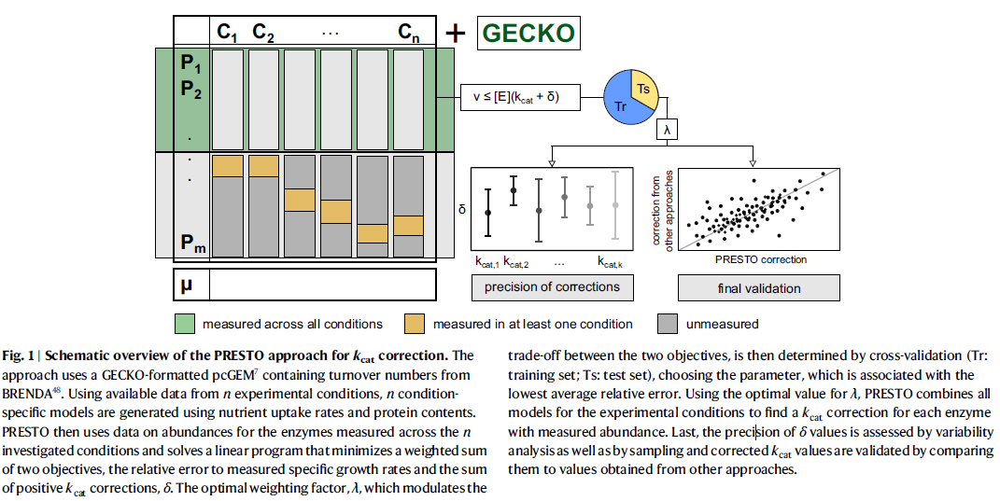
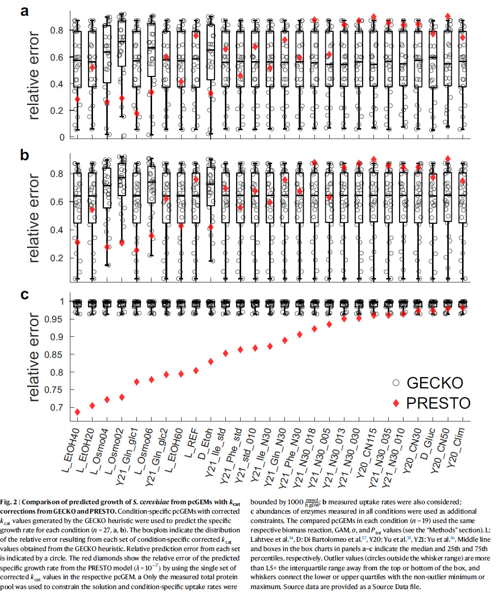
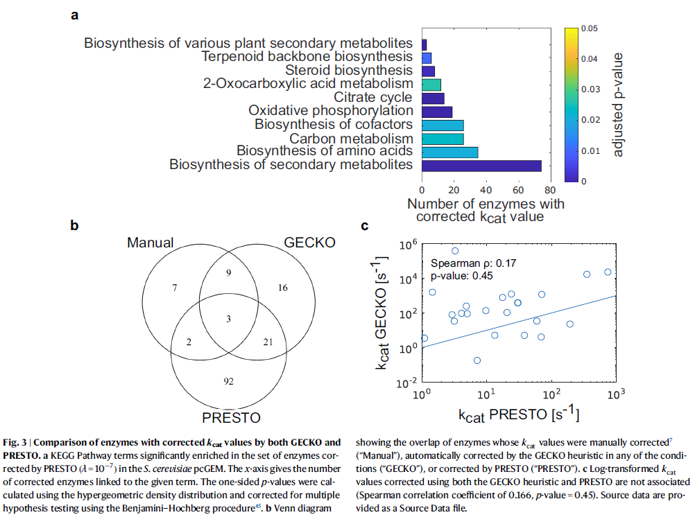
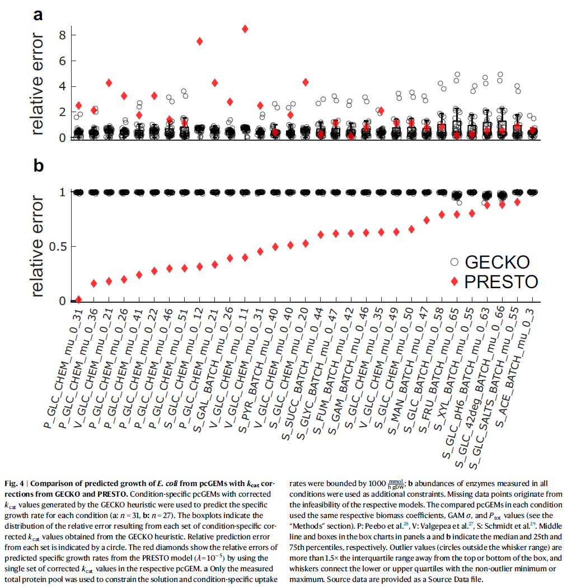

# Data integration across conditions improves turnover number estimates and metabolic predictions

## Abstract

turnover number는 효소의 중요한 특성을 나타내며, 제약 기반의 대사 모델링에서 사용될 때 다양한 세포 표현형의 예측 정확성을 높일 것으로 기대됩니다. in vivo turnover number는 개별 실험에서 얻은 반응 속도와 효소 농도 측정치를 통합하여 얻을 수 있습니다. 그러나 condition-specific인 세포 표현형의 예측을 개선하는 데 이들의 기여는 여전히 모호합니다. **여기서 우리는 사용 가능한 in vitro(in vitro) 및 in vivo(in vivo) turnover number가 protein-constraint 모델의 Escherichia coli와 Saccharomyces cerevisiae의 condition-specific 성장률을 예측하는 데 있어, 특히 단백질 농도가 고려될 때, 저조한 예측을 초래한다는 것을 보여줍니다.** 우리는 단백질체학 및 생리학적 데이터를 동시에 고려하여 turnover number를 수정하면 condition-specific 성장률의 예측이 향상된다는 것을 증명합니다. 또한, 얻어진 estimates는 해당 in vitro turnover number보다 더 정확합니다. 따라서 우리의 접근법은 turnover number를 수정할 수 있는 수단을 제공하며, 다른 생물의 kcatome을 목록화하는 길을 열어줍니다.

## Introduction

게놈 규모 대사 모델(GEMs)과 제약 기반 모델링의 발전은 세포 자원이 다양한 세포 작업을 수행하는 데 어떻게 사용되는지에 대한 이해를 개선했습니다. 최근의 발전은 개별 효소의 촉매 능력이 Enzyme abundance 할당과 연결된 protein-constraint GEMs(pcGEMs)의 개발에 크게 힘입었습니다. 이러한 모델은 다양한 탄소 원천에서 최대 specific growth rates, 플럭스 분포, 그리고 Escherichia coli와 Saccharomyces cerevisiae의 다른 복잡한 표현형의 더 정확한 예측으로 이어졌습니다. **그러나 pcGEMs의 개발은 생물 특이적 효소 turnover number(kcat)의 통합, 즉 생물의 kcatome에 크게 의존합니다.**

**in vitro 특성을 기반으로 한 생물의 kcatome을 측정하는 것은 특정 효소를 정제할 수 없고, 기질을 사용할 수 없으며, 필요한 보조 인자에 대한 지식이 부족하여 제한적입니다.** 따라서 이들의 in vivo 표현형 연구에 대한 관련성은 여전히 의문입니다. **in vivo turnover number에 대한 proxies 값, 즉 maximal apparent catalytic rates는 다양한 성장 조건 또는 유전적 변형하에서 protein abundances 측정과 함께 플럭스 예측을 위한 제약 기반 접근법을 결합하여 추정할 수 있습니다.** 개별 데이터 세트를 사용하는 condition-specific estimates를 순위 매기는 이 접근법의 결과는, 일반적으로 in vivo turnover number proxies 값이 E. coli에서 in vitro kcat 값과 일치함을 보여줍니다. 그러나 S. cerevisiae와 A. thaliana의 데이터로 응용한 결과는 이 in vivo turnover number proxies 값이 in vitro 측정을 반영하지 않는다는 것을 나타냈습니다 **(E.coli에서는 잘 됐는데 다른 strain에서는 잘 안되는듯)**. kcatome을 추정하는 또 다른 접근법은 효소의 다양한 특성(예: 네트워크 기반, 구조 기반 및 생화학적 특성)을 사용하는 머신러닝 및 딥러닝 방법에 전적으로 의존하며, 이는 in vitro turnover number의 변동성의 최대 70%를 설명할 수 있는 예측 모델을 생성합니다.

turnover number estimates는 여러 제약 기반 접근법에 의해 대사 모델에 통합되며, 이는 coarse-grained(예: MOMENT5, sMOMENT20, eMOMENT21, GECKO7 등)과 fine-grained(예: resource balance analysis1 및 ME-models)으로 나뉩니다. 이 중 GECKO7은 protein-constraint의 elegantly structured formulation으로 인해 최근 여러 연구에서 채택되었습니다. 또한 **GECKO**는 **protein contents**과 모델에 포함된 **효소의 질량 fraction(f)** 및 모든 효소의 **평균 in vivo saturation(σ)**를 고려한 correction factors를 통합할 수 있게 하여 condition-specific 모델 개발을 촉진합니다. in vivo turnover number의 데이터 기반 estimates는 pcGEMs에서 kcat 값의 coverage를 향상시키지만, **이용 가능한 estimates는 총 단백질 질량의 할당을 사용할 때 과도하게 제약된 모델로 이어지는 경우가 많습니다.** 이는 FBA(FBA)에서는 고려되지 않습니다.

여기서 우리는 turnover number의 protein abundances 기반 correction(PROTEIN-ABUNDANCE-BASED CORRECTION OF TURNOVER NUMBERS)을 위한 scalable 제약 기반 접근법인 PRESTO를 제안합니다. **PRESTO는 여러 조건에서 pcGEMs의 예측과 세포 표현형 측정치를 동시에 일치시켜 turnover number를 수정**합니다. 제약 기반 접근법으로서 PRESTO는 제안된 correction의 variability를 조사할 수 있도록 합니다. **우리는 PRESTO로 수정된 turnover number를 사용한 S. cerevisiae의 pcGEMs의 성장 예측이 enzyme control coefficients에 의존하는 contending heuristic에 기반한 kcat 값을 포함하는 모델보다 더 정확하다는 것을 보여줍니다.** 또한 동일한 결론이 PRESTO를 사용하여 E. coli pcGEM에 Enzyme abundance를 통합할 때도 적용된다는 것을 입증합니다. 따라서 PRESTO는 생명공학적 응용이 가능한 생물의 pcGEMs의 적용성을 넓히고, 유전자형 특이적 kcatome estimates에 도달할 수 있는 길을 열어줍니다.

## Result

### Protein-abundance-based correction of turnover numbers

**protein abundances 기반 turnover numbers correction**

---

Fig. 1 | PRESTO 접근 방식의 도식적 개요

이 접근 방식은 BRENDA48에서 얻은 turnover numbers를 포함하는 GECKO 형식의 pcGEM7을 사용합니다. n개의 실험 조건에 대한 사용 가능한 데이터를 사용하여, 영양소 uptake rates와 protein contents을 이용하여 n개의 조건별 모델이 생성됩니다. PRESTO는 이후 n개의 조건에서 측정된 Enzyme abundance 데이터를 이용하고, 측정된 specific growth rates에 대한 relative error와 양의 kcat corrections 합의 가중합을 최소화하는 선형 프로그램을 해결합니다. 최적의 weighting factor λ는 교차 검증을 통해 결정됩니다 (Tr: 훈련 세트; Ts: 테스트 세트). 가장 낮은 평균 relative error와 관련된 parameter를 선택합니다. 최적의 λ 값을 사용하여 PRESTO는 실험 조건에 대한 모든 모델을 결합하여 측정된 Enzyme abundance를 가진 각 효소에 대한 kcat corrections을 찾습니다. 마지막으로, δ 값의 변동 분석 및 샘플링을 통해 δ 값의 정밀도를 평가하며, 수정된 kcat 값은 다른 접근 방식에서 얻은 값과 비교하여 유효성을 검증받습니다.

---

특정 조건 세트에서 protein abundances 데이터 세트를 사용하면 pcGEM에서 turnover numbers를 가진 효소를 **세 그룹**으로 나눌 수 있습니다. 예를 들어, 최근 S. cerevisiae에서 in vivo turnover numbers를 추정하는 데 사용된 protein abundances 데이터 세트는 27개의 사용된 조건 중 각각 45%, 41%, 14%가 전체적으로 측정되었고, 최소 한 번(하지만 모두는 아님), 그리고 전혀 측정되지 않았습니다. 따라서 이러한 단백질 클래스의 kcat 값을 교정하기 위한 데이터 지원이 다릅니다. PRESTO는 pcGEM에 통합된 초기 turnover numbers correction과 predicted specific growth rates의 평균 relative error의 weighted linear combination을 최소화하는 선형 프로그램을 해결하는 데 의존합니다(그림 1, “방법” 섹션 참조). 또한, 모든 조건에서 측정된 단백질에 대한 단백질 제약을 통합하고 steady state를 보장하면서 10번의 반복을 통해 K-fold cross-validation(여기서 K=3)을 사용합니다(그림 1, “방법” 섹션 참조). **조건의 training set는 각각의 in vivo protein abundances를 사용하여 single set of corrected in vitro kcat values를 생성하는 데 사용됩니다.** **결과적으로 corrected kcat 값은 pcGEM과 FBA을 사용하여 테스트 세트의 각 조건에 대한 predicted specific growth rates의 relative error를 결정하는 데 사용**되며, 총 protein contents와 측정된 uptake rates만 제한합니다. predicted specific growth rates의 relative error와 introduced corrections의 합은 마지막으로 PRESTO의 목적 함수에서 정규화에 의존하는 머신러닝 접근법에서 수행되는 것처럼 튜닝 parameter λ 값을 선택하는 데 사용됩니다.

### PRESTO outperforms a contending heuristic in S. cerevisiae

**PRESTO는 S. cerevisiae에서 contending heuristic보다 뛰어나다**

PRESTO의 성능을 결정하고 이를 contending heuristic과 비교하기 위해, 우리는 PCA에 의해 지원되는 27가지 다양한 조건에서의 protein abundances와 exchange fluxes를 포함하는 데이터 세트를 사용했습니다(보충 그림 1). BRENDA에서 얻은 초기 in vitro turnover numbers를 사용한 S. cerevisiae의 pcGEM과 함께 PRESTO를 적용한 결과, 교차 검증 절차에서 평균 relative error가 0.68로 나타났으며, 평균 213개의 turnover numbers를 교정하는 결과를 얻었습니다(보충 그림 2a). **S. cerevisiae pcGEM의 경우, PRESTO obejctive의 parameter λ 값으로 10^(-7)이 relative error와 introduced corrections의 합 사이에서 최적의 균형을 제공하는 것으로 나타났습니다**(“방법” 섹션 참조). 또한, 교차 검증에서 corrected turnover numbers를 가진 단백질 세트 간의 높은 겹침(평균 Jaccard 거리 0.07, 보충 그림 2b, c)을 관찰하여, 다양한 조건에서 통합된 데이터가 특정 효소 하위 집합을 가리킨다는 것을 시사합니다.

PRESTO와 달리, **GECKO는 주어진 조건에서 각 단백질에 대해 계산된 objective control coefficient를 기반으로 한 turnover numbers correction을 위한 휴리스틱을 구현합니다**(보충 그림 3). **단백질의 control coefficient는 turnover numbers를 1000배 증가시키고 predicted specific growth rates에 미치는 영향을 평가하여 결정됩니다.** 그런 다음 단백질은 control coefficient가 감소하는 순서로 순위가 매겨지며, 목록에서 첫 번째 효소의 turnover numbers는 모든 생물에서 이 효소에 대해 BRENDA에서 발견된 최대 값으로 변경됩니다. 이 절차는 pcGEM이 해당 조건에서 측정된 specific growth rates보다 최대 10% 작게 성장률을 예측하거나 솔루션을 강하게 제한하는 추가적인 kcat 값을 찾을 수 없을 때까지 나머지 효소에 대해 반복됩니다(보충 그림 3). 이는 고려된 조건 순서에 따라 큰 교차 또는 완전 포함을 가지는 조건 특이적 교정 kcat 세트로 이어집니다(보충 그림 4a).

**이 절차와 달리, PRESTO는 다양한 조건에서 동시에 데이터를 활용하여 조사된 모든 조건에서 측정된 여러 효소의 turnover numbers를 한 번에 교정하여 런타임과 해결된 문제의 수를 상당히 줄입니다. 그 결과, 새로운 시나리오에 대한 예측을 하거나 대규모 동력학적 대사 모델을 구축하는 데 사용하기 어려운 조건 특이적 교정 kcat 값을 도출하는 대신, PRESTO는 단일 세트의 corrected kcat 값을 제공합니다.**

---
Fig. 2 | GECKO와 PRESTO를 사용한 S. cerevisiae의 예측 성장률 비교

(a, b) 조건별로 corrected kcat 값이 적용된 GECKO 휴리스틱으로 생성된 조건별 pcGEM을 사용하여 각 조건에 대한 특정 성장률을 예측했습니다 (n=27). **box plot은 GECKO 휴리스틱에서 얻은 각 조건별 corrected kcat 값 세트에서 발생한 relative error의 분포를 나타냅니다**. 각 세트로부터의 relative prediction error는 원으로 표시되어 있습니다. 빨간 다이아몬드는 PRESTO 모델 (λ = 10^-7)에서 해당 pcGEM의 단일 corrected kcat 값 세트를 사용하여 예측된 특정 성장률의 relative error를 보여줍니다. a에서는 **measured total protein pool**만을 제한으로 사용했고, 조건별 흡수 속도는 1000 mmol/h gDW로 제한했습니다. b에서는 **measured uptake rates**도 고려했으며, c에서는 **모든 조건에서 측정된 abundances of enzymes**를 추가적인 제약 조건으로 사용했습니다. 각 조건에서 비교된 pcGEMs (n=19)은 동일한 생체량 반응, GAM, σ, Ptot 값을 사용했습니다 (‘Methods’ 섹션 참조). L: Lahtvee 등34, D: Di Bartolomeo 등37, Y20: Yu 등35, Y21: Yu 등36. 패널 a-c의 상자 그림에서 중앙 선 및 상자는 각각 중위수 및 25번째 및 75번째 백분위수를 나타냅니다. 상자 바깥의 원형은 상자 수염 범위 외에 있는 이상치 값을 나타내며, 수염은 하위 또는 상위 사분위수와 비이상치 최소 또는 최대를 연결합니다. Source data는 Source Data 파일로 제공됩니다.

**GECKO를 뜻하는 원은, 다양한 조건에서 다양한 corrected kcat을 도출하기 때문에 여러개의 원과, 박스플롯으로 나타나있고, PRESTO를 뜻하는 빨간 다이아몬드는 모든 조건에서 단 하나의 corrected kcat 값을 도출하므로 단 하나만 찍혀있다. relative error는 당연히 작은게 더 좋다.**

---

우리는 다음 세 가지 모델링 시나리오에서 PRESTO와 GECKO에서 구현된 휴리스틱의 성능을 비교했습니다: **(i) 조건 특이적인 총 protein contents만 고려, (ii) 총 protein contents와 흡수 제약을 모두 고려, (iii) 모든 조건에서 측정된 효소의 풍부도에 대한 추가 제약 고려** (그림 2). PRESTO의 turnover numbers correction에서, relative error는 가장 적게 제한된 시나리오 (i)에서 0.15에서 0.88 범위로 나타났으며 (그림 2a), 가장 많이 제한된 시나리오 (iii)에서 0.69에서 0.98 범위로 나타났습니다 (그림 2c). 반면, GECKO 휴리스틱의 turnover numbers correction에서는 시나리오 (iii)에서 relative error가 0.96에서 1.00 범위로 나타났습니다 (그림 2c). 또한, 시나리오 (iii)에서 각 조건에 대한 GECKO 휴리스틱의 median relative error는 PRESTO가 예측한 specific growth rates의 relative error보다 큽니다 (그림 2c). Enzyme abundance를 고려하면서 총 protein contents에 제약을 두지 않은 FBA의 예측 결과는, PRESTO에 따라 corrected kcat 값의 경우 평균 relative error가 0.70이고, GECKO에 따라 corrected kcat 값의 경우 0.99로 나타났습니다 (보충 표 1). (그림에 표시되지 않은 시나리오에서도 PRESTO가 더 좋게 나타났다.)

우리는 또한 PRESTO 목표에 사용된 weighting coefficient λ의 더 작은 값인 10^(-10)을 조사하여 sensitivity analysis을 수행했습니다. weighting coefficient가 10^(-10)일 때 (초기 kcat 값의 총 교정이 한계점에 도달할 때), PRESTO 교차 검증의 relative error는 총 protein contents에 대한 제약을 고려할 때 0.69로 더 감소할 수 있으며, 다른 결과에는 영향이 없다는 것을 발견했습니다 (보충 그림 2a). **또한, weighting coefficient가 10^(-14)에서 10^(-1) 범위에서 고려될 때, relative error는 0.35에서 0.80 범위에 있다는 점을 주목합니다. 이 결과들을 종합하면, PRESTO에 따라 corrected kcat 값이 모든 available 데이터를 모델 제약에 통합한 시나리오에서 contending heuristic으로 얻은 값보다 더 나은 모델 성능을 제공한다는 것을 보여줍니다.**

### PRESTO provides precise corrections of turnover numbers

**PRESTO는 turnover numbers의 정확한 교정을 제공합니다**

다음으로, 우리는 S. cerevisiae의 데이터와 pcGEM 모델에 PRESTO를 적용하여 corrected kcat 값의 정확성을 조사했습니다. 이를 위해 PRESTO의 최적점에서 specific growth rates과 총 교정의 relative error를 고정하면서 각 효소의 kcat 값 교정이 취할 수 있는 범위를 결정했습니다(“방법” 섹션 참조). 또한, weighting coefficient λ의 두 값(10^(-7) 및 10^(-10))으로 PRESTO의 최적점을 달성하는 corrected kcat 값을 샘플링하여 이 분석을 보완했습니다.

S. cerevisiae의 corrected kcat 값의 경우 weighting coefficient가 10^(-7)일 때, 가장 큰 교정을 가진 kcat 값이 더 정확하게 결정되는 것을 발견했습니다(보충 그림 5). 또한, 각 효소당 샘플링된 교정값은 각각의 평균에 대한 유클리드 거리의 평균이 4.88 s^(-1)로 나타나, BRENDA의 값보다 더 정확한 것을 나타냈습니다. BRENDA의 값은 EC 번호당 평균에 대한 유클리드 거리가 27.54 s^(-1)입니다(보충 그림 6). 중요한 것은, 교정값이 적은 kcat 값은 더 큰 변동성을 보였지만, 42개의 효소에 대한 샘플링된 교정값의 25와 75 백분위수는 PRESTO로부터 얻은 값 주변에 집중되어 있다는 점입니다. weighting coefficient가 10^(-10)일 때 분석을 반복한 결과, 초기 kcat 값의 더 큰 총 교정은 모든 kcat에 대한 교정의 더 큰 변동성으로 이어졌습니다(보충 그림 7). 여기에서도, 62개의 효소에 대한 샘플링된 교정값의 25와 75 백분위수는 PRESTO로부터 얻은 값 주변에 집중되어 있습니다. 따라서, 우리는 PRESTO의 교정값이 정확하며 다운스트림 분석에 사용할 수 있다는 결론을 내렸습니다.

### Pathways enrichment for corrected turnover numbers

**corrected turnover numbers의 경로 강화**

GECKO 도구를 사용하여 생성된 pcGEMs에서, turnover numbers는 퍼지 매칭 알고리즘을 사용하여 GEM의 각 효소에 할당됩니다. 이 알고리즘은 BRENDA 항목의 생물체, 기질, 그리고 EC 번호를 고려합니다. BRENDA 항목과 해당 효소 사이의 일치 품질에 따라 turnover numbers correction의 크기를 조사했을 때, S. cerevisiae에서 측정된 kcat 값은 다른 생물체에서 측정된 값보다 작은 교정과 관련이 있다는 것을 발견했습니다(보충 그림 8a).

다음으로, in vitro kcat 값의 교정이 더 필요한 대사 과정을 확인하기 위해, corrected kcat 값에 연결된 KEGG pathway term을 기반으로 강화 분석을 수행했습니다(“방법” 섹션 참조). 이 분석에서 가장 두드러진 경로는 2차 대사물질의 합성, 특히 보조 인자 및 테르페노이드의 합성이었습니다(그림 3a). 그러나, 트라이카복실산 회로와 산화적 인산화와 같은 중심 탄소 대사와 연결된 여러 terms들도 유의미하게 강화되었습니다. 흥미롭게도, 많은 질소 대사 경로가 테스트된 terms 중에 있었음에도 불구하고, 아미노산 합성은 이 분석에서 질소 대사와 연결된 유일한 terms였습니다. 이 분석은 in vitro 분석의 과소 평가로 인해 특히 탄소 대사에서 in vitro turnover numbers 값을 교정해야 함을 시사했습니다.

### Comparison of turnover number corrections from GECKO

**GECKO로부터의 turnover numbers correction 비교**

---
Fig. 3 | GECKO와 PRESTO에 의해 수정된 효소의 비교. a S. cerevisiae pcGEM에서 PRESTO(λ = 10^-7)에 의해 수정된 효소들이 풍부하게 포함된 KEGG pathway term. x축은 해당 terms에 연결된 수정된 효소의 수를 나타냅니다. one-side p-값은 초하이퍼지오메트릭 분포를 사용하여 계산되었으며, Benjamini-Hochberg 절차로 다중 가설 검정이 보정되었습니다. b Venn 다이어그램은 수동으로 수정된 효소들 ("Manual"), GECKO 휴리스틱에 의해 어떠한 조건에서도 자동으로 수정된 효소들 ("GECKO"), 그리고 PRESTO에 의해 수정된 효소들 ("PRESTO")의 중첩을 보여줍니다. c **GECKO 휴리스틱과 PRESTO에 의해 수정된 로그 변환된 kcat 값들은 서로 관련이 없습니다** (Spearman 상관 계수 0.166, p-값 = 0.45). Source data are provided as a Source Data file.

---

다음으로, corrected kcat 값이 PRESTO와 GECKO 접근법 사이에서 얼마나 다른지를 확인하고자 했습니다. 이를 위해, 수동으로 corrected 효소의 kcat 값, PRESTO에 의해 corrected 값, 그리고 GECKO 휴리스틱에 의해 corrected 값의 교집합을 확인했습니다. 이 비교를 위해, GECKO 접근법으로부터 조건별로 교정된 모든 kcat 값의 합집합을 고려했습니다. weighting coefficient $\lambda = 10^{-7}$를 사용하여, **PRESTO는 GECKO 휴리스틱에 의해 corrected 효소의 48%의 kcat 값을 조정했습니다(그림 3b, 보충 데이터 1). 두 절차에서 사용된 원리가 다르기 때문에, 이 교집합의 로그 변환된 kcat 값들 사이에 유의미한 스피어만 상관관계(ρS = 0.17, P = 0.45)를 찾지 못했습니다(그림 3c).**

GECKO와 PRESTO가 교정한 효소를 포함하는 경로를 확인하기 위해, 교집합 내 효소에 대한 pathway enrichment analysis을 반복했습니다. 유의미한 terms들 중에서, PRESTO와 마찬가지로 2-옥소카복실산, 아미노산, 그리고 2차 대사가 강화된 것을 발견했습니다(그림 3a, S9). 그러나, 더 구체적인 pathway term들은 두 접근법 모두에 의해 corrected 탄수화물 대사와 방향족 아미노산 대사의 일부분인 경로들과 관련이 있었습니다(보충 그림 9, 보충 데이터 2). **수동으로 corrected 값과 GECKO 휴리스틱에 의해 corrected 값 사이의 교집합이 PRESTO와의 교집합보다 높았습니다. 이는 수동 조정이 부분적으로 가장 제약적인 turnover numbers를 교정하는 것을 목표로 하기 때문에 예상된 결과입니다.**

또한, GECKO에 의해 조정된 kcat 값을 동일한 프로테오믹스 데이터를 사용하여 절약적 FBA(pFBA)에 의해 얻은 in vivo kcat 값 추정치와 비교했습니다(보충 그림 10a, b). 수동 수정 없이 GECKO 모델에 포함된 BRENDA로부터 얻은 kcat 값과 in vivo kcat 추정치 간의 낮은 대응 관계(ρS = 0.23)를 확인했습니다. 예상대로, PRESTO 기반으로 corrected turnover numbers에 대한 in vivo kcat 추정치의 대응 관계가 더 높았습니다(ρS = 0.34). 이러한 추정치가 모델 매개변수로서 어떻게 작용하는지를 조사하기 위해, 가능할 때마다 pFBA로부터 얻은 in vivo kcat 값을 BRENDA 값 대신 사용한 pcGEM을 생성했습니다. Enzyme abundance 값이 없는 시나리오에서, 이 모델은 PRESTO에 의해 corrected kcat 값을 포함하는 모델 및 모든 조건별 GECKO 교정의 최대값을 결합한 모델보다 성능이 낮았습니다(보충 그림 11a, b). Enzyme abundance 제약 시나리오에서, pFBA에 의해 추정된 in vivo turnover numbers를 포함하는 모델은 GECKO보다 약간 더 나은 성능을 보였지만, 여전히 PRESTO로 인한 0.69보다 큰 최소 relative error 0.93에 그쳤습니다(보충 그림 11c). 이러한 결과는 BRENDA의 게놈 규모 커버리지와 in vivo 프로테오믹스 키모스탯 측정을 결합하여 덜 편향된 kcat 값 추정치를 얻는 데 있어 PRESTO의 가치를 입증했습니다.

### PRESTO with protein-constrained model of E. coli metabolism

**E. coli 대사에서 단백질 제약 모델을 사용한 PRESTO**

PRESTO의 적용 가능성을 종 간에 입증하기 위해, 우리는 E. coli의 pcGEM (eciML1515)과 함께 PRESTO를 적용했습니다. 이를 위해, 31개의 다양한 성장 조건을 포함한 큰 데이터 세트를 사용했습니다. 영양소 교환율 데이터가 부족하기 때문에, 모든 조건에서 동일한 GAM 값(즉, 75.55 mmol/gDW)을 사용했습니다. 마찬가지로, 조건별 측정값이 없었기 때문에 총 protein contents에 대해서도 동일한 값을 사용했습니다(“Methods” 섹션 참조).

**세 번의 교차 검증을 적용한 결과, λ 파라미터의 최적 값을 10^{-5}로 찾았습니다**(보충 그림 12a). 이 값은 평균 relative error 1.95(모든 λ의 평균: 3.32)와 73개의 corrected turnover numbers와 관련이 있었으며, 모든 λ 값에 대해 평균 156개의 kcat 값이 교정되었습니다. 교차 검증 폴드 간의 평균 자카드 거리(Jaccard distance)는 0.13이었고(보충 그림 12b), 각 λ 파라미터에 대해 corrected turnover numbers를 가진 고유한 효소 세트 간의 평균 자카드 거리는 세 배 더 컸습니다(0.4, 보충 그림 12c). 따라서 각 λ에 대한 교차 검증 폴드 간의 corrected kcat 값은 더 유사했습니다(최대 자카드 거리 0.29). 또한, corrected kcat 값의 효소 세트의 합집합은 최대 네 자릿수 범위 내의 선택된 λ 파라미터에서도 유사하게 유지될 수 있어 방법의 견고함을 입증했습니다.

---
Fig. 4 | GECKO와 PRESTO에 의해 수정된 kcat 값을 사용하여 예측된 대장균의 성장 비교. GECKO 휴리스틱에 의해 생성된 조건별 pcGEM들은 각 조건에서 특정 성장 속도를 예측하는 데 사용되었습니다 (a: n = 31, b: n = 27). 상자 그림은 GECKO 휴리스틱에서 얻은 각 조건별 수정된 kcat 값들의 상대 오차 분포를 나타냅니다. 각 세트의 상대적 예측 오차는 원으로 표시되었습니다. 빨간 다이아몬드는 PRESTO 모델(λ = 10^-5)이 해당 pcGEM 내에서 하나의 수정된 kcat 값 세트를 사용하여 예측한 특정 성장률의 상대 오차를 나타냅니다. a **해결 방법 제약을 위해 측정된 총 단백질 풀만 사용되었고, 조건별 흡수 속도는 1000 mmol/h gDW로 제한되었습니다**; b 모**든 조건에서 측정된 효소의 풍부도도 추가 제약 조건으로 사용되었습니다**. 누락된 데이터 포인트는 해당 모델의 불가능성에서 비롯됩니다. 각 조건에서 비교된 pcGEM은 같은 생체 반응 계수, GAM σ 및 Ptot 값을 사용했습니다 ("Methods" 섹션 참조). P: Peebo et al.28, V: Valgepea et al.27, S: Schmidt et al.29. 패널 a 및 b의 상자 차트의 중간 선과 상자는 각각 중앙값 및 25th 및 75th 백분위수를 나타냅니다. 이상치 값(상자의 상단 또는 하단에서 1.5× IQR 이상 떨어진 원)은 상자와 휘스커로 연결되어 있으며, 이상치가 아닌 최소값 또는 최대값과 연결됩니다. Source data are provided as a Source Data file.

---

PRESTO의 성능을 평가하고 GECKO와 비교하기 위해 조건별 uptake rates이 없기 때문에 시나리오 (i)와 (iii)를 사용했습니다. **기본 uptake rates로, predicted 성장에 대한 relative error는 덜 제약된 시나리오 (i)에서 0.01과 8.56 사이로 나타났습니다(그림 4a).** 더 제약된 시나리오 (iii)에서는 PRESTO에 의해 corrected kcat 값을 사용할 때 relative error가 0.01과 0.88 사이였습니다(그림 4b). 반면, GECKO 접근법의 kcat 값을 사용할 때, relative error는 시나리오 (i)에서 0.01과 4.89 사이였고, 시나리오 (iii)에서는 0.89와 0.99 사이였습니다. 이 시나리오에서도 GECKO에 의해 corrected kcat 값을 사용할 때의 relative error가 PRESTO에 의해 얻어진 단일 세트의 corrected kcat 값에 의해 얻어진 relative error보다 일관되게 더 큰 것을 관찰했습니다(그림 4b).

**덜 제약된 시나리오에서 높은 relative error를 관찰했기 때문에(그림 4a), 우리는 PRESTO에 두 번째 단계를 추가했습니다.** **이 단계는 단백질 데이터를 고려하여 동일한 relative error로 이어지는 음의 교정을 도입합니다. 이는 사용자가 첫 번째 단계에서 도입된 양의 교정(즉, turnover numbers의 완화)에 추가로 선택할 수 있는 선택적인 단계입**니다(보충 방법 1). 그 결과, 시나리오 (i)에서 relative error를 줄이는 170개의 음의 교정을 발견했습니다(보충 그림 13).

**양의 교정과 음의 교정을 동시에 검색하지 않는 이유는 음의 교정이 현재 kcat 값이 성장을 과대 예측할 때만 relative error를 줄일 수 있기 때문입니다. 이는 단백질 데이터를 고려할 때 해당되지 않습니다. 따라서 도입된 양의 교정 및 음의 교정의 절대값을 단일 단계에서 고려해야 하는 경우 음의 교정은 발견되지 않습니다.**

중요하게도, **PRESTO의 목표는 효소의 촉매 효율성에 대한 상한값을 나타내는 turnover numbers를 교정하는 것입니다**. **따라서 protein abundances 데이터와 결합했을 때 specific growth rates을 과소 예측하는 in vitro turnover numbers는 너무 낮다고 가정할 수 있습니다. 그러나 동일한 시나리오에서 specific growth rates의 과대 예측은 열역학적, 온도 효과 또는 in vivo 특정 효과에 의해 발생할 수 있습니다. 따라서 in vitro turnover numbers를 줄이면 고려된 조건에 대한 평균 외관상 촉매율을 얻게 되며, corrected turnover numbers가 아닙니다.**

양의 kcat 교정 모델을 고려할 때, PRESTO 목적 함수에서 weighting factor λ의 10^-11에서 교정 합계가 플래토 상태에 도달했습니다. 이 값에서 상대 교차 검증 오차는 5.26으로 나타났으며, 이는 최적 λ를 사용할 때의 relative error보다 2.7배 큽니다. **따라서 PRESTO에서 더 많고 큰 교정을 허용할수록 전반적인 오차는 감소하지만 매우 편향된 parameter로 이어집니다. 높은 편향 parameter로 predicted 결과는 테스트 조건에서 나쁘며, Enzyme abundance 제약이 없는 상태에서 더 큰 specific growth rates을 나타냅니다.**

이 관찰은 GECKO 접근법에서 소수의 교정만을 고려하는 것과 일치합니다. **GECKO는 단지 풀 제약만을 고려하며, 이는 PRESTO가 Enzyme abundance를 통합할 때만 kcat 값을 교정하여 eciML1515 모델의 예측 성능을 향상시킨다는 결론을 이끌어 냈습니다.**

**corrected kcat 교정의 정밀성을 평가하기 위해 우리는 λ 값이 10^-5와 10^-11인 두 가지 경우에 대해 초기 kcat 값의 변동성 분석 및 샘플링을 수행했습니다. 우리는 PRESTO에서 얻은 값들이 좁은 구간을 감싸고 있으며, 변수성 분석에서 결정된 해당 구간에 고르게 분포되어 있지 않다는 것을 관찰했습니다. 또한, 더 작은 δ의 예측이 일반적으로 큰 교정(δ ≥ p50)보다 정밀하며, 이는 대략 2개의 자릿수를 포함합니다 (작은 δ (<p50): 1.83).**

**그러나 더 많은 교정을 허용할 때 정밀도가 감소하는 것도 관찰되었습니다. 이는 λ 값이 10^-11에서 204개의 교정과 비교하여 73개의 교정만을 보장하는 최적 parameter 선택이 더 정밀한 추정을 제공한다는 우리의 선택을 더욱 정당화합니다. 따라서 PRESTO의 적용은 단일 종에 한정되지 않으며, 종간 turnover numbers correction 도구로서 다양한 유용성을 제공합니다.**

S. cerevisiae에서 관찰된 것과는 달리, **Enzyme abundance 제약이 없는 모델링 시나리오에서 pFBA에 의해 추정된 in vivo turnover numbers를 사용한 모델이 PRESTO와 GECKO 모두를 능가하는 것을 발견했습니다. 이는 pFBA가 in vitro kcat 값을 초과할 수 있는 추정치를 생성할 수 있기 때문입니다. 그러나 Enzyme abundance 제약이 있는 시나리오에서는 PRESTO가 실험적 관측에 더 가까운 specific growth rates을 예측할 수 있었습니다.** 따라서 이 시나리오에서 PRESTO가 다양한 모델링 조건에서의 정보 통합을 통해 pFBA 접근법보다 우수한 성과를 보였습니다.

마지막으로, GECKO 또는 PRESTO로 corrected kcat 값을 사용하여 모델링된 결과의 플럭스 분포와 predicted protein abundances를 비교했습니다. 두 접근 방식 모두 모든 조건에서 Pearson 상관 계수가 0.985로 나타났으며, PRESTO를 사용한 경우 가능한 범위의 사분위 범위가 더 작음을 나타냈습니다. **PRESTO를 사용한 kcat 교정 후에는 GECKO보다 플럭스가 강하게 제약된 반응이 적었습니다.**

### Robustness of turnover number corrections

**turnover numbers 교정의 견고성**

모든 in vivo turnover numbers 추정 접근 방식은 다양한 조건에서 predicted(또는 추정된) 플럭스와 protein abundances에 의존하지만, 이들은 사용된 조건 수에 따른 추정의 견고성을 탐구하지 않았습니다. 따라서 우리는 모든 실험 조건을 대신하여 M개의 임의로 샘플링된 하위 모음(M= 3, 5, 10, 15)을 사용했을 때 corrected turnover numbers를 가진 효소 집합의 차이와 그들의 교정 일치를 조사했습니다. 이 차이와 일치는 Jaccard 지수와 Pearson 상관 계수를 사용하여 각각 측정되었습니다. S. cerevisiae의 경우, 200개 시나리오에서 가장 작은 Jaccard 차이는 0.36이었으며, E. coli에서는 0.41이었습니다 (부록 그림 19 및 20). 추가로, S. cerevisiae에서 모든 실험 데이터를 고려한 corrected turnover numbers와 M개의 하위 모음을 고려한 경우 (로그 변환된) Pearson 상관 계수는 M= 15 경우에는 0.99에서 1.00 사이였고, M= 3 경우에는 0.11에서 1.00 사이였습니다 (부록 그림 19). E. coli의 경우에도 비슷한 분석을 반복하여, Pearson 상관 계수는 M= 15 경우에는 0.15에서 1.00 사이였고, M= 3 경우에는 0.14에서 1.00 사이였습니다 (부록 그림 20). 이는 교정이 실험 수가 증가함에 따라 안정화된다는 기대에 부합합니다. 이 모든 발견들은 PRESTO에서 유래된 turnover numbers 교정의 견고성을 강조합니다.

## Discussion

반응 속도 모델링에 필수적인 효소 매개변수의 특성화는 다양한 생물공학 응용 프로그램에서 대사 모델의 사용을 확장하고 발전시키는 데 중요합니다. pcGEM 생성은 더 많은 생리학적으로 관련성 있는 제한을 통합하는 데 기여하지만, 이는 효소 turnover numbers 추정치에 대한 접근을 필요로 합니다. 우리는 protein abundances 제약과 결합될 때 측정된 성장과 예측 성장 사이의 편향으로서 in vitro 및 in vivo turnover numbers 추정치의 가능성을 평가했습니다. 우리는 protein abundances를 고려한 모델링 시나리오를 최종 검증 시나리오로 채택하여, 이는 대사 플럭스 예측 뿐만 아니라 specific growth rates 예측에 있어서도 상당히 생화학적으로 중요한 제한을 포함하고 있습니다. 실제로 이 시나리오에서, 우리는 S. cerevisiae 및 E. coli의 pcGEM이 사용 가능한 in vitro (그림 2c 및 4b) 및 in vivo 추정치 (부록 그림 11c, e)를 사용할 때 조건별 성장률을 신뢰할 수 없다는 것을 보였습니다. GECKO는 생리학적 정보를 고려하지 않고 측정된 protein abundances를 활용하여 이 문제를 해결합니다. 이 한계를 극복하기 위해 PRESTO를 개발했으며, 이는 turnover numbers 번호를 교정하고 Enzyme abundance 제약을 통합하는 데 기여합니다.

PRESTO와 대조적으로 GECKO는 turnover numbers 번호를 교정하는 과정에서 단일 조건에서 측정된 총 단백질 내용을 사용하여 specific growth rates을 달성합니다. 따라서 corrected turnover numbers 번호는 다른 실험 간에도 달라질 수 있습니다. GEM 기반의 in vivo turnover numbers 추정에 대한 모든 기존 접근 방식과 마찬가지로 우리는 turnover numbers 번호를 교정하기 위해 직접 protein abundances 데이터를 통합했습니다. PRESTO에서 이 전략을 따르는 것은 pcGEM에 포함된 turnover numbers 번호가 종종 동일한 효소 (즉, EC 번호), 기질 또는 유기체에서 유래되지 않았음을 관찰하여 더욱 타당합니다. 최근 제안된 베이지안 통계 학습을 고려하여 in vivo turnover numbers 추정치를 조정할 수 있지만, 이 접근은 protein abundances 정보를 포함하지 않았습니다.

우리는 현재 사용 가능한 가장 큰 데이터 세트를 이용하여 S. cerevisiae 및 E. coli에 대한 PRESTO를 적용했습니다. 여러 비교 분석을 통해 PRESTO에 의한 turnover numbers 번호 교정이 protein abundances 데이터가 해당하는 pcGEM에 통합될 때 두 생물체의 조건별 성장률 예측 정확도를 극대화시킨다는 것을 입증했습니다.

PRESTO는 조건에 독립적인 kcat 집합을 생성하기 때문에 생물학적 플럭스의 과소 예측을 수정하는 parameter들을 수정할 수밖에 없습니다. pFBA로부터 in vivo kcat 추정치를 얻는 경우에도 이와 같은 논리가 적용되며, 이는 명시적 촉매 속도 및 전체 조건의 최대값을 취하여 이루어집니다. 그럼에도 불구하고, 우리는 선택적 단계를 추가하여 in vitro kcat 값을 줄이는 것을 허용했습니다. 이는 평균 명시적 촉매 속도 추정치로 간주될 수 있으며, E. coli 실험에서 더 나은 성능을 낼 수 있습니다 (부록 그림 13 및 16). 또한 우리는 단백질체학 및 플럭소믹스 데이터를 사용하여 조건별 추정치를 순위 매기는 것을 통해 얻은 in vivo turnover numbers 번호 프록시가 PRESTO의 추정치와 비교하여 더 높은 (하지만 적당한) 상관 관계를 가진다는 것을 보였습니다. PRESTO의 제약 기반 공식화 덕분에 turnover numbers 번호 교정의 정밀도를 결정했습니다. 이전 연구들은 잘 연구된 모델 생물인 Saccharomyces cerevisiae에서도 pcGEM 내의 효소 turnover numbers의 52%만이 유기체 특이적인 in vitro 측정에서 얻어질 수 있음을 보여 주었습니다. GECKO 파이프라인에서와 같이 유기체 불특정 kcat 값 사용은 한 EC 번호 클래스 내에서 효소의 촉매 속성이 유사하다고 가정합니다. 그러나 EC 클래스 내에서 kcat 유사성의 분포를 고려할 때, 두 번째 자릿수까지 명확한 차이를 확인할 수 없었습니다 (부록 그림 21). 실제로 EC 클래스가 turnover numbers 번호 예측에 중요한 역할을 하지 않고, 일치하는 GO 범주와 더 강한 유사성을 보인다고 보고된 바 있습니다. 흥미로운 점은 PRESTO에서 얻은 turnover numbers 번호 교정이 EC 클래스 기반 교정보다 더 정밀하다는 점입니다 (부록 그림 6). 이러한 연구 결과는 PRESTO가 turnover numbers 번호의 편향을 줄이는 데 유용하게 사용될 수 있음을 보여 주며, 이는 단백질 서열로부터 kcatome을 효과적으로 예측하는 방향으로의 결과 및 미래 확장을 열어 줍니다.

## Methods
### Experimental data

S. cerevisiae의 경우, 우리는 15번 연구에서 모은 데이터셋을 활용했습니다. 이 데이터셋은 네 가지 다른 연구(34–37)에서 수집된 것으로, protein abundances 데이터 (mmol gDW^(-1)), 측정된 성장 또는 희석 속도 (h^(-1)), 그리고 영양소 exchange fluxes (mmol gDW^(-1)h^(-1))를 포함하고 있습니다. 특정 조건에서 누락된 exchange fluxes는 해당 영양소가 사용된 배지에 존재하는 경우 1000mmol gDW^(-1)h^(-1)로 설정되었습니다. 우리는 원래 연구에서 측정된 총 protein contents 측정치 (g gDW^(-1))를 이 데이터셋에 추가로 확장했습니다. 후속 분석에서는 각 실험 조건의 각 단백질 복제본에 대한 최대 풍부도 값을 사용했습니다. specific growth rates 및 영양소 교환 속도에 대해서는 평균 값을 사용했습니다. Di Bartolomeo 연구에서 평가된 두 가지 조건에 대해서는 총 protein contents 측정이 없었기 때문에, 이러한 조건에 대해서는 남은 조건들에서 측정된 최대 protein contents을 사용했습니다 (즉, 0.67 g gDW^(-1)). 또한, 온도 스트레스 조건 (Lahtvee2017_Temp33, Lahtvee2017_Temp36, Lahtvee2017_Temp38) 세 가지는 효소의 촉매 활성에 큰 영향을 미칠 수 있기 때문에 분석에서 제외했습니다. 단백질체학 데이터셋에서 유전자 이름은 UniProt REST API의 일괄 검색 서비스를 사용하여 UniProt 식별자로 변환했습니다.

E. coli의 경우, 우리는 Davidi와 동료들이 수집한 데이터셋을 사용했습니다. 이 데이터셋은 세 가지 출판물(27–29)에서 모은 31개의 실험 조건을 포함하며, Xu 등의 연구에서 보강되었습니다. 마찬가지로 모든 복제본에서의 최대 protein abundances (mmol gDW^(-1))를 사용했습니다. 원래 연구 중 두 곳에서는 총 protein contents 측정 데이터가 부족했기 때문에, Valgepea 연구에서 측정된 최대 protein contents (즉, 0.61 g gDW^(-1))을 모든 조건에 사용했습니다. 몇 가지 조건에 대해서만 정확한 영양소 uptake rates 데이터가 제공되었기 때문에, 최소 배지에 포함된 모든 영양소 (부록 테이블 2 참조)에 대해 기본 상한 값을 1000mmol gDW^(-1)h^(-1)으로 할당했습니다. 유전자 식별자는 S. cerevisiae와 유사하게 UniProt로 번역했습니다.

### Model preparation

제안된 접근 방식은 유전체 규모 효소 제약 대사 모델에서 측정된 protein abundances를 사용하여 턴오버 값의 절약적 corrections을 목표로 합니다. 따라서 효소와 반응 간의 차이점, 즉 이소효소, 효소 복합체 및 다용성 효소와 같은 differential association을 고려하는 것이 중요합니다. 우리는 이 문제들을 직접적으로 Stoichiometric matrix에 필요한 정보를 인코딩함으로써 우아하게 처리하는 GECKO formalism7을 사용하기로 결정했습니다. S. cerevisiae(YeastGEM v.8.5.0)과 E. coli(iML1515)의 유전체 규모 대사 모델은 각각 yeast-GEM 및 ecModels GitHub 저장소에서 얻었습니다22,39 [https://github.com/SysBioChalmers; 2021년 8월 22일에 접근함]. 이후 단계에서는 COBRA v3.0 toolbox40와 GECKO2.0 toolbox22의 기능을 사용했으며, 몇 가지 기능은 우리의 목적에 맞게 수정되었습니다.

두 유기체에 대한 원시 단백질 제약 모델을 도출하기 위해, GECKO2.0 모델 개선 파이프라인을 수정하여 kcat corrections 절차를 생략할 수 있었습니다. 또한, 모델 생성에서 턴오버 숫자의 수동 corrections도 제외되었습니다. 각 유기체에 대해 원시 pcGEM을 해당 실험 조건에 맞게 조정하는 과정에서, GECKO2.0의 scaleBioMass 함수를 사용하여 각 조건별 영양소 교환 속도에 기반하여 조건별 GAM 값이 적합되었습니다. 이때 S. cerevisiae의 경우, 9 mmol gDW^(-1) 또는 161 mmol gDW^(-1)의 최솟값 또는 최댓값 구간 경계를 반환했습니다. 또한, 모든 실험에서 측정된 protein abundances를 가진 효소 세트에 대해서만 적용 가능한 이 접근 방식에서 측정되지 않은 Enzyme abundance는 제외되었습니다 (M).

## Appendix

### protein control coefficient
[protein control coefficient](#presto-outperforms-a-contending-heuristic-in-s-cerevisiae)는 특정 단백질이 전체 생장 속도에 미치는 영향을 평가하는 데 사용된다. 

1. 먼저, 특정 조건에서 predicted specific growth rate에 미치는 영향을 보기 위해 해당 단백질의 turnover number를 1000배 증가시킵니다.
2. turnover number를 증가시킨 후 predicted specific growth rate의 변화를 평가합니다. 이 변화는 해당 단백질이 생장 속도에 미치는 control coefficient를 나타냅니다. control coefficient는 단백질이 대상 생체계의 중요한 조절 포인트인지를 나타내는 지표입니다.
3. 각 단백질은 이러한 control coefficient에 따라 순위를 매깁니다. control coefficient가 높은 순서대로 정렬됩니다.
4. 이제 control coefficient가 가장 높은 첫 번째 단백질에 대해 BRENDA 데이터베이스에서 이 단백질에 대한 최대 turnover number 값을 찾습니다.
5. 이 과정을 남은 단백질에 대해서도 반복합니다. 다음 단백질에 대해 turnover number를 증가시켜 예측된 생장 속도가 조건에서 측정된 특정 성장률보다 최대 10% 작거나, 새로운 kcat 값이 문제 해결을 강력하게 제한하는 것을 찾을 때까지 반복합니다.