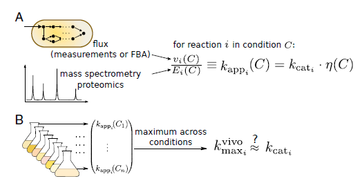
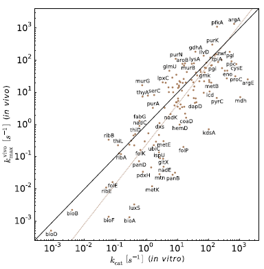
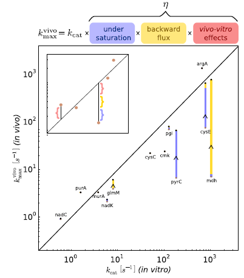

# Global characterization of in vivo enzyme catalytic rates and their correspondence to in vitro $k_{cat}$ measurements

## Abstract

Turnover numbers($k_{cat}$ 값)는 효소의 기본적인 특성입니다. 그러나 **$k_{cat}$ 데이터는 희귀하며 in vitro(시험관 내)에서 측정되므로 실제 in vivo(생체 내) 상황을 충실히 반영하지 못할 수 있습니다.** 해결되어야 할 기본적인 질문은 $k_{cat}$ 값이 in vivo 효소의 최대 촉매율을 얼마나 대표하는가 입니다. 여기서 **우리는 omics data를 활용하여 세포 내 효소의 관찰된 최대 촉매 속도($k^{vivo}_{max}$)를 계산**합니다. 대장균의 $k_{cat}$ 값과 비교한 결과, 로그 스케일에서 상관 계수 r² = 0.62(p < 10^−10)로 나타났으며, 평균 제곱근 차이는 0.54(선형 스케일에서 3.5배)로 나타나 in vivo 및 in vitro 최대 속도가 일반적으로 일치함을 보여줍니다. **효소의 포화도와 열역학에 의해 결정되는 역방향 플럭스를 고려함으로써 $k^{vivo}_{max}$와 $k_{cat}$ 값 간의 대응 관계를 더욱 정밀하게 조정할 수 있습니다.** **여기서 제시하는 접근 방식은 in vitro 및 in vivo 효소 촉매작용의 정량적 관계를 특징짓고 omics data에서 효소의 동역학 상수를 추출하는 고속 처리 방법을 제공**합니다.

## Introduction

enzyme catalysis rates는 metabolite concentrations 및 플럭스, 세포의 외부 자극에 대한 반응, 효소에 대한 자원 투자 등 중심적인 세포 현상을 이해하는 데 있어 기본적입니다 (1–6). 세포 대사 모델의 많은 부분에서 효소의 maximal turnover rates인 $k_{cat}$ 값이 주요 입력값으로 포함되어 대사 경로 및 네트워크의 동작을 예측합니다 (7–9). **그러나 대부분의 $k_{cat}$ 값은 실험적으로 측정된 적이 없습니다.** **대장균은 생화학적으로 가장 많이 특성화된 생물이지만, 약 2000개의 효소-반응 쌍 중 약 10%에 대해서만 $k_{cat}$ 값이 존재**합니다 (Dataset S1). 실제로, $k_{cat}$ 값은 몇몇 중심 대사 효소에 대해서도 존재하지 않습니다. 동역학 데이터의 부족은 모델의 범위를 제한하며, 일반적인 매개변수 할당을 필요로 하여 세포 모델의 예측력을 크게 감소시킵니다.

더욱이, 더 많은 $k_{cat}$ 값을 사용할 수 있게 된다 하더라도, 현재 사용 방식에는 주요한 어려움이 있습니다. **$k_{cat}$ 값은 초기 반응 속도, 즉 기질이 완전히 포화된 상태와 생성물 수준이 무시할 수 있는 정도인 in vitro 효소 분석을 통해 측정됩니다.** 이러한 분석은 세포 내 metabolite concentrations, 열역학적 제약, 번역 후 수정, 샤페론, 세포 혼잡 및 활성화 및 억제 분자와 같은 요소들을 반영하지 못할 수 있으며, 이는 in vivo에서 효소 동역학을 크게 변화시킬 수 있습니다. **이러한 누락은 $k_{cat}$ 측정의 in vivo 관련성을 의심하게 만듭니다 (10–12)**. 게다가, in vivo 조건에 가까운 환경에서 다수의 $k_{cat}$ 값을 측정하려는 노력은 관련된 생화학적 요소가 얼마나 많을지 모르는 상황에서 막대한 도전 과제가 됩니다.

**몇몇 연구에서는 in vitro에서 측정된 $k_{cat}$ 값의 분포를 샘플링하거나 관련 종의 동일 효소 측정을 사용하여 누락된 $k_{cat}$ 값을 해결하려고 합니다 (13–16).** 이러한 근사치는 in vitro와 in vivo 환경의 차이로 인한 오류를 체계적으로 무시합니다. 이러한 근사치는 또한 이종효소에서와 같이 같은 생물 내에서 또는 생물 간의 $k_{cat}$ 값이 수 배 차이날 수 있기 때문에 **상당한 오류를 도입할 수 있습니다** (17–19).

여기서는 오믹스 연구의 최근 발전을 활용하여 위에서 언급한 도전 과제를 해결하는 대안적인 접근 방식을 설명합니다. **효소의 in vivo 촉매 속도는 효소가 수행하는 플럭스와 효소 copy 수에서 유추할 수 있습니다. 프로테오믹스 메소드는 이제 여러 생물과 다양한 성장 조건에서 효소 수준에 대한 정량적 측정을 제공합니다. 계산된 플럭스를 프로테오믹스에서 얻은 효소의 양으로 나누어 in vivo 효소의 속도($k_{app}$)를 계산합니다. 이 분석을 많은 성장 조건(n = 31)에서 수행합니다. 여러 조건에서 $k_{app}$의 최대 값을 취하여 in vivo 효소의 maximal turnover rates 추정치를 얻고, 이를 $k^{vivo}_{max}$로 정의합니다. $k_{cat}$ 값과 $k^{vivo}_{max}$ 값의 관계는 무엇일까요? 이 값을 비교하고 관찰된 차이를 정량적으로 분석합니다.**

## Results

### Integrating Enzyme Abundances and Fluxes to Calculate the Catalytic Rate of Enzymes in Vivo.

대사 경로 및 네트워크의 동역학 모델은 종종 $V_{max}$ 매개변수로 효소 촉매 반응의 최대 속도를 설명합니다:

$$ v = E \cdot k_{cat} \cdot \eta \\
E \cdot k_{cat} = V_{max} $$

여기서 v는 고려된 시스템 내의 반응을 통한 플럭스이며, E는 시스템 내 효소 활성 부위의 총 수이고, **η는** 예를 들어 기질의 불완전한 포화 및 열역학적 효과로 인한 역방향 플럭스로 인해 최대 속도($k_{cat}$)와 비교하여 **촉매 속도의 감소를 설명하는 조건 의존적 함수로, 0에서 1 사이의 값을 가집니다** (21).

**여기서는 E. coli의 프로테오믹스 데이터를 사용하여 $V_{max}$에서 $k_{cat}$을 분리합니다 (Eq. 1). 우리는 $k_{app}$, 즉 이전에 도입된 효소의 in vivo 촉매 속도의 측정치를 계산하는 것부터 시작합니다 (20) (Eq. 2; Fig. 1A). 고유한 효소에 의해 촉매되는 대사 반응에 대해 조건 C가 주어지면, v와 E 사이에는 거의 항상 비례 관계가 존재합니다. 따라서 다음과 같이 정의합니다:**

$$ k_{app}(C) = \frac{v(C)}{E(C)}. $$

따라서 $V_{max}$와 $k_{app}$ 간의 관계를 명확히 볼 수 있습니다:

$$v(C) = E(C) \cdot k_{cat} \cdot \eta(C)\\
k_{cat} \cdot \eta(C)= k_{app} $$

**여기서 $k_{cat}$ 값이 in vitro에서 측정되므로, 이러한 투영은 아래에서 논의되는 대로 in vitro와 in vivo의 전환에 의해 발생하는 영향을 고려해야 합니다.**
프로테오믹스 측정치는 세포 내 개별 polypeptides의 abundances를 제공합니다. 그러나 효소는 종종 여러 소단위로 구성됩니다. 따라서 전통적으로 정의된 활성 부위당 효소의 촉매 속도를 유추하기 위해 E. coli 효소의 소단위 및 활성 부위 화학양론 데이터를 수집했습니다 (22) (Dataset S1). 효소가 소단위당 하나의 활성 부위를 포함하는 경우, E는 측정된 polypeptides의 abundances와 같습니다. **다중 소단위 효소에 대한 $k_{app}$을 계산하기 위해 polypeptides의 사본 수를 활성 부위를 만드는 데 필요한 사슬 수로 나눕니다.**

앞서 논의한 바와 같이, 우리는 최근 E. coli 대사 체계의 게놈 스케일 재구성인 iJO1366에서 약 60%의 효소 반응을 구성하는 고유한 호모머 효소에 의해 촉매되는 반응에 초점을 맞춥니다 (23). 여러 서로 다른 효소에 의해 촉매되는 반응은 이 프레임워크에서 분석하기 어렵습니다. 왜냐하면 **우리는 동종효소 간에 플럭스가 어떻게 분배되는지 알지 못하기 때문**입니다. 유사하게, 여러 다른 polypeptides로 구성된 이종효소는 종종 어느 소단위가 활성 부위를 포함하는지 명확하지 않기 때문에 분석을 복잡하게 만듭니다. 이종효소가 제기하는 도전을 극복하기 위해 $k_{app}$을 활성 부위당 속도보다는 효소 복합체 1밀리그램당 촉매 속도로 간주할 수 있습니다. 이 정의는 Turnover numbers($k_{cat}$) 대신 "특정 활성" 개념에 해당합니다. 아래의 모든 분석은 최대 특정 활성 값을 사용했을 때와 $k_{cat}$을 사용했을 때 유사한 결과를 나타냅니다 (Dataset S1에는 모든 경우의 값이 포함되어 있습니다). 동종효소에 의해 촉매되는 반응에 대한 $k_{app}$의 일반화는 보조 정보에 설명되어 있습니다.

우리는 E. coli의 최근 프로테오믹스 연구에서 31가지 조건 (20, 24, 25)에 대한 polypeptides abundances를 사용합니다. 여기에는 다양한 탄소원, 스트레스 조건, 그리고 포도당 제한 생물반응기 조건이 포함됩니다 (Dataset S1). **polypeptides abundances가 주어지면, 플럭스 측정치나 계산된 플럭스를 사용하여 $k_{app}$을 계산할 수 있습니다.** 다양한 조건에서 대사 네트워크를 포괄적으로 다루기 위해, 우리는 여기서 플럭스 균형 분석(FBA)을 사용하여 세포 내 플럭스를 계산합니다 (26, 27). FBA는 대사 네트워크를 통한 대사체 변환의 속도 및 화학양론을 분석하는 수학적 접근 방식입니다. 반응은 선형 계획법을 통해 평가할 수 있는 화학양론 매트릭스로 통합됩니다 (28). 우리는 네트워크를 통한 총 플럭스를 최소화하고, 성장 속도 및 프로테오믹스 실험에서 보고된 대로 매질 구성을 제한하는 FBA의 변형을 사용하기로 결정했습니다 (자료 및 방법 및 보조 정보를 참조하십시오). 실험적 플럭스 측정을 사용한 병행 분석(29)은 보조 정보에 나와 있으며, 측정된 플럭스와 비교할 때 로그 상관이 r² = 0.85, p < 10^−5로 좋은 일치를 보입니다. 그러나 FBA 유도 플럭스보다 훨씬 작은 범위를 가집니다 (4가지 성장 조건에서 13개의 효소-반응 쌍만 포함).

우리는 436개의 효소에 대해 $k_{app}$ 값을 계산합니다. 확률적 효과를 최소화하기 위해 우리는 최소한 세포질 1fL당 10개의 polypeptides 사본을 가진 효소만 분석했습니다 [대략 E. coli의 부피 (30); 자료 및 방법 참조]. 주목할 점은 효소의 전환율이 반응의 정방향과 역방향 간에 다를 수 있으므로 $k_{app}$은 특정 enzyme-reaction-direction combination에 대해 정의된다는 점입니다.

### In Vivo and in Vitro Maximal Rates Show High Similarity.
**in vivo와 in vitro 최대 속도는 높은 유사성을 보인다**

E. coli 세포의 촉매 능력은 생리 상태, 즉 성장 속도와 영양 조건에 따라 달라집니다 (20, 31, 32). 조건에 따른 이러한 변동을 고려할 때, 우리는 어떻게 in vivo 효소의 최대 촉매 속도를 추론할 수 있을까요? 여러 조건에서 $k_{app}$ 값을 계산하고 최대 값을 취함으로써 in vivo 효소의 최대 촉매 속도에 대한 대리 값을 얻습니다 (Fig. 1B). 효과적으로, 우리는 η가 최대인 조건을 찾고 (Eq. 3), 이 조건에서의 $k_{app}$ 값을 $k^{vivo}_{max}$로 표시합니다.

in vitro $k_{cat}$ 측정은 종종 대사 모델에서 효소의 최대 촉매 속도를 설명하는 데 사용됩니다. $k^{vivo}_{max}$ 값은 in vitro $k_{cat}$ 측정과 얼마나 유사할까요? 글로벌 분석을 수행하기 위해, 우리는 대장균 효소의 $k_{cat}$ 값을 문헌에서 수집했습니다. BRENDA 데이터베이스 (33)와 기타 출판물에서 146개의 $k_{cat}$ 값을 수집하였으며, 각각 specific enzyme-reaction pair에 해당합니다. 데이터가 활성 부위당 보고되었는지 확인하고, 데이터베이스에 올바르게 입력되었는지 확인하기 위해 수작업으로 데이터를 검토했습니다 (대부분의 오류는 단위 변환의 잘못에서 발생; 모든 검토된 $k_{cat}$ 값과 참조 목록은 Dataset S1에 제공됨).

우리는 $k_{cat}$ 값이 존재하는 146개의 효소-반응 쌍 중 132개의 $k^{vivo}_{max}$ 예측치를 계산했습니다 (나머지 14개는 사본 수가 너무 적거나 플럭스를 지원하지 않음). 이 132개의 효소 반응은 해당되는 대사 경로를 넓게 아우르며, 해당 경로에는 해당 경로, 오탄당 인산 경로, 아미노산 대사, 뉴클레오타이드 생합성, 비오틴 생합성 및 헴 생합성이 포함됩니다. Fig. 2에서 보듯이, 우리는 in vivo 및 in vitro 값 간에 로그 스케일에서 r² = 0.62 (p < 10^-10)의 상관관계를 발견했습니다. $k^{vivo}_{max}$와 $k_{cat}$ 값 모두 대략 6차원의 범위를 가지며, 평균 제곱근 차이는 선형 스케일에서 3.5배입니다. $k_{app}$의 두 번째로 큰 값을 $k^{vivo}_{max}$ 대신 사용한 분석도 $k_{cat}$과 유사한 상관관계를 보여줍니다 (r² = 0.59, p = 10^-10), 이는 우리의 $k^{vivo}_{max}$ 근사치가 측정된 특정 조건에 대해 상당히 견고하다는 것을 나타냅니다.

이러한 높은 글로벌 상관관계에도 불구하고, 특정 효소에 대해 $k^{vivo}_{max}$와 $k_{cat}$ 간의 큰 편차를 관찰합니다. 주목할 만한 예로는 malate dehydrogenase (mdh) 효소가 있으며, $k^{vivo}_{max}$는 ≈ 10 s^-1인 반면 $k_{cat}$은 ≈ 1,000 s^-1입니다. 실제로, mdh는 삼카복실산 회로의 방향에서 열역학적으로 불리한 반응을 보상하기 위해 높은 $k_{cat}$ 값을 진화시켰다고 제안되었습니다. 이는 in vivo에서 많은 역방향 플럭스를 유발하여 $k^{vivo}_{max}$의 감소를 초래할 수 있습니다. 이는 in vitro 조건에서는 고려되지 않습니다 (21). 다른 이상치들은 심층적인 생화학적 분석을 위한 좋은 후보가 됩니다. 보조 정보에서는 $k^{vivo}_{max}$와 $k_{cat}$ 간의 잔차와 다른 효소 조절 인자 수와의 관계도 논의합니다.

### Saturation and Thermodynamics Improve the Correspondence Between in Vitro and in Vivo Rates
**포화도와 열역학이 in vitro 및 in vivo 속도 간의 일치를 개선하다**

kvivo_max와 $k_{cat}$ 값의 차이를 합리적으로 설명하기 위해, 우리는 속도 법칙(Eq. 1)에서 조건 의존적 항인 η를 (i) 효소의 포화도 정도, (ii) 반응의 열역학적 구동력 효과로 인한 역방향 플럭스, 그리고 (iii) pH, 온도, 군집화제, 보조 인자, 샤페론 등을 포함한 규제 및 기타 환경적 요인을 포함하는 vivo–vitro 효과의 곱으로 간주합니다 (Fig. 3). 포화도와 열역학적 효과는 metabolite concentrations의 함수이며, in vitro 용량(즉, $k_{cat}$) 중 얼마나 사용되는지를 나타내는 0에서 1 사이의 값을 가집니다 (34–36). 그러나 규제 및 환경적 효과는 in vivo에서 in vitro보다 높은 속도를 초래할 수 있습니다(예: 시험관에서는 샤페론이 없기 때문) 또는 그 반대(예: 세포질 내에서의 최적이 아닌 pH). Fig. 3은 이러한 논리를 적용하여 $k_{cat}$와 kvivo_max 간의 잔차를 해석하는 방법을 보여줍니다.

현재의 지식으로는 효소 촉매작용의 중요한 특성을 나타내는 vivo–vitro 효과를 완전히 설명하기에는 부족합니다. 그러나 불포화된 기질 수준과 역방향 플럭스에 의해 발생하는 속도 감소를 계산하여 세포 환경에 기인한 이러한 차이를 평가할 수 있습니다. 이를 위해 우리는 E. coli에서 측정된 metabolite concentrations를 사용합니다 (37, 38) (Dataset S1). 각 효소에 대해 프로테오믹스 데이터를 사용하여 kvivo_max를 계산하는 데 사용된 것과 동일한 조건에서 측정된 metabolite concentrations를 찾았습니다.

포화도 정도를 추정하기 위해, 우리는 BRENDA (33)와 EcoCyc (39) 데이터베이스에서 효소의 KM 값을 수집하고(Dataset S1), 여러 기질에 대한 비가역적인 Michaelis-Menten 속도 법칙(40, 41)에서 유도된 관계를 사용했습니다 (42):

$$\text{saturation term} = \frac{\prod_j \left( \frac{s_j}{K_j} \right)^{m_j}}{1 + \prod_j \left( \frac{s_j}{K_j} \right)^{m_j}},$$

여기서 sj는 기질 j의 농도이고, Kj 및 mj는 각각 기질의 KM 및 화학양론 계수입니다.

E. coli 효소 중 (i) $k_{cat}$ 값, (ii) 기질과 생성물에 대한 KM 값, (iii) 기질 및 생성물 농도가 모두 완전히 측정된 효소는 없습니다. 따라서 우리는 생성물의 영향을 고려하지 않고 기질 포화도에만 기반하여 saturation term을 계산합니다. 전반적으로, 132개의 효소-반응 쌍 중 13개만 분석할 수 있을 만큼 충분한 데이터가 제공되었습니다.

반응의 역방향-정방향 플럭스 비율(열역학적 항)을 추정하기 위해, 우리는 구성 요소 기여 방법(component contribution method) (43–45)을 사용하여 표준 Gibbs 자유 에너지를 계산하고, 세포 내 metabolite concentrations를 사용하여 수정했습니다:

$$ΔrG′ = ΔrG′° + RT \ln \left( \prod_i c_i^{m_i} \right).$$

이를 통해 역방향 플럭스를 설명하는 열역학적 항을 얻을 수 있습니다:

$$열역학적 항 = \left( 1 - e^{\frac{ΔrG′}{RT}} \right),$$

여기서 R은 이상 기체 상수, T는 절대 온도, ci는 반응물 i의 농도, mi는 화학양론 계수입니다 (21, 36). 측정되지 않은 생성물에 대해서는 기본적으로 100 μM의 농도를 사용합니다 (37) (자료 및 방법 참조).

Fig. 3은 kvivo_max와 $k_{cat}$ 값 간의 잔차에 미치는 불포화 및 역방향 플럭스의 영향을 보여줍니다. $k_{cat}$ ≫ kvivo_max를 가지는 효소들(예: mdh, pyrC, 및 cysE)은 불포화 및 열역학적 구동력 부족으로 설명될 수 있습니다. kvivo_max 값을 수정한 후, kvivo_max 값의 변화는 이 제한된 13개의 효소 집합에서 $k_{cat}$에 대한 향상된 상관관계를 나타냅니다 (r² = 0.92, p < 10^-4; 수정 전 상관관계는 r² = 0.55).

## Discussion

현재 in vivo 동역학 상수를 측정하는 체계적인 방법은 없습니다. 대표적인 대사 효소 세트를 포함하는 in vitro 효소 분석을 사용하는 것은 막대한 노력이 필요하며, 일부 경우에는 in vivo 동역학을 잘 반영하지 못할 수 있습니다. 이 연구에서는 프로테오믹스 데이터와 플럭스 추정을 사용하여 in vivo 효소의 최대 촉매 속도를 근사하는 널리 적용 가능한 방법을 제안합니다. 많은 조건에서 최대 명백 촉매 속도(kapp)를 취함으로써 in vivo 최대 속도(kvivo_max)에 대한 대리값을 얻고, in vitro $k_{cat}$ 측정을 사용하여 그 정확성을 검증합니다.

Fig. 2에 나타난 kvivo_max와 $k_{cat}$ 간의 상관관계는 두 가지 독립된 주장을 뒷받침합니다. 첫째, in vivo 및 in vitro 최대 속도가 유사하다는 것, 즉 in vitro 효소 분석이 일반적으로 in vivo 효소의 최대 속도를 정확히 반영한다는 것입니다. 둘째, 우리의 접근법이 $k_{cat}$ 값을 예측하는 도구로 사용될 수 있다는 것입니다. kvivo_max와 $k_{cat}$ 간의 RMSD는 3.5배로, $k_{cat}$ 데이터 세트의 표준 편차 15배와 비교됩니다. 따라서 kvivo_max 값은 평균 $k_{cat}$ 값을 최대 속도의 대표값으로 사용하는 것보다 약 4배 더 나은 예측자입니다 [≈ 10 s^-1 (19)].

이 분석은 E. coli를 대상으로 한 것이지만, 제시된 방법은 다른 생물 및 대사 경로로 쉽게 확장될 수 있습니다. $k_{cat}$ 데이터는 매우 제한적이지만, 프로테오믹스 데이터는 점점 더 많이 제공되고 있으며, 효소의 최대 촉매 속도를 추정하기 위한 고속 처리 대안을 제공합니다. 우리의 접근법은 $k_{cat}$보다 대사 네트워크의 훨씬 더 높은 범위를 제공합니다. 일부 효소의 경우, 이 방법이 in vivo 측정을 기반으로 하므로 속도 한계를 예측하는 데 더 유용할 수 있습니다. 다른 생물에서 좋은 범위를 달성하기 위해서는 효소와 관련된 대사 반응 간의 보다 포괄적인 매핑이 필요합니다. E. coli의 경우 대부분의 프로테옴이 특성화되어 있지만 (46), 다른 생물에서는 제한된 유전자 주석이 kapp 예측을 편향시킬 수 있습니다. 대사 반응을 통해 플럭스를 지원하는 효소를 알아야 효소의 속도를 추론할 수 있습니다.

kvivo_max는 효소의 최대 촉매 속도에 대한 하한 추정값을 나타냅니다. 그러나 약 10개의 효소는 $k_{cat}$에 비해 kvivo_max 값이 5배 이상 높게 나타났습니다. 이는 기술적 한계로 인해 생화학자들이 특정 효소의 $k_{cat}$을 과소평가했기 때문일 수 있습니다. 가장 높은 kvivo_max/$k_{cat}$ 비율을 가진 두 효소(purN 및 murG)의 경우, 원래 $k_{cat}$ 측정에서는 효소의 안정성을 위해 또는 실제 보조 인자가 제공되지 않았기 때문에 보조 인자 유사체를 사용했습니다 (47, 48). 이는 낮은 $k_{cat}$ 값을 설명할 수 있습니다. 다른 몇 가지 사례에서는 효소 측정을 위해 태그가 지정된 효소를 사용했으며 (49, 50), 이는 효소의 불안정성을 초래하거나 촉매작용에 간섭했을 수 있습니다 (51). 다른 경우에는 응집된 단백질로부터 효소가 재구성되었을 수 있으며 (52), 이는 측정 버퍼에 잘못 접힌 효소가 포함되어 $k_{cat}$ 값을 과소평가했을 수 있습니다. 몇몇 다른 효소의 경우, 알려지지 않은 다른 대사 조절자가 in vitro에서 인위적으로 낮은 $k_{cat}$ 측정을 초래했을 수 있다고 생각됩니다. 예를 들어, kvivo_max > $k_{cat}$을 보이는 여러 효소는 탈수소효소(e.g., gdhA)로, 복잡한 동역학과 많은 다른 대사 조절 인자(AMP, ADP, ATP, 아미노산 등)를 가지고 있는 것으로 알려져 있습니다 (53). 따라서 우리는 kvivo_max ≫ $k_{cat}$을 보이는 효소가 대사 네트워크의 조절을 더 잘 이해하는 데 유용할 수 있는 알려지지 않은 대사 활성제 식별의 유망한 후보라고 제안합니다 (54–56).

kvivo_max 값은 플럭스 예측 및 효소 abundances 데이터에서 직접 얻어지며, 매개변수 맞춤이 필요 없습니다. 대규모 절대 프로테옴 정량화는 큰 진전을 이루고 있으며 보편화되고 있습니다. 수백 개의 조건을 고려하여 최대 kapp 값을 계산할 수 있을 가능성이 있습니다. 게놈 전체의 최대 속도 추정은 대사 공학 응용 분야에 매우 유용할 수 있습니다. 예를 들어, 정형효소(ortholog) 모음 중에서 가장 빠른 효소를 선택하거나 (57, 58), 대체 합성 경로를 비교하는 데 사용할 수 있습니다 (59–61). 또한 재조합된 경로에서 효소의 발현 수준을 조정하려면 특정 활성에 대한 정보가 필요합니다. 여기서 입증된 바와 같이, 절대 프로테옴 정량화의 가용성은 효소 동역학 데이터 수집에 필요한 정보를 제공합니다.

## Materials and Methods

계산된 플럭스 예측 및 프로테오믹스 데이터는 kapp 추정의 입력으로 사용됩니다. 플럭스 예측은 COBRApy 패키지(64)를 사용하여 절약형 FBA(pFBA) (62, 63)를 통해 수행되었습니다. pFBA 분석은 네트워크를 통한 총 플럭스를 최소화하고 모델 내에 존재하는 반응 방향 제약을 시행하며, 측정된 플럭스와 일치하는 것으로 나타났습니다 (63, 65). 우리는 성장 속도와 프로테오믹스 실험에서 측정된 매질 구성에 따라 모델을 제한했습니다. 각 반응에 대해, 우리는 플럭스 변동 분석(FVA) (66)을 통해 플럭스의 변동을 분석했습니다. 99%의 반응에서 플럭스 변동은 미미했으며, 반응을 통한 순 플럭스의 1% 미만을 나타냈습니다(보조 정보 참조). ATP 유지 반응을 통한 플럭스도 결과에 미미한 영향을 미치는 것으로 나타났습니다(보조 정보 참조). 프로테오믹스 데이터 통합을 위해, 우리는 iJO1366 모델에서 유전자 주석을 사용하여 polypeptides 사슬을 대사 반응에 매핑했습니다. Valgepea et al. (20) 및 Peebo et al. (25)의 데이터는 세포질 1fL당 사본 수로 보고되었으며, 조건별 세포 크기 측정값을 기반으로 합니다. Schmidt et al.의 데이터 세트 (24)에서는 세포당 사본 수로 보고되었으며, 따라서 세포질의 특성값인 180 fg/μm³ 단백질 농도를 사용하여 fL당 사본 수로 변환했습니다. 이 값은 조건에 따라 약 10% 정도 변할 수 있지만, 이 변동에 대한 포괄적인 정보는 현재 없으며, 어쨌든 발현 수준의 변동을 고려할 때 이는 미미한 효과일 것입니다. 최소 10개의 polypeptides 사슬을 1fL당 발현하는 436개의 호모머 효소 중, 257개는 최소한 한 가지 조건에서 플럭스를 지원하여 kapp > 0을 나타냅니다. 주목할 점은 179개의 명백히 비활성 효소는 전체 플럭스를 최소화함으로써 나타난 인공물일 수 있으며, 실제로는 플럭스를 가질 수 있다는 것입니다. 많은 0값을 제안하는 플럭스 예측 방법을 사용함으로써, 우리는 상대적으로 신뢰할 수 있는 값을 제한합니다. 발현된 효소가 플럭스를 지원하지 않는 효소는 분석에 포함되지 않았습니다. 모든 수치 데이터는 Dataset S1에 제공됩니다. 코드들은 오픈소스이며, https://github.com/milo-lab/in-vivo-catalytic-rates (Python으로 구현되었으며 주로 Linux에서 테스트됨)에서 이용할 수 있습니다.

$k_{cat}$ 및 kvivo_max 값 비교를 위한 데이터 수집 및 단위 변환. 우리는 BRENDA와 주요 문헌에서 $k_{cat}$ 값을 포괄적으로 수집했습니다. 동일한 $k_{cat}$에 대해 여러 값이 보고된 경우, 최대 보고 값을 사용했습니다. $k_{cat}$의 단위는 1/s이므로, 플럭스 값은 세포 건조 중량(gCDW)당 밀리몰/시간(mmol/gCDW/h)에서 세포 건조 중량(gCDW)당 밀리몰/초(mmol/gCDW/s)로 변환했습니다. abundances는 분자/fL에서 mmol/gCDW로 변환되었으며, 건조 중량 비율 30%를 가정했습니다[BNID:109838 (68, 69)] 및 세포 밀도 1.1 g/mL [BNID:103875 (69, 70)]. 따라서, 플럭스를 abundances로 나누면 1/s 단위의 속도가 됩니다. 특정 활성에 대해서는, 효소의 분자량을 사용하여 분당 mg 효소당 μmol 생성물 단위로 속도를 추론했습니다(추가 세부 사항은 보조 정보 참조).

반응의 역방향 플럭스 계산. ΔrG′°를 계산하기 위해, 우리는 측정된 열역학 데이터를 통합하여 대사체의 형성 에너지를 계산하는 구성 요소 기여 방법을 사용했습니다 (43, 44). 측정된 metabolite concentrations를 포함하여, 우리는 반응의 in vivo Gibbs 자유 에너지를 근사하여, 가역성 및 열역학적 구동력을 평가하는 보다 정확한 방법을 제공합니다(표준 Gibbs 에너지 검사보다). (43).

## Figure explaination

### Fig. 2 설명

Fig. 2는 생체 내 최대 촉매 속도(kvivo_max)와 시험관 내 최대 촉매 속도(kcat) 간의 관계를 보여주는 로그-로그 플롯입니다. 이 그림을 통해 생체 내와 시험관 내에서 측정된 효소 반응 속도 간의 유사성을 시각적으로 확인할 수 있습니다. 다음은 Fig. 2에 대한 자세한 설명입니다:

**축(Labeling):
- **x축**: 시험관 내에서 측정된 kcat 값 (log 스케일).
- **y축**: 생체 내에서 추정된 kvivo_max 값 (log 스케일).

**데이터 포인트(Data Points):
- 각 데이터 포인트는 특정 효소-반응-방향 조합을 나타냅니다. 데이터 포인트는 각 효소의 이름으로 레이블이 지정되어 있으며, 중복되지 않는 경우 이름이 표시됩니다.
- 데이터 포인트는 특정 조건에서 계산된 kvivo_max 값을 나타냅니다.

**대각선(y = x) 라인:
- 검은색 대각선(y = x)은 kvivo_max 값과 kcat 값이 일치하는 경우를 나타냅니다. 이 라인은 두 값이 완전히 일치하는 이상적인 경우를 나타내며, 데이터 포인트가 이 라인에 가까울수록 생체 내 최대 속도와 시험관 내 최대 속도가 유사하다는 것을 의미합니다.

**상관 관계(Correlation):
- 데이터 포인트는 대체로 y = x 라인에 가까이 분포되어 있으며, 이는 생체 내와 시험관 내 최대 속도 간에 높은 상관 관계가 있음을 나타냅니다.
- 상관 계수(r²) = 0.62로, 이는 로그 스케일에서 두 값 간에 강한 상관 관계가 있음을 의미합니다(p < 10^-10).
- 선형 스케일에서 평균 제곱근 차이(RMSD)는 3.5배로 나타나며, 이는 두 값 간의 차이가 평균적으로 3.5배 정도임을 의미합니다.

**최적 적합선(Fit Line):
- 갈색 점선은 로그 스케일에서의 최적 적합선을 나타냅니다. 이 선의 기울기는 1.23 ± 0.07, 절편은 -0.6 ± 0.1입니다.
- 최적 적합선은 실험 데이터의 경향을 나타내며, 실제 측정된 값이 y = x 라인과 얼마나 일치하는지 평가합니다.

#### 주요 관찰 내용

**유사한 범위(Similar Range):
- kvivo_max와 kcat 값 모두 대략 6 차원의 범위를 가지고 있으며, 이는 매우 다양한 효소 반응 속도를 나타냅니다.

**큰 편차(Large Deviations):
- 대부분의 효소에서 kvivo_max와 kcat 값이 유사하지만, 몇몇 효소에서는 큰 편차가 관찰됩니다. 예를 들어, malate dehydrogenase (mdh)의 경우 kvivo_max는 약 10 s^-1인 반면 kcat은 약 1,000 s^-1입니다.
- 이러한 큰 편차는 생체 내 조건과 시험관 내 조건 간의 차이로 설명될 수 있습니다. 예를 들어, mdh는 삼카복실산 회로 방향으로 열역학적으로 불리한 반응을 보상하기 위해 높은 kcat 값을 진화시켰을 수 있습니다.

#### 결론

Fig. 2는 생체 내와 시험관 내 효소 최대 촉매 속도 간의 높은 유사성을 시각적으로 나타내며, 대부분의 효소에서 두 값 간의 강한 상관 관계를 보여줍니다. 이 그림은 효소의 시험관 내 측정값이 실제 생체 내에서도 비교적 잘 유지된다는 것을 시사합니다. 이는 생체 내 효소 촉매 속도를 예측하거나 모델링할 때 유용한 정보를 제공합니다.

### Fig. 3 설명

Fig. 3은 효소의 생체 내 촉매 속도(kvivo_max)와 시험관 내 최대 촉매 속도(kcat) 간의 차이를 설명하는 다양한 요인들을 시각적으로 나타낸 그림입니다. 이 그림은 kvivo_max와 kcat 간의 잔차를 포화도, 열역학적 구동력, 그리고 vivo–vitro 효과로 분해하여 설명합니다.

**축(Labeling):
- **x축**: 효소의 이름과 데이터 포인트를 나타냅니다.
- **y축**: kvivo_max와 kcat 간의 차이를 나타내며, 로그 스케일로 표시됩니다.

**데이터 포인트(Data Points):
- 각 데이터 포인트는 특정 효소-반응-방향 조합을 나타내며, kvivo_max와 kcat 간의 잔차를 보여줍니다.

**잔차(Residual):
- y축에서 kvivo_max와 kcat 간의 잔차를 로그 스케일로 나타냅니다.
- 잔차는 kvivo_max에서 kcat 값을 뺀 값으로, 양수 값은 kvivo_max가 kcat보다 큰 경우를, 음수 값은 그 반대를 나타냅니다.

**포화도 및 열역학적 효과(Saturation and Thermodynamic Effects):
- 포화도 및 열역학적 효과는 각각 파란색과 노란색으로 표시됩니다.
- 포화도 효과는 기질의 불완전한 포화로 인해 효소 활성이 감소하는 정도를 나타냅니다.
- 열역학적 효과는 반응의 역방향 플럭스(thermodynamic driving force)로 인해 효소 활성이 감소하는 정도를 나타냅니다.

**vivo–vitro 효과(Vivo–Vitro Effects):
- vivo–vitro 효과는 생체 내 조건과 시험관 내 조건 간의 차이로 인해 발생하는 영향을 나타냅니다.
- 이는 pH, 온도, 군집화제, 보조 인자, 샤페론 등의 요인들을 포함합니다.
- vivo–vitro 효과는 포화도 및 열역학적 효과와 달리 효소 활성을 증가시키거나 감소시킬 수 있습니다.

**수정된 kvivo_max 값(Corrected kvivo_max Values):
- 포화도 및 열역학적 효과를 고려하여 수정된 kvivo_max 값은 검은색 데이터 포인트로 표시됩니다.
- 수정된 kvivo_max 값은 원래의 kvivo_max 값을 포화도 및 열역학적 효과로 나누어 계산됩니다.

**상관 관계(Correlation):
- 포화도 및 열역학적 효과를 고려한 후, kvivo_max와 kcat 간의 상관 관계가 개선되었습니다.
- 수정 전 상관 관계는 r² = 0.55였으나, 수정 후 상관 관계는 r² = 0.92로 향상되었습니다(N = 13).

#### 주요 관찰 내용

**포화도 효과(Saturation Effect):
- 효소가 불완전하게 포화될 경우, 효소 활성은 최대치(kcat)보다 낮아집니다. 이는 실제 세포 내 조건에서 기질 농도가 낮아 효소가 완전히 포화되지 않는 경우를 반영합니다.

**열역학적 효과(Thermodynamic Effect):
- 역방향 플럭스가 큰 경우, 효소 활성이 감소합니다. 이는 반응의 열역학적 구동력이 부족하여 역반응이 발생하는 경우를 반영합니다.

**vivo–vitro 효과(Vivo–Vitro Effect):
- vivo–vitro 효과는 세포 내 조건과 시험관 내 조건 간의 차이로 인해 발생합니다. 이는 효소 활성을 증가시키거나 감소시킬 수 있으며, 포화도 및 열역학적 효과를 넘어서 추가적인 영향을 미칠 수 있습니다.

#### 결론

Fig. 3은 생체 내 효소 촉매 속도(kvivo_max)와 시험관 내 최대 촉매 속도(kcat) 간의 차이를 설명하는 데 있어 포화도, 열역학적 구동력, 그리고 vivo–vitro 효과의 중요성을 시각적으로 나타냅니다. 포화도 및 열역학적 효과를 고려한 후, kvivo_max와 kcat 간의 상관 관계가 크게 개선되었음을 보여줍니다. 이는 이러한 요인들이 효소 활성을 설명하는 데 중요한 역할을 한다는 것을 시사합니다.
