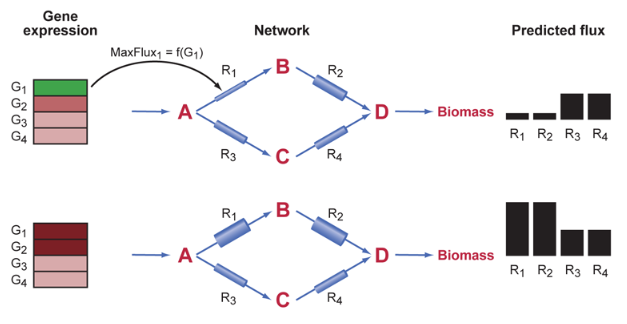
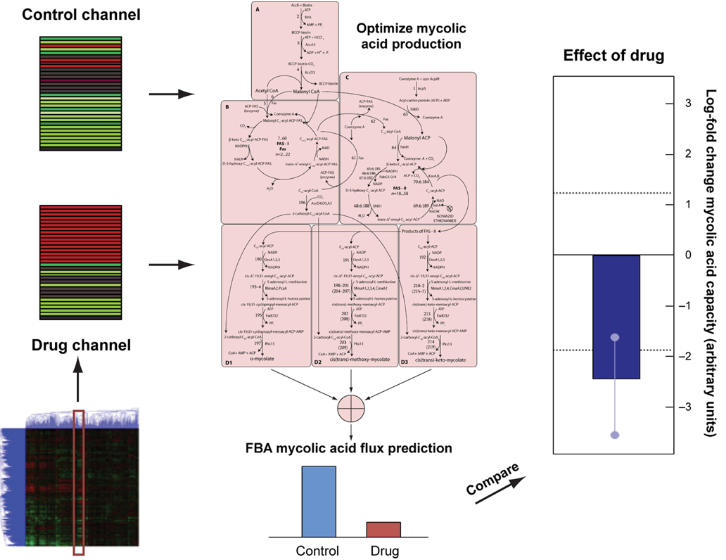
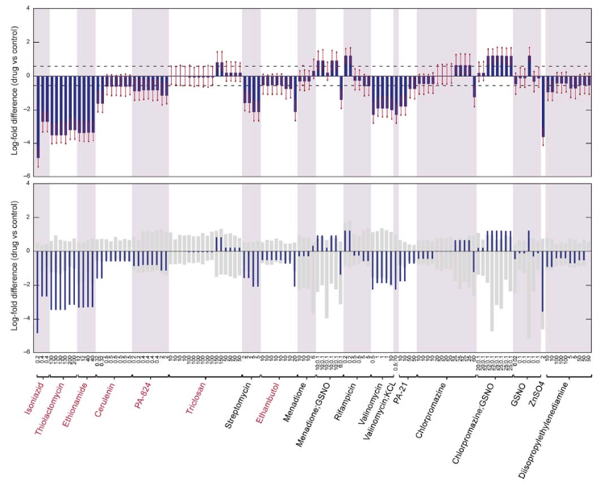
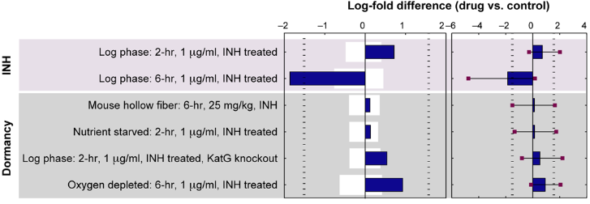
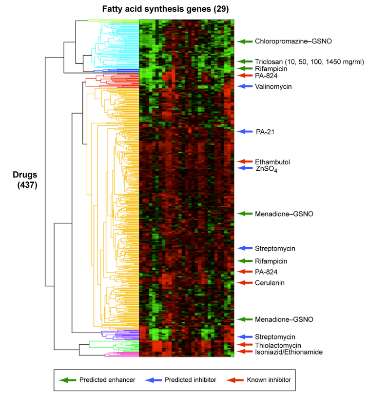

# Interpreting Expression Data with Metabolic Flux Models: Predicting Mycobacterium tuberculosis Mycolic Acid Production

## Abstract

대사는 세포 생리에 중추적이며, 대사 이상은 수많은 질병 상태에 역할을 합니다. 중요성에도 불구하고, 유전체 기술을 사용하여 대사를 전역적으로 연구하는 능력은 제한되어 있습니다. 원칙적으로 완전한 유전체 서열은 유기체에 가능한 대사 반응 범위를 설명하지만, 이러한 반응들의 행동을 정량적으로 설명할 수는 없습니다. 우리는 유전자 발현의 전체 셀 측정을 사용하여 대사 상태를 모델링하는 새로운 방법을 제시합니다. 우리가 E-Flux(플럭스와 발현의 결합으로)라고 부르는 이 방법은 Flux Balance Analysis 기법을 확장하여 최대 플럭스 제약을 측정된 유전자 발현의 함수로 모델링합니다. 유전자 발현 데이터를 대사적으로 해석하기 위한 이전 방법과는 달리, E-Flux는 기저 대사 네트워크의 모델을 사용하여 대사 플럭스 용량의 변화를 직접 예측합니다. 우리는 결합성 폐결핵(TB)을 일으키는 박테리아인 결합성 결핵균(Mycobacterium tuberculosis)에 E-Flux를 적용했습니다. 결합성 결핵균의 주요 세포벽 구성 요소 중 하나는 여러 선진적인 TB 약물의 대상인 마이콜산입니다. 우리는 75가지 다양한 약물, 약물 조합 및 영양 조건이 TB 결합성 결핵균에서 마이콜산 생합성 능력에 미치는 영향을 예측하기 위해 E-Flux를 사용했습니다. 이때 400개 이상의 발현 배열을 포함한 공개적인 무리를 사용했습니다. 우리는 마이콜산 생합성 모델과 M. 결합성 결핵균의 유전체 규모 모델을 사용하여 우리의 방법을 테스트했습니다. 우리의 방법은 이 무리에서 알려진 8가지 지방산 억제제 중 7가지를 정확하게 예측하며, 이러한 화합물들이 지방산 생합성에 대한 특이성에 대한 정확한 예측을 제공합니다. 또한 우리의 방법은 TB 마이콜산 생합성의 추가적인 잠재적인 변조제들을 예측합니다. 따라서 E-Flux는 유전자 발현 데이터로부터 대사 상태를 알고리즘적으로 예측하기 위한 유망한 새로운 접근 방식을 제공합니다.

## Introduction

대사는 세포 생리에 중추적이며, 대사 이상은 다양한 질병 상태에서 역할을 합니다. 그러나 그 중요성에도 불구하고, 유전체 기술을 사용하여 전역적으로 대사를 연구하는 능력은 제한적입니다. 원칙적으로 완전한 유전체 서열은 유기체에서 가능한 대사 반응 범위를 설명하지만, 이러한 반응들의 행동을 정량적으로 설명할 수는 없습니다. 유전자 발현 데이터는 대사 반응의 조절에 대한 전역적인 통찰력을 제공하지만, 이러한 데이터로부터 대사 네트워크의 행동, 특히 대사 플럭스를 추론하는 방법은 제한적입니다. 따라서 대규모 대사 네트워크 수준에서 대사를 추론하기 위해 사용 가능한 유전체 데이터를 활용하는 계산적 접근 방식을 개발해야 합니다.

대사를 계산적으로 연구하는 한 가지 접근 방법은 효소 작용의 동역학을 설명하는 결합된 미분 방정식을 기반으로 상세한 모델을 개발하는 것입니다. 그러나 이러한 모델은 많은 운동학적 매개변수를 측정해야 하므로 대규모 시스템 및 실험적으로 다루기 어려운 유기체 - 예를 들어 감염성 질병 요인 -에 대해서는 매우 어려울 수 있습니다.

플럭스 균형 분석(FBA)은 효소 운동학을 포함한 상세한 시뮬레이션 모델을 개발하지 않고도 대사를 모델링하는 대안적인 접근 방법입니다. 이는 대사 반응의 화학 및 질량 균형에 의해 유기체에 독립적인 반응 계수들이 결정된다는 사실을 이용합니다. 게다가 완전한 유전체 서열의 이용은 반응 계수가 알려진 대사 네트워크의 재구성을 가능하게 합니다. FBA는 또한 효소 역학이 유전자 발현의 규제 변화와 비교하여 빠르게 발생한다는 사실을 이용합니다: 즉, 관련 실험실 시간(일반적으로 몇 시간)이 화학 반응 시간(일반적으로 몇 분)보다 훨씬 긴 경우에는 일시적인 동역학이 고려된 시간 기간의 작은 부분에만 지속되며, 그 후에는 대사 네트워크가 안정 상태에서 기능합니다. FBA는 안정 상태 조건에서 네트워크가 대사 목표를 생산할 수 있는 능력을 예측하기 위해 보편적인 반응 계수를 활용하는 방법입니다.

FBA는 대사 네트워크를 대사 반응의 계수를 포착하는 계수행렬 S로 나타내고, 플럭스 구성을 네트워크 내의 반응이 움직이는 속도로 설명하는 것으로 표현합니다(즉, 반응 플럭스 집합). FBA는 일부 반응에 대한 제한이 알려져 있어야 합니다. 이는 해당 반응의 최대 또는 최소 속도를 반영합니다. 이러한 제한은 측정(예: 섭취 반응)되거나 물리적 매개변수(예: 산소 확산) 또는 열역학적 제약에서 계산될 수 있습니다. 많은 경우, 이러한 제한은 주어진 반응의 효소 활동 정도와 관련이 있습니다. 행렬 S 및 반응 제한 집합은 안정 상태에서 모든 가능한 플럭스 구성을 정의합니다. 플럭스 구성은 플럭스 공간에서의 벡터로 시각화할 수 있으며, 안정 상태에서 가능한 모든 플럭스 구성은 이 공간 내의 원뿔 안에 있습니다. FBA의 핵심 접근 방식은 플럭스의 선형 함수인 대사 목적을 선택한 다음, 이 목적을 최적화하기 위해 선형 프로그래밍을 사용하여 제한 조건을 따릅니다. 이 알고리즘은 선택한 대사 목표에 대해 최적화된 하나 이상의 플럭스 구성을 제공하며, 해당 목적의 최적 생산 능력을 제공합니다.

FBA는 안정 상태에서 대사 시스템의 기능 및 상태를 탐색하기 위한 방법을 제공하며, 유전체 규모 대사 모델은 주석이 달린 유전체 서열과 문헌 검토를 토대로 재구성될 수 있습니다. FBA는 유전자 knockouts의 대사 형질을 성공적으로 예측하는 데 사용되었으며, 이 경우의 대사 모델링 사용은 영양소 종속적 형질을 예측하는 장점이 있습니다. FBA는 또한 의사 안정 상태 동적 모델링 접근법을 사용하여 대장균 및 결합성 결핵균의 성장, 기질 흡수 및 대사 생성물의 시간 경과를 예측하는 데 사용되었습니다. 최근에는 약물 식별을 위한 통합 분석 체계의 일부로서 FBA가 사용되었습니다; Raman 등이 이 접근 방식을 보고한 최근의 논문이 있습니다.

FBA는 강력하지만 유전자 규제 상태를 고려하지 않는 한계가 있습니다. 실제로 기본 접근 방식은 모든 반응이 동일한 최대 용량을 가진다고 가정한 대사 능력을 예측합니다. 예측된 유전자 knockouts의 많은 오류가 표준 FBA 모델에서의 유전자 규제 부재로 추적되었습니다. FBA에 논리적인 유전자 규제 모델을 통합하면, 변화하는 탄소 원본의 가용성에 대한 대응으로 예를 들어 다이옥식 이동을 포함한 보다 생물학적으로 현실적인 동적 행동을 예측할 수 있습니다. 그러나 이러한 접근 방식은 유전자 발현을 논리 변수로 축소시키고, 유전자 규제를 직접적으로 전체 세포 발현 데이터를 사용하여 측정하는 대신 상한 플럭스에 대한 상수 값 또는 0을 사용합니다.

저희는 발현 데이터를 기반으로 대사 능력을 예측하는 "E-Flux"라는 방법을 개발했습니다. E-Flux는 유전자 발현 데이터를 대사 플럭스 제약 조건에 통합함으로써 FBA를 확장합니다. 우리는 결합성 결핵 (TB)을 일으키는 병원균인 결합성 결핵균 (M. tb)에 E-Flux를 적용했습니다. 이 병은 추정으로는 전 세계 인구의 1/3가 이 병에 노출되었으며, 전 세계적으로 연간 약 160-180만 명을 죽이고 있다고 추정됩니다. 결합성 결핵균에 대한 다제 내성 (MDR) 및 광범위한 다제 내성 (XDR) 균주가 전 세계적으로 등장하고 있으므로 새로운 약물 개발이 중요합니다. 세균 대사는 TB 병리학에서 중요한 역할을 하며, 세포 내 성장과 관련된 대사적 변화뿐만 아니라 마이콜산을 포함한 병원성과 관련된 대사 생성물의 생산을 통해 이러한 역할을 합니다. M. tb의 성장 속도가 느리고, 이 감염성 생물체와 직접 실험하는 위험이 있으며, 모든 대사 생성물을 동시에 측정하는 것에는 제한이 있기 때문에 M. tb 대사를 예측하기 위해 실험적 접근 방법을 계산적 방법으로 보완하는 동기가 상당합니다.

우리는 E-Flux를 사용하여 약물 및 환경 조건이 M. tb의 마이콜산 생합성 능력에 미치는 영향을 예측했습니다. 이는 이러한 조건으로부터의 발현 측정 기록을 기반으로 합니다. 우리의 방법은 이 레퍼런스에 있는 마이콜산 또는 지방산 생산의 알려진 억제제 중 8가지 중 7가지를 정확하게 식별합니다. E-Flux는 또한 이러한 조건이 마이콜산 생산을 직접적으로 억제하는지, 아니면 다른 메커니즘을 통해 간접적으로 생산을 억제하는지를 올바르게 예측합니다. 우리의 방법은 따라서 유전자 규제의 전체 세포 측정에서 대사 상태를 모델링하기 위한 유망한 접근 방식을 제공합니다.

## Result

### Method Overview

E-Flux 방법의 핵심 혁신은 발현 데이터를 사용하여 대사 반응을 통한 최대 가능한 플럭스를 모델링한다는 것입니다. 특정 효소 코딩 유전자의 발현이 낮을 때 (어떤 기준에 상대적으로), 해당 반응(들)을 통한 최대 플럭스에 엄격한 제약을 두게 됩니다. 발현이 높을 때는 해당 반응(들)을 통한 플럭스에 보다 여유로운 제약을 두게 됩니다. 그런 다음 적용된 제약 조건과 적절한 목적 함수를 사용하여 해당 대사 상태 또는 최적의 대사 능력을 결정하기 위해 FBA를 사용합니다.

---
**Figure 1. Illustration of E-Flux method.** 이 방법의 핵심 아이디어는 유전자 발현을 사용하여 개별 반응에 최대 플럭스 제약을 설정하는 것입니다. 이는 각 반응 주위의 다양한 폭의 파이프로 설명될 수 있습니다. 여기에는 4개의 대사 물질 (A-D), 4개의 내부 반응, A의 흡수 반응 및 D를 생체량으로 전환하는 반응으로 구성된 간단한 모델이 표시됩니다. 왼쪽에는 4개의 유전자의 발현 데이터가 나와 있으며, 이들의 효소가 4개의 내부 반응을 촉매합니다 (녹색 - 낮은 발현, 빨강 - 높은 발현). 상단 패널에서는 G1이 낮게 발현되어 있습니다; 이는 표시된 것처럼 반응 1 주위의 얇은 파이프로 개념화될 수 있습니다. 하단 패널에서는 G1과 G2가 높게 발현되어 있으며, 이는 이러한 반응에 대한 보다 넓은 파이프에 해당합니다. A의 흡수가 제한되지 않는 조건에서는 하단 패널에서 상단 패널과 비교하여 R1 및 R2를 통한 플럭스가 더 많이 예측될 것이며, R3 및 R4에는 그렇지 않을 것입니다. 이는 오른쪽의 막대로 나타납니다. 오른쪽에 있는 질적 예측을 유발하는 구체적인 조건은 메서드 섹션에 설명되어 있습니다.

---

개념적으로, 우리의 방법은 발현 상태의 함수로 특정 반응 주위의 '파이프'의 너비를 설정하는 것으로 이해할 수 있습니다. Figure 1은 4개의 대사 물질과 4개의 내부 반응을 가진 간단한 대사 모델을 나타냅니다. 각각의 내부 반응은 4개의 유전자에 대응되는 효소에 의해 촉매됩니다. 또한 대사 물질을 흡수하는 반응과 대사 물질을 생체량으로 변환하는 반응도 포함됩니다. 두 개의 다른 집합의 시뮬레이션된 유전자 발현 데이터가 두 패널에 표시됩니다. 상단 패널에서 G1은 발현이 낮습니다. 우리의 방법은 개념적으로 이를 반응 1 주위의 얇은 파이프로 모델링하여 이 반응을 통한 최대 플럭스를 제한합니다. 반면, 하단 패널에서 G1은 높게 발현됩니다. 이는 더 많은 가능한 플럭스에 해당합니다(더 넓은 파이프). 만일 기질이 제한되지 않은 상황에서는 상단 패널에서는 반응 3과 4를 통한 플럭스가 더 많이 예측되며, 반응 1과 2를 통한 플럭스가 적게 예측될 것입니다. 반면, 하단 패널에서는 반응 1과 2를 통한 플럭스가 더 많이 예측되며, 반응 3과 4를 통한 플럭스가 적게 예측될 것입니다.

기하학적으로, 유전자 발현에 따라 최대 플럭스 제한을 설정하면 플럭스 원뿔이 재구성됩니다. 서로 다른 유전자 발현 상태는 서로 다른 플럭스 원뿔 기하학을 가져와서 동일한 대사 목표에 대해 서로 다른 해결책으로 이끌 수 있습니다. 플럭스 원뿔을 재구성하고 이를 통해 서로 다른 플럭스 구성을 생성하는 것은 유전자 knockouts로부터 표현형을 예측하기 위해 FBA를 사용한 접근 방식과 유전자 규제 모델과 대사 모델을 결합하는 접근 방식과 유사합니다. 그러나 이러한 접근 방식은 꺼진 상태가 아닌 모든 반응에 대해 동일한 제약을 사용했습니다. 그에 반해, E-Flux는 개별 유전자를 켜거나 끄는 것이 아니라 모델 내의 많은 또는 모든 유전자에 가능한 플럭스 한계의 범위를 제공함으로써 원뿔을 형성합니다. 더 중요한 점은 유전자 발현의 경험적 측정을 기반으로 원뿔을 재구성한다는 것입니다.

우리의 방법은 효소 농도, 효소 활동 또는 실제 반응 플럭스가 mRNA 발현 값에 의해 결정된다고 가정하지 않습니다. 실제로 반응에 대한 실제 플럭스는 효소의 동력학 및 농도뿐만 아니라 대사 물질의 농도에도 의존합니다. 효과적인 효소 농도는 다시 말해 유전자 발현, 전사 및 번역, 후전사적 수정 및 분해에 의해 결정됩니다. 많은 반응에 대해 이러한 값을 결정하는 것은 금기적입니다.

우리 방법의 생물학적 근거는 발현 데이터가 각 유전자에 대한 mRNA 수준 측정을 제공한다는 점입니다. 고려된 시간 동안 효소의 한정된 축적이 있다면, 특정한 번역 효율에 따라 mRNA의 수준은 최대 가능한 단백질의 근사 상한 및 따라서 반응 속도의 근사 상한으로 사용될 수 있습니다. 이는 우리가 모든 반응이 동일한 제약을 가진다고 가정하는 알고리즘에서 시작하여, 조건에 따라 종속되는 경험적 데이터를 활용하는 접근으로 플럭스 균형 분석을 확장할 수 있게 합니다. E-Flux는 이러한 데이터를 대사 능력의 변화와 직접적으로 연결할 수 있도록 합니다. 우리는 우리 방법의 근거를 논의에서 더 자세히 다룰 것입니다.

수학적으로, 우리의 접근 방식은 FBA를 다음과 같이 수정합니다. FBA는 다음과 같은 최적화 문제를 해결하는 것을 포함합니다:

$$
\text{max } c^Tv \\
\text{subject to } 
\begin{cases}
S\cdot v=0 \\
a_j \leq v_j \leq b_j
\end{cases} 
$$

여기서 $v$는 특정한 플럭스 구성을 나타내는 플럭스 벡터이고, $S$는 stoiciometric matrix, $c$는 linear objective function $c^Tv$를 정의하는 coefficient vector를 나타내며, $a_j$와 $b_j$는 각각 반응 $j$를 통한 최소 및 최대 플럭스를 나타냅니다. 우리는 $S$에 있는 반응과 관련된 일부 또는 모든 유전자의 발현 측정치 집합이 있다고 가정합니다. 

E-Flux의 핵심 방법은 유전자 $j$  및 관련 유전자의 발현을 기능으로 하는 $j$-번째 반응에 대한 최대 플럭스 $b_j$를 선택합니다:

$$b_j = f(\text{expression level of genes associated with reaction j})$$

해당 효소에 의해 촉매되는 반응이 가역적인 경우 $a_j=-2b_j$이고, 그렇지 않으면 $a_j=0$입니다. 여기서 "관련된 유전자"는 동일한 효소 복합체의 구성 요소인 유전자 및 반응의 별도 이소효소에 관련된 유전자를 모두 나타냅니다. 후자의 경우, 우리는 $f$ 해당 유전자의 발현의 단조적으로 증가하는 함수로 선택합니다. 일반적으로 $b_j$는 반응 $j$의 효소활동을 조절하는 유전자에 의존할 수 있으며, 따라서 $f$는 더 일반적인 형태를 취할 수 있습니다. discussion section에서 특정 최대 플럭스 제한과 $f$의 기능적 형태를 연구합니다. 

### Application of E-Flux to M. tuberculosis Mycolic Acid Biosynthesis

우리는 M. tb에서 mycolic acid 생합성을 포함하는 두 가지 대사 모델에서 E-Flux를 시험했습니다. 첫 번째 모델은 mycolic acid 생산의 기초가 되는 반응만으로 구성되었습니다. Mycolic acid는 환상균류의 특징적인 세포벽 구성 성분이며 이 세균의 생존에 필수적입니다. 비환상균류 종, 즉 인간을 포함한 환경에서 mycolic acid 생합성 경로가 존재하지 않기 때문에, isoniazid, thiolactoymycin 및 ethionamide을 비롯한 TB 치료에 사용되는 가장 일반적인 항생제들의 대상입니다. 더구나, 이 경로의 대사 하위 모델이 이전에 발표되었습니다. 이 모델은 28개의 단백질, 219개의 반응 및 197개의 대사물질을 포함하며, malonyl CoA의 생성, 지방산 합성효소(FAS) I 및 II 경로, 그리고 결과적으로 생성된 FAS 생성물의 합성물인 알파-, 메톡시- 및 케토- mycolic acids의 결합을 나타내는 네 가지 하위 경로가 포함되어 있습니다. 우리는 이 모델에 mycolic acid 생합성과 관련된 후속으로 식별된 두 가지 추가적인 유전자를 추가로 포함시켰습니다.

우리는 Boshoff TB 유전자 발현 총서 [17]의 마이크로어레이 데이터를 분석했습니다. 이 총서에는 TB 치료에 사용되는 알려진 항결핵제, 성장 조건 및 알려지지 않은 화합물을 포함하여 M. tuberculosis의 75가지 다양한 물질 및 조건에 대한 세균의 전사 반응을 측정한 여러 연구에서 얻은 데이터가 포함되어 있습니다. 특히, 이 집합에는 mycolic acid 생합성의 알려진 억제제 8가지도 포함되어 있었습니다. 우리의 목표는 E-Flux를 사용하여 각 화합물이나 조건이 M. tuberculosis에서 mycolic acid 생합성에 미치는 영향을 예측하는 것이었습니다.

다양한 그룹의 데이터 및 다양한 실험 조건에 대한 방법의 적합성을 탐색하기 위해, Karakousis 등의 표현 데이터 집합 [18]도 분석했습니다. 이 저자들은 isoniazid, mycolic acid 억제제 및 전선 항결핵제인 작용을 연구하기 위해 전역적인 유전자 발현 프로파일을 분석하여 M. tb의 휴면 단계 모델을 여러 개 조사했습니다.

### Application to Genome Scale M. tuberculosis Metabolic Model

M. tuberculosis에 대한 두 가지 유전체 규모의 대사 모델이 있습니다. Beste 등의 모델 [6]과 Jamshidi 및 Palsson [19]의 모델입니다. 우리의 방법이 유전체 규모의 대사 모델에 적합한지를 검증하기 위해, 우리는 Beste 등의 M. tuberculosis 대사 모델을 사용하여 E-Flux를 적용했습니다. 이 모델은 더 많은 유전자를 포함하고 유전자 필수성에 대한 예측이 Jamshidi 및 Palsson의 모델보다 더 정확했습니다. 후자의 모델은 성장률에 더 집중했습니다. 우리의 분석이 비교적인 성격을 가지고 있기 때문에, 더 많은 올바른 유전자 필수성을 가진 모델의 질적 이점이 관련있는 것으로 여겼습니다.

Beste 등의 모델 [6]은 Raman 등의 mycolic acid 하위 모델과 유전체 규모 모델을 병합하여 수정되었습니다. 구체적으로, 우리는 유전체 규모 모델에서 mycolic acid 반응을 제거하고 Raman 등의 모델에서 mycolic acid 반응으로 교체하고 교환 반응에 대한 경계를 정규화했습니다. 이 결과로써, Beste 등의 mycolic acid 표현을 Raman 등의 표현으로 대체했습니다. 후자가 더 자세하며, 이는 두 모델에서 E-Flux 결과를 직접 비교할 수 있게 합니다.

Mycolic acid 생합성 모델과 마찬가지로, 우리는 Boshoff TB 유전자 발현 총서 [17]에서 각 화합물 또는 조건이 mycolic acid 생합성에 미치는 영향을 예측하기 위해 유전체 규모 모델에 E-Flux를 적용했습니다.

### Computational Approach

---
**Figure 2. Applying E-Flux to mycolic acid biosynthesis.** [17]의 각 실험에 대해 해당 약물 또는 조건 (cy5)과 제어 채널 (cy3)을 분리했습니다. 먼저 제어 채널에서 표현 데이터를 사용하여 mycolic acid 모델에 제약을 설정하고 (모델 개요도는 [7]에서 채택되었습니다), FBA를 사용하여 최대 mycolic acid 생합성 용량을 예측했습니다 (하단 하늘색 막대). 그런 다음 해당 약물에 대한 최대 mycolic acid 플럭스를 예측하기 위해 이 채널에서의 표현을 적용했습니다 (하단 빨간 막대). 두 예측을 비교하여 약물 또는 조건이 mycolic acid 생합성 용량에 미치는 상대적인 영향을 평가했습니다 (오른쪽 파란색 막대). 오른쪽의 점선은 두 개의 제어 채널을 비교하여 예상되는 차이의 95% 신뢰 구간을 나타냅니다. 막대는 조건별 특정 오차 막대를 나타냅니다. 유전체 규모 모델에 대해서도 유사한 방법이 사용되었습니다 (Method 참조).

---

Figure 2는 저희의 컴퓨팅 접근 방식을 보여줍니다. 먼저, 우리는 이전에 발표된 분산 분석(ANOVA) 기술을 사용하여 표현 데이터를 전처리했습니다 [20]. 이 방법은 각 칩의 서로 다른 지점에서 결합 강도의 차이, 칩 간 차이, 유전자 간 다양한 결합 강도, 염색체 효과 및 복제본 내 생물학적 변이와 같은 여러 소음 원천을 추정하기 위해 조건 내 및 조건 간 복제본을 활용합니다. 또한 각 칩의 제어 채널 중앙값을 기준으로 중앙값 조정 전처리 방법을 사용하여도 우리의 예측에는 거의 영향이 없었습니다.

전처리 후, 우리는 약물 또는 조건 (cy5) 및 제어 채널 (cy3)을 분리했습니다. 각 실험에 대해, 우리는 모델 내 반응의 최대 플럭스에 대한 제약을 설정하기 위해 제어 채널의 표현 데이터를 사용했습니다. 그런 다음 Flux Balance Analysis (FBA)를 사용하여 전체 mycolic acid 생합성을 최대화하는 플럭스 구성을 결정했습니다 (Figure 2의 하단 하늘색 막대 참조). 마찬가지로 해당 약물 조건에 대해 대응하는 제어 채널에서 최대 mycolic acid 생산을 예측했습니다 (하단 빨간 막대). 두 예측을 비교하여 약물 또는 조건이 mycolic acid 생합성 능력에 미치는 상대적인 영향을 평가했습니다 (오른쪽 파란색 막대). Figure 2의 예시에서는 약물이 mycolic acid 생산을 억제한다고 예측할 것으로 예상됩니다.

mycolic acid 생합성 모델에 대한 FBA를 수행하기 위해, 총 mycolic acid 생산을 나타내는 목적 함수를 사용했습니다. 이 모델은 M. tb가 실제로 mycolic acid 생산을 최대화하려고 노력하는 것을 의미하지 않지만, 이러한 목적 함수를 사용하면 주어진 제약 조건 하에서 모델이 생산할 수있는 mycolic acid의 최대 양을 예측할 수 있습니다. 유전체 규모 모델의 경우 동일한 목적 함수를 사용했습니다. 또한 [6]에서 제공된 생체량 목적을 사용할 수 있었습니다 (Method 참조).

약물 및 제어 채널을 비교함으로써 예측된 mycolic acid 플럭스의 차이는 약물 효과와는 독립적인 유전자 발현 측정의 변동으로 인한 것일 수 있습니다. 특정 차이가 이러한 변동으로 설명될 수 있는지를 확인하기 위해, 우리는 ANOVA 분석에서 유래된 잡음 변동으로 제어 채널 데이터를 재샘플링했습니다. 이를 통해 두 가지 다른 제어 채널을 비교하여 예측에 얼마나 많은 변동이 발생하는지 이해할 수 있었습니다. 재샘플링된 제어 채널 데이터의 예측에 대한 95% 신뢰 구간은 Figure 3의 점선으로 표시되며 모든 실험에서 일관되게 유지됩니다. 각 예측에 대한 오차 막대를 생성하기 위해이 분포에서 노이즈를 포함하여 제어 및 약물 채널을 모두 재샘플링했습니다. 결과적으로 생성된 오차 막대가 Figure 3에 나와 있습니다.

---
**Figure 3. Selected predictions of E-Flux applied to mycolic acid biosynthesis in M.**  상단 패널: 각 조건에 대한 예측과 예측 유의성이 Figure 2와 같이 표시됩니다. 레이블에 따라 x-축에 조건이 배열됩니다. 많은 조건은 동일한 화합물의 복제품으로, 서로 다른 농도일 수 있습니다. 복제품은 수평 축 레이블의 배경 쉐이딩과 괄호로 표시됩니다. 괄호 안의 숫자는 각 복제품의 농도를 나타냅니다. 하단 패널: 각 예측의 mycolic acid 생합성에 대한 특이성이 표시됩니다. 짙은 막대는 상단 패널과 같이 예측 강도를 나타냅니다. 연한 회색 막대는 유전자 레이블을 임의로 설정하여 예측된 95% 신뢰 구간을 나타냅니다. 짙은 막대가 연한 막대보다 작은 경우, 비특이적인 예측을 나타냅니다. 알려진 지방산 억제제는 수평 축 레이블에서 빨간색으로 표시됩니다.

---

또한 예측된 차이가 mycolic acid 생합성에 특정한지 또는 보다 일반적인 대사 변화를 반영하는지를 결정하고자 했습니다. 예를 들어, mycolic acid 생산의 예측된 억제는 유전자 발현 또는 대사의 전반적인 억제 때문일 수 있습니다. 이를 위해 각 데이터 세트 내에서 유전자를 무작위로 다시 라벨링하고 E-Flux를 사용하여 예측을 계산했습니다. 이 순열 및 계산을 여러 번 반복하여 각 조건에 대한 mycolic acid 생산에 대한 비특이적인 효과에 관련된 널 분포를 계산했습니다. 이러한 분포의 95% 범위는 Figure 3의 회색 막대로 표시됩니다.

### Predicted Mycolic Acid Biosynthesis Modulators

**Table 1. Summary of E-Flux predicted mycolic acid inhibitors from Boshoff data set**
| Predicted Inhibitors     |  ||  |
|---------------------------|-------------|----------|--------|
| Isoniazid                 | Specific    | Strong   | Known  |
| Thiolactomycin            | Specific    | Strong   | Known  |
| Ethionamide               | Specific    | Strong   | Known  |
| ZnSO4                     | Non-specific| Strong   | New    |
| Ethambutol                | Specific**    | Weak**     | Known  |
| Cerulenin                 | Specific**    | Weak**     | Known  |
| PA-21                     | Specific**    | Weak     | New    |
| Streptomycin              | Non-specific| Weak     | New    |
| Valinomycin               | Non-specific| Weak     | New    |
| Amikacin                  | Non-specific| Weak**     | New    |
| Pyrazinamide* **              | Non-specific| Weak     | Known  |
| Tetracycline              | Non-specific| Weak     | New    |
| Dubos-NRP1; Dubos-NRP1+KNO3 | Non-specific| Weak*  | New    |
| PA-824                    | Non-specific| Very weak| Known  |
| Chlorpromazine**            | Non-specific| Very weak| New    |
| Capreomycin               | Non-specific| Very weak| New    |
| Synthetic pyridoacridine analog (124196)**| Specific| Very weak| New |
| Ascedidemin (111895)**      | Non-specific| Very weak| New    |
| Rifapentine**               | Non-specific| Very weak| New    |
| Procept 6776, 6778**        | Non-specific| Very weak| New    |
| Succinate, palmitate in minimal medium*| Non-specific| Very weak| New |
| Starvation conditions     | Non-specific| Very weak| Expected|
---
결과는 Boshoff 등이 제시한 437개 실험 중에서 모든 유의한 예측에 대해 보여줍니다 [17]. 지방산 생합성의 7가지 알려진 억제제 중 E-Flux는 6가지를 정확하게 예측합니다. 강한 효과는 통제군과 약물 간의 +/23 로그 변화 이상을 보이는 효과로 정의됩니다. 약한 억제 효과는 억제가 21.5 로그 변화 미만이며, 매우 약한 효과는 21 로그 변화 미만입니다. 약한 촉진 효과는 +1 로그 변화보다 큽니다. 특정 효과는 넓은 범위의 경로에 걸쳐 발생하는 효과와 대조적으로, 효모산 생합성에 영향을 주는 효과를 나타냅니다 - 자세한 내용은 본문을 참조하십시오.

*일부 복제에 대해서만 예측이 이루어짐.    
**일부 용량에 대해서만 예측이 이루어짐.

기아 조건은 인산염 또는 트리스-버퍼 살리늄 (PBST 또는 TBST)을 함유하는 조건이었습니다 [17]. 복제별로 촉진 및 억제 예측이 모두 있는 조건은 제외되었습니다.

---
**Table 2. Summary of E-Flux predicted mycolic acid enhancers from Boshoff data set.**

| Predicted Enhancers       |  |  |    |
|---------------------------|---------------------|---------------|-------------|
| Chlorpromazine/GSNO       | Non-specific        | Weak*          | New         |
| Rifapentine**               | Non-specific        | Weak          | New         |
| Rifampicin**                | Non-specific        | Weak          | New         |
| Chlofazimine/GSNO         | Non-specific        | Weak          | New         |
| GSNO                      | Specific            | Strong*        | New         |
| Menadione/GSNO            | Non-specific        | Very weak*     | New         |
| Triclosan                 | Non-specific        | Very weak*     | Incorrect?  |

---
결과는 Boshoff 및 동료들의 437개 실험 세트에서 모든 중요한 예측을 보여줍니다. 강한 효과는 제어와 약물 간에 +/23 로그 변화를 보이는 효과로 정의됩니다. 약한 증가 효과는 +1 로그 이상의 변화가 있는 것으로 정의되며, 우리는 예측이 95% 널 신뢰 구간을 벗어나는 두 가지 매우 약한 효과를 나열합니다. 구체적인 효과는 넓은 범위의 경로보다 미콜산 생합성에 대한 효과를 나타냅니다. 자세한 내용은 텍스트를 참조하십시오. 

*: 특정 복제에 대한 예측만 이루어집니다.     
**: 특정 용량에 대한 예측만 이루어집니다. 

복제 간에 증가와 억제 예측이 모두 있는 조건은 제외되었습니다.

---

우리는 Boshoff 데이터 세트의 모든 437개 실험에 Figure 2에 나와 있는 방법을 적용했습니다. mycolic acid 생합성 모델에 대한 결과는 Table 1과 Table 2에 요약되어 있으며, 일부 예측의 세부 사항은 Figure 3에 표시되어 있습니다. 이 결과의 가장 주목할 만한 측면은 Boshoff 데이터 세트에서 시험한 mycolic acid의 여덟 가지 알려진 억제제 중 E-Flux가 일곱 가지를 정확하게 예측한다는 것입니다. 보다 일반적으로, E-Flux는 mycolic acid 경로에 영향을 주는 알려진 결합제 중 결합제를 모두 조절자로 식별합니다.

E-Flux를 M. tb 유전체 규모 모델에 적용하면 Table 1과 Table 2에 나와 있는 것과 동일한 특이성과 예측 강도를 가진 동일한 예측 억제제 및 증강제 세트가 생성되었으며 양적 예측은 약간 다르게 나타났습니다(부록 자료 참조). 이는 우리의 방법이 표적된 대사 모델과 유전체 규모의 대사 재구성 모두에 적용 가능하다는 것을 의미합니다.

가장 강한 예측된 억제제로는 이소니아지드(INH)와 에티오나마이드가 포함됩니다. 이소니아지드는 결핵에 대한 1차 약제로, 박테리아 카탈레이스-페루옥시다제 효소 카트G에 의해 활성화되는 프로약물입니다. 활성화는 InhA 및 FabG1을 각각 억제하는 INH-NAD 및 INH-NADP 부가물의 형성으로 이어집니다. InhA 및 FabG1은 mycolic acid 생합성의 FAS-II 사이클 구성요소입니다. 에티오나마이드는 이소니아지드의 구조 아날로그로 추정되며 InhA를 타겟으로 하는 것으로 알려져 있습니다. 이소니아지드와 에티오나마이드는 강한 선택적 mycolic acid 생합성 억제제로 예측됩니다.

E-Flux는 또한 티올랙토마이신과 에탐부톨을 강한 선택적 억제제로 예측합니다. 티올랙토마이신은 Nocardia와 Streptomyces에서 생산되는 천연물로, 식물 및 세균의 유형 II 분리된 지방산 합성 효소를 강력하고 매우 선택적으로 억제합니다. 에탐부톨은 아라비노시란의 합성에서 아라비노갈락탄의 59-수산기 그룹에 mycolic acid를 부착하는 아라비노실 전이효소를 억제하고 결핵세포 벽의 형성을 방해합니다. 흥미롭게도, E-Flux는 에탐부톨에 대한 억제를 최고 농도에서만 예측했습니다. 이 메커니즘이 옳다면, 이는 mycolate 고분자의 양을 줄이고 이에 따른 자유 mycolate의 축적을 초래할 수 있으며, 반응으로 mycolic acid 생합성이 다운 조절될 수 있습니다.

게다가, E-Flux는 지방산 생합성을 증가시킬 수 있는 몇 가지 화합물도 예측합니다. 메나디온과 클로르프로마진은 약한 비특이적 증강제로 예측되지만, 이러한 결과는 GSNO와 한 가지 GSNO의 경우를 포함하여 염화스토롤로 조합되어 있습니다. 그러나 메나디온은 인간 지방 세포에서 지방산 생성을 증가시키는 것으로 보고되었으며 다양한 대사 효과가 있습니다. 클로르프로마진은 페노치아진으로, 멀티 드러그 내성 결핵을 타겟팅할 수 있는 가능성이 있는 화합물 클래스입니다. GSNO는 결핵균에게 독성인 일산화 질소 지원체로, 그의 메커니즘은 알려져 있지 않습니다. 세포 외글루타치온은 이합체 펩티드로 변환되어 다이펩타이드 투과율을 가진 다중 구성 요소 ABC 운반 단백질인 dipeptide permease에 의해 박테리아 세포로 운반됩니다. 흥미롭게도, 트리클로산도 증강제로 예측되었습니다. 트리클로산은 지방산 합성의 에노일-ACP 환원효소를 억제합니다. 우리는 낮은 농도에서는 유의미한 영향이 없다고 예측하지만, E-Flux는 최고 농도에서 mycolic acid 생합성의 상당한 상승을 예측합니다. 트리클로산은 여러 메커니즘을 통해 작용한다는 것이 관찰되었으며 지방산 대사의 상향조절을 유발할 수 있습니다.

이소니아지드에 대한 비흡입성 결핵의 전사 반응에 대한 Karakousis 등의 자료는 휴면 상태인 결핵에 대한 E-Flux의 예측을 조사할 기회를 제공합니다. 이소니아지드는 mycolic acid 생합성의 강력한 억제제임에도 불구하고, 산소 공급 부족 또는 영양 고갈 상태에서는 M. tb에 대한 활성이 거의 없습니다. 이와 일관되게, Karakousis 등 [18]는 휴면 결핵 조건에서 이소니아지드의 활동과 관련된 전사 서명이 소멸되었음을 발견했습니다. 이러한 데이터를 E-Flux에 적용한 결과가 Figure 4에 표시되어 있습니다. E-Flux는 6시간 후 mycolic acid 생합성의 강력한 억제를 올바르게 나타내지만, 데이터 세트의 네 가지 휴면 모델 중 어느 것에도 이소니아지드의 효과가 없음을 보여줍니다. 이는 이소니아지드에 대한 Boshoff 문서에서의 결과를 확인할 뿐만 아니라, 이러한 데이터가 이용 가능해지면 휴면 M. tb의 발현 프로필을 분석하는 데 E-Flux가 유용한 도구일 수 있다는 것을 나타냅니다.

---
**Figure 4. Predictions of E-Flux applied to data on M. tb’s response to isoniazid under dormancy conditions.** 상단 패널: 각 조건에 대한 예측 및 예측 유의성이 그림 2에 설명된 대로 표시됩니다. 6시간 후 이소니아지드는 유의한 영향을 보이지만 동면 조건 하에서는 유사한 억제 효과를 나타내지 않습니다. 2시간에서 억제 효과의 부재는 이 시간의 발현이 불완전할 수 있으므로, 가장 관련 있는 비교는 해당 동면 모델에서 유의한 억제 효과를 보이지 않는 산소 고갈 조건(6시간)과의 비교입니다. 하단 패널: mycolic acid 생합성에 대한 각 예측의 특이성이 표시됩니다. 짙은 회색 막대는 상단 패널과 같이 예측 강도를 나타냅니다. 연한 회색 막대는 유전자 라벨을 임의로 섞어 예측한 경우의 95% 신뢰 구간을 나타냅니다.

---

### Comparison to Gene Expression Clustering

---
**Figure 5. Clustering of experiments in the Boshoff compendium using expression of the mycolic acid biosynthetic genes.** 군집화는 피어슨 상관 거리 메트릭과 평균 연결법을 사용하여 계층적 군집화로 수행되었습니다. 알려진 mycolic acid 억제제는 유전자 발현에 기반하여 단독으로 군집화되지 않습니다. 이는 [17]에서 보고된 모든 M. tb 유전자의 군집화와 일치합니다. 비슷하게, 예측된 억제제 및 촉진제도 구별된 군집을 형성하지 않습니다.

---

우리의 예측이 대사 모델링과 독립적인 유전자 발현의 유사성을 반영하는지를 확인하기 위해, Boshoff 데이터 세트의 모든 437개 실험에서 mycolic acid 생합성 모델에 사용된 29개 유전자의 발현을 클러스터링했습니다. Figure 5에서 볼 수 있듯이, 알려진 억제제들은 단일 클러스터를 형성하지 않습니다. 이는 Boshoff 등 [17]이 보고한 것과 같이 M. tb 모든 유전자를 클러스터링한 결과와 일치합니다. 마찬가지로, E-Flux에 의해 예측된 억제제 및 증강제 또한 단일 클러스터를 형성하지 않습니다. 또한, 예측된 억제제들은 이전에 알려진 억제제들과 명백하게 클러스터에 속하지 않으며, 이는 대사 모델을 사용하면 알려진 억제제와의 유사성 이상으로 목표의 억제 또는 증강에 대한 구별된 경로를 발견할 수 있음을 시사합니다. 더 근본적으로, 지도 분류 방법과 달리 E-Flux는 방법을 보정하기 위해 알려진 효과가 있는 화합물의 데이터가 필요하지 않습니다(즉, 초기 교육 세트가 필요하지 않습니다). 특히 현재 mycolic acid 증강제는 알려져 있지 않으며, 따라서 발현 프로필을 알려진 화합물과 비교하여 새로운 증강제를 분류하는 방법은 적용할 수 없습니다. 우리는 E-Flux와 발현 분류 간의 차이점을 논의 섹션에서 자세히 살펴봅니다.

## Discussion

본 논문에서는 유전자 발현 데이터로부터 대사 능력을 예측하기 위한 새로운 방법을 제시했습니다. E-Flux는 대사 평형 특성을 예측하는 플럭스 밸런스 분석을 확장하여 특정 경험적으로 측정된 유전자 발현 상태에 해당하는 것입니다. 우리의 방법의 주요 혁신은 유전자 발현 데이터를 사용하여 개별 대사 반응을 통한 최대 플럭스를 모델링한다는 것입니다.
우리는 E-Flux를 Boshoff TB 발현 총집합에서의 마이콜산 생합성 능력에 대한 약물, 약물 조합 및 환경 조건의 영향을 예측하기 위해 사용했습니다. E-Flux는 이 총집합 내에서 마이콜산 생합성 억제제 중 8개 중 7개를 올바르게 예측하고, 이 억제에 대한 특이성을 하나를 제외하고 모두 올바르게 예측합니다. E-Flux는 또한 소수의 추가적인 잠재적인 억제제와 마이콜산 생산의 촉진제를 예측합니다. 또한, 우리는 이소니아지드로 치료된 휴면 중의 M. tb 데이터에 E-Flux를 테스트했으며, 이 에이전트의 효과 차이를 여러 휴면 모델에서 정확하게 예측합니다.
따라서 E-Flux는 상대적으로 측정하기 어려운 대사 상태를 상대적으로 많은 상황에서 간단히 측정할 수 있는 유전자 발현 상태로부터 탐색하는 데 잠재적으로 강력한 도구를 제공합니다. 이는 M. tb와 작업하기 어려운 점, 이 생물체에 대한 많은 마이크로어레이 실험이 가능한 점(www.tdbd.org), 그리고 M. tb의 병인학에서의 대사의 필수적인 역할을 고려할 때 특히 중요합니다.

### Gene Expression and Maximum Flux Constraints

E-Flux 방법의 주요 원리는 효소에 대한 mRNA 수준이 해당 대사 반응을 통한 잠재적인 플럭스의 상한을 근사한다는 것입니다. 즉, 특정 번역 및 분해 수준에서, mRNA 양은 이용 가능한 효소의 양에 상한을 설정하며, 이용 가능한 효소의 양은 특정 반응을 통한 최대 플럭스 (예: Vmax)와 비례합니다.

우리는 mRNA 발현이 플럭스를 결정하는 데 충분하지 않으며, 많은 경우에는 플럭스의 진정한 상한을 결정하지 못한다는 것을 인정하지만, 그럼에도 불구하고 mRNA 발현 데이터를 플럭스 밸런스 모델에 포함시킴으로써, 표현 데이터를 세포 대사 모델과 연결하는 새롭고 유용한 방법을 제시하며, 현재 존재하는 모든 반응의 최대 플럭스가 동일하다고 가정하는 것보다 나은 것입니다. mRNA 및 단백질 수준 간의 상관 관계의 정도는 계속해서 연구되고 있습니다. mRNA 및 단백질 수준 간의 상관 관계에 대한 상충된 보고서가 있지만 [38], 일부 전체 게놈 연구에서는 적은 상관 관계를 보고했습니다. 예를 들어, Saccharomyces cerevisiae의 289 개 단백질에 대한 연구에서, 방법론적 문제를 수정한 후에는 0.61의 상관 관계를 보고했습니다. 그러나 방법론적 잡음과 mRNA-단백질 관계의 잠재적인 비선형성을 보정하면, mRNA-단백질 합의 높은 수준이 나타납니다. 일원생물에서, 리보솜은 새로 생성되는 mRNA에 바인딩되어 번역이 전사와 동기화될 수 있도록하므로, 단백질 수준은 주로 mRNA의 풍부도에 의존합니다. 이와 일치하여, Staphylococcus aureus 바이오필름 및 기둥세포의 비교에서는 전사체 및 단백질체의 발현 차이에 대한 질적 합의를 보고했으며 [43], Desulfovibrio vulgaris의 400 개 유전자에 대한 mRNA 및 단백질 수준의 분석은 0.45-0.53 사이의 상관 관계를 보고했습니다. 또한, 서로 다른 기능 범주의 유전자는 상관 관계의 다른 수준을 나타냅니다. 예를 들어, S. cerevisiae와 D. vulgaris 모두 중앙 중간 대사 및 에너지 대사에 연관된 유전자는 다른 그룹보다 더 높은 상관 관계를 나타냅니다. 또한,野생형 E. coli DF11과 pgi 돌연변이의 중심 대사 유전자를 연구한 연구에서는 전사 및 효소 활성의 로그 비율 간의 상관 관계가 0.81임을 보고했습니다. E. coli에서 대사의 전사 조절을 연구한 연구 [45]는 또한 밀접한 전사-번역 결합을 시사합니다. 아미노산 생합성 경로의 비가지간 세그먼트에서는 상류 반응을 촉매하는 효소의 유전자가 하류 반응보다 먼저 및 더 높은 프로모터 활동으로 전사되는 경향이 있습니다. 이러한 패턴은 효소 수준이 mRNA 수준의 직접적인 함수 일 때 최적입니다.

특정 반응을 통한 최대 플럭스에 대한 사용 가능한 효소의 총량은, 여러 조절 과정이 효소 활성의 유효한 수준을 수정할 수 있습니다. 대사물 피드백 규제, 알로스테릭 상호 작용 및 다양한 공액 변형이 이미 합성된 효소의 활성을 변경할 수 있습니다. 그러나 이러한 변형은 사용 가능한 효소가 최대 활성 상태일 때 가능한 활동보다 많은 활동으로 이끌 수 없습니다. 예를 들어, 효소가 특정 키나제에 의해 인산화를 통해 완전히 비활성화되는 극단적인 경우에는, 실제로는 플럭스가 제로이지만 mRNA 수준은 더 높은 한계를 제시할 수 있습니다. E-Flux 관점에서는 mRNA 수준에 의해 설정된 효소 활성의 상한은 상한이지만 항상 엄격한 상한은 아닙니다. 이러한 경우에서, E-Flux에 의해 수행된 예측의 정확도는 근사 및 실제 경계 사이의 차이에 의존할 수 있습니다.

효소 활동의 변조를 고려하기 위해 E-Flux 프레임워크를 일반화하는 것이 가능합니다. 우리는 마이콜산 생산에 대한 우리의 응용에서, 특정 반응에 대한 최대 플럭스를 해당 효소 또는 효소 복합체의 구성 요소인 모든 유전자의 함수로 모델링했습니다. 그러나 특정 효소의 활동을 수정하는 모든 유전자의 발현을 이 함수에 통합할 수 있습니다. 예를 들어, 어떤 효소가 특정 키나제에 의해 인산화를 통해 비활성화되는 경우, 해당 최대 플럭스를 해당 효소 및 키나제의 유전자 발현의 함수로 선택할 수 있습니다. 이러한 접근 방식은 Covert 등이 채택한 대사 모델과 부울 규제 모델의 결합과 개념적으로 유사하지만, E-Flux는 경험적으로 측정된 유전자 발현 수준을 사용한다는 점에서 다릅니다. 그러나 이러한 접근 방식은 우리가 여기서 제시한 분석에서 사용한 것보다 더 많은 단백질 간 규제 상호 작용에 대한 지식이 필요합니다.

### Comparison to Previous Approaches

과거에는 발현 데이터에서 대사에 대한 통찰력을 얻기 위해 여러 가지 방법이 개발되었습니다. 가장 일반적인 방법은 특정 조건에서 다르게 발현되는 유전자 또는 유전자 세트를 식별하는 것입니다. 종종 이는 대사 지도에 발현 데이터를 시각화하는 것을 포함합니다. 그러나 이 방법은 일반적으로 해당 대사 경로의 전문가에 의해 다르게 발현된 유전자 세트를 주관적으로 해석해야 한다는 한계가 있습니다.

다른 방법들은 알려진 대사 또는 세포 상태에 해당하는 발현 패턴과의 유사성에 따라 유전자 발현을 분류하는 것입니다. 그러나 마이콜산 생합성의 경우, 서로 다른 억제제들이 발현 유사성을 기반으로 군집화되지 않습니다. 심지어 모든 M. tb 유전자 [17] 또는 마이콜산 생합성과 직접 관련된 29개의 유전자만 고려할 때도 마찬가지입니다. 이는 마이콜산 생합성이 억제될 수 있는 다양한 메커니즘의 범위와 일치합니다. 예를 들어, 이소니아지드, 에티오나미드 및 티올락토마이신은 FAS-II 지방산 생합성 주기를 억제하지만, 세룰레닌은 FAS-I 및 FAS-II를 모두 억제하며, 에탐부톨은 마이콜산을 세포벽에 통합하는 것을 차단합니다. 유전자 발현 기반 분류기가 개발되어 이러한 다양한 메커니즘의 억제제를 올바르게 식별할 수 있다고 가정할 수 있습니다. 그러나 E-Flux는 대사 네트워크 모델의 시각을 통해 발현 데이터를 해석함으로써 이러한 다양한 메커니즘을 암시적으로 통합합니다.

보다 근본적으로, 우리의 방법은 사전에 경로에 대한 영향이 알려진 학습 데이터 집합을 필요로하지 않습니다. 전통적인 분류 방법은 분류할 범주에서의 예시를 필요로합니다. 이러한 예시는 한 범주의 객체를 다른 범주의 객체와 다른 측면에 배치하는 결정 경계를 선택하는 데 사용됩니다. 비록 Boshoff 데이터 세트에는 알려진 마이콜산 억제제에 해당하는 조건이 포함되어 있지만, 이 정보는 우리의 방법을 매개 변수화하기 위해 사용되지 않았습니다. 대신, E-Flux는 다양한 규제 상태의 효과를 시뮬레이션하기 위해 기본 화학 및 생물학적 네트워크 모델을 사용합니다. 따라서 이 방법은 이전 데이터가 없어도 새로운 발현 데이터 세트를 분류하는 데 사용될 수 있습니다. 더욱이, 우리는 이 방법을 사용하여 이전에 보고되지 않은 효과를 예측할 수 있습니다. 예를 들어, 우리의 방법은 일부 화합물이 전체적인 마이콜산 생산을 증가시킬 수 있다고 예측합니다. 그러나 알려진 마이콜산 증강제가 집합에 포함되어 있지 않습니다. 더욱이, 우리의 목표는 여기서 알려진 외부 조건의 대사적 영향을 예측하는 것이었지만, 관련된 논문 [54]에서는 이러한 논리를 뒤집어 알려지지 않은 환경을 예측하여 특히 발현 데이터를 대사 모델에 결합하여 대사되고 있는 가장 가능성 있는 영양소를 식별합니다.

E-Flux의 초기 개발 이후에는 표현 데이터를 플럭스 밸런스 분석과 결합하는 두 가지 다른 방법이 소개되었습니다. Becker와 Palsson의 방법 [55]은 유전자를 켜거나 끄기 위해 Covert와 Palsson의 방법의 변형을 활용합니다. 유전자가 켜거나 꺼지는 것은 유전자 규제의 부울 모델에 기초한 방법과 대조적으로, Becker와 Palsson의 방법 [55]은 발현이 주어진 임계 수준 아래인 유전자를 끕니다. 이 제약된 모델이 주어진 목표를 달성할 수 없는 경우, 유전자가 목표를 달성할 수 있을 때까지 다시 켜집니다. Shlomi 등의 방법 [56]은 유전자 발현 수준과 대사적 플럭스 간의 일치를 최대화하는 혁신적인 중첩 최적화 방법을 사용하여 FBA 솔루션을 결정합니다. 이러한 방법들은 FBA 모델에 대한 제약 조건을 수정하기 위해 발현 데이터가 어떻게 사용되는가에 따라 다릅니다. Becker와 Palsson [55]은 유전자 발현을 기반으로 하드 제약을 적용하여 유전자가 켜거나 꺼집니다. 반면, 꺼지지 않은 유전자는 발현 데이터에 의해 수정되지 않습니다. Shlomi et al. [56]은 유전자 발현 데이터를 통해 간접적으로 플럭스를 영향을 줍니다. E-Flux는 이러한 두 가지 접근 방식 사이에서 중간에 위치합니다. 그것은 플럭스가 직접적으로 발현에 의해 제약되는 점에서 Shlomi et al. [56]의 방법보다 더 공격적입니다. 그것은 Palsson et al. [55]의 방법보다는 유전자가 꺼지지 않지만, 모든 플럭스 제약이 해당 유전자의 발현에 의해 수정된다는 점에서 더 포괄적입니다. 어떤 접근 방식이 더 정확한지는 응용 분야에 따라 다를 수 있습니다.

### Other Applications of E-Flux

E-Flux는 발현 데이터로부터 대사를 모델링하기 위한 일반적인 접근 방식을 제공합니다. 이 접근 방식은 여기에서 제시된 결핵 응용 프로그램을 넘어 다양한 잠재적인 응용 분야를 가지고 있습니다. E-Flux는 발현 데이터가 있는 다른 질병 상태를 조사하고 모델링하는 데에도 사용될 수 있습니다. 예를 들어, 많은 암 세포가 산소가 존재하는 상황에서 글리콜라이틱하게 성장하고 지질 생성형 표현형을 발달시키는 것으로 알려져 있습니다. 다양한 암 세포에 대한 다수의 발현 데이터 세트가 있는 상황에서, E-Flux는 이러한 현상을 컴퓨터적으로 연구하는 기회를 제공할 수 있습니다.

E-Flux는 원칙적으로 약물 발견 도구로도 사용될 수 있습니다. 예를 들어, 특정 대사물질의 생성을 감소시키는 약물을 찾고자 한다면, 수많은 소분자의 유전체 규모 발현 프로파일을 E-Flux로 분석할 수 있으며, 그 후 E-Flux가 원하는 억제를 예측한 것에 초점을 맞추어 후속 연구를 진행할 수 있습니다. 이는 특정 효과에 대한 직접적인 스크리닝이 마이크로어레이 분석에 비해 비용이 비싼 상황에서 유용한 접근 방식일 것입니다. 게다가, E-Flux가 예상치 못한 효과를 예측할 수 있기 때문에, 이 방법은 독성 대사물질의 생성과 같은 가능한 원하지 않는 효과를 예측하는 데 사용될 수 있습니다. 또한, 대사 네트워크의 서로 다른 부분 또는 경로에 해당하는 각각의 목적 함수 세트가 개발되면, E-Flux는 각 목적마다 별도로 사용될 수 있어 해당 분자의 작용 메커니즘을 도와 식별하는 데 도움이 될 수 있습니다.

마지막으로, E-Flux는 대사 시스템을 엔지니어링하기 위한 노력에 대한 새로운 도구를 제공합니다. 플럭스 분석은 이전에 대사 네트워크의 설계를 안내하는 데 사용되었습니다. E-Flux는 이러한 접근 방식을 개선하여 특정한 경험적으로 결정된 유전자 발현 상태에 대한 대사 특성을 예측할 수 있도록 합니다.

## Materials and Methods

### FBA Model of Mycolic Acid Biosynthesis

우리는 연구에서 두 가지 대사 모델을 활용했습니다: 특별히 미콜산 생합성 부분에 중점을 둔 모델 [7]과 M. tuberculosis를 위한 게놈 규모 모델 [6]. 미콜산 생합성 모델은 네 가지 하위 경로로 구성되어 있습니다: 지방산 합성 효소 (fas) I 및 II, 이러한 각 경로에 대한 입력인 말로닐-CoA의 생성, 그리고 fas I 및 II의 생성물을 알파, 메톡시 및 케토 미콜산으로 압축하는 것입니다. 이 모델은 197가지 고유한 대사물질을 219개의 내부 반응을 통해 연결합니다. 또한, 주요 입력물질인 AccB의 흡수, 수분, 이산화탄소 및 모델에서 명시적으로 생성되거나 소비되지 않는 기타 물질의 교환, 그리고 미콜산 출력의 생성을 나타내는 28개의 외부 반응이 있습니다. 이 모델은 SBML 형식으로 DOI: 10.1371/journal.-pcbi.0010046.sd001에서 사용할 수 있으며 [7]의 부록 자료에 제시되어 있습니다. 모델에는 Raman 등의 게시물에 게시된 시점에서 알려지지 않은 두 개의 유전자가 'UNK1' 및 'UNK2'로 라벨이 지정되어 있습니다. 이 중 하나는 Raman 등에 의해 발표된 미콜산 대사 모델에서 M. tuberculosis의 fas II 연장 주기에서 (3R)-하이드록시아실-ACP의 탈수를 담당하는 것으로 Sacco 등 [16]가 나중에 식별했습니다. 그들은 이들 이형 이중체인이 더 짧은 탄소 사슬에 대해 이 반응을 우선적으로 촉매하고 hadBC가 더 긴 탄소 사슬에 대해 이를 수행하는 것을 관찰했습니다. 우리는 hadAB에 의해 반응 68 및 74 (길이가 C-18까지)의 촉매 작용을 포함시켰으며 hadBC에 의해 반응 80, 86, 92, ... ,188 (보다 긴 길이)의 촉매 작용을 포함시켰습니다. hadABC 유전자를 포함해도 결과에는 큰 변화가 없었습니다.

우리가 사용한 게놈 규모 모델은 주로 Beste 등이 발표한 것과 유사합니다. 우리는 E-Flux를 사용하여 미콜산 생산 능력의 억제 또는 향상을 테스트하기 위해 Raman 등의 미콜산 하위 모델 [7]을 게놈 규모 모델에 병합했습니다. 이 병합 과정에는 Raman 등의 모델에서 모든 외부 대사물질을 식별하고 Beste 등의 모델에서 해당하는 대사물질을 찾는 것이 포함되었습니다. 이들 대사물질에 대한 교환 반응은 순수한 생성 및 소비가 허용되지 않도록 제거되었습니다. 게놈 규모 모델에서 미콜산 반응을 제거하고 Raman 등의 모델에서 미콜산 반응으로 교체했으며, 교환 반응의 경계를 균일하게 (+/- 21) 정규화했습니다. 이 교체는 사실상 McFadden 등의 미콜산 표현을 Raman 등의 것으로 대체하며, 후자가 더 자세하고 E-Flux 결과를 두 모델 간에 직접 비교할 수 있도록 합니다. 이 모델은 Dataset S1로 제공됩니다.

### Expression Data

Boshoff 등이 발표한 발현 데이터는 GEO 접근 번호 GSE1642로 나열되어 있습니다. Boshoff 등은 발현 프로필의 클러스터링을 사용하여 이전에 알려지지 않은 약제의 작용 메커니즘을 예측했습니다. 데이터는 두 개의 채널에서 사용 가능합니다: Cy3(대조) 및 Cy5(조건)로, 총 437개의 spotted chip에 대한 mRNA 발현 데이터가 포함되어 있으며 각각이 M. tuberculosis 균주 H37Rv에 대한 것입니다. 게시된 데이터는 로그 형식으로 되어 있으며, 이를 원시 값으로 변환하기 위해 지수화되었습니다. Karakousis 등의 데이터는 GEO 접근 번호 GSE9776에서 http://www.ncbi.nlm.nih.gov/geo/ 에서 발표되었으며 H37Rv M. tb의 두 채널 데이터입니다. 이 데이터셋은 6개의 고유한 조건에 대한 17개의 배열을 포함하며, M. tb의 동면 모델에서 이소니아지드에 대한 응답을 비교합니다.

### Expression Data Processing

우리는 MAANOVA 2.0 [20]을 사용하여 발현 데이터를 처리했습니다. 이는 두 가지 색소 cDNA 마이크로어레이 실험 데이터를 분석하는 Matlab 패키지입니다. MAANOVA 2.0은 측정값의 비생물학적 변동을 설명하기 위해 분산 분석(ANOVA) 모델을 데이터에 맞춥니다. 간단히 말해, $y_{ijkg}$가 i번 채널, j번 칩, k번 조건(실험 조건), g번 유전자의 로그 변환된 측정값을 나타내는 경우 모델은 다음과 같이 설정됩니다.

$$y_{ijkg} = \mu_{ij} + G_{g} + (AG)_{jg} + (DG)_{ig} + \hat{y}_{kg} + \varepsilon_{ijkg}$$

여기서 $\mu_{ij}$는 칩 i의 채널 j의 평균 측정값이고, Gg는 유전자 g의 효과를 나타내며, $(AG)_{jg}$는 칩 j 및 유전자 g에 특정한 효과를 나타내고, $(DG)_{ig}$는 채널 i 및 유전자 g에 특정한 효과를 나타내며, $\hat{y}_{kg}$는 특정한 효과를 나타내며, 즉 유전적 변동입니다. 따라서 우리는 전체 밝기와 스팟 효과와 같은 체계적이고 비생물학적인 효과를 제거하고자 이 모델을 적합시킵니다. 이 모델을 적합시키기 위해 잔차 제곱합 (RSS)을 최소화하는 방향으로 설정됩니다.

$$RSS = \sum_{i,j,k,g} \varepsilon_{ijkg}^2$$

이 절차에 따라 얻은 $\hat{y}_{kg}$의 추정값은 ANOVA 처리된 데이터로 사용됩니다.

우리는 ANOVA 처리된 데이터를 사용하여 예측 결과를 비교했고, 이를 로그 형식으로 게시된 값과 비교했습니다. 이 접근 방식에서 게시된 데이터 (로그 형식)는 원시 값으로 변환되었습니다. 칩 간의 전체 밝기 변동에서 발생하는 잡음을 제거하면서 각 칩의 중앙값 차이를 유지하기 위해 각 칩의 중앙값을 해당 칩의 Cy3 채널의 중앙값에 따라 조정했습니다. 제어 채널의 중앙값은 데이터 집합 전체에서 제어 채널 중앙값의 최대값으로 설정하여 (중앙값이 아닌 중간값으로) 음의 플럭스 제약 입력을 얻는 것을 피했습니다. 다시 말해, 우리는 각 칩의 Cy3 채널의 중앙값 (j번째 칩에 대해 Mj로 표시)을 계산하고 이 중 최대값 Mmax를 찾았습니다. 그런 다음 각 j번째 칩의 두 채널에 (Mmax-Mj)를 더했습니다. 결과값은 Cy3 채널에 대해 동일한 중앙값을 가지고 있으며, Cy5 채널에 대해서는 다른 중앙값을 가지고 있으며, 각 칩의 Cy3와 Cy5 채널 중앙값의 차이는 로우 데이터와 같습니다. 또한 로그 변환된 값과 함께 E-Flux를 수행했습니다. 여기에서 제어 채널 중앙값 조정 후에 로그 변환된 값과 원시 값에 기반한 예측은 R = 0.99로 상관되었습니다.

ANOVA 처리된 및 원시 발현 데이터를 기반으로 한 예측 결과를 비교하면, 상위 미콜릭 산 억제제 (이소니아지드, 티올랙토마이신, 에티오나미드)의 결과가 유지되었습니다. 또한 Cerulenin, PA824 및 Valinomycin에 대한 억제 예측도 유지되었습니다. Ethambutal은 원시 데이터에서도 억제제로 예측되었지만, 그 정도는 덜 강력했으며, 스트렙토마이신도 마찬가지였습니다. 트리클로산의 증가 효과는 ANOVA 처리된 데이터보다 원시 데이터에서 더 강력하게 예측되었습니다. ZnSO4은 억제적이지만 그 정도가 덜하며, GSNO는 증가 효과가 그리 강력하지 않았습니다. 두 데이터셋의 결과는 전반적으로 R = 0.62의 상관 관계를 보였으며 유의 수준은 p = 2.11e-48입니다. Karakousis et al. [18]의 이손이아지드와 동면에 관한 데이터의 경우, ANOVA 모델은 총 데이터 포인트가 적었기 때문에 (17개의 마이크로어레이) 해당 오류 막대 (Figure 4 참조)가 Boshoff 데이터보다 넓습니다. 이는 더 큰 잔차 제곱합을 반영합니다.

### E-Flux Method

E-Flux 방법은 제어 및 조건 채널의 발현 데이터에서 제약 벡터 a와 b를 생성하여 주어진 목표와 함께 플럭스 밸런스 분석에 이를 제약으로 사용하고, 해당 목표의 최대 생산 능력을 제어 및 조건 간에 비교합니다.

우리는 발현 데이터의 각 조건에 대해 제어 및 조건 채널에 대한 제약 벡터 a 및 b를 다음과 같이 생성했습니다. 한 가지 유전자에 의해 촉매되는 각 반응에 대해, 우리는 반응 j를 촉매하는 제품의 발현값을 기준 데이터에서 가져와 상한값 $b_j$를 설정했습니다. 예를 들어, 미콜릭 산 서브 모델에서 반응 2는 Rv3279c인 birA에 의해 촉매되므로, Rv3279c의 제어 채널 발현 값이 15이면, b2는 초기에 15로 설정됩니다. 두 개의 유전자가 필요한 복합체에 의해 촉매되는 반응에 대해, 우리는 $b_j$를 두 유전자의 발현 중 최솟값으로 설정하고, 두 유전자 모두에 의해 촉매될 수 있는 반응에 대해 $b_j$를 그들의 발현값의 합으로 설정했습니다. 그런 다음 $b_j$ 값을 최대값 $M = max_j$ ($b_j$)로 나누어 $b_j$의 각 구성 요소로 정규화했습니다. 각 교환 반응에 대해, 우리는 $a_j$ = 21 및 $b_j$ = 1로 설정했습니다. 다시 말해, 이러한 반응은 유전자 발현에 의해 제한되지 않았습니다. 교환 반응의 제한 (예 : +/21에서 +/22로)을 다른 값으로 변경해도 여기에 제시된 결과는 변경되지 않습니다. 왜냐하면 제어에서 조건으로의 상대적인 생산 능력은 로그 비율이며 전체적인 척도에 의존하지 않기 때문입니다. Raman et al.의 지시에 따라 모델의 모든 내부 반응은 불가역적이라고 가정되었으므로, 이러한 반응에 대해 $a_j$ = 0으로 모델링되었습니다 (j = 1에서 219까지). Raman의 모델에서 남은 알려지지 않은 유전자가 촉매하는 반응에 대한 bj는 1로 설정되었고, $a_j$는 0으로 설정되었습니다.

이러한 단계는 제어 채널 발현 데이터 및 조건 채널에 대해 각각 수행되었습니다. 이로써 총 4개의 벡터가 생성되었습니다: 칩의 cy3 채널에서 가져온 $a_{control}$ 및 $b_{control}$, 및 조건 채널에서 가져온 $a_{condition}$ 및 $b_{condition}$. 선형 최적화가 각각의 제약 조건과 동일한 목표 함수를 사용하여 수행되었으며, 이는 가중치가 부여된 미콜릭 산 생산입니다. 미콜릭 산 서브시스템 모델의 목표 함수는 다음과 같습니다.

$$c = {-0.4926 e_{197} - 0.2333 e_{203} - 0.0327 e_{209} - 0.2117 e_{214} - 0.0297 e_{219}}$$

여기서 ei는 i번째 성분에 1이고 다른 모든 성분에 0이 있는 벡터를 나타냅니다. Matlab의 선형 프로그래밍 도구 linprog은 cTv를 최소화하므로 c의 계수는 최적화가 미콜릭 산을 생성하는 가중 플럭스를 극대화하도록 음수로 선택되었습니다. c에 포함된 반응은 각각 알파, 시스 및 트랜스 메톡시 미콜레이트 및 시스 및 트랜스 케토 미콜레이트를 생성합니다. 이것은 Raman et al.의 목표 함수 c1과 동일합니다. 우리의 결과는 목표 함수에 따라 특정한 균형과 관계없이 a-, 케토- 및 메톡시- 미콜레이트의 특정 생산 능력을 민감하지 않습니다. 우리는 또한 두 가지 대체 목표 함수로 E-Flux를 수행했습니다: Beste et al.에서 제공하는 생체량과 [7]에서와 같은 가중치로 미콜릭 산 목표 함수.

이 절차는 어떤 목표 함수를 사용하든 최대 생산 능력에 대한 두 결과를 생성합니다: 제어 채널에서 가져온 제약 조건을 사용하여 $P_{control} = max(c^Tv)$ 및 조건 채널에서 가져온 제약 조건을 사용하여 $P_{condition} = max(c^Tv)$. 상대적인 생산, 즉 Figure 3 및 부록 Figure S1, S2, S3, S4 및 S5에 표시된 결과는 $\log(P_{condition}/P_{control})$로 주어집니다.

j번째 반응을 촉매하는 유전자의 발현값으로 bj를 설정하는 것 외에도, 우리는 제약 b를 만들기 위해 시그모이드, 지수 및 다항식 증가 함수를 사용하는 것을 탐색했습니다. 즉, bj = expression(j) 대신 $b_j = f(expression(j))$를 사용했습니다. 이러한 결과는 데이터의 충분한 변동성을 유지하면서 높은 발현 수준에서 포화되고 낮은 수준에서 억제되도록 가장합니다.

### Significance Calculations and Error Bars

예측이 유의한지 여부를 결정하기 위해 각 칩의 제어 채널을 다시 샘플링하여 Anova 모델에서 제공된 잡음 분포에서 추출한 잡음을 추가했습니다. 그런 다음 하나의 이러한 재샘플링된 제어 데이터 집합으로부터 다른 제어 데이터 집합으로부터의 실제 과산화물 생산 능력을 비교하고 이 절차를 800번 반복했습니다. 그런 다음 값이 95%가 있는 'null' 간격을 찾았습니다. 이 간격은 도 3에서 점선으로 표시됩니다. 이 간격 내에 있는 예측은 유의미하지 않은 것으로 간주되었습니다. 도 3에 표시된 오차 막대를 생성하기 위해 유사한 접근 방식을 사용했습니다. 여기서는 제어 및 조건 채널 모두에 잡음을 추가했으며(다시 Anova 모델에 따라 분포되었습니다), E-Flux를 적용했습니다. 이 절차를 800번 반복한 후, 값의 95%가 속하는 간격을 찾았습니다. 이러한 간격이 표시된 오차 막대는 데이터에서의 무작위 잡음의 양을 나타내는 Anova 추정에 기초하여 예측의 불확실성을 나타냅니다.

### Mycolic Acid Specificity Calculation

미콜릭산 경로에 특이한 예측과 M. tuberculosis의 많은 유전자에 대한 조건의 영향으로 인한 예측을 구분하기 위해 두 가지 접근 방식을 사용했습니다. 첫 번째로, 대사 모델에 나열된 유전자 대신 각 칩에서 임의로 선택된 유전자를 사용하여 예측을 계산했습니다. 이를 위해 각 칩의 모든 유전자에 대한 임의의 순열을 선택하고 이 임의로 선택된 유전자를 사용하여 제어 및 조건 채널의 각 칩에 대한 제약 벡터 a와 b를 형성했습니다. 두 채널에 대해 동일한 유전자 순열을 사용했습니다. 그런 다음 E-Flux를 적용하여 임의로 선택된 유전자의 발현에 대한 제약에서 예상되는 억제 또는 증강을 다시 계산했습니다. 이 절차를 반복한 후, 각 실험에 대해 결과 예측이 속하는 범위를 찾았습니다(도 3 및 부록 도에서 회색 막대). 범위가 넓은 경우, 유전자 이름을 다시 지정된 예측과 올바른 유전자를 사용한 예측 사이에 일반적으로 상당한 겹침이 있습니다. 이는 조건이 유기체의 많은 유전자에 영향을 미쳤기 때문에 발생합니다. 이 경우, 해당 예측을 미콜릭산 경로에 특이한 것으로 간주하지 않습니다. 유기체 내의 여러 경로가 억제 또는 증강될 수 있기 때문에 모델에서 임의의 유전자가 사용될 때 일반적으로 억제가 발생할 것으로 예상됩니다. 반면, 유전자 이름을 다시 지정된 예측과 올바른 유전자에서 재샘플링된 잡음 예측 간에 상당한 차이가 있는 경우, 예를 들어 이소니아지드의 경우 (도 3 참조), E-Flux의 예측은 미콜릭산에 특이한 것으로 간주됩니다. '특이한'을 양적으로 사용할 때, '특이한' 예측으로 간주하기 위해 잡음으로 다시 샘플링된 예측 중 95%가 유전자 이름을 다시 지정하여 얻은 예측의 95% 범위 외에 있는 것으로 나타났습니다(도 3의 회색 막대에 표시된 오차 막대). 이 기준에 따르면 예측이 '특이한' 것으로 판단될 때 임의로 이름을 다시 지정된 유전자로 얻을 가능성이 낮습니다.

