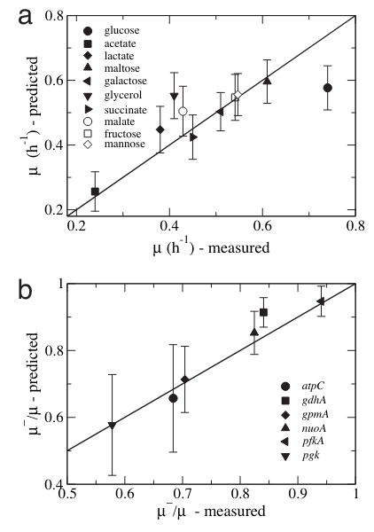
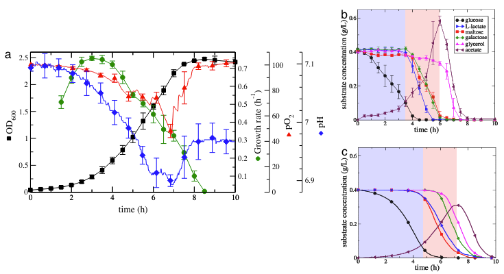
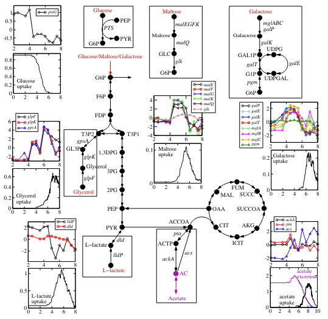
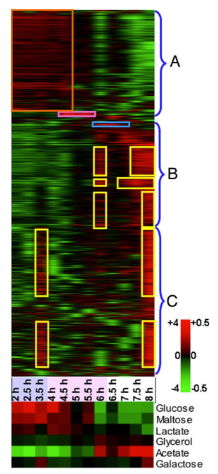

# Intracellular crowding defines the mode and sequence of substrate uptake by Escherichia coli and constrains its metabolic activity

세포 생리학에서 고분자의 높은 세포 내 농도의 영향이 점점 더 인정받고 있지만, 시스템 수준의 세포 기능에 대한 영향은 아직 잘 정량화되지 않았습니다. 그 잠재적 영향을 평가하기 위해, 여기서 우리는 대장균 세포 대사의 플럭스 균형 모델을 개발하여 **crowding한 세포질 내 다양한 대사 반응을 촉매하는 효소의 농도에 대한 시스템 수준의 constraints**을 고려합니다. 우리는 모델이 단일 substrate 제한 배지에서의 야생형 및 돌연변이 대장균 세포의 상대 최대 성장률과 복잡한 배지에서의 substrate uptake 및 이용의 순서 및 방식을 예측하는 데 있어 후속 실험적 관찰과 잘 일치한다는 것을 보여줍니다. 이러한 결과는 molecular crowding이 대사 네트워크의 달성 가능한 기능적 상태의 경계를 나타내며, 이 constraints을 통합한 모델이 환경 변화에 반응하여 활성화된 세포 대사의 변화를 체계적으로 식별할 수 있음을 시사합니다.

## Intro

시스템 생물학의 중요한 목표는 분자 상호작용 네트워크의 기능과 유기체의 표현형 다양성 한계를 특징짓는 조직 원리와 근본적 constraints을 식별하는 것입니다 (1-3). 대사 네트워크의 구조에 의해 부과된 constraints을 질량 또는 에너지 보존 원칙과 결합한 플럭스 균형 기반 모델링 접근 방식은 유기체의 대사 플럭스 상태와 성장률에 대한 실험적으로 검증 가능한 예측을 제공하는 데 특히 성공적입니다 (3-6). 그러나 이러한 접근 방식의 상대적인 **단점은 세포의 독특한 세포내 환경으로 인해 발생하는 물리적 및 공간적 constraints을 고려하지 않는다는 것입니다** (7-9). 예를 들어, 대장균 세포질의 약 20-30%는 단백질과 같은 고분자로 채워져 있으며, 이들 중 많은 것은 효소입니다. 이 효소의 세포질 농도는 단백질 접힘, 단백질-단백질 결합 속도, 생화학적 반응 속도, 세포 내 수송 동역학에 큰 영향을 미치지 않고는 더 이상 증가할 수 없습니다 (9, 10). 이는 **각 반응을 촉매하는 효소가 이용 가능한 세포질 공간을 놓고 경쟁함으로써 잠재적으로 달성 가능한 플럭스 속도를 제한할 수 있음을 시사**합니다 (12, 13).

현재 플럭스 균형 기반 모델링 접근 방식은 또한 환경에서 substrate uptake를 예측하는 능력이 제한적입니다. 광범위한 실험 데이터는 복합 배지에서 자란 박테리아 세포가 성장 조건에 따라 이용 가능한 **substrate을 선호적으로 또는 동시에 사용한다**는 것을 나타냅니다 (예: 14-17). **mixed-substrate 성장을 모델링하려는 노력은 substrate uptake 및 biomass 성장률에 대한 specific kinetic expressions을 가정하고, 그 예측은 알려진 모델 parameters를 기반으로 합니다** (15, 18). 마찬가지로, FBA 예측은 해당 배지에서 maximum uptake rates에 대한 사전 지식을 기반으로 하며 (실제로 예측하려는 변수), **실증적 증거와는 대조적으로, FBA 자체는 mixed-substrate 성장 배지에서 모든 탄소원을 동시에 이용한다고 예측**합니다. **이 결함을 극복하는 한 가지 방법은 FBA 모델에 regulatory 메커니즘 (mRNA 발현 시그니처 형태)을 겹쳐서 어떤 substrate이 흡수되고 어떤 substrate이 흡수되지 않는지를 평가하는 것입니다** (19). 그러나 regulatory 메커니즘은 세포에 선택적 이점을 제공하기 때문에 진화 과정에서 나타납니다. 이 선택적 이점은 유기체의 metabolic constraints 내에서 이용 가능한 자원을 더 잘 사용한 결과입니다. 따라서 metabolic constraints이 주요 원인으로 간주될 수 있으며, **regulatory 과정은 이 constraints에 대처하기 위해 개발된 특정 분자 메커니즘을 나타냅니다**. 이 사실은 관련 constraints을 부과한 후 regulatory 메커니즘 구현의 선택적 이점을 예측하는 FBA 모델의 가능성을 열어줍니다. **여기서 우리는 crowding한 세포질 내에서 달성 가능한 효소 농도에 대한 용매 용량 constraints을 통합한 수정된 FBA 모델을 개발**합니다. 이 모델을 사용하여 **단일 탄소원에서의 E. coli MG1655 야생형 및 돌연변이 균주의 최대 성장률과 mixed-substrate 성장 배지에서의 substrate 이용 동적 패턴을 예측**합니다. 우리는 성장률 측정 및 마이크로어레이와 substrate 농도 시간 프로파일을 사용하여 모델 예측을 테스트하고, 모델 예측과 실험 측정 간의 좋은 일치를 얻습니다. 종합하면, 이러한 결과는 **고분자 crowding이 실제로 박테리아 대사 활동에 생리학적으로 관련된 constraints을 부과하며, 이 constraints을 통합하면 시스템 수준의 원칙에서 세포 대사 모델링이 개선된다는 것을 시사**합니다.

## Result

### FBA with Molecular Crowding

세포 대사의 플럭스 균형 모델에서는 세포의 대사 네트워크가 화학량론적 행렬 $S_{mi}$로 수학적으로 표현됩니다. 여기서 $S_{mi}$는 반응 $i$에서 대사산물 $m$의 화학량론적 계수를 나타냅니다 (m = 1, ..., M; i = 1, ..., N) .

세포가 안정 상태에 있다고 가정할 때, 세포질 내 각 대사산물의 농도는 일정하게 유지됩니다. 즉, 다음과 같은 수식을 만족합니다:

$$\sum_{i=1}^{N} S_{mi} f_i = 0,$$

여기서 $f_i$는 반응 $i$의 플럭스를 나타냅니다. 이 방정식과 세포 외부 substrate의 최대 흡수 속도 constraints을 결합하여 플럭스 균형 분석(FBA)의 기본을 형성합니다 .

우리는 세포 내의 매우 높은 고분자 농도에서 발생하는 물리적 및 공간적 constraints을 고려하여 이 프레임워크를 확장했습니다. 효소 분자가 유한한 몰 부피 $v_i$를 가지므로, 주어진 부피 $V$ 내에 유한한 수의 효소만을 배치할 수 있습니다. 실제로 $n_i$가 $i$번째 효소의 몰 수라면 다음과 같은 수식을 만족합니다:

$$\sum_{i=1}^{N} v_i n_i \leq V.$$

이 방정식은 효소 수준 $n_i$에 대한 constraints을 나타내며, 이는 최대 달성 가능한 값과 상대적 풍부도에 영향을 미칠 수 있습니다. 이를 세포 질량 $M$으로 나누면, 효소 농도 $E_i = n_i / M$ (질량 단위당 몰)으로 이 constraints을 다시 표현할 수 있습니다. 결과적으로 다음과 같은 수식을 얻습니다:

$$\sum_{i=1}^{N} v_i E_i \leq \frac{1}{C},$$

여기서 $C = M / V$는 E. coli의 세포질 밀도입니다. 이 방정식은 최대 달성 가능한 효소 농도에 constraints을 가하며, 따라서 우리는 이를 효소 농도 constraints이라고 부릅니다. 이 constraints은 대사 플럭스에도 반영됩니다. 실제로, 효소 농도 $E_i$는 반응 $i$에서 $f_i = b_i E_i$의 플럭스를 생성하며, 여기서 $b_i$는 반응 메커니즘, 동역학적 parameters 및 대사산물 농도에 의해 결정됩니다. 따라서 효소 농도 constraints(위 방정식 3)은 다음과 같은 대사 플럭스 constraints에 반영됩니다:

$$\sum_{i=1}^{N} a_i f_i \leq 1,$$

여기서 $a_i = C v_i / b_i$는 최대 달성 가능한 플럭스와 다른 대사 반응 간의 플럭스 분포에 영향을 미칩니다. 여기서부터 우리는 이 수학적 프레임워크를 "분자 군집과의 플럭스 균형 분석(FBAwMC)"라고 부릅니다. 또한, $a_i$ 계수가 반응 $i$에 의한 전체 군집에 대한 기여도를 정량화하므로 이를 "반응 $i$의 군집 계수" 또는 간단히 "군집 계수"라고 부릅니다.

마지막으로, 효소 농도 constraints이 E. coli의 대사 능력을 제한할 수 있는 유일한 추가 constraints이 아님을 언급해야 합니다 (예: 수송체 용량도 유사하게 제한적일 수 있음). 그러나 여기서 우리의 목표는 효소 농도 constraints이 E. coli의 최대 대사 능력을 제한하는 주요 요소라고 가정하는 모델의 예측 가치를 테스트하는 것입니다.

### FBAwMC Predicts the Relative Maximum Growth of E. coli Growing on Single Carbon Sources

세포 대사 활동의 constraints 조건으로서 거대 분자의 crowding의 타당성을 확인하고, FBAwMC 프레임워크의 예측 능력을 테스트하기 위해, 우리는 먼저 산소가 풍부한 단일 탄소 제한 배지에서 성장하는 동안의 세포 외 substrate 가용성의 표현형 결과를 최대 성장률에 초점을 맞추어 조사했습니다. FBAwMC에는 평균 crowding 계수 $\langle a \rangle$라는 자유 변수가 포함되어 있으며, 최대 성장률에 대한 모델 예측은 $\langle a \rangle$에 비례합니다. 먼저 $\langle a \rangle$가 substrate과 무관한 상수라고 가정했습니다. 이 경우, 다른 substrate에서의 최대 성장률을 임의의 단위로 예측할 수 있습니다. 특정 단위의 최대 성장률을 얻기 위해, 예측된 성장률과 측정된 성장률 간의 평균 제곱 편차를 최소화하도록 $\langle a \rangle$를 조정한 결과, $\langle a \rangle = 0.0040 \pm 0.0005 \, h \cdot g/mmol$ (여기서 g는 건조 중량의 그램 단위)로 나타났습니다. 우리는 $\sim 100$개의 E. coli 효소에 대한 $a_i$의 독립적인 추정치를 얻었으며 [지원 정보(SI) 데이터셋 1 및 2], 이 값은 $10^{-6}$에서 $10^{-1}$ 사이에 있으며, 대부분의 확률 값은 $10^{-5}$에서 $10^{-2}$ 사이입니다(h \cdot g/mmol 단위). 얻어진 $\langle a \rangle$는 따라서 예상 범위 내에 있습니다.

---

Fig 1. Predicted and measured maximal growth rates comparison

(a) 다양한 탄소원을 사용하여 M9 최소 배지에서 성장한 E. coli MG1655의 예측된 (y 축) 및 측정된 (x 축) 성장률을 비교합니다. 실험과 이론 간의 완벽한 일치를 위해 기호는 검은 대각선 위에 있어야 합니다. 기호는 키에서 식별된 탄소 원을 나타냅니다. 예측된 성장률은 특정 ai 매개 변수 1,000 세트에 대한 표준 편차를 나타냅니다. (S1 및 S2 섹션 참조)

(b) 같은 그래프를 포도당에서 성장하는 단일 유전자 삭제 E. coli 변이체에 대해 나타냅니다. 삭제된 유전자는 키에서 나타내었습니다. 변이체 성장률은 포도당 제한 배지에서 성장하는 와일드타입 E. coli 세포의 예측된 및 측정된 최대 성장률을 기준으로 제공됩니다.

---

재구성된 E. coli MG1655 대사 네트워크(SI 데이터셋 1)를 사용하여, 우리는 먼저 다양한 단일 탄소 제한 배지에서 E. coli MG1655 세포의 최대 성장률을 테스트하고 이 결과를 이론적으로 예측된 성장률과 비교했습니다(그림 1a). 대부분의 경우, 완벽한 일치의 선이 표준 편차 내에 있어, 모델 예측과 측정된 최대 성장률 간에 전반적인 좋은 일치를 나타냅니다. 포도당과 글리세롤의 경우, 완벽한 일치의 선이 표준 편차 밖에 있어, substrate 독립적인 $\langle a \rangle$ 가정이 이 두 substrate에 대해서는 유효하지 않음을 나타냅니다. E. coli는 포도당 성장에 더 잘 적응되어 있어, 다른 탄소원보다 평균 crowding 계수가 작습니다. 실제로, 포도당에 대해 완벽한 일치를 얻기 위해 필요한 평균 crowding 계수는 더 작습니다: $\langle a \rangle = 0.0031 \pm 0.0001 \, h \cdot g/mmol$. 반대로, 일부 탄소 제한 배지에서 E. coli는 적응적 진화 기간 후에야 예측된 최대 성장률에 도달합니다(23, 24), 이는 대사 적응 이전에 더 높은 평균 crowding 계수를 나타냅니다. 실제로, 완벽한 일치를 위해 필요한 평균 crowding 계수는 다른 substrate보다 더 큽니다: $\langle a \rangle = 0.0077 \pm 0.0003 \, h \cdot g/mmol$. 대조적으로, 일부 substrate에서는 성장률이 과소 예측되었으며, 이는 거대 분자의 crowding으로 인한 최대 성장률이 과대 평가되었음을 나타냅니다.

### Substrate Hierarchy Utilization by E. coli Cells Growing in Mixed Substrates

---

Fig 2. E. coli growth profile and predicted vs. measured hierarchy of substrate utilization. 

(a) M9 최소 배지에 같은 비율의 포도당, 말토스, 갈락토스, 글리세롤 및 락테이트를 포함하는 배치 배양 대장균 세포의 절대 농도 (검은 곡선) 및 최대 성장률 (녹색 곡선)을 보여줍니다. 이에 pH (파란 곡선)와 산소 농도, pO2 (빨간 곡선)가 함께 나타납니다. 

(b) 성장 배지에서 표시된 탄소원의 측정 농도. 성장 실험은 삼중 복제로 수행되었으며 (SI Fig. 8 참조), 여기에는 평균 및 표준 편차가 표시됩니다. 독점 포도당, mixed-substrate 및 글리세롤 및 아세테이트 세 가지 substrate 이용 단계, 각각 연한 파란색, 보라색 및 흰색 배경으로 표시됩니다. 

(c) FBAwMC 모델을 기반으로 한 성장 배지로부터의 예측된 substrate uptake량입니다. substrate 이용 곡선의 색상 코딩은 b와 c에서 동일하며, 오차 막대는 삼 개의 개별 바이오리액터 실행에서 수집된 샘플로부터 분석된 데이터의 표준 편차를 나타냅니다 (SI Fig. 8 참조).

---

복잡한 배지에서 성장하는 박테리아 세포는 성장 조건에 따라 선호적으로 또는 동시에 이용 가능한 substrate을 사용한다는 많은 실험 데이터가 있습니다(예: 참고 문헌 14, 15 및 17). 세포 대사에 대한 효소 농도 제한의 역할을 더 평가하기 위해 우리는 다음으로 mixed-탄소 제한 배지에서의 E. coli 세포의 substrate 이용을 조사했고 이를 FBAwMC E. coli 모델로 예측된 substrate uptake 및 이용과 비교했습니다(그림 2). 우리는 같은 농도(각각 0.04%)의 다섯 가지 다른 탄소원(갈락토스, 포도당, 말토스, 글리세롤 및 락테이트)를 포함하는 배치 배양에서 12 시간 동안 E. coli MG1655를 성장시켰습니다(그림 2a 및 SI Fig. 8). 이러한 substrate은 E. coli에 의해 substrate 특이적인 수송 기전을 통해 흡수되며 다양한 substrate 중간체를 통해 중심 탄소 대사로 들어갑니다(그림 3 대사 경로). 단일 탄소 제한 배지에서 포도당에서 E. coli의 최대 성장률(0.74 h^-1)은 더 높았지만, 글리세롤(0.41 h^-1) 및 락테이트(0.38 h^-1)에서 실험적으로 측정된 최대 성장률은 모델 예측보다 낮았습니다(그림 1a). 반면, 말토스(0.61 h^-1)와 갈락토스(0.51 h^-1)에서 얻은 최대 성장률은 FBAwMC로 예측된 값과 매우 일치했습니다(그림 1a). 배치 배양에서 일반적으로 볼 수 있는 것처럼, 초기에 E. coli 세포는 최소한의 성장을 보여주었고(잠복 기간), 이어서 2시부터 8시까지 빠른 인구 증가가 있었으며(지수적 성장 기간) 그 이후로는 더 이상의 성장이 없었습니다(정체 기간)(그림 2a).

이와 병행하여, 성장률은 로그 성장 기간의 시작과 함께 빠르게 증가하여 3시부터 3.5시 사이에 최대치에 도달했습니다. 그 후 성장률은 점진적으로 감소하여 8시 이후에는 무시할 수 있을 정도로 감소했습니다(그림 2a). 다섯 가지 제공된 탄소원 중에서 성장의 처음 3.5시간 동안에는 포도당만 사용되었습니다(1 단계); 이는 배지로부터 4시간 이내에 고갈되었습니다(그림 2b). 이 ‘‘독점 포도당 사용’’ 단계는 초기 폭발적인 성장과 배양의 최대 도달 성장률과 함께 일치했습니다(그림 2a). 3.5-4시간에 E. coli 세포는 나머지 네 가지 탄소원을 사용하기 시작했으나 각각 다른 속도로 사용되었습니다. 다음 2시간 동안(2단계) 갈락토스, 락테이트 및 말토스가 선호적으로 사용되었으며, 이들 중 모든 탄소원은 6시까지 배지에서 고갈되었습니다(그림 2b). 이 ‘‘mixed-탄소 이용’’ 단계에서 락테이트가 가장 빠르게 소비되었으며, 말토스와 갈락토스가 그 뒤를 이었습니다. 이 시간 동안 일부 글리세롤도 흡수되었지만, 그 주요 이용은 6시 이후에만 발생했으며, 7.5시에 배지에서 완전히 고갈되었습니다(그림 2b). 잘 알려진 E. coli 공기 중에서의 빠른 성장의 부산물 인 아세테이트의 농도는 꾸준히 증가하여 6시에 배지에서 농도의 최고치에 도달했습니다. 그 후 과정은 반대로 되돌아가 아세테이트와 함께 글리세롤이 신속하게 소비되어 8시에 배지에서 완전히 고갈되었습니다(그림 2b), 이는 배양에서의 ‘‘지연된 탄소 이용’’ 단계를 나타냅니다(3단계). 유의할 점은 단일 탄소원으로 아세테이트가 다섯 가지 제공된 탄소원 중에서 가장 낮은 최대 성장률(0.24 h^-1)을 제공한다는 것입니다(그림 1a). 종합적으로, 배치 배양 실험에서 substrate 이용의 순차적인 순서는 각각의 substrate이 개별적으로 제공하는 최대 성장률과 일부 일치하지만, 전체적으로는 일차적으로 락테이트가 나타나고 나중에 말토스와 글리세롤이 나타납니다.

이어서, mixed-substrate 조건에서 FBAwMC E. coli 모델을 테스트했습니다. FBA (3, 11)와 대조적으로, 모든 탄소원의 동시 이용을 예측하는 대신, FBAwMC로 예측된 substrate uptake와 소비의 모드와 순서 사이에 주목할 만한 높은 상관관계를 발견했습니다(그림 2b 및 c). 그러나 두 가지 주목할 만한 차이가 있습니다. 첫째, FBAwMC는 아세테이트의 더 낮은 배출을 예측합니다. 그 결과로, substrate은 vivo에서 더 빨리 소비됩니다(그림 2b), 왜냐하면 탄소 원소의 더 큰 부분이 아세테이트 배출을 향해 전환되기 때문입니다. 결과적으로, substrate 소비의 서로 다른 단계는 모델 예측을 위해 오른쪽으로 이동됩니다(더 긴 시간). 두 번째 주요한 불일치는 모델 예측에서 갈락토스의 지연된 소비입니다(그림 2c). 그럼에도 불구하고, FBAwMC는 전체적으로 substrate 소비의 세 가지 실험적으로 관찰된 단계의 존재를 올바르게 예측합니다: 포도당의 초기 소비, 중간 mixed-substrate 소비 및 늦은 글리세롤 및 아세테이트 소비입니다.

배양 실험 중에는 세포 대사의 대리 마커로서 배지에서 pH와 산소 농도의 변화를 추적했습니다. 처음 6시간 동안 pH는 꾸준히 감소하다가 67시간 동안 약간 증가한 후 78시간 동안 증가했습니다(그림 2a 및 SI Fig. 8). 또한 배지에서 용해 산소 농도(pO2)는 처음 7시간 동안 가속하여 감소한 후 다음 30분 동안 급격하게 증가했습니다. 그러나 감소 단계(아세테이트 배출로 인한 점차적으로 산성이 되는 환경에서의 유산소 호흡을 나타냄)는 지속적으로 주기적으로 용술의 증가에 의해 중단되었습니다(그림 2a 및 SI Fig. 8). 이러한 스파이크는 주요한 substrate 사용 전환으로 인한 일시적인 유산소 대사의 일시적인 일시 정지를 나타냅니다. 실제로 이러한 스파이크 중 첫 번째인 4시에는 포도당의 고갈과 mixed-substrate 이용의 시작과 관련이 있으며, 두 번째인 5시에는 락테이트의 고갈과 말토스의 증가된 이용과 관련이 있습니다. 마지막으로, 6시에는 글리세롤과 아세테이트의 공동 이용의 시작과 관련이 있습니다. 마찬가지로, 7시에서의 산소 농도의 첫 번째 급격한 증가는 글리세롤의 거의 고갈과 관련이 있으며, 30분 후에는 배지에서 아세테이트의 고갈과 관련이 있습니다(그림 2b).

### The Mode and Sequence of Substrate Utilization Correlate with the Expression of Genes Participating in the Uptake Modules.

--- 

Fig 3. 

각 그래프 쌍의 상단 패널은 시간(시간 단위)에 따른 측정된 상대적 유전자 발현 프로파일을 나타냅니다. 하단 패널은 시간(시간 단위)에 따른 예측된 substrate uptake 프로파일 (mmol/min-g)을 나타냅니다. 원래 성장 배지에 존재하는 substrate (빨간색) 중에서 포도당, 말토스, 갈락토스, 글리세롤 및 락테이트의 흡수 및 E. coli 금속 유리화 경로 및 시트르산 회로로의 진입점이 도표화된 대사 경로가 나타납니다. 

아세테이트 (보라색)는 배치 배양에서 성장하는 E. coli 세포에 의해 처음에 생성되고 나중에 소비됩니다. 다른 모든 substrate은 검은색으로 표시되며, 중간체 substrate의 수송 및 분해를 촉진하는 다양한 효소를 인코딩하는 유전자도 이탤릭체로 표시됩니다. 나열된 탄소원의 흡수 및 이용에 책임 있는 유전자에 대한 설명, 그들의 생물학적 역할 및 substrate 진입 메커니즘의 설명은 SI Table 1에 자세히 나와 있습니다. 갈락토스, 포도당, 글리세롤, 락테이트, 아세테이트 및 말토스 대사에 특히 관여하는 대사 수송체 및 효소를 인코딩하는 유전자의 mRNA 발현 프로파일이 표시됩니다. 상세 프로파일 및 전체 마이크로어레이 데이터는 SI Dataset 3에 제시되어 있습니다. 

full microarray data의 유전자 발현 값(y 축)은 각 유전자에 대해 각 시간 점의 하이브리다이제이션 강도의 기하 평균에 대한 각 시간 점의 계산된 폴드 변경으로 표시되며 log2로 표시됩니다. 낮은 값은 낮은 유전자 발현을 나타내고, 높은 값은 높은 유전자 발현을 나타냅니다.

--- 

또한, 우리는 2시부터 8시까지 30분 간격으로 채취한 샘플로부터 mRNA를 추출하여 마이크로어레이 분석으로 처리했습니다(SI Dataset 3로 제시됨). substrate uptake 경로의 수준에서(Fig. 3), 포도당 수송체 PtsG/Crr을 인코딩하는 유전자인 ptsG의 발현은 첫 번째 시점부터 포도당이 배지로부터 고갈될 때까지 높은 수준으로 유지되었으며, 그 후에는 ptsG 발현이 빠르게 차단되었습니다. 마찬가지로, 유당 수송체 LldP를 인코딩하는 유전자인 lldP의 발현은 성장의 처음 4.5시간 동안 높았으며, 그 이후에는 빠르게 차단되었는데, 이는 예상보다 일찍 락테이트가 소비되는 것과 일치합니다. 반면에, 말토스와 갈락토스 흡수 및 이용에 관여하는 유전자 제품의 발현은 훨씬 늦게 시작되었고, 4.55.5시간에 정점을 찍었으며, 이는 그들의 최대 흡수 기간과 일치합니다. 

글리세롤 흡수 및 이용을 담당하는 유전자 제품의 발현은 두 번의 파도로 나타났는데, 작은 파도는 4.55시간 사이에, 큰 파도는 6.57시간 사이에 발현되었습니다. 후자는 배지로부터 최대의 글리세롤 소비에 해당합니다(Fig. 2b). 마지막으로, 아세테이트를 시트르산 회로로의 흡수로 촉진하는 acs의 발현은 성장 68시간에 정점을 찍었으며, 이는 이전에 배지로부터 분비된 아세테이트의 최대 흡수에 해당합니다. 모든 이러한 변화가 대응하는 substrate의 FBAwMC 모델로 예측된 흡수와 일치한다는 점에 유의합니다(Fig. 3, 검은색 추적). 

마이크로어레이 프로파일의 품질을 평가하고, 흡수 경로 효소를 인코딩하는 유전자들의 발현 패턴이 유사한 유전자들을 식별하기 위해 TimeSearcher(29)를 사용했습니다. 우리는 발현 패턴이 쿼리 유전자들과 유사한 대부분의 유전자들이 동일한 operon 내에서 그들과 공존하는 것을 발견했습니다(SI Figs. 10-15). 예를 들어, 말토스 흡수 모듈 유전자(malEFGK, malQ 및 glk)에 대해 TimeSearcher는 발현 프로파일이 유사한 여러 다른 유전자들(lamB, malM, malP, malS 및 malZ)를 식별했습니다. 이러한 유전자들은 말토스 regulatory론(30) 내의 여러 operon의 일부입니다.

### Activation of Stress Programs upon Switching Metabolic Phases

---
Fig. 4. 마이크로어레이 발현 데이터의 분석.

(상단) 최적의 잎 순서를 갖는 계층적 클러스터링 (31)은 세 가지 주요 발현 모드를 식별합니다. 최고에서 (빨강)부터 최저까지 (녹색)의 상대적 유전자 발현 값을 보여줍니다. 색상 척도 막대의 왼쪽에 나타난대로 [+4에서 -4까지]. 발현 모드 A: 4.5 시간까지 상승하는 유전자 (빨간색 상자). 발현 모드 B: 6 시 및 7.5 시 이후에 발현 정점을 갖는 유전자. 발현 모드 C: 3.5 시간 및 7.5 시간 이후에 정점을 갖는 유전자입니다. 이러한 세 발현 모드의 GO 분석은 SI Fig에서 확인할 수 있습니다. 16-18. 보라색 및 파란색 상자는 각각 말토스 및 글리세롤 regulatory론의 상승을 나타냅니다. substrate 이용의 세 가지 단계의 시간 순서는 연한 파란색, 보라색 및 흰색 음영으로 표시됩니다 (Fig. 2와 동일).

(하단) 주어진 시간 점에서의 전반적인 발현 프로파일과 해당 단독 탄소 제한 배지의 중간 로그 배양에서 얻은 프로파일과의 전반적 상관 관계를 비교하는 행렬입니다. 색상 척도 막대의 오른쪽에 나타난대로 [+0.5 (빨강-높음) 및 -0.5 (녹색-낮음)].

---

시간 경과 실험의 다양한 대사 상태 동안 E. coli 전사체의 전체적 상태를 평가하기 위해 우리는 전체 마이크로어레이 데이터를 분석하기 위해 세 가지 다른 데이터 분석 방법을 사용했습니다. 이 방법에는 최적의 잎 순서를 갖는 계층적 클러스터링 (31, 32) (그림 4), 주성분 분석 (PCA) (33) (SI Fig. 9) 및 숨겨진 마르코프 모델 (HMMs)을 기반으로 한 확률적 클러스터링 방법 (34) (SI Figs. 19–26)이 포함되었습니다. 독점 포도당 이용 단계 동안 2시부터 3.5시까지 수집된 모든 샘플에서 유사한 발현 프로파일이 나타나며, 그 이후 4시 이후 mixed-이용 단계의 전사체 상태 변화가 나타납니다(Fig. 4). 후자의 단계에서, 말토스 regulatory론 유전자들의 발현 증가가 명백합니다 (Fig. 4).

mixed-substrate 이용 단계 (5시와 5.5시) 및 늦은 탄소 이용 단계 (6.5시) 동안 얻은 샘플들은 유사한 전체적 발현 프로파일을 나타내며, 6시에 발현 프로파일의 상당한 변화가 발생하여 아세테이트 분비에서 아세테이트 이용으로의 전환을 나타냅니다 (Fig. 3). 흥미롭게도, 6시의 전사체는 배지로부터 모든 substrate이 (거의) 고갈된 E. coli 세포를 특징으로 하는 것과 유사하며, 이 단계는 일반적인 스트레스 반응으로 특징지어집니다 (Fig. 4 및 SI Fig. 27). 마지막 단계에서 상승하는 많은 유전자들도 전적으로 포도당 이용에서 mixed-substrate 이용 단계로 전환되는 단계인 3.5시에 비해 3.5시에 비해 상승합니다.

시간점별 발현 프로파일을 더 자세히 특성화하기 위해 우리는 또한 포도당, 말토스, 글리세롤, 아세테이트, 락테이트 또는 갈락토스로 제한된 배지에서 성장한 개별 중간 로그 배양 E. coli 세포 (OD600 $\approx$ 0.2)에서 mRNA 샘플을 준비하고 마이크로어레이 분석을 수행했습니다 (SI Datasets 4 및 5로 제시됨). 그리고 이러한 얻은 전사체 프로파일을 mixed-substrate 실험의 각 시간점 (Fig. 4 하단)의 프로파일과 비교했습니다. 단독 포도당 및 mixed-substrate 이용 단계 중에 전사체 프로파일은 초기 시간점에서 포도당 및 말토스 제한 배양의 그것과 가장 높은 상관 관계를 나타내며, 늦은 탄소 이용 프로파일은 글리세롤 및 특히 아세테이트 제한 배양의 그것과 가장 유사합니다. 상당히 주목할 만한 것은 갈락토스 제한 배양의 전사체 프로파일로, 이것은 독점 포도당 이용에서 mixed-substrate 이용 단계로의 전환 (3.5시) 단계의 세포와 다소 유사하며, 모든 탄소원이 고갈될 때 (8시)의 전사체 프로파일과 더 높은 유사성을 나타냅니다. 따라서, E. coli 세포는 각 주요 대사 전환 단계에서 일부 적응/스트레스 반응을 나타내며, 일반적인 스트레스 반응 (SI Fig. 27)과 모든 세포 외 substrate의 완전한 고갈에 따른 먹이 프로그램 (35)을 실행하는 것으로 보이는 아세테이트 및 갈락토스 분해에 가장 잘 준비된 것처럼 보입니다.

## Discussion

정의하는 원칙을 식별하는 데 초점을 맞추었습니다. 우리의 실험 결과는 E. coli의 성장 중에 세 가지 주요 대사 단계가 발생한다는 것을 나타냅니다. 단일 유형의 mixed-substrate 배지에서. 글루코스는 최고의 성장률을 제공하므로 E. coli가 우선적으로 사용되며, 이어서 말토스, L-락테이트 및 갈락토스가 동시에 이용됩니다. 글리세롤과 (분비된) 아세테이트는 성장의 세 번째 및 마지막 단계에서 사용됩니다. 게다가, 전역 mRNA 발현 데이터는 E. coli에서 세포 기능의 조직 수준 통합이 주요 대사 단계의 경계에서의 부분적인 스트레스 반응의 발생과 (이전에 보여준대로) 성장 배지에서 substrate의 고갈에 대한 먹이 프로그램의 활성화를 포함한다는 것을 나타냅니다 (Fig. 4).

시뮬레이션 결과는 여기서 소개된 FBAwMC 모델이 조사된 대사 활동의 모든 주요 특징을 성공적으로 포착한다는 것을 보여줍니다. 첫째, 서로 다른 탄소 한정 배지에서 E. coli의 실내 상대적 최대 성장률과 FBAwMC의 인 실리코 예측 사이에 상당한 상관 관계가 있습니다 (Fig. 1). 둘째, FBAwMC 모델은 mixed-substrate 성장 배지에서 substrate 이용의 세 가지 대사 단계와 계층적 모드 (즉, 단일 또는 mixed-substrate 이용)의 존재를 매우 잘 예측합니다 (Figs. 2-4). 본질적으로 우리의 모델링 접근 방식은 E. coli 세포가 substrate이 풍부한 조건에서 성장할 때 그들의 성장률이 세포질의 용매용량에 의해 결정된다는 것을 나타냅니다; 그 반대로, 용매용량은 최대 성장률에서 포화될 것입니다. 따라서, 풍부한 탄소원 혼합물에서 성장할 때 E. coli 세포는 가장 높은 성장률을 제공하는 substrate을 우선적으로 소비해야 합니다. 용매용량이 포화되면, 두 번째로 효율이 낮은 substrate을 이용하는 데 필요한 대사 효소의 합성이 불가능해집니다. 그러나 이는 성장률 감소를 유발하며, 따라서 더 효율적인 탄소원의 동시 이용을 허용하는 세포가 더 우위에 있게 됩니다.

그러나 FBAwMC 모델 예측의 두 가지 불일치를 관찰합니다: (i) 성장 배지에서 분비된 아세테이트의 예측보다 높은 양, 그리고 (ii) 모델에 의한 예측보다 약간 빠른 시기에 배지로부터 여러 substrate의 흡수 및 소비. 첫 번째 불일치는 화합물 효소 이외의 다른 세포 성분의 기여에 기인할 것으로 생각됩니다. 성장률이 증가함에 따라, 대사 효소에 추가로 리보솜 단백질, mRNA 및 DNA 농도가 필요합니다 (36). 이 관찰은 FBAwMC 모델이 대분자 crowding 및 그 결과로의 아세테이트 분비의 영향을 과소평가할 수 있다는 것을 나타냅니다. 두 번째 불일치는 대개 아세테이트 분비량이 증가함에 따라 탄소원 흡수 속도가 증가하는 경향이 있기 때문에 첫 번째 불일치의 결과로 생길 가능성이 높습니다.

이러한 점을 종합하면, 우리의 결과는 플럭스 밸런스 및 기타 물리화학적 constraints 조건을 포함한 인 실리코 모델이 세균 세포의 대사 활동을 점점 더 잘 포착할 수 있으며, 최대 효소 농도가 mixed-substrate 성장 조건에서 substrate 이용의 계층 구조를 형성하는 중요한 constraints 조건임을 보여줍니다. 그러나 세포의 대사 능력은 이러한 constraints 조건에 의해 제한되지만, 실제로 대사 활동의 변화는 이러한 constraints 조건의 맥락에서 진화한 regulatory 메커니즘에 의해 통제됩니다. 따라서 constraints 조건에 대한 최적화된 접근 방식은 또한 E. coli 및 다른 생물의 작용하는 regulatory 메커니즘을 더 잘 이해하고/또는 발견하는 데 도움이 될 것으로 기대됩니다.