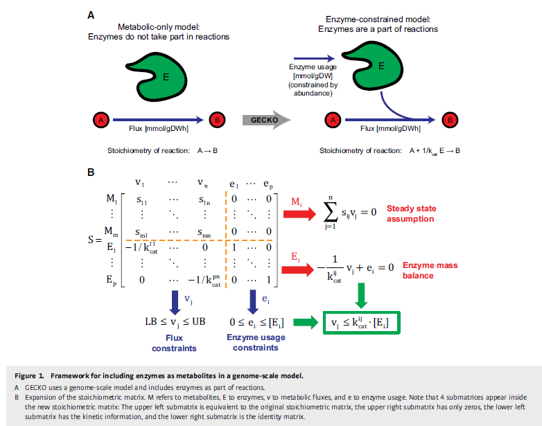
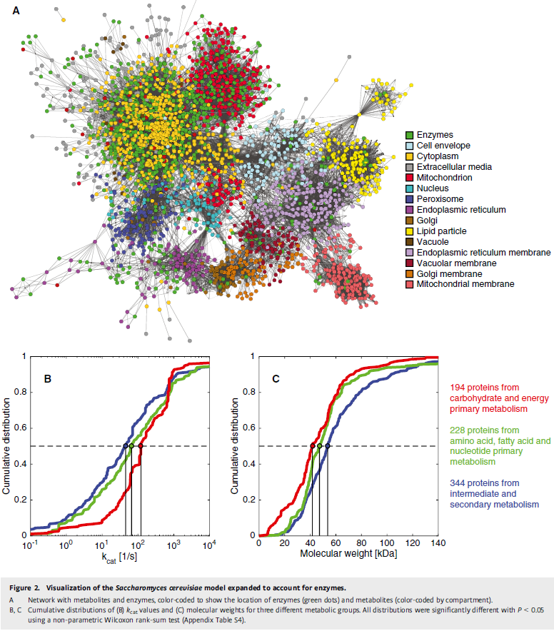
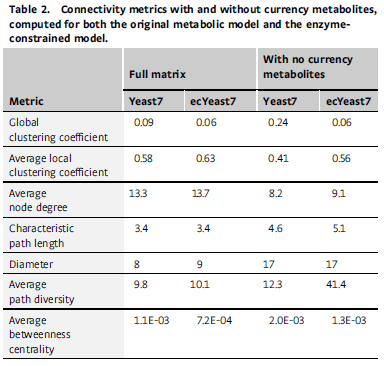
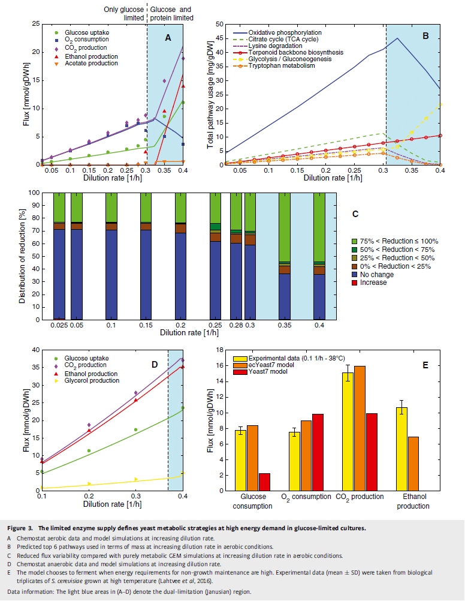
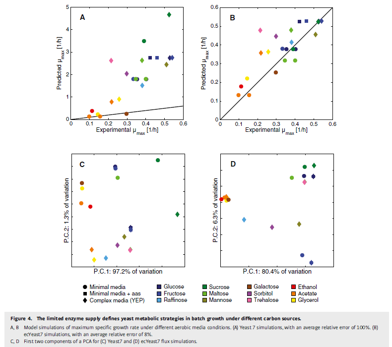
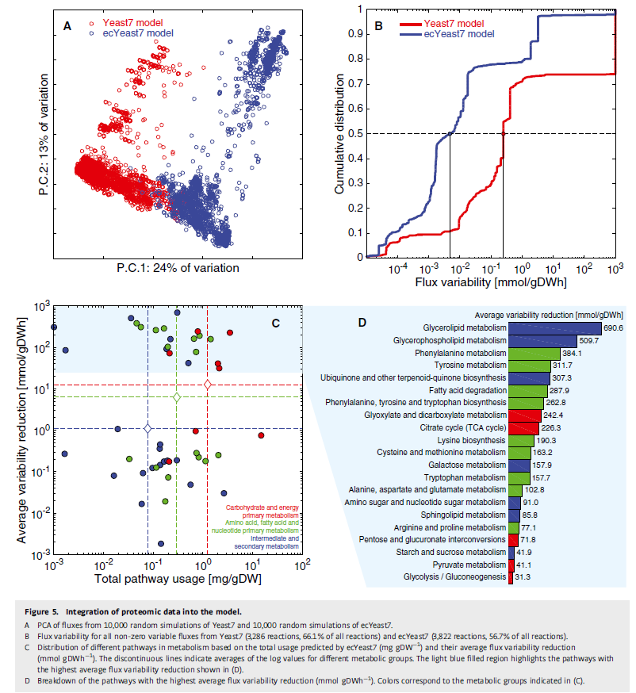
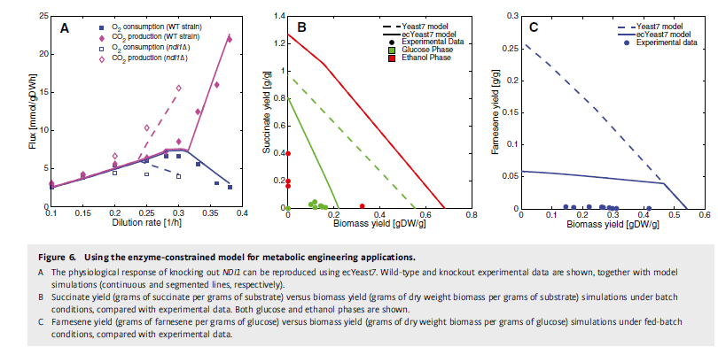

# Improving the phenotype predictions of a yeast genome-scale metabolic model by incorporating enzymatic constraints

## Abstract

Genome-scale metabolic models(GEMs)은 metabolic phenotypes을 계산하는 데 널리 사용됩니다. 이러한 모델들은 metabolites 생산 및/또는 성장이 탄소원 섭취율(uptake rate)에 의해 제한된다는 constraints을 정의하는 것에 의존합니다. 그러나 metabolic flux을 제한하는 효소의 abundance와 kinetics은 고려되지 않습니다. 여기에서 우리는 GECKO를 소개합니다. **이 방법은 반응의 일부로 효소를 포함하도록 GEM을 향상시켜 각 metabolic flux이 효소의 abundance와 turnover number의 곱과 같은 maximum capacity를 초과하지 않도록 합니다.** 우리는 GECKO를 Saccharomyces cerevisiae GEM에 적용하여 새로운 모델이 이전 모델이 설명할 수 없었던 phenotypes을 올바르게 설명할 수 있음을 입증했습니다. 특히 high enzymatic pressure 조건에서, 예를 들어 다양한 탄소원을 과도하게 사용하여 성장하는 효모, 스트레스를 견디는 경우, 또는 특정 경로를 overexpressing하는 경우에 해당합니다. GECKO는 또한 quantitative proteomics data를 직접 통합할 수 있게 하여 모델의 flux variability을 metabolic reaction의 60% 이상에서 크게 감소시켰습니다. 추가로 이 모델은 대사 경로 내 및 경로 간 enzyme usage의 분포에 대한 통찰력을 제공합니다. 개발된 방법과 모델은 대사 공학에서 모델 기반 설계의 사용을 증가시킬 것으로 예상됩니다.

## Introduction 

대사는 세포 기능의 핵심에 있으며, 신뢰할 수 있는 정량적 대사 모델의 개발은 시스템 생물학의 주요 목표입니다. 지난 20년 동안 이러한 목표를 달성하기 위한 반복적인 모델링 접근 방식은 반응의 stoichiometry 및 세포 내 metabolites의 mass balances에서 metabolic flux을 계산할 수 있는 constraint-based modeling 이었습니다. GEM은 수율 또는 knock-out 예측과 같은 대사 공학 응용을 위해 광범위하게 사용되어 왔습니다. 그러나 관심 있는 metabolites의 생산을 고려할 때, **이러한 모델은 일반적으로 탄소원(예: glucose)의 섭취율이 생산을 제한한다고 가정합니다. 이는 metabolic flux이 해당하는 enzyme level에 의해 제한되기 때문에 과도한 단순화일 수 있습니다.** 그러나 전통적인 GEM에서는 효소 농도를 metabolic flux과 연결할 수 없기 때문에 이를 직접적으로 테스트할 수 없습니다. 따라서 enzyme level을 GEM에 통합할 수 있는 새로운 모델링 개념의 개발에 관심이 있습니다. 이러한 enzyme level은 quantitative proteomics data에서 추론할 수 있습니다. 프로테오믹스 데이터는 지금까지 주로 GEM과 간접적으로 결합되어 단백질 수준을 해당 flux과 상관시키는 방식으로 사용되었습니다.

Enzymatic limitations을 대사 모델에 반영하기 위한 다양한 접근 방식이 개발되었습니다. 하나의 접근 방식인 molecular crowding가 포함된 flux 균형 분석(FBAwMC)은 모든 대사 효소가 차지하는 전체 세포 부피에 대한 global capacity constraint을 부과하는 방식에 의존합니다. 이 접근 방식은 효소 총량을 제한하는 방식으로도 조정되었습니다. Escherichia coli의 GEM과 함께 FBAwMC를 사용하면 높은 specific growth rates에서 아세트산 생산이 산화적 인산화의 낮은 촉매 효율로 인한 것임을 보여주었습니다. 유사한 결과는 젖산을 생성하는 암세포와 에탄올을 생성하는 Saccharomyces cerevisiae 세포에서 관찰되었습니다. 이러한 접근 방식의 다른 변형은 효소를 별도의 엔터티로 간주하고 추가 단백질 부문을 고려하도록 개발되었습니다. 그럼에도 불구하고 이러한 접근 방식은 생리화학적 constraints에 대한 proteomics의 전역 적응을 연구하기 위해 개발되었으며, proteomics 데이터를 통합하도록 설계되지 않았습니다.

Enzymatic limitations을 고려하기 위한 또 다른 프레임워크는 대사와 유전자 발현의 게놈 규모 모델(ME 모델)입니다. 이 모델은 유전자 transcription rates에서 시작하여 기능성 단백질 합성에 필요한 모든 과정을 포함합니다. **이 접근 방식은 E. coli에서 높은 specific growth rates에서 효소 용량의 제한을 확인하는 데 사용되었습니다.** ME 모델은 Thermotoga maritima와 E. coli에만 개발되었는데, 이는 단백질 성숙, 단백질 접힘, 금속 결합 등의 모든 단계를 자세히 알아야 하기 때문입니다. **이는 모든 유기체에 대해, 특히 진핵 세포에 대해 쉽게 제공되지 않습니다.** 최근 유기체의 단백질 분비 과정을 모델링하려는 노력에도 불구하고 단백질 합성 요구 사항, 특히 위치 지정 및 구획화 측면에서 자세한 내용이 필요합니다.

Protein limitations을 고려하기 위해 resource balance analysis, self-replicating models 및 whole-cell models과 같은 대체 접근 방식도 개발되었습니다. **전자는 실험 데이터를 사용하여 apparent(분명한) catalytic rates을 추정하고 이 추정을 hard constraints(equalities)으로 사용하여 단백질 분포를 예측**합니다. 따라서 여러 실험 데이터 세트가 필요합니다. **후자의 두 접근 방식은 대부분 qualitative이거나 현재 사용할 수 없는 과도한 수의 parameters를 필요로 합니다**. 언급된 모든 모델링 접근 방식을 고려할 때 proteomics 데이터를 통합하기 위한 각 enzyme level에 soft constraints(inequalities)을 부과할 수 있는 정량적 예측 게놈 규모 방법이 필요합니다.

여기서 우리는 **효소 kinetics과 abundance를 사용하여 GEM을 생물학적으로 실행 가능한 flux으로 제한하기 위한 종합적인 모델링 접근 방식**을 제시합니다. 이 방법론에서는 **각 metabolic reaction에 enzyme usage을 나타내는 추가 엔터티가 포함**됩니다. **엔터티는 모델에 입력으로 제공될 수 있는 단백질 abundance에 의해 제한**됩니다. 따라서 **단백질 abundance 측정을 기반으로 한 constraints을 통해 capacity constraints이 올바르게 나타나도록 대사를 편리하게 시뮬레이션할 수 있습니다**. 이 방법은 enzymatic limitations이 있는 Kinetic 및 Omics 데이터를 사용하여 GEM을 향상시키며 GECKO라고 합니다. 우리는 GECKO를 S. cerevisiae의 GEM에 적용하여 다양한 생물학적 현상을 어떻게 설명할 수 있는지 보여줍니다. 특히 시뮬레이션을 통해 enzymatic limitations이 유전자 knock-out phenotypes, 다양한 탄소원에서의 성장 및 분비된 metabolites의 수율과 같은 다양한 세포 행동을 지배함을 보여줍니다. 이러한 결과는 미생물에서 단백질 할당을 위한 단순한 원칙이 있다는 아이디어를 강화합니다.

## Result

### GECKO: accounting for enzyme constraints in a genomescale model

어떤 reaction flux(또는 대사율)은 기본적인 constraints을 가지고 있습니다: **반응의 최대 속도(v_max)를 초과할 수 없으며, 이는 해당 효소의 세포 내 농도에 효소의 turnover number(k_cat 값)를 곱한 값과 동일**합니다. 그러나 효소와 반응 간의 복잡한 관계가 자주 발생하여 이러한 constraints을 복잡하게 만듭니다(Adadi et al, 2012). 이러한 예로는 isozyme(같은 반응을 촉매하는 서로 다른 효소), promiscuous enzymes(여러 반응을 촉매할 수 있는 효소), complexes(여러 하위 단위가 함께 하나의 반응을 촉매하는 경우), 그리고 reversible 반응(효소가 동일한 반응의 두 방향을 촉매하는 경우)이 있습니다.

우리는 GECKO를 개발하여 효소 데이터를 사용하여 GEM의 metabolic flux을 제한함으로써 constraint-based modeling  결과의 variability을 줄이고 예측을 개선할 수 있도록 했습니다. 이 접근 방식은 효소를 모델의 해당 반응에서 제한된 용량을 가진 엔터티로 나타내어 게놈 규모 모델링을 확장합니다(Fig 1A). 전통적인 게놈 규모 모델링에서는 전체 대사를 나타내는 stoichiometry 행렬이 정의되며, 열은 각 반응의 stoichiometry을 나타내고 행은 각 metabolites의 mass balances을 나타냅니다. GECKO에서는 효소를 나타내는 **새로운 행과 각 효소의 사용을 나타내는 새로운 열을 추가하여 이 접근 방식을 확장**했습니다(Fig 1B; Gu et al, 2016; Machado et al, 2016). metabolic flux을 mmol gDWh로 변환하는 stoichiometry 계수로 k_cat 값 형태의 kinetics 정보를 포함했습니다. 단백질 수준은 각 enzyme usage에 대한 상한으로 포함되어 원하는 대로 각 flux에 대한 constraints이 존중되도록 합니다(Fig 1B).

모델의 모든 효소는 GEM의 유전자 연관성을 사용하여 추론되었으며, SWISS-PROT(Boeckmann et al, 2003) 및 KEGG(Kanehisa & Goto, 2000)에서 조회되었습니다. 특정 형식이 개발되어 reversible 효소, isozyme, promiscuous enzymes, complexes와 같은 사례를 관리했습니다. turnover numbers는 BRENDA(Schomburg et al, 2013)에서 유연한 기준을 사용하여 자동으로 조회되었으며 데이터 variability을 관리하기 위한 기준을 유연하게 관리합니다. 효소 abundance는 실험 값(절대 proteomics 분석)으로 모델에 상한으로 설정될 수 있습니다. proteomics 데이터가 없거나 불완전한 경우, 효소별 constraints은 FBAwMC 접근 방식과 유사한 전체 enzyme mass constraints으로 대체될 수 있습니다(Beg et al, 2007). GECKO의 추가 세부 사항은 재료 및 방법 섹션을 참조하십시오.

### ecYeast7: an enzyme-constrained model of Saccharomyces cerevisiae

#### General description of the model

GECKO는 최신 버전의 효모의 합의된 게놈 규모 재구축인 Yeast7에 적용되었습니다. 이 모델은 현재 3,493개의 반응과 2,220개의 metabolites로 구성됩니다. 결과적으로 효소 constraints 모델인 ecYeast7은 6,741개의 반응과 3,388개의 metabolites을 가지며, 이 중 764개는 효소이고 404개는 isozyme을 관리하기 위해 도입된 가상 metabolites입니다(Table 1). 모델에서는 효소와 반응 간의 복잡한 관계가 흔하며, 226개의 complexes, 373개의 isozyme 반응, 315개의 promiscuous enzymes 반응이 있습니다(Table 1, Appendix Fig S2). 마지막으로, ecYeast7은 COBRA 도구 상자와 완벽하게 호환되며, 대사 상대 모델에 비해 유사한 시뮬레이션 실행 시간을 가집니다. 표준 성장 최대화 FBA 문제를 Windows PC에서 Gurobi LP 해석기를 사용하여 실행한 결과, ecYeast7의 경우 135 ± 7.3 ms, Yeast7의 경우 138 ± 9.7 ms가 소요되었습니다.

#### Biochemical characteristics of enzymes in the model

다음으로 ecYeast7의 764개의 **효소의 kcat 값과 분자량이라는 생화학적 특성을 조사**했습니다. 분자량은 3의 크기 범위에 걸쳐 있으며 kcat 값은 11의 크기 범위에 걸쳐 있으며, 각각의 중앙값은 48.2 kDa와 70.9 s입니다(Appendix Fig S3). **총 92.1%의 kcat 값은 0.1에서 10,000 s 사이에 있습니다**(Fig 2B). BRENDA 데이터베이스의 값은 일반적으로 시험관 내에서 측정되며 실험실 내 값과 약간 다를 수 있습니다.

그런 다음 효소를 세 가지 대사 그룹으로 분류하여 대사 기능별로 비교했습니다. 대사 그룹마다 다른 kcat 값(Fig 2B)과 분자량(Fig 2C) 분포를 가졌습니다. **특히 탄수화물 및 에너지 1차 대사 효소는 다른 두 그룹보다 현저히 높은 kcat 값(중앙값 = 120 s)과 낮은 분자량(중앙값 = 41.7 kDa)을 가졌습니다**. 반면 **중간 및 2차 대사 효소는 촉매 속도가 느리고(중앙 kcat 값 = 45.1 s) 분자량이 더 큽니다**(중앙 분자량 = 53.6 kDa). 아미노산, 지방산 및 뉴클레오타이드 1차 대사 효소는 중간 정도의 kcat 값(중앙값 = 65.9 s)과 분자량(중앙값 = 47.1 kDa)을 가졌습니다. **이는 중앙 탄수화물 대사 효소가 진화적 압력으로 인해 더 효율적이라는 이전 관찰과 일치**합니다(Bar-Even et al, 2011).

isozyme, promiscuous enzymes, complexes와 같은 다양한 유형의 효소 간의 생화학적 특성도 비교했습니다(Appendix Figs S4 and S5). complexes에 속한 단백질은 단일 효소보다 빠르고(Appendix Fig S4B) 작았으며(Appendix Fig S5B), promiscuous enzymes는 비promiscuous enzymes보다 빠릅니다(Appendix Fig S4D).

#### Connectivity of the model

Yeast7 및 ecYeast7의 연결성 메트릭을 metabolites 네트워크(Table 2)를 사용하여 계산했습니다. 전반적으로 유사한 값을 관찰하여 효소 constraints 모델이 원래 모델과 유사한 토폴로지를 가지고 있음을 나타냈습니다. 관찰된 차이 중, 글로벌 클러스터링 계수와 평균 중심성은 ecYeast7이 낮았습니다. 이는 주로 isozyme의 중간 단계로서 404개의 가상 metabolites의 포함으로 인해 효소 constraints 네트워크가 덜 클러스터링되었음을 나타냅니다. 반면 평균 지역 클러스터링 계수는 Yeast7보다 높아서 지역 클러스터의 증가를 나타냅니다. 이는 효소 764개의 추가로 인해 네트워크의 대부분의 metabolites에 새로운 연결이 생기면서 노드 차수의 증가와 일치합니다.

### Simulating physiological behavior

**먼저 proteomics 데이터의 입력 없이 모델을 테스트했습니다. 효소 총량에 대한 constraints만 적용했으며, 모델은 이 전반적인 constraints 내에서 효소를 자유롭게 할당할 수 있도록 했습니다.** 이는 GECKO의 모듈을 사용하여 효소 풀 역할을 하는 가상 metabolites을 도입하여 수행되었으며, **이는 molecular crowding 공식과 유사한 전체 질량 constraints을 만듭니다**(Beg et al, 2007; Adadi et al, 2012). **이 접근 방식으로 Overflow metabolism이 스트레스 반응, 비전형적인 탄소원 소비를 포함한 일련의 생리학적 반응을 테스트했습니다.**

#### Growth at increasing specific growth rate: simulating the Crabtree effect

여러 유기체에서 Overflow metabolism이 발생합니다. E. coli(Van Hoek & Merks, 2012), S. cerevisiae(Van Hoek et al, 1998) 및 암세포(Vazquez & Oltvai, 2011)의 경우가 그렇습니다. S. cerevisiae에서는 이것을 **Crabtree 효과**라고 하며, 호기성 조건에서 약 0.3 h^(-1)의 임계 specific growth rates에서 **효모 대사가 순수 호흡에서 호흡과 발효의 조합으로 전환되어 에탄올이 생성**됩니다. 이는 **덜 효율적인 에너지 생산 방식**입니다.

**Overflow metabolism이 원인**에 대해 여러 이론이 제기되었습니다(Molenaar et al, 2009). 최근에는 **protein limitations이 근본적인 원인일 수 있다**는 이론이 제기되었습니다. **더 빠른 성장은 더 많은 에너지를 필요로 하며, 이는 더 높은 metabolic flux을 요구하고, 이는 더 많은 enzyme mass을 필요로 합니다. 그러나 세포 내 단백질 풀은 제한적이며, 호흡 효소는 크기가 커서 특정 활동이 낮습니다. 따라서 specific growth rates이 임계 값을 초과하면 세포는 동일한 양의 enzyme mass으로 더 많은 ATP를 생성할 수 있는 경로로 전환합니다. 이는 ATP/탄소 수율이 낮더라도 효율적입니다.** 이는 다양한 접근 방식을 통해 입증되었습니다.

**전통적인 GEM은 임의의 constraints 또는 objective functions를 부과하지 않는 한 Overflow metabolism이 나타낼 수 없습니다**(Famili et al, 2003). **따라서 우리는 ecYeast7이 증가하는 specific growth rates에서 total enzyme mass constraints으로 인해 이러한 대사 변화를 나타낼 수 있는지 테스트했**습니다. 평균 효소 포화도 51%를 가정하여, 우리는 문헌의 실험 데이터와 잘 맞는 결과를 얻었으며(Van Hoek et al, 1998; Fig 3A), **specific growth rates이 0.3 h^(-1)을 초과하는 구간에서 dual limitation 영역(Janusian 영역)을 관찰**했습니다(O’Brien et al, 2013). **이 영역에서는 glucose과 enzyme content의 dual limitation으로 인해 호흡에서 발효로 전환이 일어납니다**. 예상대로 원래의 Yeast7 모델은 이 현상을 재현할 수 없었습니다(Appendix Fig S7). 또한, 임의로 할당된 kcat 값이나 분자량이 있는 효소 constraints 모델은 때때로 이 현상을 나타냈지만(Appendix Fig S8), 99.9% 이상의 경우 전환이 lower dilution rates에서 예측되었습니다. **따라서 우리는 Crabtree phenotypes이 효소 속성에 대한 적응이지 네트워크 속성이 아님을 확인할 수 있습니다**(Nilsson & Nielsen, 2016). **또한 높은 성장률에서 무산소 조건에서도 작은 Janusian 영역이 있음을 관찰**했습니다(Nissen et al, 1997; Fig 3D). 이 영역에서는 에탄올과 글리세롤 생산률 사이의 약간의 트레이드오프가 나타납니다.

호기성 조건에서 증가하는 specific growth rates에서 enzyme usage 예측을 조사했을 때(Fig 3B), specific growth rates이 임계 값을 초과하면(0.3 h^(-1)) 산화적 인산화 경로(가장 질량이 많이 필요한 경로)의 효소가 점진적으로 글리콜리틱 효소로 대체되는 것을 볼 수 있습니다. **이는 효모의 에너지 합성이 낮은 specific growth rates에서는 metabolic efficiency, 높은 specific growth rates에서는 katalytic efficiency에 의해 지배된다는 관점을 지지**합니다(Molenaar et al, 2009; Nilsson & Nielsen, 2016). 주목할 점은 specific growth rates이 증가함에 따라 산화적 인산화 효소의 농도는 감소하고 글리콜리틱 효소의 농도는 증가할 수 있다는 것입니다(Van Hoek et al, 1998, 2000). 이 구분은 효소 특이적 포화 데이터가 부족하여 시뮬레이션에서는 평균 포화도를 가정했기 때문에 우리의 시뮬레이션 범위를 벗어납니다. 비록 전체 질량 constraints 개념을 사용하는 모델이 단백질 함량을 어느 정도 예측할 수 있음을 보여주었지만(Nilsson & Nielsen, 2016), 위에서 언급한 효소 트레이드오프가 포화도, 농도 또는 두 가지 모두와 관련이 있는지 확인하려면 고품질의 게놈 규모 효모 proteomics 데이터 세트가 필요합니다.

또한 enzyme mass constraints을 사용할 때 시뮬레이션 variability가 변화했는지도 조사했습니다. 원래 Yeast7 모델과 새로운 ecYeast7에서 다양한 specific growth rates에서 flux variability 분석(FVA)을 수행했습니다(Appendix 참조 및 다양한 specific growth rates에서의 자세한 결과는 Appendix Fig S9 참조). **분석 결과, 대부분의 flux는 variability가 유지되거나 감소한 반면, 소수의 flux만이 variability가 증가한 것을 확인할 수 있었습니다**(Fig 3C). 또한 임계 specific growth rates까지 효소 constraints을 고려했을 때 flux variability가 감소한 flux이 30-40%였으며, enzymatic limitations에 도달했을 때 60% 이상으로 증가했습니다. 전반적으로, GEM에서 total enzyme mass constraints을 고려함으로써 모델의 내재된 variability을 크게 줄일 수 있음을 확인할 수 있습니다.

#### Growing under temperature stress

**효모의 Overflow metabolism이 높은 specific growth rates뿐만 아니라 많은 에너지를 필요로 하는 스트레스 조건에서도 발생**합니다. 우리는 높은 온도에서 스트레스를 시뮬레이션하여, 비성장 관련 유지(NGAM)를 증가시켜 모델이 문헌의 실험 데이터를 맞추도록 했습니다(Lahtvee et al, 2016). NGAM을 증가시키면, **ecYeast7 모델은 에탄올 분비와 증가된 glucose 소비 및 감소된 산소 소비를 예측할 수 있었으며**, 이는 원래의 Yeast7 모델로는 설명되지 않는 특징입니다(Fig 3E).

#### Maximum growth under different carbon sources

마지막으로 ecYeast7을 사용하여 호기성 조건에서 minimal media, 아미노산이 포함된 media 또는 complex media에서 12개의 다른 탄소원으로 무제한 성장을 설명하고, 이를 문헌의 실험 데이터와 비교했습니다(Tyson & Lord, 1979; Van Dijken et al, 2000). glucose에서 성장에 맞추어 평균 효소 포화도 44%를 가정했으며, 대부분의 조건에서 최대 specific growth rates을 성공적으로 재현할 수 있었습니다(Fig 4B, 평균 상대 오차 8%, P 값 < 0.001). 비교를 위해 동일한 조건에서 Yeast7의 예측을 계산했을 때, 순수 대사 모델은 여전히 성장을 과대 예측했습니다(Fig 4A, 평균 상대 오차 100%).

특히, sucrose에서의 성장 예측에서 ecYeast7이 크게 개선된 것이 주목할 만합니다. Yeast7은 sucrose에서 glucose보다 훨씬 빠른 성장을 예측했지만, ecYeast7은 glucose과 sucrose에서 동일한 specific growth rates을 예측했으며, 이는 실험적으로 관찰된 것과 잘 일치합니다. flux 교환률을 조사한 결과, ecYeast7은 enzymatic limitations으로 인해 효율적인 탄소원인 glucose을 사용하는 것으로 나타났습니다. 이는 실제로도 sucrose를 소비할 때 단당류가 축적되는 현상과 일치하며(D’Amore et al, 1989), 모델의 예측력을 입증합니다. 반면, trehalose의 경우, ecYeast7 모델은 실험적으로 관찰된 것보다 훨씬 높은 specific growth rates을 예측했으며, 이는 trehalose의 높은 수화된 부피가 단백질 활성을 감소시키고 아미노산/뉴클레오타이드 섭취를 방해하기 때문일 수 있습니다(Sola-Penna & Meyer-Fernandes, 1998).

모든 flux 분포를 주성분 분석(PCA)을 사용하여 비교했습니다. Yeast7의 flux 시뮬레이션은 specific growth rates에 따라 주로 클러스터링되며, 유사한 경향을 보였습니다(Fig 4C). 반면, ecYeast7의 시뮬레이션은 더 다양하며, 탄소원에 따라 클러스터링되었습니다(Fig 4D). 예를 들어, glucose 세 가지 flux 분포가 서로 가까이 위치했습니다. 비발효성 탄소원(에탄올, 아세트산, 글리세롤, 갈락토오스)의 flux 분포는 유사한 대사 경로를 사용하여 함께 클러스터링되었습니다. 이러한 관찰 결과는 주 기질이 대사 프로파일을 정의하는 데 더 중요한 역할을 한다는 것을 시사합니다. 개발된 접근 방식은 enzyme level뿐만 아니라 metabolic flux 분포에 대한 통찰력을 제공합니다.

### Integration of proteomics

GECKO는 proteomics 데이터를 직접 통합하는 데 매우 적합합니다. **각 효소의 abundance를 설정하여 더 제한된 탐색 공간으로 시뮬레이션을 실행할 수 있습니다.** 이를 테스트하기 위해, 우리는 glucose 제한 최소 배지에서 0.1 h^(-1)로 성장하는 효모의 절대 정량 proteomics 데이터 세트를 사용했습니다(Lahtvee et al, 2017). 총 453개의 효소가 모델에 직접 매칭되었으며, 이는 질량으로 0.283 g gDW^(-1)를 차지하며, 해당 상한값이 설정되었습니다(데이터의 variability을 고려하여 약간의 유연성을 포함). 모델에 포함된 다른 311개의 효소는 0.036 g gDW^(-1)로 제한된 전체 enzyme mass constraints을 사용하여 모델에 설정되었습니다. 이는 모델에 포함된 total enzyme mass 중 88.7%가 실험 값과 일치하며 11.3%는 그렇지 않음을 의미합니다.

proteomics 데이터를 효소 constraints 모델에 포함함으로써, 우리는 순수 대사 모델이 예측한 것과 유사한 교환 flux을 가진 솔루션을 얻었으며(Appendix Fig S11), 13C metabolic flux 분석으로 정량화된 flux 데이터와 비교하여 유사한 성능을 예측할 수 있었습니다(Jouhten et al, 2008; Appendix Table S5 and Fig S12). 두 모델 예측 간의 주요 차이점을 찾기 위해, 우리는 두 모델에 무작위 샘플링(Bordel et al, 2010)을 수행했습니다(무작위 샘플링 구현에 대한 세부 사항은 Appendix에 나와 있습니다). 분석된 4,116개의 반응 중 31.7%는 두 모델 간의 flux 값이 유의미하게 다르며(P < 0.05), 그 중 3.7%만이 유의미하게 다르고 평균 차이가 0.1 mmol gDWh^(-1)를 초과했습니다. 모든 flux 샘플에 대해 PCA를 수행한 결과, 첫 두 주성분(Fig 5A)이 전체 차이의 37%를 설명하며, 이는 피루브산 대사, 지방산 분해 및 글리세로인지질 대사와 관련이 있음을 확인했습니다.

두 모델을 FVA로 비교한 결과, ecYeast7의 예측은 Yeast7의 예측보다 flux variability가 유의미하게 낮았습니다(Fig 5B, 비모수 Wilcoxon 순위 합 테스트에서 P = 1.5e-65). 특히 ecYeast7의 variability 반응 중 1.5%만이 완전한 variability을 가지고 있으며, 원래의 Yeast7에서는 이 비율이 25.3%였습니다. 원래 모델의 모든 4,972개의 flux 중 3,177개는 효소 constraints을 포함함으로써 variability가 감소했고, 1,757개는 variability가 유지되었으며, 38개는 약간 증가했습니다(Appendix Fig S13). variability가 감소한 3,177개의 flux 중 평균 감소율은 87.7%였으며, 그 중 85.4%는 variability가 90% 이상 감소했습니다(Appendix Fig S13B). 전체적으로 효소 constraints을 포함함으로써 시뮬레이션의 flux variability을 크게 감소시켰으며, 생리학적으로 관련 있는 솔루션을 유지할 수 있었습니다.

또한, 각 효소의 KEGG 경로 분류를 기반으로 경로별 평균 감소 flux variability을 계산했습니다. 모델에 포함된 60개의 경로 중 53개의 경로에서 flux variability가 감소했으며, 7개의 경로에서는 variability가 유지되었습니다. flux variability가 감소한 경로는 대사 전반에 걸쳐 분포했으며(Fig 5C), 효율적인 경로와 비효율적인 경로 모두에서 flux 예측을 개선했습니다. 특히 트라이글리세리드 대사 경로(글리세로인지질 및 글리세롤 대사)가 가장 많이 감소한 경로로 나타났습니다(Fig 5D). 이는 Yeast7이 모든 가능한 지방산 삼중 결합을 나타내기 위해 많은 트라이글리세리드 반응을 가지고 있으며, enzymatic limitations이 이러한 시나리오에서 용량 constraints으로 작용하여 더 견고한 결과를 제공하기 때문입니다.

### Metabolic engineering applications

constraint-based modeling  기술인 FBA는 knock-out 성장 또는 특정 metabolites의 생산과 같은 변형된 조건에서 생물학적 성능을 과대평가하는 경향이 있습니다(Zhang & Hua, 2016). 효소 constraints을 고려한 새로운 모델은 이러한 시나리오에서 더 현실적인 예측을 제공해야 합니다. 이를 평가하기 위해 우리는 NDI1의 knock-out 사례를 연구했습니다. NDI1은 미토콘드리아 NADH 탈수소효소를 코딩하는 유전자입니다. 우리의 모델은 in vivo에서 관찰된 임계 specific growth rates의 변화를 포착할 수 있었으며(Luttik et al, 2000; Fig 6A, Appendix Fig S14), Yeast7은 knock-out의 효과를 간과하고 전체 희석률 범위에서 이산화탄소 생산률의 선형 증가를 예측했습니다.

또한, ecYeast7과 Yeast7의 숙신산 및 파네센 수율 예측을 실험 데이터와 비교했습니다(Raab et al, 2010; Otero et al, 2013; Tippmann et al, 2016). glucose 성장 동안의 생산 한계선이 보여주듯이(Fig 6B and C), 효소 constraints 모델을 사용하면 생물학적으로 실행 가능한 솔루션을 제외하지 않고 해결 공간을 줄일 수 있었습니다. 에탄올 성장 동안, ecYeast7은 Yeast7과 동일한 숙신산 수율을 예측했는데, 이는 주로 낮은 에탄올 섭취율 때문입니다. 숙신산 생산의 경우, 효소 constraints 모델이 비현실적인 영역으로 식별한 부분은 주로 높은 생체량 수율과 관련이 있으며, 이는 숙신산 자체가 enzyme usage 면에서 크게 요구되지 않는 물질임을 의미합니다. 이는 유전자 knock-out과 같은 전통적인 대사 공학 접근 방식이 숙신산 생산을 증가시키는 데 잘 맞는다는 것을 시사합니다.

반면, 파네센 생산의 경우 비현실적인 영역은 높은 파네센 수율과 관련이 있으며, 이는 파네센 생산 경로의 효소들이 낮은 효율을 가지고 있음을 의미합니다. 이는 파네센 생산을 개선하기 위해 해당 경로의 효소 활성을 향상시키는 단백질 공학 접근이 유용할 수 있음을 시사합니다.

GECKO는 효소 kinetics 정보를 포함하고 있어, 소위 flux 제어 계수(FCC)를 계산할 수 있습니다(Nilsson & Nielsen, 2016). 우리는 각 효소 특이적 활성이 파네센 특이적 생산성에 미치는 민감도를 분석하여, 파네센 생산과 관련된 FCC를 계산했습니다. 분석 결과, HMG-CoA 환원효소와 파네센 합성효소가 파네센 생산에 가장 높은 제어력을 가지고 있으며(Appendix Fig S15), 따라서 overexpressing 및/또는 효소 활성을 개선하기 위한 표적으로 고려되어야 합니다. FCC 계산에 대한 세부 사항은 Appendix에 나와 있습니다.

## Discussion

우리는 효소 데이터를 사용하여 metabolic flux을 constraints하는 간단한 방법인 GECKO를 설명했습니다. 이 방법은 어떤 GEM에도 구현할 수 있습니다. 우리의 방법은 이전 접근 방식과 요소를 공유하지만, 실험적으로 측정된 turnover numbers를 사용하여 게놈 규모 모델에 효소 constraints을 구현하는 최초의 방법으로, 절**대적인 proteomics 측정을 직접 통합**할 수 있습니다. GECKO는 FBAwMC 접근 방식(Beg et al, 2007)을 기반으로 하지만, 각 개별 효소를 제한하여 생리학적으로 constraints된, 따라서 더 실행 가능한 솔루션을 제공합니다. 반면, **GECKO는 equalities을 대신하여 inequalities을 사용하므로 RBA(Goelzer et al, 2015)보다 덜 제한적이며, 실험 데이터의 품질에 덜 의존**합니다. 마지막으로, GECKO는 **단백질 합성에 대한 자세한 설명이 필요하지 않기 때문에, ME 모델링 전략(O'Brien et al, 2013)에 비해 진핵생물 모델링 구현이 덜 까다롭습니다.** 게다가, 결과적으로 생성된 효소 constraints 모델은 모든 GEM과 동일한 구조를 가지므로, 어떤 constraints 기반 분석 방법(FBA, FVA, 무작위 샘플링 등)에도 사용할 수 있으며, 순수 대사 모델과 유사한 계산 시간을 가집니다. 이는 더 많은 계산 자원을 필요로 하는 ME 모델과 차별화됩니다.

우리는 GECKO를 최신 효모 합의 대사 네트워크 재구축에 적용하여 S. cerevisiae의 효소 constraints 모델인 ecYeast7을 생성했습니다. 이 모델에서는 효모 단백질 질량의 거의 절반을 고려합니다. 포함된 효소의 생화학적 특성을 분석한 결과, 에너지 및 탄소 대사 효소가 다른 효소들보다 훨씬 빠르고 작은 것을 확인했습니다. 이 결과는 kcat 값에 대한 이전 관찰(Bar-Even et al, 2011)과 일치하며, 진화적 맥락에서 직관적입니다. 중요한 효소는 질량 효율적이어야 하기 때문입니다.

ecYeast7을 사용하여 생리학적 행동을 시뮬레이션한 결과, 효모에서 Overflow metabolism이 세포의 제한된 효소 풀과 궁극적으로 에너지 생산 용량의 결과일 수 있음을 보여주었습니다. 이는 enzymatic limitations이 효소 단백질의 재할당과 관련된 주요 원동력임을 확인시켜 주었으며, 이전 연구(Hui et al, 2015; Nilsson & Nielsen, 2016)와 일치합니다. 이 이론은 Overflow metabolism이만 아니라 온도 스트레스 하에서의 적응 및 다양한 media 조건에서의 최대 specific growth rates도 설명합니다. 따라서 우리의 연구는 효율적인 proteomics 재할당이 대사 조절의 중요한 원칙이라는 가설을 강화할 뿐만 아니라, 단순한 물리화학적 constraints을 GEM과 통합하여 예측력을 향상시킬 수 있음을 보여줍니다.

또한, 효소 constraints 모델은 proteomics 데이터를 통합하고 constraints 기반 시뮬레이션의 내재된 variability을 줄이는 데 유용했습니다. 마지막으로, knock-out 생리학을 재현하고 순수 대사 모델에 비해 제품 수율 예측을 개선하는 등 대사 공학 응용에서 접근 방식의 잠재력을 보여주었습니다. 전체적으로, GECKO 플랫폼은 정량적 계산 생물학에서 개선된 시뮬레이션을 위한 기본 도구이며, 오믹스 데이터 해명을 위한 기초 시스템 생물학 및 GEM의 예측 성능을 향상시키기 위한 대사 공학에 매우 유용합니다.

GECKO는 flux에 대한 상한으로 soft constraints을 부과하지만, 상한과 하한을 모두 constraints하는 hard constraints은 과도하게 모델을 제한할 수 있습니다. 그러나 이는 방법의 한계로 간주될 수 있습니다. **GECKO는 효소의 최대 용량으로 flux을 제한하기 때문에, 효소 활성 조절과 기질 수준에 따른 불포화와 같은 다른 과정은 고려되지 않습니다.** 이는 생물학적으로 실행 불가능한 솔루션이 여전히 해결 공간에 포함되어 있음을 의미합니다. 즉, 실제 해결 공간은 ecYeast7이 예측한 것보다 더 작습니다. 따라서 다음 과제는 위에서 언급한 과정을 우리의 접근 방식에 포함하여 다른 대사 전략을 설명할 수 있는 것입니다(Noor et al, 2016). 최근 연구에서는 metabolites 수송/확산 및 단백질 위치 비용을 고려하면 constraints 기반 시뮬레이션을 개선할 수 있음을 보여주었습니다(Liu et al, 2014a).

우리가 보여주었듯이, 개발된 모델의 시뮬레이션 결과는 kcat 값의 선택에 크게 의존합니다(Appendix Fig S8). kcat 값이 잘못 측정되었거나 잘못 주석이 달렸을 수 있습니다. 최근 연구에서는 BRENDA의 시험관 내 kcat 측정 값과 오믹스 데이터에서 추론된 in vivo 값 간에 좋은 상관 관계가 있음이 밝혀졌지만(Davidi et al, 2016), 이 모델을 특정 경로의 flux 예측과 같은 특정 목적으로 사용할 때는 항상 해당 경로의 kcat 값을 사전 검토해야 합니다. 또한, 조건에 따라 더 자세한 kinetics 데이터가 필요하며, 특히 데이터가 적은 유기체에 대해 이 방법을 사용할 때 더 정확한 예측을 위해 필요합니다. 예를 들어, 진핵생물이 스플라이스 변이체를 나타내는 경우, 같은 유전자의 서로 다른 동형 간에 kinetics이 어떻게 다른지 구분하는 것이 중요합니다. Yeast7 모델에는 어떤 유전자에도 스플라이스 변이체가 보고되지 않았음을 여기서 언급할 가치가 있습니다.

개발된 ecYeast7 모델의 미래 사용에 대해 많은 가능성이 있습니다. 예를 들어, proteomics 데이터를 오버레이하여, 각 반응의 최대 속도(v_max) 값을 쉽게 계산할 수 있습니다. 이는 개별적으로 측정해야 하는 kinetics 분석 없이 가능합니다. 또한, proteomics 측정 값과 모델 내 사용량을 비교하여 enzyme usage 비율을 계산할 수 있습니다. 이는 proteomics와 flux체를 연결하는 새로운 정보 계층으로 해석될 수 있으며, 다양한 실험 조건에서 사용 경향을 찾기 위해 연구될 수 있습니다. 여러 실험 조건을 가짐으로써 모든 조건에서 많이 사용되는 효소를 찾아내어 전사 조절의 징후로 해석할 수 있습니다. 마지막으로, 개발된 모델은 특정 metabolites의 생산에 대한 특정 enzyme level의 변화를 테스트하는 데 사용할 수 있으며, 이는 최근 개발된 전사 미세 조정 기술로 in vivo에서 테스트될 수 있습니다(Farzadfard et al, 2013).

## Materials and Methods

### Additional details of GECKO

GECKO는 flux balance analysis (FBA) 접근 방식을 사용합니다 (Orth et al, 2010). FBA에서는 세포 대사의 화학량론이 화학량론 행렬로 표현됩니다. 이 행렬의 열은 반응의 화학량론을 나타내고, 행은 각 metabolites의 mass balances을 나타냅니다. 가정된 준안정 상태 조건(즉, 축적 없음), 플럭스에 대한 constraints 부여 및 세포의 objective functions를 가정함으로써 모든 대사 플럭스에 대한 최적의 해를 찾을 수 있습니다. 본 연구에서는 enzyme level으로 플럭스를 제한하여 해 공간을 추가로 constraints했습니다. 효소 $E_i$가 반응 $R_j$를 촉매하는 경우, 다음과 같은 관계가 성립합니다:

$$
v_j \leq k_{cat}^{ij} [E_i] \quad (1)
$$

여기서 $v_j$는 $R_j$의 대사 플럭스 (mmol gDW⁻¹ h⁻¹), $[E_i]$는 $E_i$의 세포 내 농도, $k_{cat}^{ij}$는 $R_j$를 촉매하는 $E_i$의 turnover number입니다. GECKO에서는 이 constraints을 모델의 각 반응에 적용합니다 (그림 1). 이 절차는 효소와 반응 간의 다양한 관계를 다음과 같이 설명합니다:

(i) 반응이 reversible적인 경우, 하나는 정방향, 다른 하나는 역방향의 두 가지 반응이 정의되며, 둘 다 동일한 효소를 사용하지만 효소의 기질 친화도에 따라 특정 $k_{cat}$ 값을 가질 수 있습니다.

(ii) 반응이 동질효소를 가지고 있는 경우, 각 효소에 대해 모델에서 하나의 반응이 지정되며, 사용 가능한 경우 친화도에 따라 다른 $k_{cat}$ 값을 가집니다. 또한, 반응 플럭스의 원래 상한을 유지하기 위해 "팔 반응(arm reaction)"을 도입하여 전체 플럭스를 제한하고, 기질과 생성물 사이에 가상의 중간체 역할을 하는 가상의 대사물을 생성합니다 (Zhang et al, 2015).

(iii) 효소가 비특이적일 경우, 해당 반응들은 모두 동일한 효소를 사용하되, 다른 기질로 인해 다른 $k_{cat}$ 값을 가질 수 있습니다. 이는 화학량론 행렬의 좌하단 부분 행에 여러 비영(非零) 계수가 존재하게 됨을 의미합니다. 또한, 하나의 enzyme usage constraints만 정의되므로, 반응들은 사용 가능한 효소의 양을 공유하게 됩니다.

(iv) 마지막으로, complexes의 경우, 반응은 해당 complexes에 속한 모든 서브유닛을 사용하게 됩니다. 이는 화학량론 행렬의 좌하단 부분 열에 여러 비영 계수가 존재하게 됨을 의미합니다. 또한, 반응 내 각 서브유닛의 화학량론 계수는 해당 complexes 내 서브유닛의 화학량론에 따라 곱해집니다.

이와 같은 형식으로 복잡한 constraints(Adadi et al, 2012)을 우회하고, 모델 내 enzyme usage 위에 proteomics 데이터를 abundance 벡터 형태로 직접 중첩할 수 있습니다. 우리의 접근법에서는 효소가 소모되지 않고 점유됩니다. 준안정 상태 가정 하에, 효소는 대응하는 플럭스를 촉매하기 위해 기질에 의해 점유되는 제한된 시간 동안 존재합니다. 따라서 enzyme level에 대한 질량 constraints을 부과함으로써, 프레임워크는 효소 농도에 의해 허용된 것보다 높은 플럭스를 가지는 반응을 방지합니다.

개발된 프레임워크에 대한 자세한 설명은 부록에 있으며, 장난감 모델 예제도 제공됩니다 (부록 그림 S1). GECKO는 MATLAB에서 구현되었으며, 일부 섹션은 BRENDA에서 $k_{cat}$ 값을 쿼리하기 위해 Python으로 구현되었습니다. GECKO와 ecYeast7은 COBRA toolbox (Schellenberger et al, 2011) 또는 다른 constraints 기반 접근 방식과 호환됩니다.

### Criteria for obtaining kinetic data

모든 $k_{cat}$ 값은 BRENDA 데이터베이스(Schomburg et al, 2013)에서 자동으로 검색되었습니다. 각 효소/반응 쌍을 해당 $k_{cat}$ 값과 정확하게 일치시키기 위해 여러 기준이 구현되었습니다 (부록 테이블 S3). 데이터가 누락된 경우, 다른 기질, 생물체에 $k_{cat}$ 값을 일치시키거나 EC 번호에 와일드 카드를 도입하여 일정한 유연성을 도입했습니다. 여러 값이 있는 경우에는 최대 $k_{cat}$ 값(가장 빠르게 작동하는 효소에 해당)이 모델을 과도하게 constraints하지 않도록 선택되었습니다 (Nilsson & Nielsen, 2016). 마지막으로, 주요 대사 경로의 $k_{cat}$ 값은 이전 데이터 (Nilsson & Nielsen, 2016) 및 추가 문헌 검색을 통해 수동으로 편집되었습니다. $k_{cat}$ 검색 및 일치에 대한 추가 정보는 부록에서 찾을 수 있습니다.

### Corrections to the yeast genome-scale model

사용하기 전에 효모의 유전체 대사 모델 (Aung et al, 2013)에 여러 수정이 가해졌습니다. 이는 생물량 가짜 반응에서 글루칸 계수를 수정하고 (부록 테이블 S1), 세포외 막 전위를 고려하고 산화 인산화 경로의 계수를 수정하는 것과 같은 것입니다. 에너지 유지를 개선하기 위해 에너지 유지 (GAM)이 폴리머화 비용을 고려하지 않은 상태에서 에어로빅 조건에서 실험 데이터 (Van Hoek et al, 1998)를 기반으로 31 mmol gDW⁻¹로 재적합되었고, NGAM은 0.7 mmol gDW⁻¹로 설정되었습니다 (Nilsson & Nielsen, 2016). 자세한 내용은 부록을 참조하십시오.

무산소 조건을 시뮬레이션하기 위해 모델에서 산소 흡수가 차단되었고, 배지에 지방산과 스테롤이 공급되었습니다. 또한, 혈색소가 생물량 가짜 반응에서 제거되었습니다 (산소가 필요하고 무산소 성장에 필요하지 않기 때문에), 일부 반응의 역방향성이 수정되어 올바른 글리세롤 생성이 이루어졌으며, 성장 관련 유지 유지가 폴리머화 비용을 고려하지 않은 상태에서 16 mmol gDW⁻¹로 설정되었습니다. 자세한 내용은 부록을 참조하십시오.

### Managing the lack of proteomic data

proteomics 데이터가 없는 경우, 각각의 효소를 별도로 제한하는 대신 총 효소량을 제한했습니다. 이를 위해 모델에 존재하는 모든 효소의 집합체를 나타내는 추가적인 가상 대사물을 도입했습니다. 이 가상 대사물의 사용량은 $P_{\text{total}}$ (단백질 총량, g gDW⁻¹)에 $f$로 표시되는 질량 분율을 곱한 값과 동일한 상한을 가지며, 이는 PaxDB(Wang et al, 2012)에 따라 모델에서 고려된 효소의 질량 분율을 나타내며 [효모 7.6의 경우 0.4461 g(단백질)/g(총 세포 단백질)] $r$은 모든 효소의 평균 in vivo 포화도를 나타내는 parameters입니다. 또한, 이러한 풀에서 각 효소로 질량을 끌어오는 반응을 포함시켰습니다. 따라서 효소 풀에 대한 mass balances은 다음과 같습니다:

$$
\sum_i MW_i e_i = \sigma \cdot f \cdot P_{\text{total}} \quad (2)
$$

이는 enzymatic limitations을 고려한 이전 접근법과 유사합니다 (Adadi et al, 2012). 이러한 형식을 사용할 때, 실험 데이터(Nissen et al, 1997; Van Hoek et al, 1998)에 따라 생물량의 아미노산 및 탄수화물 조성을 조정하고, 성장 관련 유지(GAM)에서 중합 비용을 다시 조정하는 등의 추가 고려 사항이 있습니다 (세부 내용은 부록에 있음).

## Figure description

### Figure 3: 효소 공급의 한계가 glucose 제한 배양 조건에서 효모의 대사 전략을 정의함

Figure 3은 glucose이 제한된 배양 조건에서 높은 에너지 요구량에 따른 효모(Saccharomyces cerevisiae)의 대사 전략을 설명합니다. 이 그림은 5개의 하위 그림(A-E)으로 구성되어 있으며, 실험 데이터와 모델 시뮬레이션을 통해 효소 제한이 대사 반응에 미치는 영향을 분석합니다.

#### A. 호기성 조건에서의 희석율 증가에 따른 대사 반응 (Chemostat Aerobic Data and Model Simulations)
- **설명**: 호기성 조건에서 증가하는 희석율에 따라 glucose 섭취, 이산화탄소 생성 및 에탄올 생성 등의 주요 대사 경로 변화를 시뮬레이션한 결과입니다. 증가하는 희석율에서 효모는 호흡에서 발효로 전환되며, 이는 에너지 효율이 낮지만 단백질 자원을 효율적으로 사용할 수 있는 경로로 전환됨을 나타냅니다. 이는 전형적인 Crabtree 효과를 설명하며, 효소 제한이 효모의 대사 반응을 지배함을 시사합니다.
- **추가 설명**: 증가하는 성장률에 따른 Crabtree 효과를 시뮬레이션한 결과, 약 0.3 h^-1의 임계 성장률에서 효모의 대사가 순수 호흡에서 호흡과 발효의 조합으로 전환됨을 보여줍니다. 이는 효소 제약 모델(ecYeast7)이 이러한 대사 전환을 잘 재현할 수 있음을 나타냅니다.

#### B. 호기성 조건에서의 주요 대사 경로 사용 예측 (Predicted Top 6 Pathways Used in Terms of Mass at Increasing Dilution Rate)
- **설명**: 호기성 조건에서 specific growth rates 증가에 따라 주요 대사 경로의 효소 사용량 변화를 예측한 결과입니다. 산화적 인산화 경로는 specific growth rates 이상에서 해당과정 효소들로 대체됩니다. 이는 효모가 낮은 성장률에서는 에너지 효율적인 경로를, 높은 성장률에서는 촉매 효율적인 경로를 채택함을 보여줍니다.
- **추가 설명**: 효소 사용 예측을 통해 효모가 두 가지 전략을 사용한다는 것을 알 수 있습니다. 낮은 성장률에서는 대사 효율성을, 높은 성장률에서는 촉매 효율성을 중시합니다.

#### C. 플럭스 variability 감소 (Reduced Flux Variability Compared with Purely Metabolic GEM Simulations)
- **설명**: 플럭스 variability 분석 결과, 효소 제약 모델을 사용하여 대사 반응의 플럭스 variability가 감소한 정도를 보여줍니다. 이는 모델이 더 일관된 예측을 제공함을 의미합니다.
- **추가 설명**: 효소 제약을 고려함으로써 대사 경로의 플럭스 variability가 감소하였고, 이는 모델의 예측 variability을 줄이는 데 기여함을 나타냅니다.

#### D. 무산소 조건에서의 희석율 증가에 따른 대사 반응 (Chemostat Anaerobic Data and Model Simulations)
- **설명**: 무산소 조건에서 증가하는 희석율에 따른 glucose 섭취, 이산화탄소 생성, 에탄올 생성 등을 시뮬레이션한 결과입니다. 높은 성장률에서 glucose 섭취와 에탄올 생성이 증가하며, 이는 효모가 무산소 조건에서도 에너지 생산을 위해 발효 경로를 사용하는 것을 나타냅니다.
- **추가 설명**: 무산소 조건에서도 효소 제한 모델이 효모의 대사 반응을 정확하게 예측할 수 있음을 보여줍니다.

#### E. 높은 비성장 유지 요구량 조건에서의 발효 선택 (Model Chooses to Ferment When Energy Requirements for Non-Growth Maintenance are High)
- **설명**: 고온 스트레스 조건(38°C)에서 glucose 제한 조건에서 효모가 대사 반응을 조절하는 방식을 시뮬레이션한 결과입니다. 이 조건에서 효모는 에너지 요구량을 충족하기 위해 발효를 선택하며, 이는 glucose 소비 증가와 산소 소비 감소로 나타납니다.
- **추가 설명**: 높은 비성장 유지 요구량을 갖는 조건에서 효모가 발효를 선택하는 것은 에너지 생산을 위한 효소 자원의 효율적 재분배를 반영합니다.

이러한 결과는 GECKO 모델이 효소 제한을 고려하여 효모의 대사 반응을 더 정확하게 예측할 수 있음을 보여줍니다. 이는 효소 제약이 대사 경로 선택과 효율성에 중요한 역할을 한다는 것을 강조하며, 대사 공학 및 시스템 생물학 연구에 중요한 통찰을 제공합니다.

Figure 4는 효모(Saccharomyces cerevisiae)의 호기성 조건에서 다양한 배지와 탄소원에 따른 성장률을 시뮬레이션한 결과를 보여줍니다. 이 그림은 대사 모델인 Yeast7과 효소 제약 모델인 ecYeast7의 예측을 비교하여 효소 제약이 대사 모델의 예측 정확성을 어떻게 향상시키는지를 설명합니다. 

### Figure 4: 다양한 배지와 탄소원에서의 최대 특정 성장률 예측 비교

#### A. Yeast7 모델의 최대 특정 성장률 예측 (Predicted Maximum Specific Growth Rate by Yeast7 Model)
- **설명**: 이 하위 그림은 Yeast7 모델을 사용하여 다양한 조건에서의 최대 특정 성장률을 예측한 결과를 보여줍니다. Yeast7 모델은 순수 대사 모델로, 탄소원과 영양소의 무제한적인 흡수를 가정합니다. 이 모델은 대부분의 조건에서 실제 성장률을 과대 예측하였으며, 평균 상대 오차가 100%에 달합니다.
- **결과**: Yeast7 모델은 설탕(sucrose)에서 매우 빠른 성장률을 예측하였지만, 이는 실제 실험 데이터와 일치하지 않습니다. 이는 모델이 설탕을 구성하는 포도당과 과당을 모두 대사할 수 있다고 가정하기 때문입니다.

#### B. ecYeast7 모델의 최대 특정 성장률 예측 (Predicted Maximum Specific Growth Rate by ecYeast7 Model)
- **설명**: 이 하위 그림은 ecYeast7 모델을 사용하여 다양한 조건에서의 최대 특정 성장률을 예측한 결과를 보여줍니다. ecYeast7 모델은 효소의 농도와 턴오버 넘버를 고려하여 대사 경로의 플럭스를 제한합니다. 이 모델은 대부분의 조건에서 실제 성장률을 잘 예측하였으며, 평균 상대 오차가 8%로 줄어들었습니다.
- **결과**: ecYeast7 모델은 포도당과 설탕에서 동일한 성장률을 예측하였으며, 이는 실제 실험 데이터와 잘 일치합니다. 이는 효모가 설탕을 대사할 때 포도당만을 효율적으로 사용하고, 과당은 사용하지 않기 때문입니다. 반면에 트레할로스(trehalose)에 대해서는 과대 예측을 하였는데, 이는 트레할로스의 높은 수화 부피가 단백질 활성을 감소시켜 아미노산과 뉴클레오타이드의 흡수를 방해하기 때문입니다.

#### C. Yeast7 모델의 플럭스 분포 주성분 분석 (PCA of Flux Distributions by Yeast7 Model)
- **설명**: 이 하위 그림은 Yeast7 모델을 사용하여 다양한 조건에서의 플럭스 분포를 주성분 분석(PCA)한 결과를 보여줍니다. Yeast7 모델의 플럭스 시뮬레이션은 특정 성장률에 주로 의존하며, 대부분의 변동성이 하나의 주성분에 의해 설명됩니다.
- **결과**: Yeast7 모델의 플럭스 시뮬레이션은 성장률에 따라 유사하게 클러스터링되며, 이는 모델이 모든 조건에서 유사한 대사 경로를 사용함을 의미합니다.

#### D. ecYeast7 모델의 플럭스 분포 주성분 분석 (PCA of Flux Distributions by ecYeast7 Model)
- **설명**: 이 하위 그림은 ecYeast7 모델을 사용하여 다양한 조건에서의 플럭스 분포를 주성분 분석(PCA)한 결과를 보여줍니다. ecYeast7 모델의 플럭스 시뮬레이션은 탄소원에 따라 클러스터링되며, 두 개의 주성분이 전체 변동성의 약 87%를 설명합니다.
- **결과**: ecYeast7 모델은 비발효성 탄소원(에탄올, 아세트산, 글리세롤, 갈락토스)의 플럭스 분포를 클러스터링하여 유사한 대사 경로가 사용됨을 나타냅니다. 이는 탄소원이 대사 프로필을 정의하는 데 중요한 역할을 함을 시사합니다.

### 결론
Figure 4는 효소 제약을 고려한 ecYeast7 모델이 다양한 배지와 탄소원에서 효모의 성장률을 더 정확하게 예측할 수 있음을 보여줍니다. 이는 효소 제약이 대사 모델의 예측 정확성을 향상시키며, 실제 생물학적 조건을 더 잘 반영할 수 있음을 나타냅니다.

Figure 4는 효모(Saccharomyces cerevisiae)의 다양한 배지와 탄소원에서의 호기성, 제한 없는 성장을 설명하기 위해 ecYeast7 모델을 테스트한 결과를 보여줍니다. 이 그림은 대사 모델인 Yeast7과 효소 제약 모델인 ecYeast7의 예측을 비교하여 효소 제약이 대사 모델의 예측 정확성을 어떻게 향상시키는지를 설명합니다.

### Figure 4: 다양한 배지와 탄소원에서의 최대 특정 성장률 예측 비교

#### A. Yeast7 모델의 최대 특정 성장률 예측 (Predicted Maximum Specific Growth Rate by Yeast7 Model)
- **설명**: 이 하위 그림은 Yeast7 모델을 사용하여 다양한 조건에서의 최대 특정 성장률을 예측한 결과를 보여줍니다. Yeast7 모델은 순수 대사 모델로, 탄소원과 영양소의 무제한적인 흡수를 가정합니다. 이 모델은 대부분의 조건에서 실제 성장률을 과대 예측하였으며, 평균 상대 오차가 100%에 달합니다.
- **결과**: Yeast7 모델은 설탕(sucrose)에서 매우 빠른 성장률을 예측하였지만, 이는 실제 실험 데이터와 일치하지 않습니다. 이는 모델이 설탕을 구성하는 포도당과 과당을 모두 대사할 수 있다고 가정하기 때문입니다.

#### B. ecYeast7 모델의 최대 특정 성장률 예측 (Predicted Maximum Specific Growth Rate by ecYeast7 Model)
- **설명**: 이 하위 그림은 ecYeast7 모델을 사용하여 다양한 조건에서의 최대 특정 성장률을 예측한 결과를 보여줍니다. ecYeast7 모델은 효소의 농도와 턴오버 넘버를 고려하여 대사 경로의 플럭스를 제한합니다. 이 모델은 대부분의 조건에서 실제 성장률을 잘 예측하였으며, 평균 상대 오차가 8%로 줄어들었습니다.
- **결과**: ecYeast7 모델은 포도당과 설탕에서 동일한 성장률을 예측하였으며, 이는 실제 실험 데이터와 잘 일치합니다. 이는 효모가 설탕을 대사할 때 포도당만을 효율적으로 사용하고, 과당은 사용하지 않기 때문입니다. 반면에 트레할로스(trehalose)에 대해서는 과대 예측을 하였는데, 이는 트레할로스의 높은 수화 부피가 단백질 활성을 감소시켜 아미노산과 뉴클레오타이드의 흡수를 방해하기 때문입니다.

#### C. Yeast7 모델의 플럭스 분포 주성분 분석 (PCA of Flux Distributions by Yeast7 Model)
- **설명**: 이 하위 그림은 Yeast7 모델을 사용하여 다양한 조건에서의 플럭스 분포를 주성분 분석(PCA)한 결과를 보여줍니다. Yeast7 모델의 플럭스 시뮬레이션은 특정 성장률에 주로 의존하며, 대부분의 변동성이 하나의 주성분에 의해 설명됩니다.
- **결과**: Yeast7 모델의 플럭스 시뮬레이션은 성장률에 따라 유사하게 클러스터링되며, 이는 모델이 모든 조건에서 유사한 대사 경로를 사용함을 의미합니다.

#### D. ecYeast7 모델의 플럭스 분포 주성분 분석 (PCA of Flux Distributions by ecYeast7 Model)
- **설명**: 이 하위 그림은 ecYeast7 모델을 사용하여 다양한 조건에서의 플럭스 분포를 주성분 분석(PCA)한 결과를 보여줍니다. ecYeast7 모델의 플럭스 시뮬레이션은 탄소원에 따라 클러스터링되며, 두 개의 주성분이 전체 변동성의 약 87%를 설명합니다.
- **결과**: ecYeast7 모델은 비발효성 탄소원(에탄올, 아세트산, 글리세롤, 갈락토스)의 플럭스 분포를 클러스터링하여 유사한 대사 경로가 사용됨을 나타냅니다. 이는 탄소원이 대사 프로필을 정의하는 데 중요한 역할을 함을 시사합니다.

### 결론
Figure 4는 효소 제약을 고려한 ecYeast7 모델이 다양한 배지와 탄소원에서 효모의 성장률을 더 정확하게 예측할 수 있음을 보여줍니다. 이는 효소 제약이 대사 모델의 예측 정확성을 향상시키며, 실제 생물학적 조건을 더 잘 반영할 수 있음을 나타냅니다.
