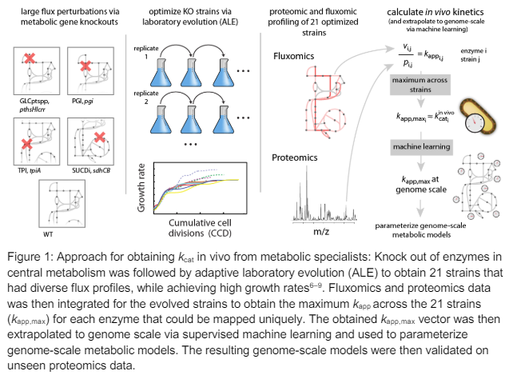
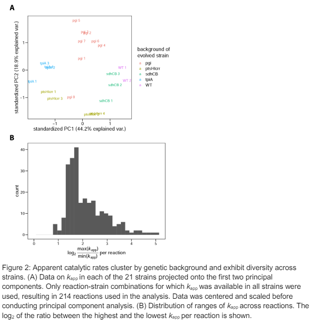
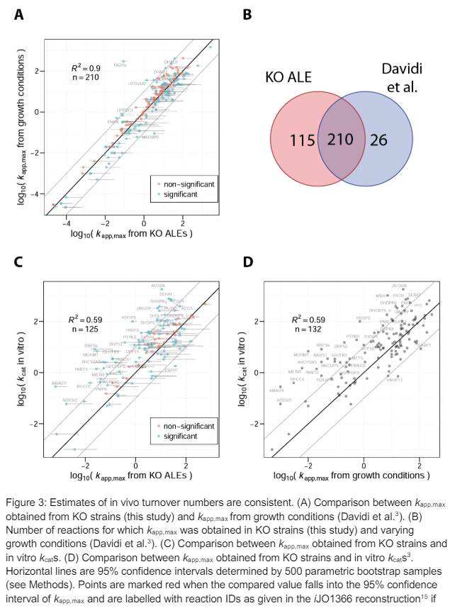
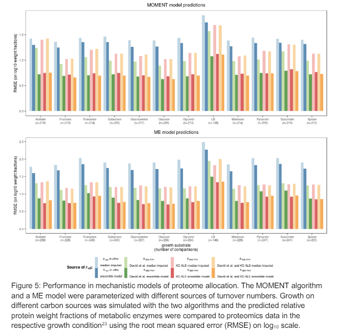
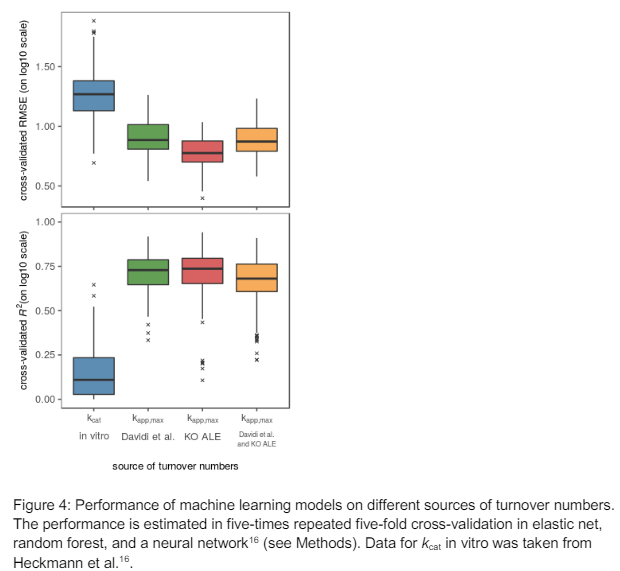

# Kinetic profiling of metabolic specialists demonstrates stability and consistency of in vivo enzyme turnover numbers 

## Abstract

효소 turnover numbers(kcat)는 세포의 정량적 이해에 필수적이다. kcat은 전통적으로 저속 처리 분석에서 측정되기 때문에 노이즈가 많고, 비생리적이며, 일관성이 없고, 획득하기가 힘들다. 우리는 대장균의 중심 대사 유전자 결실을 통해 생성된 대사 특화 균주를 사용하여 데이터 기반 접근법으로 in vivo kcat을 추정하였다. 절대 proteomics(proteomics)과 플럭소믹스(fluxomics) 데이터를 결합하여 in vivo kcat이 유전자 변이에 대해 robustness를 발견하였다. 이는 유전자 손실에 대한 대사 적응이 주로 유전자 조절 변화와 같은 다른 메커니즘을 통해 이루어진다는 것을 시사한다. 머신러닝과 유전체 규모 대사 모델을 결합하여, 얻어진 in vivo kcat이 in vitro kcat보다 훨씬 더 높은 정밀도로 보이지 않은 proteomics 데이터를 예측할 수 있음을 보여주었다. 이러한 결과는 in vivo kcat이 세포 모델의 노이즈 많고 일관성 없는 매개변수화 문제를 해결할 수 있음을 증명한다.

## Introduction

효소 촉매 속도는 성장, 단백질 배분, 스트레스 및 변형에 대한 동적 반응과 같은 생명 시스템의 많은 특성을 이해하는 데 매우 중요하다. 효소의 turnover numbers(kcat)는 효소의 촉매 부위가 반응을 촉매할 수 있는 최대 속도를 설명한다. kcat에 대한 지식은 전통적으로 세포를 정량적으로 이해하는 데 걸림돌이 되어왔다. 주로 kcat이 역사적으로 노동 집약적인 저속 처리 시험에서 얻어졌기 때문이다. 저속 처리 시험에 필요한 상당한 노력은 심지어 모델 생물에서도 세포 효소의 일부만이 측정된 kcat 값을 가지고 있는 이유일 것이다.

더욱이, 문헌 출처가 다를 때 in vitro kcat 추정치는 매우 일관성이 없는 경우가 자주 있다. 이는 in vitro 조건이 in vivo 조건을 모방하지 못하기 때문일 가능성이 크다. in vitro kcat 추정치는 번역 후 변형에 영향을 받고 실험  batch effects에 의해 편향될 수 있다.

낮은 처리량 획득 및 in vivo와 in vitro의 불일치 문제를 해결하기 위해 Davidi 등은 proteomics 데이터와 플럭스 예측을 결합하여 겉보기 촉매 속도(kapp)를 기반으로 in vivo turnover numbers를 추정했다. Davidi 등은 여러 성장 조건에서 E. coli proteomics 데이터 세트를 출판된 자료와 in silico 플럭스 예측을 통합하여, 성장 조건 전반에서 최대 겉보기 촉매 속도(kapp,max)가 in vitro kcat과 상당히 상관관계가 있음을 보여주었다. 따라서 kapp,max는 in vitro kcat이 겪는 불일치 문제, in vitro와 in vivo의 불일치 및  batch effects 문제를 극복할 수 있는 잠재력을 가지고 있다. 그러나 kapp,max가 변형에 강한 안정적인 시스템 매개변수인지, 실험 절차가 kapp,max 추정에 얼마나 많은 편향을 주는지는 불분명하다. 절대 단백질체 정량화 기술은 여전히 높은 변동을 겪고 있으며, kcat의 이전 추정치는 13C 플럭스 데이터가 아닌 in silico 플럭스 예측을 기반으로 했다. 게다가, kcat은 성장 속도에 따라 규모가 달라질 것으로 예상된다. 문헌 데이터에서 사용된 많은 실험 조건이 낮은 성장 속도를 초래했기 때문에 kapp,max에 기여하는 데이터 세트의 유효 수가 적다. 마지막으로, kapp,max가 in vivo kcat의 유용한 추정치라면, 이는 데이터를 얻는 데 사용되지 않은 데이터셋, 즉 테스트 세트에 대한 대사 모델의 예측 능력을 향상시켜야 한다.

여기서 우리는 in vivo kcat을 추정하기 위한 새로운 접근 방식을 제시한다(Figure 1). 우리는 대사 유전자 결손을 통한 강한 생리적 변형을 겪은 E. coli 균주에서 in vivo kcat을 추정하기 위해 단백질체 프로파일링과 플럭소믹스 데이터를 결합했다. 높은 성장 속도를 달성하기 위해 대사 결손 균주에서 적응 실험실 진화를 사용했다. 우리는 높은 성장 속도를 달성한 다양한 플럭스 프로파일을 가진 21개의 균주를 프로파일링했다. 이러한 데이터 기반 접근 방식으로, 우리는 in vivo kcat이 유전자 변이에 대해 안정적이고 강건하며, 유전체 규모 모델에서 보이지 않은 단백질 풍부도 데이터를 높은 예측 성능으로 얻을 수 있음을 보여주었다.

## Results

### Quantifying in vivo kinetics in metabolic specialists

**이론적으로, 각각의 효소가 최대 효율로 활용되는 조건이 발견되면, kapp,max는 in vivo에서 kcat에 접근할 것이다**. 효소 사용의 강력한 유전적 변형을 달성하기 위해, 우리는 PTS 시스템(ptsHIcrr6), 포도당 인산 이성질화 효소(pgi8), triosephosphate isomerase (tpiA7), 그리고 숙신산 탈수소효소(sdhCB9)에 대한 유전자 결손(KO) 균주를 사용했다. **kapp가 성장 속도에 따라 증가**하기 때문에, 우리는 적응 실험실 진화(ALE) 실험을 통해 포도당 최소 배지에서 성장하도록 최적화된 KO 균주를 사용했다. 이러한 KO 균주 외에도, 우리는 ALE를 수행한 야생형 MG1655 균주를 사용했다. 진화가 결정론적 과정이 아니기 때문에, ALE의 종착점은 유전자형이 다르며, 우리는 ALE 실험의 종착점 균주를 대표하는 총 21개의 균주를 포함했다(즉, ptsHIcrr의 4개의 종착점 균주, pgi의 8개의 종착점 균주, tpiA의 4개의 종착점 균주, sdhCB의 3개의 종착점 균주, 그리고 2개의 야생형 대조군).

선택된 균주를 게놈 시퀀싱에 적용하고, 그 결과 시퀀스를 LC-MS/MS proteomics의 참조 단백질체로 사용했다. 절대 정량화는 UPS2 표준과 top3 메트릭을 통해 달성되었으며, 이는 3개의 가장 높은 이온화 펩타이드의 평균 강도를 기반으로 단백질 풍부도를 추정한다. 측정된 단백질 풍부도는 생물학적 복제 사이에서 중간 R² 값이 0.91을 나타내며, 균주당 중간값으로 2076개의 단백질이 검출되었다(Supplementary Table 1). 얻어진 단백질 풍부도 벡터는 ALE에 사용된 균주의 유전적 배경에 따라 클러스터링되었으며(Supplementary Figure 1), 이는 단백질 수준이 각각의 유전자 결손을 보상하기 위해 특정 패턴으로 조정되었음을 나타낸다(세부 사항은 6–9에서 설명됨).

### Gene KO and ALE cause diversity in enzyme usage

**유전자 KO와 ALE는 효소 사용의 다양성을 초래한다**

우리는 측정된 단백질 풍부도와 13C MFA 플럭소믹스 데이터를 통합하여 21개의 균주에서 플럭스와 단백질 풍부도의 비율로 겉보기 촉매 속도(kapp)를 계산했다. Davidi 등과 마찬가지로, **우리는 단백질을 반응에 구체적으로 매핑하기 위해 isoenzyme과 다중 동형 효소에 의해 촉매되지 않는 반응에 대해서만 kapp를 계산**했다. 이 접근 방식으로 각 균주당 중간값으로 258개의 효소에 대해 kapp를 계산할 수 있었다. 결과적인 겉보기 **촉매 속도는 유전자형에 따라 크게 클러스터링되어, 해당 유전자 KO에 의해 효소 사용이 실제로 변형되었음을 확인**했다(Figure 2A). 21개의 균주 전반에서 특정 효소의 관찰된 최대 kapp는 평균적으로 가장 작은 kapp보다 4.4배 더 큰 것으로 나타났으며(Figure 2B), 이는 **대사 유전자 결손에 의해 효소 사용에 상당한 변동이 발생했음을 나타낸다.** 실험적 변동이 효소 사용의 이러한 겉보기 다양성을 초래하는지 여부를 배제하기 위해, 우리는 생물학적 복제 간의 kapp 표준 편차(로그10 스케일의 평균 = 0.07)를 21개의 균주 전반에서 측정된 표준 편차(로그10 스케일의 평균 = 0.18)와 비교했다. 우리는 유전자 KO와 ALE에 의해 발생하는 변동이 실험적 변동보다 훨씬 크다는 것을 발견했다(p<2e-16, Wilcoxon rank sum test).

### Using machine learning to extrapolate to the genome scale

머신러닝을 사용한 유전체 규모로의 extrapolate

in vitro에서 kcat의 낮은 커버리지 문제는 kapp,max에서도 나타난다. 모든 단백질 풍부도를 효소에 고유하게 매핑할 수 없으며, 단백질체 실험은 여전히 커버리지 문제를 겪고 있다. 최종적인 kapp,max 값 세트는 325개의 효소를 포함한다(Figure 3B). 이 커버리지는 Davidi 등보다 27% 더 높으며, 이는 주로 13C 플럭소믹스 데이터를 사용했기 때문이다. 13C 플럭소믹스 데이터는 Davidi 등이 사용한 in silico 방법(절약적 FBA)보다 더 높은 민감도를 가지는 경향이 있다. 유전체 규모 모델에서 3,000개 이상의 direction-specific 반응을 포함하는 대사 모델을 검증하기 위해, 우리는 먼저 데이터를 유전체 규모로 extrapolate할 필요가 있었다. 우리는 이 목표를 달성하기 위해 다양한 **효소 데이터 세트를 사용한 지도 학습(supervised machine learning)을 사용**했다. 이 데이터 세트는 효소 네트워크 문맥, 효소 3D 구조, 효소 생화학에 대한 데이터를 포함한다. **엘라스틱 넷(elastic net), 랜덤 포레스트(random forest), 신경망(neural network)의 앙상블 모델은 in vivo turnover number에 대해 교차 검증에서 좋은 성능을 보였으며, 가장 높은 성능은 21개의 KO 균주에서 얻은 kapp,max에서 달성되었다(Figure 4). 본 연구에서의 kapp,max와 Davidi 등의 kapp,max를 결합하여 최대값을 취했을 때, 가장 큰 훈련 세트가 됨에도 불구하고 모델 성능이 향상되지 않았다.**

### Validation of turnover numbers in mechanistic models

효소 turnover numbers는 주어진 플럭스를 유지하기 위해 필요한 효소 농도의 하한을 설정하므로 유전자 발현 수준의 주요 결정 요인이다. turnover numbers는 제한된 세포 단백질 예산이나 단백질의 번역 및 희석 균형에 의해 대사 플럭스를 제한하는 유전체 규모 대사 모델에서 성공적으로 사용된다. 다양한 성장 조건에서 얻은 kapp,max는 이전에 유전체 규모 대사 모델에서 성공적으로 사용되었으며, kapp,max를 사용하는 모델의 단백질 풍부도 예측 성능이 in vitro kcat을 사용하는 모델보다 훨씬 높은 것으로 나타났다. 이 분석의 주요 단점은 메타볼릭 모델의 검증이 데이터 누출을 통한 순환 논리의 위험을 초래할 수 있는 데이터를 사용하여 수행되었다는 점이다. **kapp,max가 in vivo 효소 촉매의 안정적인 속성이라면, 이는 새로운 데이터에서도 높은 성능을 발휘할 것으로 예상된다. 즉, kapp,max 기반 모델은 잘 일반화되어야 한다.**

이 가설을 테스트하기 위해, 우리는 KO 균주에서 얻은 kapp,max를 사용하여 두 가지 유전체 규모 대사 모델링 알고리즘, MOMENT와 ME 모델을 매개변수화하였다. 그런 다음, 우리는 본 연구에서 kapp,max를 얻는 데 사용되지 않은 데이터 세트인 Schmidt 등의 다양한 성장 조건에서의 효소 풍부도 데이터를 예측하기 위해 모델을 사용했다. 비교를 위해, 우리는 in vitro kcat, Davidi 등의 kapp,max, 그리고 본 연구에서 얻은 kapp,max와 Davidi 등의 kapp,max의 최대값을 사용한 모델 매개변수를 포함했다. 우리는 KO 균주에서 얻은 kapp,max의 성능이 Schmidt 등의 데이터에서 Davidi 등의 kapp,max와 매우 유사함을 발견했다: MOMENT 모델의 경우 평균 중간 제곱근 오차(RMSE)는 4% 높고, ME 모델의 경우 12% 낮았다. 이 보이지 않은 데이터에서의 좋은 성능은 in vivo kcat이 유전자 변형에 대해 안정적이고 실험 프로토콜 전반에 걸쳐 일관적임을 확인해준다.

우리는 또한 kapp,max가 모든 성장 조건에서 MOMENT 및 ME 모델에서 in vitro kcat을 능가함을 발견했다. 중간 대체된 kcat 매개변수화와 지도 학습을 사용한 매개변수화를 비교했을 때, 지도 학습이 kapp,max의 경우 38%, in vitro kcat의 경우 10%로 RMSE를 감소시켰음을 발견했다. 이는 이 접근법의 유용성을 확인해준다.

## Discussion

대사 작용을 지배하는 kinetic parameters를 대규모로 특성화하는 것은 세포 행동을 정량적으로 이해하는 데 큰 장애물이 되어 왔다. **kcat은 kinetic의 주요 부분을 차지하는데, 이를 유전체 규모에서 활용하기 위한 이전의 노력들은 in vitro 데이터를 사용하거나 생리학적 데이터에 맞추어 kinetic parameters를 조정하는 방법을 사용했다. 그러나 in vitro kcat은 일관성이 없고, 낮은 처리량과 높은 노이즈, in vivo 효과의 부재와 같은 문제를 겪고 있으며, 매개변수 맞춤은 자주 과소결정되어 새로운 조건에서 잘 일반화되지 않는 비유일한 솔루션을 초래할 수 있다.** proteomics 데이터와 동종 효소에 대한 플럭스 예측을 활용하는 접근법은 in vitro 데이터와 맞춤 방법의 많은 단점을 해결할 수 있는 유망한 방법이다. **이 접근법은 in vivo kcat의 근사치인 kapp,max가 in vitro kcat과 적절한 상관관계를 보인다는 점을 보여주었지만, kapp,max가 유전자 변형과 실험 절차 전반에 걸쳐 안정적인 상한선을 캡처하는지는 불분명했다.** 이러한 속성은 kapp,max를 대사 모델에 적용하기 위한 전제조건이다.

**우리는 KO 균주에서 얻은 in vivo turnover number가 매우 다른 프로토콜 사이에서 놀랍도록 일관성이 있음을 발견했다**(Figure 3). **구체적으로, 우리가 사용한 프로토콜은 Davidi 등과 다음과 같은 차이를 보인다: (1) kapp는 성장 조건에 의해 변형되지 않고 유전자 KO에 의해 변형된다.** (2) 우리는 in silico 데이터 대신 13C MFA 플럭소믹스 데이터를 사용했다. (3) 우리는 단일 LC-MS/MS 프로토콜로 얻은 proteomics 데이터를 사용하여  batch effects를 피했다. **(4) 모든 데이터는 높은 성장률을 촉진하는 배치 성장 하에서 얻어져 kapp를 증가시켰다. kapp,max를 얻기 위한 두 가지 방법 간의 높은 일치도는 in vivo kcat의 높은 안정성과 일관성을 나타낸다.**

in vivo kcat의 높은 안정성은 ALE 동안의 균주 적응이 in vivo kcat의 급격한 증가로 이어지지 않음을 나타낸다. 이 가설은 효소의 코딩 영역에서 convergent mutations의 상대적으로 적은 수에 의해 뒷받침된다(Supplementary Data 1). **Short term metabolic evolution는 이 연구에서 조사된 isoenzyme의 경우 enzyme efficiency 수준의 적응보다는 유전자 발현 변화에 의해 지배되는 것으로 보인다.**

**왜 kapp,max는 높은 일관성을 보이는 반면, in vitro kcat은 다양한 출처 간에 낮은 일관성을 보이는가? 한 가지 이유는  batch effects를 피하는 데 있을 수 있다: in vitro kcat은 일반적으로 효소 특이적 시험에서 개별적으로 얻어지는 반면, kapp,max는 이상적으로 same instruments에서 얻은 소수의 proteomics 및 플럭스 데이터를 사용하여  batch effects를 피한다.** 또한, in vivo에서 많은 효소를 포화시키는 대사물질 수준이 있는 경향이 있어, 상대적으로 적은 수의 시스템 변형으로도 높은 효소 포화 조건을 찾을 수 있다.

이 연구에서 제시된 kapp,max 값에는 여전히 일부 불확실성이 존재한다. 우리가 사용한 13C MFA 데이터는 각각의 ALE 실험의 종착점 집단에 대해 얻어졌으며, 우리는 proteomics 실험을 위해 가장 우세한 돌연변이를 나타내는 클론을 선택했지만, 플럭스 분포는 드물게 나타나는 돌연변이에 의해 영향을 받을 수 있다. 또한, 13C MFA 데이터는 높은 커버리지를 제공할 수 있지만 여전히 기본 네트워크 모델의 품질에 크게 의존하여 분석을 편향시킬 수 있다.

모든 효소를 고유하게 반응에 매핑할 수 없고 단백질체 데이터가 여전히 불완전한 커버리지를 겪고 있기 때문에, kapp,max는 대사 네트워크의 낮은 커버리지를 가지고 있으며 유전체 규모 모델에서 쉽게 사용할 수 없다. 효소 turnover number를 형성하는 요인에 대한 기계적 지식을 바탕으로, 지도 학습이 in vivo kcat을 유전체 규모로 외삽하는 데 성공적으로 사용되었다. 우리는 KO 균주에서 얻은 kapp,max의 교차 검증 오차가 성장 조건에서 얻은 kapp,max보다 약간 낮음을 발견했다. 이러한 성능의 약간의 증가는 13C MFA 데이터를 사용하여 38% 더 많은 kapp,max 값을 얻은 것에 기인할 수 있다.

우리는 KO 균주에서 얻은 kapp,max 값을 사용하여 매개변수화된 대사 모델이 보이지 않은 proteomics 데이터에서 매우 좋은 예측 성능을 보임을 발견했다. 기계적 모델에서의 이러한 성능은 kapp,max가 실제로 시스템의 안정적인 속성, 즉 in vivo kcat을 나타낸다는 가설을 뒷받침한다. 따라서 kapp,max는 보이지 않은 조건에 잘 일반화되는 유전체 규모 대사 모델을 가능하게 할 수 있다.

kinetic parameters를 얻는 것은 여전히 어렵지만, in vivo kcat의 안정적이고 일관된 특성은 이러한 매개변수가 대사 모델의 예측 능력을 크게 향상시킬 수 있음을 뒷받침하며, 따라서 세포에 대한 더 나은 정량적 이해를 가능하게 한다. 마지막으로, in vivo kcat의 높은 안정성은 Short term metabolic evolution가 효소 kinetic 수준에서의 적응보다는 유전자 발현 변화에 의해 지배된다는 것을 시사한다.

## betch effect

다양한 배치(batch) 또는 그룹 간의 체계적인 차이를 말합니다. 이는 특히 생물학적 및 생물의학 연구, 예를 들어 단백질체학, 유전체학, 전사체학 연구에서 흔히 발생하는 문제입니다. 배치 효과는 실험 조건, 시약, 기기, 실험실 기술자, 시간 등 여러 요인으로 인해 발생할 수 있습니다. 이러한 효과는 실제 관심 대상인 생물학적 변이와 무관하게 데이터에 영향을 미쳐, 데이터 분석과 결과 해석에 오류를 초래할 수 있습니다.

배치 효과는 실제 생물학적 차이가 아닌, 데이터 수집 방법의 차이로 인한 변동을 초래합니다. 
