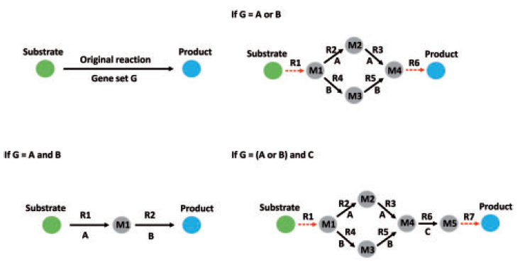

# Logical transformation of genome-scale metabolic models for gene level applications and analysis

LTM을 개발하게 된 계기는 GEMs의 복잡성을 해결하고, 유전자 표적 식별 및 유전자 조작 전략을 보다 효율적으로 수행하기 위해서입니다. 기존의 GEMs는 복잡한 GPR 관계로 인해 유전자 표적 식별이 어렵고, 유전자 수준의 최적화 문제를 해결하는 데 한계가 있었습니다. LTM은 이러한 문제를 해결하고, 대규모 대사 네트워크에서 유전자 수준의 조작을 보다 효율적으로 수행할 수 있도록 하기 위해 개발되었습니다.

**LTM(Lossless Transformation Model)** 은 대규모 대사 모델(GEMs: Genome-scale Metabolic Models)에서 유전자-단백질-반응(GPR: Gene-Protein-Reaction) 관계를 간단하고 직관적으로 표현하기 위해 개발된 논리적 변환 모델입니다. LTM은 GEMs 내에서 두 개 이상의 유전자와 연관된 반응을 최대 한 개의 유전자와 연관된 의사 반응(pseudo reactions)으로 분해하여, 모델을 단순화하고 유전자 표적 식별을 용이하게 합니다.

LTM의 작동 방식은 다음과 같습니다:

* **GPR 관계 단순화**: GEM에서 두 개 이상의 유전자와 연관된 복잡한 GPR 관계를 단순화합니다.
* **논리적 변환**: 각 반응을 논리적으로 동등한 하위 네트워크로 확장합니다. 예를 들어, 유전자 A와 B가 모두 필요한 반응(A AND B)은 두 개의 의사 반응으로 분해됩니다.
* **의사 반응 추가**: 실제로 존재하지 않는 의사 대사물과 반응을 모델에 추가하여, 반응과 그 유전자 집합 간의 논리적 관계를 시뮬레이션합니다.
* **플럭스 경계 설정**: 의사 반응의 플럭스 경계를 원래 반응과 동일하게 설정하여, 모든 종류의 유전자 조작이 원래 모델과 동일한 영향을 미치도록 합니다.
* 
다른 모델들과의 차이점은 무엇인가요?
**기존의 GEMs:**

* 복잡한 GPR 관계를 포함하여, 두 개 이상의 유전자와 연관된 반응을 그대로 유지합니다.
* 유전자 표적 식별이 어렵고, 모델의 복잡성이 증가합니다.
**LTM:**

* GPR 관계를 단순화하여, 각 반응을 최대 한 개의 유전자와 연관된 의사 반응으로 변환합니다.
* 모델이 단순화되어, 유전자 표적 식별이 용이하고, 유전자 수준의 조작을 보다 효율적으로 수행할 수 있습니다.

## Abstract

최근 몇 년 동안, 게놈 규모의 대사 모델(GEMs)은 시스템 생물학 및 생물정보학 분야에서 중요한 역할을 했습니다. 그러나 gene–reaction associations의 복잡성으로 인해 GEMs는 유전자 수준의 분석 및 관련 응용에서 한계가 있습니다. 따라서 기존 방법들은 주로 반응 및 대사물의 응용과 분석에 초점을 맞추고 있었습니다.

우리는 gene–reaction associations을 단순화하고 다른 개발된 방법들과 통합할 수 있는 logic transformation of model(LTM)이라는 프레임워크를 제안합니다. 우리는 변환된 GEMs가 반응 및 대사물의 수와 플럭스 균형 분석의 자유도가 증가하지만, gene–reaction associations과 주요 플럭스 분포 특성은 일정하게 유지된다는 것을 보여줍니다. 또한, 우리는 LTM을 기존의 반응 기반 방법과 결합하여 OptGeneKnock과 FastGeneSL이라는 두 가지 방법을 개발했습니다. FastGeneSL은 철저한 검색보다 뛰어난 성능을 보였으며, 두 가지 사례 연구에서 신속한 유전적 개입 전략을 설계하고 간세포암종(HCC) 종양 성장을 억제하기 위한 이중 및 삼중 합성 치사 유전자 세트를 식별하는 데 성공했습니다.

## Introduction

Genome-scale metabolic models(GEMs)은 시스템 생물학에서 유용한 플랫폼으로, 산업 생명공학 응용에서 널리 사용되고 있습니다. 특정 대사물의 생산을 향상시키기 위해 미생물의 유전적 수정을 합리적으로 설계하는 데 성공한 많은 사례가 있습니다.

또한 GEMs는 high throughput data를 통합하여 다양한 미생물의 생리학에 대한 새로운 생물학적 통찰력을 제공하는 데 사용되었습니다 (Chandrasekaran and Price, 2010; Hamilton et al., 2013; Hoppe et al., 2007). 최근에는 인간 GEMs가 새로운 예후 바이오마커를 식별하고, 효율적인 치료 전략을 설계하기 위한 잠재적 약물 표적을 식별하는 데 사용되었습니다.

GEMs는 널리 사용되고 있지만, 유전자 관련 응용에서는 몇 가지 제한이 있습니다. 여러 가지 이중 수준 선형 프로그래밍 방법이 개발되어, 예를 들어 OptKnock (Burgard et al., 2003), OptReg (Pharkya and Maranas, 2006), OptForce (Ranganathan et al., 2010), Genetic Design through Local Search (GDLS) (Lun et al., 2009), Genetic Design through Branch and Bound (GDBB) (Egen and Lun, 2012) 등이 있으며, 이러한 방법들은 주로 잠재적 목표 반응(노크아웃 또는 상향/하향 조절)을 식별하는 데 초점을 맞추고 있습니다. 그러나 이러한 반응 기반 방법들은 단백질 복합체 및 동형 효소의 유전적 상호작용을 고려하지 않아, 유전적으로 복잡하거나 실행 불가능한 전략을 도출할 수 있습니다. 최근에는 OptO$RF$ (Kim and Reed, 2010)와 같은 또 다른 이중 수준 기반 방법이 개발되어, 원하는 화학물질의 과생산을 유도할 수 있는 대사 및 규제 유전자 표적을 식별합니다. 그러나 이 방법은 각 모델에 대해 사용자에 의해 체계적으로 정의되어야 하는 3차원 유전자-효소 반응 배열을 사용하여, 널리 사용되기에는 한계가 있습니다.

다른 한편으로, OptGene 및 그 파생 알고리즘(Chong et al., 2014; Choon et al., 2014; Patil et al., 2005)은 유전자 노크아웃 전략을 식별할 수 있지만, 이러한 방법들은 기본적으로 무작위 돌연변이에 기반한 유전 알고리즘으로, 최적의 솔루션을 놓칠 가능성이 있습니다. 또한, 합성 치사(SL) 분석은 두 개 이상의 유전자의 돌연변이 조합이 in silico에서 세포 치사로 이어지는 경우를 식별하여, 암 치료를 위한 작은 헤어핀 RNA(shRNA) (Bernards et al., 2006) 및 CRISPR (Cho et al., 2013) 표적을 식별하는 데 사용할 수 있습니다. 그러나 삼중 또는 그 이상의 수준에서 SL의 방대한 계산 비용으로 인해 생명공학 응용에는 사용하기 어렵습니다. 두 가지 반응 SL을 효율적으로 식별하기 위한 방법이 개발되었으나(Pratapa et al., 2014; Suthers et al., 2009), 유전자 SL 분석에서는 하나는 사용할 수 없고, 다른 하나는 유전자 및 반응의 이진 변수에 대한 '적절한 방정식'을 수동으로 식별해야 하는 문제로 인해 시간이 많이 소요됩니다.

이 유전자 수준 응용 문제는 유전자-단백질 관계(GPR) 정보의 손실에서 기인합니다. GRAM은 GEMs에서 미리 정의된 이진 행렬로, i번째 반응이 j번째 유전자와 연관된 경우 1, 그렇지 않은 경우 0을 나타냅니다. 대부분의 기존 방법에서 GRAM은 GPR 정보를 포착하기 위한 유일한 수학적으로 친화적인 부분입니다. 그러나 GRAM은 유전자 집합 간의 관계에 대한 정보를 포함하지 않습니다. 예를 들어, 단백질 복합체(유전자 집합에서 AND 관계) 또는 동형 효소(유전자 집합에서 OR 관계)와 연관된 반응인지 여부를 직접적으로 알 수 없습니다. 따라서 GPR 정보를 올바르게 시뮬레이션 알고리즘에 통합하려면 수학적 표현으로 해석해야 하며, 이는 시간이 많이 걸리고 번거로우며, 때로는 올바른 관계를 재구성하는 것이 매우 어려울 수 있습니다.

우리는 GEM 수정 알고리즘인 논리적 변환 모델(LTM)을 도입하여, 유전적 응용성이 훨씬 뛰어난 논리적으로 동등한 확장 GEM을 제공합니다. 이 알고리즘에서는 GEM에 기술된 GPR 관계를 기반으로 GEM에 의사 반응 및 대사물을 추가하여 동형 효소 및 단백질 복합체 관계를 시뮬레이션합니다. 이로 인해 반응이 하나 이상의 유전자와 연관되지 않게 됩니다. 따라서 GPR 정보가 GEM의 화학량론적 행렬에 포함되어, 모든 종류의 최적화 프로그래밍 알고리즘(OptKnock, OptReg 및 OptForce 등)에 GRAM을 직접 적용할 수 있습니다. 또한 LTM은 이전에 반응 시뮬레이션을 위해 개발된 방법들을 유전자 수준 응용에 사용할 수 있도록 확장할 수 있습니다. 우리는 LTM을 이전에 개발된 이중 수준 혼합 정수 선형 프로그래밍(MILP) 기반 노크아웃 방법과 결합하여 OptGeneKnock을 개발했습니다. 이 MILP 문제는 잘린 분기 및 경계 알고리즘에 의해 해결되어, 원하는 표현형을 가진 최적의 유전자 노크아웃 전략을 얻을 수 있습니다. 추가로, LTM을 반응 SL의 효율적 식별을 위해 개발된 이전 방법(Pratapa et al., 2014)과 결합하여 FastGeneSL이라는 새로운 방법을 설계했습니다. 우리는 FastGeneSL이 Escherichia coli, Saccharomyces cerevisiae 및 간세포암종(HCC)의 GEM에 대한 유전자 SL 분석에서 철저한 분석보다 훨씬 뛰어나다는 것을 보여주었습니다.

마지막으로, 우리는 여기서 제시된 방법들의 능력을 입증하기 위해 두 가지 사례 연구를 수행했습니다. 첫째, OptGeneKnock을 사용하여 두 가지 다른 E. coli GEM에서 신속한 유전적 개입 전략을 설계함으로써, 원하는 생화학물질 생산을 증가시킬 수 있는 유전자 표적을 식별했습니다. 둘째, HCC GEM과 FastGeneSL을 함께 사용하여 HCC의 기본 분자 메커니즘에 대한 생물학적 통찰력을 얻고, 종양 성장을 억제할 수 있는 잠재적 shRNA 표적을 식별했습니다.

## Material and Methods

### Logic transformation of model

반응이 두 개 이상의 유전자와 연관되어 있는 경우, 해당 반응을 원래의 GPR(유전자-단백질 관계) 관계를 기반으로 논리적으로 동등한 하위 네트워크로 확장합니다. 같은 반응을 제어하는 유전자 집합 간의 관계는 단백질 복합체와 동형 효소의 두 그룹으로 나뉩니다. 예를 들어, 반응이 유전자 A와 유전자 B와 연관된 경우, (A AND B)는 두 유전자가 모두 반응을 촉매하는 데 필요함을 의미하고, (A OR B)는 두 유전자 중 어느 하나가 반응을 촉매할 수 있으며, 두 유전자가 모두 삭제될 때만 반응이 차단될 수 있음을 의미합니다. 실제로 존재하지 않는 의사 대사물과 반응을 GEM에 추가하여 반응과 그 유전자 집합의 논리적 관계를 시뮬레이션합니다.

---
Figure 1. 반응의 논리적 변환의 간단한 예시. 원은 대사물을 나타내고, 화살표는 반응을 나타냅니다. 점선 화살표는 암(arm) 반응을 나타냅니다. 'M1'과 'R1'은 각각 첫 번째 의사 대사물과 반응을 나타냅니다.

---

(A AND B)의 경우, 반응은 각각 유전자 A와 유전자 B와 연관된 두 개의 의사 반응으로 분리됩니다(그림 1의 좌측 하단). 원래의 플럭스 경계를 유지하기 위해 플럭스 경계는 원래의 반응과 동일하게 설정됩니다. (A OR B)의 경우, 반응은 유전자 A와 B에 각각 연관된 두 개의 동등한 경로로 나누어지고, 전체 플럭스를 제어하기 위해 추가적인 암(arm) 반응이 추가됩니다(그림 1의 우측 상단). 암 반응의 상한(UB)과 하한(LB)은 원래의 반응과 동일하게 설정되며, 의사 네트워크 내부의 반응 경계는 다르게 설정됩니다. 원래의 플럭스 경계가 UBoriginal > 0이고 LBoriginal > 0인 경우, 내부 의사 반응의 상한(UB)은 UBoriginal, 하한(LB)은 0으로 설정됩니다. UBoriginal < 0이고 LBoriginal < 0인 경우, 상한(UB)은 0, 하한(LB)은 LBoriginal로 설정됩니다. 그 외의 경우, 상한(UB)과 하한(LB)은 각각 UBoriginal과 LBoriginal로 설정됩니다.

위와 같은 방식으로 반응 경계를 설정함으로써, 모든 종류의 in silico 유전자 조작(업/다운 조절 및 노크아웃)은 원래 GEM과 동일한 영향을 미치게 됩니다. 보다 복잡한 유전자 집합의 경우, 이 원칙을 단계별로 적용할 수 있습니다(보충 그림 S1). 그러나 중복되는 의사 반응의 수를 줄이기 위해, 암 반응은 전체 네트워크의 양쪽에만 추가됩니다(그림 1의 우측 하단). 이와 같은 변환은 복잡한 GPR을 포함하는 반응을 여러 개의 의사 반응으로 분해합니다. 따라서 GEM에서 두 개 이상의 유전자와 연관된 모든 반응은 최대 한 개의 유전자와 연관된 의사 반응으로 분해됩니다.

---
Figure 2. toy 모델을 사용한 LTM의 설명. 점선 화살표는 교환 반응을 나타내며, 'b1'에서 'b4'로 표시됩니다. 세포내 반응은 'R1'에서 'R5'로 표시되며, 각 반응은 방향을 나타내는 화살표를 가지고 있습니다. 'g1'에서 'g7'까지는 유전자입니다. 'ARx-y', 'PRx-y' 및 'Mx-y'는 각각 'RX' 반응의 y번째 암(arm) 반응, 의사 반응 및 의사 대사물을 나타냅니다.

---

LTM이 GRAM을 어떻게 단순화하는지 더 명확히 설명하기 위해, toy 모델(Fig. 2)을 사용하여 LTM의 원칙을 설명했습니다. 이 toy 모델은 네 개의 교환 반응과 다섯 개의 세포내 반응을 포함했습니다. 세 개의 세포내 반응은 두 개 이상의 유전자와 연관되어 있고, 나머지 두 개는 한 개의 유전자와 연관되어 있습니다. LTM을 적용한 후, 유전자와 연관되지 않은 반응(교환 반응)과 한 개의 유전자와 연관된 반응은 동일하게 유지되었으며, 다른 반응들은 그들의 GPR 연관성에 따라 확장된 하위 네트워크로 대체되었습니다.

확장된 모델에서 모든 반응은 최대 한 개의 유전자와 연관되어 있습니다. 따라서 확장된 모델의 GRAM은 단순하고 유전자 표적 식별에 사용하기 쉽습니다. 예를 들어, 'g1'과 'g3'이 노크아웃된 경우, 이진 반응 노크아웃 벡터는 GRAM과 이진 유전자 노크아웃 벡터를 곱하여 쉽게 얻을 수 있습니다. 동일한 원칙을 원래 GRAM에 적용하면 잘못된 결과를 얻을 수 있다는 점에 유의해야 합니다(Fig. 3).

### OptGeneKnock

---
Fig. 3. Comparison between GRAMs of toy model before and after LTM. In vectors of gene or reaction knockouts, if ‘g1’ or ‘R1’ is knocked out, the corresponding binary variable is 1; otherwise, it is 0

---

OptKnock(Burgard et al., 2003) 방법을 기반으로 LTM을 적용하여 OptGeneKnock을 개발했습니다. OptGeneKnock을 구현하기 전에, GEMs를 LTM으로 확장하여 단순화된 GRAM을 얻었습니다. 그 후, 새로운 GRAM을 나타내는 $m \times k$ 이진 행렬 $G$를 얻었습니다. 이 행렬에서 $G_{ik}$는 $i$번째 반응이 $k$번째 유전자와 연관된 경우 1, 그렇지 않은 경우 0입니다(Fig. 3). 따라서 최적의 유전자 노크아웃 전략을 찾는 문제는 이전에 발표된 연구(Egen and Lun, 2012)와 유사한 단일 수준의 MILP 문제로 변환되었습니다.

$$
\max g'v
$$

제약 조건:

$$
\sum_{k=1}^l x_k \leq C
$$

$$
x_k \in \{0, 1\}, k = 1, \ldots, l
$$

$$
Sv = 0
$$

$$
Gx = y
$$

$$
(1 - y_i)a_i \leq v_i \leq (1 - y_i)b_i, i = 1, \ldots, m
$$

$$
f'v = \sum_{i=1}^m w_i b_i - l_i a_i, i = 1, \ldots, m
$$

$$
f_i \leq \sum_{j=1}^n k_j S_{ij} - w_i + l_i, i = 1, \ldots, m
$$

$$
-D y_i \leq v_i \leq D y_i, i = 1, \ldots, m
$$

$$
w, l \geq 0
$$

여기서 $g$는 원하는 표현형을 유도하는 목표 반응의 가중치를 나타내는 벡터, $v$는 반응 플럭스 분포 벡터, $x$는 이진 유전자 노크아웃 벡터, $C$는 노크아웃이 허용된 최대 유전자 수, $S$는 화학량론적 행렬, $a, b$는 각 반응의 상한 및 하한 벡터, $f$는 생물학적 목표 벡터, $k$는 평등 제약 조건의 이중 변수, $l, w$는 상한 및 하한에 대한 이중 변수, $D$는 스칼라 값입니다.

이 MILP 문제에서 유전자 노크아웃 벡터 $x$는 $G$ 행렬과 단순 곱셈을 통해 반응 차단 벡터 $y$로 쉽게 변환될 수 있습니다. 그런 다음, 문제는 이전 연구(Egen and Lun, 2012)의 절단된 분기 및 경계 알고리즘을 사용하여 해결되었습니다.

### 2.3 FastGeneSL

LTM을 이전의 반응 기반 방법인 FastSL(Pratapa et al., 2014; Suthers et al., 2009)과 결합하여 FastGeneSL을 개발했습니다. FastGeneSL은 유전자 SL(Synthetic Lethality) 분석을 가속화하기 위해 유전자 후보를 사전 선별합니다. 먼저, GEM을 LTM으로 확장하여 GPR(유전자-단백질 관계)을 단순화합니다. 그 결과, 반응 집합에서 유전자를 쉽게 찾을 수 있습니다. 그런 다음 FastSL의 원칙을 적용합니다. 생물학적 목표를 최적화하고 플럭스 분포를 얻습니다. 여기서 non-zero 플럭스를 가진 반응들($Rf$)을 선택하고, 이러한 반응들과 연관된 유전자들($Gf$)을 선별합니다. 모든 필수 유전자들이 $Gf$에 포함되어 있다는 점을 유의해야 합니다. 따라서, $Gf$ 내의 유전자 단일 돌연변이 분석을 수행하고 각 돌연변이에 대한 플럭스 분포를 계산할 수 있습니다. 그 결과, $Gf$는 두 부분으로 나뉩니다: $Gf_0$(생물학적 목표 플럭스가 임계값(이 연구에서는 최대값의 5%) 이하인 경우)와 $Gf_1$(그 외의 경우). 따라서, $Gf_0$는 필수 유전자 그룹이 되고, $Gf_1$은 이중 유전자 SL 분석을 위한 후보 그룹이 됩니다. 이중 유전자 SL 분석에서는 $Gf_1$ 내의 단일 돌연변이 플럭스 분포를 하나씩 선택합니다. 이전 과정과 유사하게, 각 돌연변이에 대해 $Gf_0$'와 $Gf_1$'을 선별합니다. 결과적으로, 선택된 $Gf_1$ 유전자와 결합된 모든 합성 치사 유전자 쌍이 식별됩니다. 이와 같은 방식으로 삼중, 사중 및 고차 합성 치사 유전자 세트를 얻을 수 있습니다.

### 2.4 모델 및 시뮬레이션

E. coli의 핵심 대사 모델(Orth et al., 2010)을 사용하여 LTM의 기본 기능을 시연했습니다. 또한, E. coli의 GEM인 iAF1260(Feist et al., 2007)과 S. cerevisiae의 Yeast 7.11(Aung et al., 2013)을 노크아웃 시뮬레이션 및 유전자 SL 분석에 사용했습니다. E. coli GEM iAF1260에서 미세 호기적 숙신산 생산의 경우, 포도당 섭취는 10 mmol/(gDW*h)로 설정되었고, O2 섭취는 5 mmol/(gDW*h)로 설정되었습니다. OptORF와의 비교를 위해, 갱신된 E. coli GEM iJR904(Reed et al., 2003)을 사용하여 혐기성 조건에서 에탄올 생산을 시뮬레이션했고, 포도당과 O2 섭취는 각각 18.5 mmol/(gDW*h)와 0 mmol/(gDW*h)로 설정되었습니다. 또한, ATP 합성효소를 암호화하는 유전자는 노크아웃에서 제외하여 모든 조건이 원래 연구와 일치하도록 했습니다(Kim and Reed, 2010). shRNA 표적 식별을 위해, 일반적인 인간 간세포암종(HCC) GEM을 사용했습니다(Agren et al., 2014). 그러나 많은 유전자 집합이 알려지지 않은 유전자-반응 관계(동형 효소 또는 단백질 복합체)를 가지고 있기 때문에, 더 신뢰할 수 있는 결과를 얻기 위해, 모든 이러한 관계를 HCC GEM에서는 'or'로 처리하여 shRNA에 대한 강력한 사례로 만들었습니다. 또한, 건강한 간세포 모델인 iHepatocytes2322(Mardinoglu et al., 2014)를 사용하여 독성 테스트를 수행하고, 식별된 표적이 정상 인간 간 조직에서 발생하는 생물학적 작업을 방해하는지 테스트했습니다. 이 256가지 대사 작업은 건강한 간세포의 알려진 생물학적 기능을 기반으로 정의되었습니다(Mardinoglu et al., 2014).

이 연구에서는 Matlab(version 8.0.0.783 (R2012b))과 COBRA Toolbox 2.0(Schellenberger et al., 2011) 및 RAVEN Toolbox(Agren et al., 2013)를 사용하여 GEM 작업과 분석을 수행했습니다. 대사 네트워크가 의사 정상 상태 시스템이라고 가정하는 플럭스 균형 분석(FBA)을 사용하여 플럭스를 계산했습니다. 모든 최적화 문제는 Gurobi 솔버(version 5.6.3, academic)와 Mosek 솔버(version 6)를 사용하여 해결했습니다. 모든 절차는 3.00 GHz Intel(R) Core(TM) i7-3540M CPU와 8.00 GB RAM을 갖춘 개인 컴퓨터에서 구현되었습니다.

## Result 

### 3.1 Comparison between original model and the extended logic model

| 모델      | Type       | Reaction 수  | Metabolite 수 | Gene number |
|-----------|------------|----------|------------|------------|
| E. coli core | Original | 95       | 72         | 137        |
|           | Extended  | 337      | 273        | 137        |
| iAF1260   | Original | 2382     | 1668       | 1261       |
|           | Extended  | 7287     | 5372       | 1261       |
| Yeast 7.11| Original | 3490     | 2220       | 910        |
|           | Extended  | 6780     | 4742       | 910        |
| iHepatocytes2322 | Original | 7930     | 5686       | 2322       |
|           | Extended  | 20787    | 18097      | 2322       |
| HCC GEM   | Original | 4820     | 4099       | 1779       |
|           | Extended  | 26282    | 18030      | 1779       |

‘Original’ represents the original model, and ‘Extended’ represents the logic
model after LTM.

LTM이 모델 콘텐츠에 미치는 영향을 설명하기 위해 여러 측면에서 원래 모델과 확장된 논리 모델을 직접 비교했습니다.

먼저, LTM을 적용하기 전후의 다섯 가지 모델에서 반응, 대사물, 유전자의 수를 비교했습니다. 표 1에 표시된 바와 같이, 반응과 대사물의 수는 약 2~5배 증가한 반면, 유전자의 수는 예상대로 일정하게 유지되었습니다. GEM마다 단백질 복합체와 동형 효소 반응의 보급률이 다르기 때문에 모델마다 반응과 대사물 수의 변화 비율이 다르게 나타났습니다(보충 표 S1). LTM은 유전자에 의해 제어되는 반응에만 작동하므로, 더 복잡한 유전자 연관성을 가진 반응이 더 많이 확장됩니다.

또한, HCC GEM과 iHepatocytes2322는 미생물 모델에 비해 더 큰 크기 증가를 보였습니다. 이는 인간 GPR의 복잡성 때문입니다. 그러나 HCC GEM은 유전자 및 원래 반응 수가 적음에도 불구하고 iHepatocytes2322보다 여전히 더 큰 크기를 가지고 있습니다. 이는 GPR 해석 방식의 차이에서 기인합니다.

둘째, 원래 모델과 확장된 모델 간의 FBA(Flux Balance Analysis) 성능의 차이를 관찰했습니다. E. coli 핵심 모델과 그 확장된 버전에 대해 특이값 분해(SVD)를 수행하고 특이값을 정렬했습니다(Fig. 4). 확장된 모델은 더 큰 특이값을 가지고 있어, 솔루션 공간에서 더 높은 자유도를 나타냅니다. 이는 동형 효소 연관 반응의 분할로 인해 대체 솔루션이 제공된 결과입니다. 그러나 이는 변경되지 않은 반응의 플럭스에 영향을 미치지 않습니다(Fig. 5에 표시됨).

마지막으로, 확장된 모델의 GPR을 이중 유전자 삭제 분석으로 검증했습니다. 두 유전자의 모든 조합에 대한 성장률을 계산한 결과, 확장된 모델의 결과는 원래 모델의 결과와 정확히 동일했습니다(보충 그림 S2). 이는 두 모델 간의 GPR이 동등함을 명확히 보여줍니다.

따라서, 위에서 설명한 바와 같이, LTM은 반응과 대사물의 수를 증가시키지만, 원래 모델의 플럭스 분포와 GPR의 주요 특성을 유지합니다.

|
|-|-|

### 3.2 Case study 1: incorporating OptGeneKnock with truncated branch and bound for fast screening

| Case       | C   | 시간(초) | 노크아웃 유전자 | N | G   | P     |
|------------|-----|----------|-----------------|---|-----|-------|
| Ethanol     | 1   | 20       | pntB            | 1 | 0.46| 17.98 |
|            | 2   | 20       | focA, focB      | 1 | 0.42| 30.74 |
|            | 3   | 100      | focA, focB, pgi | 2 | 0.24| 33.47 |
|            | 4   | 200      | focA, focB, pgi, ptsH | 16 | 0.19 | 34.22 |
|            | 5   | 200      | pflA, focB, pgi, ptsH, gdhA | 17 | 0.17 | 34.47 |
| Succinate     | 1   | 100      | sdhD            | 1 | 0.40| 0.00  |
|            | 2   | 100      | sdhD            | 1 | 0.40| 0.00  |
|            | 3   | 800      | pykA, pykF, ptsI | 18 | 0.21 | 0.41 |
|            | 4   | 3100     | pta, eutD, sdhD, atpF | 4 | 0.14 | 5.55 |
|            | 5   | 3400     | ptsI, focA, focB, pykA, pykF | 20 | 0.19 | 8.32 |

In the ‘Case’ column, ‘Ethanol’ means anaerobic ethanol production in updated iJR904, while ‘Succinate’ stands for microaerobic succinate production in iAF1260. ‘C’ represents the maximum number for knockout. ‘Time’ means computational time for obtaining the strategy, and the unit is second. ‘N’ represents the number of reactions blocked by the knockout strategies. ‘G’ and ‘P’ stands for the growth and succinate production rates of the knockout mutants, respectively, and the units are mmol/(gDW*h).

LTM에 의해 확장된 논리 모델은 단순화된 GRAM을 가지고 있어, 이전에 개발된 이중 수준 MILP 기반 방법의 유전자 표적 식별을 가능하게 합니다. 이 연구에서는 OptKnock과 LTM을 통합한 새로운 방법인 OptGeneKnock을 개발했습니다(Egen and Lun, 2012). 이전 방법은 실제로는 반응 노크아웃에 의해 발견된 유전자 세트 노크아웃만 처리할 수 있었습니다. 반응(유전자 세트)의 최적 노크아웃 전략과 개별 유전자의 최적 노크아웃 전략을 찾는 것은 두 가지 독립적인 질문입니다(보충 그림 S3). 또한, 정확히 동일한 유전자 세트를 가진 반응만 동시에 차단되어 포괄적인 GPR이 정확하게 반영되지 않았습니다. 그러나 OptGeneKnock을 사용할 때 이러한 문제는 해결됩니다. 반응이 최대 한 개의 유전자와만 연관되어 있기 때문에, MILP 문제를 해결하여 in silico 유전자 노크아웃을 수행할 수 있습니다.

확장된 논리 모델을 사용하여 E. coli에서 혐기성 에탄올 및 미세 호기성 숙신산 과생산을 위한 유전자 노크아웃 전략(하나에서 다섯 개의 노크아웃)을 식별했습니다(Table 2). 대부분의 이전 방법(OptKnock 등)과 달리, OptGeneKnock에 의해 얻어진 전략은 모두 실제 유전자 표적이므로 in vivo 검증에 유리합니다. 흥미롭게도, pntB(피리딘 뉴클레오타이드 트랜스하이드로게나제 베타 소단위체를 암호화하는 유전자)의 단일 삭제는 에탄올 생산을 크게 향상시킵니다. E. coli에서 pntA와 pntB는 막 결합 피리딘 뉴클레오타이드 트랜스하이드로게나제의 알파 및 베타 소단위체를 암호화하여 NADP의 가역적 환원을 NADH로 결합합니다. 따라서, pntA와 pntB는 두 가지 반응(NADTRHD 및 THD2)에 관여합니다. 반면에 sthA는 NADPH의 산화에 의한 가용성 피리딘 뉴클레오타이드 트랜스하이드로게나제를 암호화합니다. 따라서, pntB의 삭제는 THD2 반응만 차단하고 에탄올 과생산을 초래합니다(Table 2). 이중 삭제의 경우, focA와 focB는 포메이트 수송체를 암호화합니다. focA와 focB의 삭제는 FORt 반응을 차단하여 포메이트의 세포질로의 수송을 차단합니다. 에탄올 생산을 위한 최적의 단일 및 이중 유전자 노크아웃 전략은 모두 하나의 반응을 차단하여 반응과 유전자 수준 돌연변이 간의 차이를 명확히 보여줍니다. 또한, 숙신산 과생산을 위한 최적의 5가지 유전자 노크아웃 전략은 20개의 반응을 동시에 차단하는 결과를 초래하여, 다른 반응 기반 방법으로 예측하기 어렵습니다. ptsI, pykA 및 pykF의 돌연변이는 PEP에서 피루브산으로의 모든 직접 전환을 차단하여 피루브산에서 트라이카복실산(TCA) 회로로의 플럭스를 이동시켜 숙신산 생산을 향상시킵니다. 반면, focA와 focB의 노크아웃은 포메이트를 부산물로의 플럭스를 차단합니다. 포메이트는 E. coli의 일반적인 부산물이 아니므로, 이 두 유전자의 노크아웃은 다른 유전자들보다 덜 중요할 수 있습니다. OptGeneKnock에 의해 얻어진 이 복잡한 유전자 노크아웃 전략은 최적의 유전자 수준 노크아웃이 영향을 받는 반응 수에 제한되지 않음을 증명합니다.

또한, OptGeneKnock의 높은 효율성을 강조했습니다. 대부분의 전략은 몇 분 내에 얻어졌으며, 어느 것도 1시간을 초과하지 않았습니다. 또한, 우리의 에탄올 생산 전략은 모든 조건에서 OptORF에 의해 얻어진 전략보다 더 나은 솔루션(심지어 전역 최적 솔루션)을 제공할 수 있음을 확인했습니다(보충 표 S2). 따라서, OptGeneKnock은 더 적은 계산 비용으로 더 나은 솔루션을 찾을 수 있습니다. OptGeneKnock의 개발은 LTM이 이전에 개발된 반응 기반 이중 수준 MILP 방법을 유전자 수준 응용으로 확장할 수 있음을 성공적으로 입증한 예입니다.

### 3.3 Comparison between FastGeneSL and exhaustive search

우리는 LTM과 이전의 반응 기반 방법인 FastSL을 결합하여 효율적인 유전자 SL(Synthetic Lethality) 분석을 위한 FastGeneSL 방법을 개발했습니다. 먼저, FastGeneSL과 철저한 검색을 사용하여 iAF1260 및 Yeast 7.11의 이중 유전자 SL 분석을 수행했습니다. 철저한 알고리즘과 비교했을 때, FastGeneSL은 거의 20배 더 빠르면서 동일한 결과를 얻었습니다(보충 표 S3). 또한, FastGeneSL을 사용하여 두 GEM뿐만 아니라 HCC GEM에 대해서도 삼중 유전자 SL 분석을 수행하고, 철저한 검색의 계산 비용을 계산했습니다(Table 3). FastGeneSL은 철저한 검색보다 훨씬 빠르며(최대 100배 이상), 대형 GEM의 삼중 유전자 SL 분석을 가능하게 합니다. 더욱이, FastGeneSL은 Yeast 7.11(910개의 유전자), iAF1260(1261개의 유전자) 및 HCC GEM(1779개의 유전자)에 대한 이중 및 삼중 SL 분석에서 개선된 성능을 보였으며, 이를 통해 더 포괄적인 모델에 적용할 수 있음을 시사합니다. 따라서, FastGeneSL은 기존 반응 기반 방법을 유전자 수준 분석으로 확장할 수 있음을 보여주는 또 다른 성공적인 예입니다.

### 3.4 Case study 2: identification of shRNA/CRISPR targets for cancer therapy with FastGeneSL

| 모델          | SL 레벨  | CPU time of exhaustive search | CPU time of FastGeneSL |
|---------------|----------|-----------------------|-----------------------|
| Yeast 7.11    | Double   | 약 8.0 시간            | 약 0.5 시간            |
|               | Triple   | 약 101.4 일*           | 약 3.7 일              |
| iAF1260       | Double   | 약 15.4 시간           | 약 0.8 시간            |
|               | Triple   | 약 270.1 일*           | 약 2.0 일              |
| HCC 모델      | Double   | 약 30.8 시간*          | 약 2.0 시간            |
|               | Triple   | 약 759.0 일*           | 약 6.1 일              |

* '약'으로 표시된 시간은 철저한 검색에 필요한 선형 프로그램(LP)의 수로 추정됩니다. 각 LP는 평균적으로 0.07초가 소요됩니다. 모든 결과는 원래 GEMs로 검증되었으며, LTM 전후의 결과는 일치했습니다.

FastGeneSL의 적용 가능성을 입증하기 위해 새로운 shRNA 및 CRISPR 표적 식별 사례 연구를 수행했습니다. 이 두 기술은 생명공학 응용에서 유전자 발현 억제에 사용됩니다. 유전자 SL 분석은 종양의 성장을 억제하거나 죽일 수 있는 잠재적 shRNA/CRISPR 표적을 찾는 데 도움이 될 수 있으며, 동시에 정상 세포는 생존할 수 있습니다. 이 연구에서는 HCC GEM을 사용하여 shRNA/CRISPR 표적을 식별하고(Mardinoglu et al., 2014), 건강한 간세포 모델인 iHepatocytes2322를 사용하여 독성 테스트를 수행했습니다.

필수 유전자뿐만 아니라 이중 및 삼중 합성 치사 유전자 세트를 HCC GEM에 LTM 및 FastGeneSL을 적용하여 식별했습니다. HCC 종양의 성장을 억제하는 데 필요한 67개의 필수 유전자와 85개의 이중 및 175개의 삼중 합성 치사 유전자 세트를 발견했습니다. 또한, 건강한 간세포에서 발생하는 256가지 생물학적 기능 중 어느 것도 방해하지 않는 34개의 필수 유전자와 44개의 이중 및 95개의 삼중 합성 치사 유전자 세트를 발견했습니다. 따라서, 이들 식별된 표적은 새로운 효과적인 암 치료 전략을 설계하는 데 사용할 수 있습니다.

유전자 SL 분석 결과는 또한 HCC의 대사에 대한 생물학적 통찰력을 제공했습니다. 암 세포에서는 글루타민이 글루탐산, 알파-케토글루타르산 및 이소시트르산으로 전환되어 TCA 회로를 부분적으로 역행할 수 있습니다. 이렇게 글루타민에서 유래한 시트르산은 지방산 생합성(FAB)에 통합되어 종양 성장에 필수적인 경로가 됩니다. 우리의 분석을 통해, 합성 치사 유전자 세트에서 글루타민 분해에 관련된 유전자인 글루타메이트 탈수소효소(GLUD1 및 GLUD2), 글루타메이트-옥살로아세트산 트랜스아미네이스(GOT2), 글루타메이트-피루브산 트랜스아미네이스(GPT1) 및 글루타미나아제(GLS)를 표적으로 삼아 HCC 종양의 성장을 억제하거나 죽일 수 있음을 발견했습니다.

우리는 또한 HCC 종양 성장을 억제하는 잠재적 표적으로 시트르산 생성효소(CS), 피루브산 카복실레이스(PC) 및 피루브산 탈수소효소(PDHA2)를 식별했습니다. 피루브산은 미토콘드리아로 운반되어 PC와 PDHA2에 의해 아세틸-CoA로 전환됩니다. 그 다음 아세틸-CoA는 시트르산으로 전환되어 세포질로 내보내지고, 시트르산은 다시 아세틸-CoA로 전환되어 FAB에 들어가 HCC의 지방 생산에 기여합니다. 이전 연구에서 암 세포에서 지방산 합성효소가 과발현된다는 것이 밝혀졌으며(Flavin et al., 2010), 이는 암 세포의 일반적인 특징입니다. 또한, 변화된 지방 대사가 암 세포의 일반적인 특징임을 시사하는 많은 증거가 있습니다(Zhang and Du, 2012).

FAB에는 많은 양의 NADPH가 필요하며, PP(오탄당 인산) 경로의 활성 증가가 FAB의 유도에 따른 환원력 수요 증가를 충족시킬 수 있습니다. 우리는 PP 경로에 관련된 유전자들인 포도당-6-인산 탈수소효소(G6PD), 트랜스알돌레이스 1(TALDO1) 및 트랜스케톨레이스(TKT)를 HCC 종양의 성장을 억제하거나 죽일 수 있는 표적으로 식별했습니다.

우리는 또한 지방산 베타 산화, 콜레스테롤 생합성, 아미노산 합성 및 아미노산 수송에 관련된 유전자들을 생체 구성 요소 형성에 중요한 역할을 하는 항암 약물 표적으로 식별했습니다. 이전 연구에서도 유사한 경로에 관련된 항암 약물 표적이 HCC 종양에서 식별되었으며(Agren et al., 2014), 우리의 분석은 이전에 식별된 표적의 잠재적 사용을 확인했습니다. 또한, 아미노산, 특히 양이온성 아미노산의 수송을 조절하는 SLC38A4를 항암 약물 표적으로 식별했습니다. 이는 HCC 종양이 다른 암 세포와는 다른 특정 아미노산 대사를 가지고 있음을 시사합니다. 우리의 예측된 항암 약물 표적은 HCC 종양의 성장을 억제하거나 죽이는 데 있어 HCC의 일반적인 특징을 정확하게 반영했습니다.

## Discussion

이 연구에서 우리는 GEMs(Genome-scale Metabolic Models)의 유전자-단백질-반응 관계를 간단하고 직관적인 방식으로 표현할 수 있는 논리적 변환 모델(LTM)을 제안했습니다. LTM은 유전자-단백질 관계(GPR)를 단순화하여 GEMs에서 두 개 이상의 유전자와 연관된 반응을 최대 한 개의 유전자와 연관된 의사 반응으로 분해합니다. 이를 통해, 모델이 단순화되어 유전자 표적 식별이 용이해지고, 복잡한 대사 네트워크에서 유전자 수준의 조작을 보다 효율적으로 수행할 수 있습니다.

LTM을 통해 기존의 반응 기반 방법을 유전자 수준으로 확장할 수 있음을 보여주기 위해 두 가지 새로운 방법, OptGeneKnock과 FastGeneSL을 개발했습니다. OptGeneKnock은 단일 수준의 MILP(Mixed-Integer Linear Programming) 문제로 변환하여 최적의 유전자 노크아웃 전략을 신속하게 찾을 수 있게 합니다. FastGeneSL은 유전자 SL(Synthetic Lethality) 분석을 가속화하기 위해 유전자 후보를 사전 선별하여, 대규모 GEM에서도 효율적인 분석을 가능하게 합니다. 두 방법 모두 LTM을 통해 기존의 복잡한 GPR을 단순화하여 유전자 표적 식별의 정확성과 효율성을 크게 향상시켰습니다.

사례 연구를 통해 OptGeneKnock과 FastGeneSL의 유효성을 입증했습니다. E. coli에서 에탄올 및 숙신산 생산을 위한 최적의 유전자 노크아웃 전략을 식별하는 데 OptGeneKnock을 사용했으며, 이 전략은 기존 방법보다 더 나은 결과를 제공했습니다. FastGeneSL을 사용하여 HCC(Hepatocellular Carcinoma) 모델에서 shRNA 및 CRISPR 표적을 식별하고, 건강한 간세포 모델을 사용하여 독성 테스트를 수행했습니다. 이를 통해 암 치료를 위한 새로운 유망한 표적을 발견할 수 있었습니다.

LTM을 사용한 접근법은 GEMs의 유전자 수준 조작 및 최적화 문제를 해결하는 데 있어 중요한 도구가 될 수 있습니다. 이는 대규모 대사 네트워크의 복잡성을 효과적으로 다루고, 유전자 표적 식별 및 대사 공학 응용에서 보다 정교한 분석을 가능하게 합니다. 앞으로 LTM을 다양한 생물학적 시스템에 적용하여 더 많은 생물학적 통찰력을 얻고, 유전자 조작 전략을 설계하는 데 있어 실질적인 기여를 할 수 있을 것으로 기대됩니다.

## Figure Description

### Figure 1.

그림 1은 GEM에서 유전자-단백질 관계(GPR)를 논리적으로 변환하여 모델을 확장하는 예시를 보여줍니다. 이 그림은 유전자 A와 B의 논리적 관계를 반영하여 의사 반응과 대사물을 추가하는 과정을 시각적으로 설명합니다.

(a) 단백질 복합체의 경우 (A AND B)

* 상단 좌측 부분에서는 유전자 A와 유전자 B가 모두 필요한 단백질 복합체(A AND B)의 경우를 보여줍니다.
* 이 경우, 반응은 두 개의 의사 반응으로 분리됩니다. 하나는 유전자 A와 연관되고, 다른 하나는 유전자 B와 연관됩니다.
* 이를 통해, 각 유전자가 개별적으로 반응을 촉매하는지 여부를 시뮬레이션할 수 있습니다.
* 원래 반응의 플럭스 경계를 유지하기 위해, 의사 반응의 상한과 하한을 원래 반응과 동일하게 설정합니다.

(b) 동형 효소의 경우 (A OR B)

* 상단 우측 부분에서는 유전자 A 또는 유전자 B가 필요한 동형 효소(A OR B)의 경우를 보여줍니다.
* 이 경우, 반응은 두 개의 동등한 경로로 분리됩니다. 하나는 유전자 A와 연관되고, 다른 하나는 유전자 B와 연관됩니다.
* 전체 플럭스를 제어하기 위해 추가적인 암(arm) 반응이 추가됩니다.
* 암 반응의 플럭스 경계는 원래 반응과 동일하게 설정됩니다. 내부 의사 반응의 플럭스 경계는 유전자 A와 B의 개별 경로에 맞게 조정됩니다.

추가로, 
* 원래의 플럭스 경계가 상한(UBoriginal) > 0이고 하한(LBoriginal) > 0인 경우, 내부 의사 반응의 상한(UB)은 UBoriginal, 하한(LB)은 0으로 설정됩니다.
* 원래의 플럭스 경계가 상한(UBoriginal) < 0이고 하한(LBoriginal) < 0인 경우, 내부 의사 반응의 상한(UB)은 0, 하한(LB)은 LBoriginal로 설정됩니다.
* 그 외의 경우, 내부 의사 반응의 상한(UB)과 하한(LB)은 각각 UBoriginal과 LBoriginal로 설정됩니다.
* 이 그림은 GEM에서 유전자-단백질 관계를 논리적으로 변환하는 방법을 시각적으로 설명하여, 복잡한 유전자 집합 간의 관계를 분명히 하고, 이를 통해 모델의 유전적 적용 가능성을 향상시키는 과정을 보여줍니다.

### Figure 2.

그림 2는 LTM(Logical Transformation of Model)의 원칙을 시각적으로 설명하기 위해 사용된 장난감 모델을 나타냅니다. 이 모델은 여러 개의 교환 반응과 세포내 반응, 그리고 이들 반응과 연관된 유전자들을 포함합니다. LTM을 적용한 후, 이 반응들이 어떻게 변환되는지에 대한 예시를 보여줍니다.

장난감 모델 구성 요소
1. 교환 반응 (Exchange Reactions):

    * 점선 화살표로 표시되며, 'b1'에서 'b4'로 명명됩니다.
    * 교환 반응은 세포내 대사물의 유입과 유출을 나타냅니다.

2. 세포내 반응 (Intracellular Reactions):

    * 'R1'에서 'R5'로 명명되며, 각 반응은 방향을 나타내는 화살표를 가지고 있습니다.
    * 각 세포내 반응은 하나 이상의 유전자와 연관되어 있습니다.

3. 유전자 (Genes):

    * 'g1'에서 'g7'로 명명됩니다.
    * 각 유전자는 특정 세포내 반응을 촉매하는 단백질을 암호화합니다.

LTM 적용 전후의 변화
1. LTM 적용 전:

    * 원래의 모델에서 일부 세포내 반응(R1, R2, R4)은 두 개 이상의 유전자와 연관되어 있습니다.
    * 예를 들어, R1 반응은 g1과 g2 유전자와 연관되어 있습니다.
    * 이러한 복잡한 GPR(유전자-단백질 관계)을 처리하기 위해, 논리적 변환이 필요합니다.

2. LTM 적용 후:

    * LTM을 적용하여 각 반응이 최대 하나의 유전자와 연관되도록 모델을 변환합니다.
    * 각 복잡한 반응은 여러 개의 의사 반응(pseudo reactions)으로 분해됩니다.
    * 예를 들어, R1 반응은 g1과 연관된 PR1-1 의사 반응과 g2와 연관된 PR1-2 의사 반응으로 분해됩니다.
    * 이러한 변환을 통해, GRAM(유전자-반응 연관 행렬)이 단순화되고, 유전자 표적 식별이 용이해집니다.

세부 설명

* ARx-y: y번째 암(arm) 반응을 나타냅니다.
* PRx-y: y번째 의사 반응(pseudo reaction)을 나타냅니다.
* Mx-y: y번째 의사 대사물(pseudo metabolite)을 나타냅니다.

이 그림은 LTM이 원래의 복잡한 GPR을 어떻게 단순화하는지, 그리고 이를 통해 모델의 유전자 수준 분석과 응용이 어떻게 향상되는지를 보여줍니다. LTM을 적용한 확장 모델은 각 반응이 최대 하나의 유전자와 연관되도록 변환되어, 유전자 노크아웃 전략을 수립하는 데 있어 보다 정확하고 효율적인 분석을 가능하게 합니다.

### Figure 3

그림 3은 장난감 모델의 LTM(Logical Transformation of Model) 적용 전후의 GRAM(Gene-Protein Reaction Association Matrix)을 비교한 것입니다. 이 그림은 LTM이 원래 모델의 복잡한 유전자-반응 연관성을 어떻게 단순화하는지를 시각적으로 설명합니다.

(a) LTM 적용 전

* 원래 모델의 GRAM은 각 반응과 관련된 여러 유전자를 포함합니다.
* 예를 들어, 'R1' 반응은 'g1'과 'g2' 유전자와 연관되어 있습니다. 이는 복잡한 GPR(유전자-단백질 관계)을 나타냅니다.
* 원래 모델에서 'g1' 또는 'R1'이 노크아웃된 경우, 이진 변수는 1로 설정되고, 그렇지 않은 경우 0으로 설정됩니다.
* 
(b) LTM 적용 후

* LTM을 적용한 후, GRAM은 단순화되어 각 반응이 최대 하나의 유전자와만 연관됩니다.
* 예를 들어, 'R1' 반응은 이제 'g1' 유전자와만 연관되며, 'R2' 반응은 'g2' 유전자와만 연관됩니다.
* 확장된 모델에서는 'g1'과 'g3'이 노크아웃된 경우, 이진 반응 노크아웃 벡터는 GRAM과 이진 유전자 노크아웃 벡터를 곱하여 쉽게 얻을 수 있습니다.

이 그림은 LTM이 복잡한 유전자-반응 연관성을 단순화하여 모델을 확장하는 방법을 시각적으로 보여줍니다. 이를 통해 유전자 표적 식별이 용이해지고, 유전자 수준에서의 최적화 문제를 보다 효율적으로 해결할 수 있습니다.

### Figure 4

그림 4는 원래 모델과 확장된 논리 모델 간의 특이값 분해(SVD) 결과를 비교하여, 두 모델 간의 자유도 차이를 시각적으로 보여줍니다. 이 그림은 E. coli 핵심 모델과 그 확장된 버전에 대해 수행된 SVD 분석 결과를 나타냅니다.

(a) 원래 모델

* 점선은 원래 모델의 특이값 분해 결과를 나타냅니다.
* 특이값의 순위에 따른 누적 기여 비율을 보여줍니다.
* 원래 모델은 특이값이 낮고, 솔루션 공간에서 자유도가 낮음을 나타냅니다.
* 
(b) 확장된 논리 모델

* 실선은 확장된 논리 모델의 특이값 분해 결과를 나타냅니다.
* 특이값의 순위에 따른 누적 기여 비율을 보여줍니다.
* 확장된 모델은 더 큰 특이값을 가지며, 이는 솔루션 공간에서 더 높은 자유도를 나타냅니다.

이 그림은 LTM을 통해 확장된 모델이 원래 모델보다 더 높은 자유도를 가지며, 이는 대체 솔루션의 가능성을 증가시킨다는 것을 시각적으로 보여줍니다. 이는 동형 효소 연관 반응의 분할로 인해 다양한 경로가 추가되어 솔루션 공간이 확장된 결과입니다. 하지만 이러한 확장은 변경되지 않은 반응의 플럭스에는 영향을 미치지 않습니다.

### Figure 5

그림 5는 E. coli 핵심 모델에서 LTM(Logical Transformation of Model) 적용 전후의 변경되지 않은 반응에 대한 플럭스를 비교한 것입니다. 이 그림은 원래 모델과 확장된 모델 간의 플럭스 분포가 어떻게 일치하는지를 시각적으로 보여줍니다.

- 변경되지 않은 반응의 플럭스 비교
  - X축: 원래 모델에서의 반응 플럭스
  - Y축: 확장된 모델에서의 반응 플럭스
  - 각 점은 개별 반응을 나타내며, 원래 모델과 확장된 모델에서 동일한 반응의 플럭스를 비교합니다.

이 그림은 대부분의 점들이 대각선 상에 위치함을 보여주며, 이는 원래 모델과 확장된 모델 간의 반응 플럭스가 거의 동일함을 의미합니다. 따라서 LTM을 적용하더라도 변경되지 않은 반응의 플럭스는 영향을 받지 않으며, 원래 모델의 주요 특성을 유지합니다.

## 요약 

1. 서론

게놈 규모의 대사 모델(GEMs)은 시스템 생물학의 유용한 플랫폼으로, 산업 생명공학 응용에서 널리 사용되고 있다. GEMs는 특정 대사물의 생산을 향상시키기 위해 미생물의 유전적 수정을 합리적으로 설계하는 데 많은 성공 사례가 있다. 또한 GEMs는 고처리량 실험 데이터를 통합하고 다양한 미생물의 생리학에 대한 새로운 생물학적 통찰력을 제공하는 데 사용되었다. 최근에는 인간 GEMs가 새로운 예후 바이오마커를 식별하고 효율적인 치료 전략을 설계하기 위한 잠재적 약물 표적을 식별하는 데 사용되었다.

2. 재료 및 방법

2.1 모델의 논리적 변환

유전자와 두 개 이상의 유전자와 연관된 반응을 논리적으로 동등한 하위 네트워크로 확장한다. 이는 GEM에 기반한 GPR 관계를 사용하여 논리적 관계를 시뮬레이션하기 위해 Pseudo 반응 및 대사물을 추가하여 수행된다. 모든 종류의 유전자 조작(업/다운 조절 및 노크아웃)은 원래 GEM과 동일한 영향을 미치도록 반응 경계를 설정한다.

2.2 OptGeneKnock

이전에 개발된 OptKnock 방법을 기반으로 LTM을 적용하여 OptGeneKnock을 개발했다. GEMs를 LTM으로 확장하여 단순화된 GRAM을 얻은 후, 최적의 유전자 노크아웃 전략을 찾기 위한 단일 수준의 MILP 문제로 변환했다.

2.3 FastGeneSL

LTM을 FastSL 방법과 결합하여 FastGeneSL을 개발했다. GEMs를 LTM으로 확장하여 유전자 후보를 선별하고 이중 유전자 SL 분석을 수행했다. FastGeneSL은 기존의 철저한 검색 방법보다 훨씬 빠르게 동일한 결과를 얻을 수 있었다.

3. 결과

3.1 모델 비교

원래 모델과 확장된 논리 모델을 비교한 결과, 반응과 대사물의 수가 2~5배 증가한 반면 유전자 수는 일정하게 유지되었다. FBA 성능에서 확장된 모델이 더 큰 자유도를 가지지만, 주요 플럭스 분포 특성은 유지되었다.

3.2 사례 연구 1

OptGeneKnock을 사용하여 E.coli의 무산소 에탄올 및 미세호기적 숙신산 과생산을 위한 유전자 노크아웃 전략을 식별했다. OptGeneKnock을 통해 얻은 전략은 모두 실제 유전자 표적으로, in vivo 검증에 유용하다.

3.3 사례 연구 2

HCC GEM을 사용하여 새로운 shRNA 및 CRISPR 표적을 식별했다. 우리는 FastGeneSL을 사용하여 HCC 종양 성장을 억제할 수 있는 필수 유전자 및 합성 치사 유전자 세트를 식별하고, 건강한 간세포 모델을 사용하여 독성 테스트를 수행했다.

4. 토론

우리는 GEM을 유전자 수준 응용이 가능하도록 논리적으로 동등한 확장 모델로 변환하는 LTM 방법을 개발했다. 이 변환은 GEM의 크기를 확대하면서도 올바른 GPR을 유지하며, FBA 결과는 증가된 자유도에도 불구하고 원래 모델과 동등하다. 우리는 두 가지 다른 생명공학 응용에서 LTM의 유용성을 보여주었다. LTM은 유전자 수준 분석 및 응용에 큰 혜택을 주며, 이전의 많은 반응 기반 방법들을 유전자 수준 응용으로 확장할 수 있다. LTM은 GEM의 응용을 촉진하는 유용한 도구이며, 커뮤니티에서 널리 사용될 것으로 확신한다.