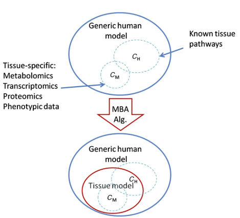
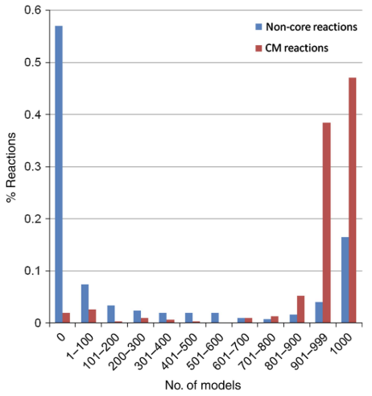
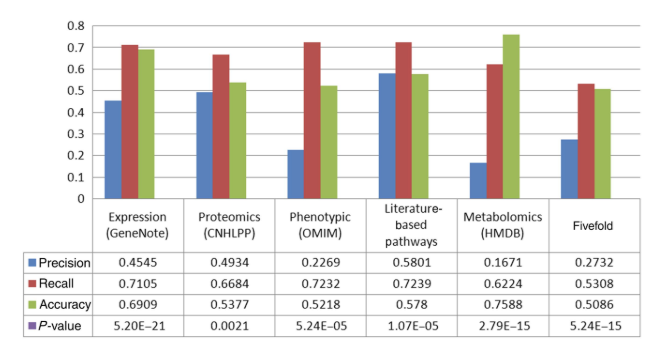
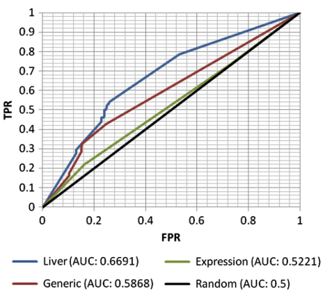
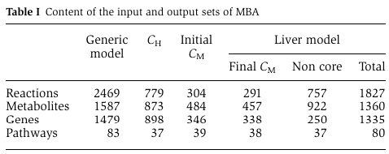

# Computational reconstruction of tissue-specific metabolic models: application to human liver metabolism

## Abstract

인간 대사의 computational study는 첫 번째 일반적(조직 특이적이지 않은) 인간 대사의 화학적 모델의 출현으로 진보되었습니다. 본 **연구에서는 인간 대사의 조직 특이적 유전체 규모 모델을 신속하게 재구성하기 위한 새로운 알고리즘을 제시**합니다. 이 알고리즘은 문헌 기반 지식, 전사체, 단백체체, 대사체 및 형질체 데이터를 포함한 **다양한 조직 특이적 분자 데이터 원본을 통합하여 일반적 인간 모델에서 조직 특이적 모델을 생성**합니다. 이 알고리즘을 적용하여 우리는 간 대사의 유전체 규모 화학 모델을 처음으로 구축했습니다. 이 모델은 표준 교차 검증 절차를 사용하여 검증되었으며, 간 대사 기능을 수행할 수 있는 능력을 통해 확인되었습니다. 이 모델의 흐름 예측은 다양한 호르몬 및 식이 조건에서 흐름 측정치와 상관 관계가 있으며, 초기 일반적 인간 모델을 사용한 예측 성능보다 개선되었습니다 (정확도가 0.67 대 0.46). 마지막으로, 이 모델은 유전적 대사 이상의 생체 표지자 변화를 더 잘 예측합니다 (정확도가 0.67 대 0.59). 제시된 접근 방식은 다른 인간 조직 특이적 모델을 구축하고 다른 생물에 적용할 수 있습니다.

## Introduction

인간 대사의 이해는 일반적인 대사 장애에서부터 비정상적인 대사 표현까지 다양하고 넓은 범위의 임상 상태 연구 및 치료에 중요합니다. 암 유발(Carcinogenesis)도 비정상적인 대사 phenotypes을 포함하며, metabolic targets은 오랫동안 암 화학 요법(chemotherapy)에 사용되어 왔습니다(Serkova 등, 2007; Galmarini 등, 2008). 최근에는 에너지 대사의 장애가 흔히 나오는 정신 질환부터 신경퇴행성 질환에 이르기까지 다양한 뇌 질환에 관여한다는 것이 밝혀졌습니다(Holmes 등, 2006; Huang 등, 2007). 인간 대사의 computational study는 이러한 중요한 의료 문제들의 실험적 조사를 보완하여 그들의 병인론에 대한 통찰을 제공하고 치료를 진전시킬 수 있습니다.

세포 대사의 수학적 모델링은 일반적으로 세포 대사의 kinetic modeling techniques을 통해 이루어져 왔으며, 이는 kinetic constants와 효소 및 대사체 수준에 대한 상세한 정보를 필요로 합니다(Garfinkel과 Hess, 1964). 그러나 현재 효소의 kinetic 및 levels에 대한 **정확한 세포 정보의 부족으로 인해 이러한 방법들의 적용 가능성이 소규모 시스템으로 제한되고 있습니다. 대안적인 계산적 접근 방식인 제한 기반 모델링(CBM)은 이러한 장애를 우회하는데, 이는 이러한 상세한 정보에 의존하지 않습니다.** 제한 기반 모델링은 가능한 흐름 분포가 화학적으로 균형을 이루고, 열역학적 제약 및 효소 수용량에 대한 제약이 실험적 관찰에 기반한 것으로 가정하는 대사적 steady state 하에 이루어집니다. 이 모델링 패러다임은 미생물 생리학 연구에 상당한 성공으로 널리 적용되어 왔습니다. 아직은 덜 발전된 상태이지만, 인간 대사의 대규모 모델링은 끊임없이 진전되고 있습니다(Goodacre 등, 2004); 이전 연구는 특정 인간 대사 경로의 특성화에 중점을 두었으며(Kanehisa와 Goto, 2000; Romero 등, 2004), 특정 세포 유형 및 세포 기관의 모델링(Wiback 및 Palsson, 2002; Chatziioannou 등, 2003; Vo 등, 2004)을 진행해 왔습니다.

2007년, 많은 유전체 및 문헌 정보를 평가하여 두 가지의 **generic human metabolic model**이 제시되었습니다(Duarte 등, 2007; Ma 등, 2007). 이 네트워크 모델은 생리학적 조건에 따라 다양한 조직 및 세포 유형에서 발생할 수 있는 **생화학 반응의 모음**으로 구성됩니다. generic model의 potential clinical utility는 이전에 혈소판 빈혈과 관련된 원인이 되는 반응 집합과 고콜레스테롤혈증 치료를 위한 잠재적인 약물 표적을 식별하는 능력에 의해 시연되었습니다(Duarte 등, 2007). 최근의 연구에서는 generic human metabolic model의 유용성이 IEMs의 유전적 돌연변이로 인해 농도가 변화하는 metabolic biomarkers를 예측하는 데 더욱 확실히 입증되었습니다(Shlomi 등, 2009). Generic human model을 사용하여 조직 특이적 대사를 예측하는 도전에 대응하여 **최근에는 generic model과 조직 특이적 유전자 및 단백질 발현 데이터를 통합하는 계산적 방법이 제시되었습니다**(Shlomi 등, 2008). 이 연구에서는 두뇌, 간, 신장 등 다양한 인간 조직의 다양한 대사 행동을 성공적으로 예측하였습니다. 예측된 대사 행동은 각 조직마다 표현 데이터(입력값으로 사용)가 측정된 단일 정상 생리학적 조건을 특징 짓습니다. (The predicted metabolic behavior characterizes, for each tissue, a single, normal physiological condition under which the expression data (used as input) was measured.)

**본 연구에서는 Shlomi 등(2008)의 연구에서 보여진 것과 같이 조직의 single metabolic state를 예측하는 대신, 다양한 조직 특이적 분자 데이터 소스를 사용하여 인간 조직의 t functional metabolic network 모델을 재구성하는 새로운 계산적 방법을 개발합니다.** **이러한 모델은 추가적인 context-specific molecular data가 필요하지 않고 표준 CBM 방법을 통해 다양한 유전 및 생리학적 조건 하에서 조직의 대사 상태를 탐색할 수 있습니다.** 구체적으로, Shlomi 등(2008)의 이전 방법에서는 유전적 격동(genetic perturbations) 또는 약물 적용의 효과를 시뮬레이션하고 연구할 수 없었지만, 이 연구에서 구축된 모델을 사용하면 이를 간단하게 수행할 수 있습니다. 특히, 본 연구의 완전한 조직 모델을 구축하기 위해 Shlomi 등(2008)의 연구에서 사용된 혼합 정수 선형 프로그래밍(**MILP) 접근 방식을 사용하는 것은 작동하지 않습니다**. 이는 이 연구에서 필요한 많은 조직 특이적 데이터 소스에 의해 제기된 높은 계산적 요구로 인한 것입니다. 따라서 대안적으로, **새로운 방법은 문헌 기반 지식, 전사체, 단백체체, 대사체 및 형질체 데이터를 포함한 관련 조직 특이적 분자 데이터 소스와 최대한 일치하는 하위 네트워크를 경험적으로 제거하여 기존의 일반적 인간 대사 모델을 정제합니다.** 이 새로운 방법을 적용하여 간의 최초의 유전체 규모 대사 모델을 생성하였으며, 이 결과 모델은 다양한 간 데이터 소스와 일치하며, generic model을 사용한 것보다 다양한 생리학적 조건에서 다양한 대사 상태를 성공적으로 시뮬레이션할 수 있음이 입증되었습니다.

## Results

### The model-building algorithm (MBA)

우리의 알고리즘은 다양한 분자 데이터 원본과 네트워크 통합을 기반으로 generic model에서 조직 특이적 대사 모델을 유도합니다. 우리는 먼저 조직 특이 데이터에서 core reactions이라고하는 generic model에 포함되어야 하는 반응 세트를 유추합니다. 즉, 우리가 구축하려는 조직 모델에 포함되어야 하는 반응입니다(자료 및 방법 섹션 참조). 특정 조직에서 수행될 가능성이 높은 core reactions과 중간 정도의 확률을 가진 core reactions 간의 차이를 구분하고, 고 확률 반응에 대한 CH와 중간 확률 반응에 대한 CM 두 세트로 핵심을 나눕니다. **일반적으로 CH 세트에는 human-curated tissue-specific pathways가 포함되고, CM 세트에는 분자 데이터에 의해 검증된 반응이 포함됩니다.** CH와 CM 모두 generic model의 하위 집합입니다. 우리 알고리즘의 입력은 다양한 개별 조직(즉, 우리의 경우 일반적 인간 모델)에 존재할 수 있는 반응의 연합으로 구성된 generic model과 핵심 조직 특이 반응입니다(도 1 참조). 그런 다음 우리의 **목표는 가장 간단하면서도 모든 조직 특이 고 확률 반응(CH), 최대 중간 확률 반응 수(CM) 및 간단하면서도 모든 core reactions을 활성화할 수 있게하는 추가 반응 세트를 포함하는 일관적인 조직 특이 모델을 유도하는 것입니다.** 후자 반응은 일관된 모델을 얻기 위해 추가되어야 하는 최소한의 반응 세트를 탐색하여 관찰됩니다. 모델의 최소화를 목표로하는 동시에 모델에 포함되는 중간 확률 반응의 수를 최대화하는 것은 상충됩니다. 후자는 모델의 품질을 평가하는 단일 점수를 얻기 위해 두 가지 최적화 기준을 가중치를 조정하여 조정됩니다(자료 및 방법 섹션 참조). 결과 모델이 이 최적화 매개 변수에 의존하는지 여부를 확인하기 위해 민감도 분석이 수행되었으며(Supplementary information, pp 5–6), MBA의 성능은 꽤 견고하며 좁은 최적화 매개 변수 값의 선택에 달려 있지 않음을 보여줍니다.



```
Figure 1는 모델 구축 알고리즘 (MBA)의 워크플로우를 보여줍니다. 이 알고리즘은 조직 특이적 core reactions 세트 (CH 및 CM)를 입력으로 받아 전체 CH 반응, 가능한 한 많은 CM 반응 및 전체 모델 일관성 달성에 필요한 최소한의 추가 반응을 포함하는 조직 모델을 재구성합니다.
```

최대 점수의 최적 모델을 찾기 위해 우리는 제거된 모델의 일관성을 유지하면서 **무작위 순서로 generic model에서 반응을 반복적으로 제거**하는 탐욕적인 휴리스틱 탐색을 사용합니다(일관된 generic model에서 시작). **각 가지치기 단계에서, 반응은 해당 반응이 제거되어도 CH에서 반응을 활성화하는 데 방해되지 않고 모델의 점수를 증가시키는 경우에만 제거됩니다.** 반응의 스캔 순서가 결과 모델에 영향을 줄 수 있으므로 알고리즘은 다른, **무작위 가지치기 순서(우리의 구현에서는 1000)로 실행**되어 다양한 후보 모델을 구축합니다(추가 설명은 Supplementary Figure 1 참조). **특정 반응을 포함해야 하는 정도를 반영하는 모델의 일부의 분수는 최종 조직 모델을 구성하기 위해 후보 모델이 집계되며, CH에서 시작하여 점수에 따라 순서대로 반응을 반복적으로 추가하여 최종적으로 최소하지만 일관된 모델을 얻습니다.**

### Generating a metabolic model of the liver

우리는 간의 유전체 규모의 대사 네트워크 모델을 자동으로 생성하기 위해 우리의 방법을 적용했습니다. 우리의 시작점은 Duarte 등(2007)에 의해 제안된 일반적 인간 대사 모델입니다. 이 모델은 2766개의 대사물질, 3742개의 반응, 1905개의 유전자 및 100개의 대사 경로를 포함합니다. **필수 코어인 CH는 간에서 활성인 것으로 알려진 조직 특이적 대사 경로의 문헌 기반 정리에서 추출되었습니다.** 이는 중심 대사, 탄수화물, 지질 및 아미노산 대사뿐만 아니라 특이적인 간 대사(예: 약물 대사, 담즙산 생합성)에 관여하는 37개의 정상적인 대사 경로로 구성됩니다. 이러한 경로는 총 779개의 반응과 873개의 대사물질이 관련되어 있습니다.**더 관대한 코어인 CM**은 304개의 반응 세트와 484개의 대사물질로 구성되어 있습니다. 간 대사의 대사물질 (Wishart 등, 2007) 트랜스크립토믹 (Shmueli 등, 2003; Yanai 등, 2005), 프로테옴 (Yan and Sadee, 2000; He, 2005; Saier 등, 2006) 및 페노 타이피 데이터 (McKusick, 2007)를 포함한 **조직 특이 데이터 원본에서 조립되었습니다.** **각 반응은 위에 나열된 데이터 원본 중 적어도 두 가지에서 지원되었거나 대사물질대로 작용하기 위해 필요한 경우에만 CM에 포함되었습니다** (Wishart 등, 2007). 따라서 총 코어는 1083개의 반응과 1187개의 대사물질로 구성됩니다 (CH, CM 및 최종 간 모델을 구성하는 반응의 설명은 부록 정보, 데이터 세트 I에 제공됩니다).



```
Figure 2는 MBA 모델 구축 과정의 일관성을 나타내는 것으로, 비-CH(CM 및 비 코어) 반응 신뢰도 점수의 분포를 측정한 것입니다. Figure에서 보듯이, 반응의 높은 비율(70.65%)이 완전한 확신으로 예측되었으며, 즉, 생성된 하위 모델 중 하나에도 모든 하위 모델에 포함되거나 포함되지 않습니다.
```
- 모델 generation procedure의 constitency를 나타낸다. 맨 왼쪽의 파란색은, 그 어떤 모델에서도 저 non-core model을 선택하지 않았다는 뜻.  그리고 거의 대부분의 모델에서 CM 반응을 선택했다. 즉, 휴리스틱 알고리즘임에도 불구하고 non core reaction과 cm reaction을 잘 구별해냈다.

우리의 MBA 방법을 적용한 후, 결과적으로 얻은 간 모델은 1827개의 반응과 1360개의 대사물질로 구성됩니다. 네트워크 시각화는 부가 웹사이트(http://www.cs.technion.ac.il/~tomersh/methods.html)를 통해 접근할 수 있으며, 무료로 제공되는 Cytoscape 소프트웨어(Cline 등, 2007)를 사용하여 대화형으로 탐색할 수 있습니다. **코어 반응에 포함되지 않은 derived liver model의 반응 중 50%는 물질을 구획 간에 전달하는 수송 반응입니다(그 중 대부분은 모델에서 유전자와 관련되어 있지 않으므로 코어 반응 세트에 포함되지 못했습니다).** 간 및 generic model의 구획화 패턴은 부록 정보, Figure 2에 나와 있습니다. MBA **알고리즘의 휴리스틱 특성에도 불구하고, 결과적으로 얻은 간 모델의 많은 반응이 다른 무작위 반응 제거 순서를 통해 일관되게 예측되었습니다.** 비-CH 반응의 70.65%에 대해서는 알고리즘이 완전히 일치하는 예측을 제공합니다. 즉, 해당 반응은 모든 모델에 포함되거나 모든 모델에 포함되지 않습니다 (Figure 2).

우리는 먼저 간 모델을 다양한 알려진 간 대사 기능을 다른 생리적 조건에서 시뮬레이션하여 테스트했습니다. 분명히, 관련 대사 경로가 이미 모델 재구축 알고리즘에 입력으로 사용되었지만(고 신뢰성 반응 집합인 CH 내에서), **결과적으로 얻은 모델은 여러 대사 경로의 integration을 포함하는 복잡한 기능을 수행할 수 있는 능력이 보장되지 않습니다.** 탄수화물이 없는 경우, 간세포는 gluconeogenesis을 갖고 있습니다. 즉, 글루코겐성 아미노산, 글리세롤 및 락테이트를 통해 포도당을 합성할 수 있습니다. 글루코네오겐을 시뮬레이션하기 위해 탄소원으로 사용될 수 있는 대사물질의 흡수를 제한하고, 글루코 생산 및 분비 속도를 최대화하여 글루코생산이 발생하는 가능한 반응 분포를 확인했습니다. 다양한 흡수 영양소의 흡수 속도에 따라 분비되는 글루코에 의존하는 분비된 가능한 반응 분포를 확인했습니다(Supplementary 정보, Figure 3). 이는 모델이 글루코네오겐을 수행할 수 있는 능력을 보여주며(KIDA et al, 1980; Chan et al, 2003), 이를 입증합니다.


```
Figure 3 (A) 건강한 (즉, 정상 호모젠), 부분 (즉, 헤테로접합형) 및 완전 노크아웃 사례의 (B) 간 및 generic model 시뮬레이션에서의 요소/글루타민 비율의 평균 및 표준 오차
```
- A는 간 모델, B는 제네릭 모델. 각각 풀 녹아웃, 부분 녹아웃, 건강을 나타낸다. 결과로 얻은 모델은 여러 대사경로의 인테그레이션을 커버하지 못한다. 포도당이 없어도 다른 대사 경로를 통해 포도당을 합성할 수 있는데, 이렇게 돌아가는것 까지 예측하지 못한다는 뜻같음. 
- 간모델에서 얻은 요소 분비: 글루타민 흡수 비율이 더 메타볼릭 프로파일을 잘 나타냄. 일반 호모일 경우 글루타민 흡수 비율 대비 요소 배출 비율이 높다. 
- 노말-부분-녹아웃으로 갈수록 비율이 줄어든다. OTC빼고 

간에서 일어나는 주요 기능 중 하나는 암모니아를 요소로의 변환하는 것입니다. 요소 회로 결핍증은 심한 고암모니아혈증과 고글루타민혈증을 일으킬 수 있는 간 대사의 선천적인 결함입니다. Lee 등(2000)의 연구에서는 **아르기노신빈티포릴라제(ASS) 결핍증(deficiency), argininosuccinate lyase(ASL) 결핍증, 그리고 ornithine transcarbamylase(OTC) 결핍증을 포함한 요소 이상을 가진 환자와 건강한 통제 대상에서 체내에서 요소 분비 및 글루타민 흡수의 대사흐름이 측정되었습니다**. **요소 분비 및 합성은 식이 아미노산의 소비와 관련되어 있기 때문에, 요소 회로의 기능을 더 잘 묘사할 수 있는 요소 분비 대비 글루타민 흡수 비율이 각 흐름의 속도보다 나은 결과를 얻을 수 있습니다**(Lee 등, 2000에 의한 결과). 세 가지 장애 각각에 대해 건강한 호모젠 접합형 (대응 반응을 통한 0이 아닌 흐름 강제), 돌연변이 헤테로접합형 (대응 반응을 통한 최대 속도의 50%로의 흐름 제한) 및 완전 제로 유전형 (즉, 반응을 통한 0 흐름 강제)을 시뮬레이션했습니다. 일반적인 인간 모델 및 간 모델에서. 특히 각각의 경우에 대해, 우리는 1000개의 샘플 솔루션을 통해 stoichiometric massbalance와 reaction directionality constraints을 충족하는 가능한 flux distribution space를 샘플링함으로써 요소:글루타민 비율을 계산했습니다. 이를 통해 비율의 평균 및 표준 편차를 도출했습니다. 간 모델에서 얻은 결과가 일반적인 모델보다 실험적으로 관찰된 대사 프로필을 더 잘 나타내는 것으로 나타났습니다. 주로 간 모델에서는 질병의 심각성에 따라 요소:글루타민 비율이 단조롭게 감소하는데, 이는 OTC 시뮬레이션에서 완전 제로 유전형을 제외하고 (Figure 3; 부록 정보, 테이블 I), 비교적 안정적인 것으로 나타났습니다. 간 모델에서 건강한 케이스의 시뮬레이션은 일반적인 모델과 달리 ASS 및 ASL 시뮬레이션의 완전 제로 유전형에서 얻은 비율보다 훨씬 높은 요소:글루타민 비율을 얻습니다(t-검정 P-값이 각각 6 x 10^(-2) 및 1 x 10^(-4)임), (t-검정 P-값이 각각 0.8469 및 0.2235임). 또한 간 모델로 정의된 솔루션 공간에서 비율의 분산은 generic model로 정의된 것보다 상당히 작습니다(부록 정보, 테이블 I). 이후 결과는 Lee et al(2000)에 의해 설명된 현상과 일치합니다. 각 유전형에 대해 비율이 상당히 안정적으로 유지되는 것입니다.

### Cross-validation



```
Figure 4 다섯 겹 교차 검증 테스트를 통한 누락된 핵심 데이터의 예측. 각각의 다섯 개의 열은 알고리즘의 MBA 성능을 나타내며, 알고리즘의 핵심을 구성하기 위해 네 가지 다른 데이터 소스를 사용하여 하나의 생략된 데이터 소스를 예측합니다.
```
- 데이터에 reaction에 대한 누락값이 있을때 올바르게 추가하는 능력 테스트. 다른 데이터 소스를 이용하여 누락된 하나의 데이터 소스를 예측한다. 

MBA의 성능을 평가하기 위해 표준적인 다섯 겹 교차 검증 절차에서 간 모델을 구축하였습니다. 구체적으로, MBA에게 전체 core reactions 세트의 여러 하위 집합이 제공되었으며, 그런 다음 예측된 MBA 모델의 반응 내용이 제외된 core reactions 데이터와 비교되었습니다. 즉, MBA가 누락된 간 반응을 올바르게 추가하는 능력이 테스트되었습니다. 알고리즘의 예측은 제외된 테스트 데이터와 유의적으로 풍부하게 연관되었습니다 (초기기하학적 P-값 = 5.24 x 10^(-15)), 정확도는 0.5086, 재현율은 0.5308, 정밀도는 0.2732입니다. 다른 방식으로 다른 교차 검증이 수행되었습니다. 각각의 분자 오믹스 데이터 집합이 구축 단계에서 누락되도록 구성되었습니다. 또한, 예측은 누락된 데이터 세트와 유의적으로 풍부하게 연관되었습니다 (평균 초기기하학적 P-값 = 4.331004), 평균적으로 정확도는 0.6174, 재현율은 0.7, 정밀도는 0.3844입니다 (Figure 4).

### Predicting hepatic flux measurements

간 모델을 사용하여 다양한 간 대사 상태에서의 플럭스 변화를 예측하고 그 예측 정확도를 원래의 일반적인 인간 모델과 비교하였습니다. 예측은 Chan et al(2003)의 포괄적인 플럭스 측정 세트를 사용하여 테스트되었습니다. Chan et al(2003)의 연구에서 보고된 실험은 기본적인 쥐 간세포에서 수행되었습니다. 간세포는 급성 간부전 환자에게 단기적인 지원을 제공할 운명인 bioartificial liver
assist devices의 주요 구성 요소를 형성합니다. **간세포는 표준 간세포 배양 배지에서 배양되었으며 고 또는 저 인슐린 수준으로 사전 조건이 설정되고, 아미노산 보충이 있는 또는 없는 인간 혈장에 노출되었습니다. 이 네 가지 조건에서 대사 플럭스가 측정되었습니다.**

이러한 상대적으로 풍부한 간 플럭스 데이터를 고려하여 우리는 네 가지 다른 classifier 사이의 포괄적인 비교를 수행하기로 결정했습니다: **(a) 간 모델, (b) generic model, (c) 발현 데이터만을 사용하여 구축된 간 모델, (d) 무작위 백그라운드 모델. 조직 특이적 발현 데이터만을 사용하여 구축된 모델(c)은 다른 분자 데이터가 아직 덜 보편적인 반면 많은 조직에 대해 사용 가능**하므로(따라서 흥미로움), 여기서 구축되고 테스트되었습니다. 예측 테스트는 실험적 플럭스 데이터를 exchange reaction의 모델에 제공하고 결과적으로 inner flux를 예측함으로써 수행되었습니다. classifier 사이의 엄격한 비교를 위해 standard
receiver–operator curve(ROC)을 사용하여 그들의 성능을 추적하였습니다. **ROC 곡선은 classifier의 결정 임계값이 변함에 따라 예측의 true positive rate(TPR)과 false positive rates(FPR) 간의 교환을 보여줍니다. 전체적인 성능은 area under the curve(AUC)으로 제공되며, 이는 0부터 1까지의 범위에서 변동되며, 1은 완벽한 classifier의 성능을 나타냅니다.**

- increasing, decreasing internal flux에서 모두, liver 모델이 모두 높은 TPR을 가진다. 제네릭보다 훨씬 높음


```
그림 5 주로 쥐 간세포에서 고 또는 저 수준의 인슐린으로 사전 처리된 경우와 아미노산 보충이 있는 또는 없는 인간 혈장에 노출된 경우에 발생하는 기관주위 플럭스에 대한 실험적 간 플럭스 데이터를 예측합니다. 모든 classifier의 ROC 곡선(및 이로 인한 AUC)은 (A) 증가하는 내부 플럭스 및 (B) 감소하는 내부 플럭스를 예측하기 위해 별도로 제공됩니다(교환 플럭스를 실험적으로 측정된 값으로 설정).
```

그림 5에서 나타나듯이, **간 모델은 증가 플럭스에 대한 AUC가 0.6745이고 감소 플럭스에 대한 AUC가 0.6044로, generic model보다 훨씬 우수한 성능을 보입니다.** generic model의 예측은 증가 및 감소 플럭스에 대해 각각 0.46073과 0.5103의 AUC를 얻습니다. 간 특이적 유전자 발현에 기초한 모델은 중간 정도의 정확도를 얻습니다(증가 플럭스에 대한 AUC는 0.57331이고 감소 플럭스에 대한 AUC는 0.4806입니다). 따라서 유**전자 발현에만 의존하는 부분 정보 코어에 기반하여 구축되었지만, 여전히 일반적 인간 모델보다 우수한 성능을 보입니다.** 다양한 모델이 외부 플럭스를 내부 플럭스로 예측하는 능력 및 전체적인 다섯 겹 교차 검증 테스트에서의 성능은 부록 그림 4에 나와 있습니다. 이러한 결과 전체적으로 간 모델이 다소 제한된 플럭스 측정 세트를 기반으로 간 대사 변화를 예측하는 데 훨씬 더 나은 기초로 작용할 수 있음을 보여줍니다

### Predicting metabolic biomarkers



```
Figure 6 Prediction of metabolic biomarkers of IEMs. The figure depicts the ROC curves (and the resulting AUCs) of the four classifiers, as in Figure 5
```

최근 Shlomi et al. (2009)은 Duarte et al.의 일반적인 모델(2007)이 IEMs로 인한 대사물질 농도 변화를 성공적으로 예측할 수 있다는 것을 보여주었습니다. 이는 생체유체 대사체 분석을 통해 감지할 수 있는 진단용 생체지표를 대표합니다. 재구성된 간 모델의 추가적인 유효성 검증으로, 우리는 간 대사 유전자의 돌연변이로 인한 대사 이상에 중점을 둔 이 분석을 여기서 반복했습니다. 이 방법은 질병 시뮬레이션 대 정상 시뮬레이션을 비교함으로써 경계 대사물질의 농도를 비교하는 것에 기초합니다. 각 경계 대사물질은 그것을 세포 외부 구획에서 세포 내부 구획으로 운반하는 교환 반응을 가지고 있으므로, 각 대사물질의 농도 변화는 교환 반응의 플럭스 간격을 비교함으로써 유추할 수 있습니다(흡수 대 배설을 대표). 시뮬레이션된 정상 대 질병 상태에서 FVA(자료 및 방법 부분 참조; Mahadevan and Schilling, 2003)를 사용하여 이러한 대사물질의 농도 변화를 유추합니다.

초기 대사 이상 집합(OMIM 데이터베이스에 기록된)은 일반적인 인간 대사 모델에 포함된 원인 유전자와 관련된 하나 이상의 알려진 대사 진단 생체지표(Shlomi et al, 2009)와 연관된 137 개의 IEMs로 구성되어 있습니다. 이 집합에서, 재구성된 간 모델에 포함된 원인 유전자의 84 가지 이상의 이상 집합을 추출하였습니다(부록 정보, 데이터 세트 II 참조). 그림 6에서 나타나는 바와 같이, 간 모델은 generic model보다 높은 AUC(0.6691)를 달성하여 개선되었습니다. generic model에서는 AUC가 0.5868입니다(간 모델의 생체지표 예측 설명은 부록 정보, 데이터 세트 II에 제공됨). 이번에는 간 전용 유전자 발현만을 기반으로 한 모델이 일반적인 모델보다 낮은 정확도를 달성하여 실망스럽게 됐습니다. AUC는 0.5221입니다. 이러한 결과는 다시 한번 간 모델이 generic model보다 더 나은 간 효소의 기능 이상으로 인한 대사 플럭스 변화를 식별하는 능력을 보여주지만, 동시에 후자의 구축 프로세스에 다양한 데이터 소스를 통합하는 것의 중요성을 강조합니다.

## Discussion

엄격하고 신속한 계산 방법을 사용하여 인체 조직 특이 대사 모델을 생성합니다. **MBA는 해당 조직의 대사를 특징 짓는 기존 문헌 및 분자 데이터를 기반으로 일반 종 모델에서 조직 특이적 모델을 추출합니다.** 결과적 모델은 stoichiometric, 질량 균형 및 열역학적 제약을 충족합니다. 알고리즘은 입력 데이터의 정확도 수준에 따라 구조화되어 있으며, 조직 특이적 핵심을 보다 신뢰할 수 있는 **human-curated data(CH)와 omics 데이터(CM)로 구분**하여 다른 신뢰 수준으로 처리합니다.**알고리즘은 휴리스틱한 성격에도 불구하고 대부분의 반응이 최종 모델에 선택되어 있어 일관성 있게 모델을 구축**합니다. 이 알고리즘은 첫 번째 stoichiometric 유전체 규모 간 대사 모델을 구축하는 데 적용되었습니다. 결과적인 간 모델은 다양한 간 대사 기능을 수행할 뿐만 아니라 **다양한 생리학적 및 유전적 조건에서 간의 대사 프로필을 정확하게 묘사하여 generic human model을 능가**합니다.

위의 방법은 최근 Christian 등(2009)의 발표된 방법과 유사하며, 일련의 반응을 핵심으로 정의하고 이를 포함하는 **최소한의 모델을 추출**하려는 점에서 다릅니다. 그러나 이 방법은 stoichiometric 제약 조건을 고려하지 않는 네트워크 확장 절차 대신 **최적화에 기반**을 두고 있습니다. **MBA에는 장단점이 있습니다.** 

장점 측면에서, **조직 특이적 모델을 생성하는 일반적이고 빠른 접근 방식이며, 상당히 정확하고 유용**합니다. 크기 확장에 거의 제한이 없으며 다양한 데이터 원본을 처리할 수 있습니다. 중요한 점은 교차 검증을 사용하여 모델의 일관성과 신뢰성을 쉽게 얻을 수 있고 현재 상황을 파악할 수 있다는 것입니다. 

단점 측면에서는 몇 가지 제한 사항이 있습니다. 먼저, 시작점은 일반 종 모델에 의존하기 때문에 정확도는 후자의 품질에 따라 달라집니다. 이 의존성은 모델 구축 중에 범용 풀에서 반응을 추가할 수 있는 확장된 계산적 접근 방식으로 향후 완화될 수 있습니다. 둘째, 조직 핵심을 결정하는 데 사용되는 다양한 분자 omics 데이터의 정확도도 명백한 제한 요소입니다. 이 효과를 완화하기 위해 우리의 접근 방식은 인간이 편집한 경로 데이터를 우선적으로 처리하고 여러 분자 원본에서 증거를 요구하지만, 분자 데이터의 모든 부정확성이 걸러지지는 않을 것으로 예상됩니다. 이러한 잠재적 주의 사항을 염두에 두면 여기에서 생성된 간 모델의 정확도는 상당히 주목할 만합니다.

**Table I** Content of the input and output sets of MBA



최종 간 모델은 CM 코어의 95% 이상으로 구성되므로(표 I 참조), 단순히 결과적 간 모델에 모든 반응을 포함하는 것보다 중간 신뢰도 코어의 추가 가치를 더욱 검증하였습니다(고 신뢰도 코어 CH와 유사하게). 이를 위해, 원래의 CH 및 CM 반응 세트로 구성된 고정된 미리 결정된 코어를 갖는 모델을 구축하여 해당 모델의 흐름 변경 예측 능력을 연구했습니다(즉, 이제 모든 것이 CH 반응으로 정의됨). 그 결과 나오는 모델은 엄격한 모델로, 어떤 코어 반응도 제거할 수 없게 구성됩니다. 엄격한 모델의 성능은 내부 흐름을 예측하는 간 모델의 성능과 꽤 유사하며, 증가하는 흐름과 감소하는 흐름에 대해 AUC가 각각 0.6061 및 0.6433을 얻습니다. 그러나 전체적인 다섯 겹 교차 검증 테스트(Supplementary Figure 4) 및 생체 표지자 예측(Supplementary Figure 5)에서 모델들을 비교하면 표준적이고 유연한 MBA 버전으로 구축된 간 모델의 이점이 나타납니다. 간 모델은 대부분의 CM 반응을 포함하고 있지만, 약 100개의 반응이 엄격한 모델과 구별됩니다. 이 반응 집합은 22개의 대사 경로에 관여하며(Supplementary information, 데이터 세트 II 참조), 모델의 성능에 영향을 줍니다.

MBA 접근 방식은 많은 유망한 미래 응용 프로그램을 열어 줍니다. 먼저, 이 연구에서 개발된 간 모델은 간 대사를 에뮬레이트하는 생체공학적인 인공 장치(예: BAL; Yang 등, 2009)를 합리적으로 설계하는 데 도움이 될 수 있습니다. BAL의 주요 구성 요소인 간세포(Strain and Neuberger, 2002)는 대사 변환(예: 지방 축적 및 암모니아 제거 감소)으로 인해 기능을 빠르게 상실하는 경향이 있습니다. 간 대사 모델을 이러한 세포의 기능을 최적화하고 이러한 불필요한 변환에 기여하는 대사 과정을 억제하는 잠재적인 방법을 예측하는 데 적용함으로써 이러한 장벽을 우회하는 데 도움이 될 수 있습니다. 둘째, MBA는 다양한 인간 조직의 대사 모델의 신속한 개발에 활용될 수 있으며, 신장, 심장 및 뇌와 같은 조직의 대사를 유전체 수준에서 조사할 수 있는 계산적 기회를 제공합니다. 세 번째로, MBA는 일반적인 모델이 있는 모든 생물에 대한 조직 모델을 생성하는 데 사용될 수 있습니다. 예를 들어 Mus musculus(Sheikh 등, 2005; Quek 및 Nielsen, 2008) 및 모델 식물 Arabidopsis thaliana(Poolman 등, 2009)입니다.

## Materials and methods

### The model-building algorithm (MBA)

대사 네트워크 모델은 (M, R, S, L) 네 개의 튜플로 표현될 수 있습니다. 여기서 M은 대사물질의 집합을 나타내고, R은 생화학 반응의 집합을 나타내며, $S \in \mathbb{R}^{|M|\times |R|}$는 반응의 화학 계수로 이루어진 행렬입니다. 그리고 $L \in \mathbb{R}^{|R|}$은 반응의 방향성에 대한 제약 조건을 나타냅니다(즉, 반응의 플럭스 속도에 대한 하한 값을 반영).

반응의 화학 계수는 stoichiometric matrix인 S에 의해 표현되며, 여기서 Si,j는 반응 j에서 대사물질 i의 화학 계수를 나타냅니다.

feasible flux distribution within a metabolic network model은 질량 보존(**Sv=0**) 및  directionality constraints($L \leq v$)을 충족하는 벡터 v입니다. 대사 네트워크 모델은 모든 반응을 활성화할 수 있는 경우 일관성이 있다고 간주됩니다. 즉, 각 반응 $r_i \in \mathbb{R}$에 대해 모든 가능한 실행 가능한 플럭스 분포 v가 있어야 합니다. $|v_i|>0$입니다.

generic model로 GM=$(M_G, R_G, S_G, L_G)$가 주어지면, 일부 모델인 PM=$(M_P, R_P, S_P, L_P)$은 generic model의 일부 반응($R_P\subset R_G$)만을 포함하고 해당하는 대사물질, stoichiometry 및 directionality constraints의 하위 집합을 기반으로 정의될 수 있습니다. 유의할 점은 일관된 generic model의 부분 모델이 그 자체로 일관되지 않을 수 있다는 것입니다(즉, 모든 가능한 실행 가능한 플럭스 분포를 고려할 때 활성화할 수 없는 막달린 반응이 포함될 수 있습니다).

generic model GM 및 고 확률로 일부 부분 모델에 포함될 것으로 알려진 두 개의 core reactions 세트인 $C_H$ 및 $C_M\subset R_G$가 주어지면, 우리의 목표는 $C_H$의 모든 반응과 $C_M$에서 최대한 많은 반응으로 구성된 최소한의 일관된 부분 모델 PM을 도출하는 것입니다. 구체적으로, 다음 최적화 문제를 해결하여 $P_M$을 식별하려고 합니다.

$$\text{Maximize }|R_P \cap C_M -\varepsilon|R_P/(C_H\cup C_M)|$$
s.t.    
PM is consistent,     
$C_H \subset R_P$

여기서 e는 가장 간결한 모델을 얻는 것과 부분 모델에 최대한 많은 중간 확률 반응을 포함하는 것 사이의 균형을 반영하는 매개 변수입니다. e의 값이 높을수록 모델은 더 간결해지고, e의 값이 낮을수록 모델에 포함되는 중간 확률 반응의 수가 늘어납니다. 간 모델의 구축에는 e가 0.5로 설정되었습니다.

위의 최적화 문제를 해결하기 위해 다음과 같은 간단한 검색 휴리스틱을 사용합니다:

그냥 원본보자 여기는

### Predicting flux measurements

간 대사 조건에 따른 대사 속도의 변화를 예측하기 위해 간 모델을 적용했습니다. 이 예측은 23개의 교환 플럭스(대사물질의 흡수) 및 22개의 내부 플럭스를 포함하는 플럭스 측정값과 비교되었습니다(Chan et al., 2003; 실험적인 플럭스 데이터에 대한 완벽한 설명은 부록 정보, 데이터 세트 II에 제공되었습니다). 이러한 측정값은 고/저 인슐린 전조 처리가 있는 네 가지 대사 조건에서 주효소로부터 얻어진 것입니다.

우선, 이러한 측정값에 가능한 한 가까운 화학 반응의 질량 균형 및 반응 방향성 제약 조건을 만족하는 가능한 플럭스 분포를 찾기 위해 이차 프로그래밍(QP)을 적용했습니다. 이 과정은 각각의 네 가지 성장 조건에서 일반적인 및 간 모델에 대해 실행되었습니다.

측정된 교환 플럭스 값을 사용하여 최적의 일치를 찾는 과정을 통해 유도된 대사 프로필을 탐색하기 위해 FVA(Mahadevan and Schilling, 2003)를 사용하여 모델 내 모든 반응을 통한 가능한 플럭스 범위를 예측했습니다. 다른 교환 반응의 최대 흡수 속도는 모델에서 글루타민 흡수 속도의 10%로 설정되었습니다(Chan et al., 2003).

메타변화를 고려하여 HP(High Preconditioning) 조건을 기준으로 다른 세 가지 조건과 비교하여 대사 플럭스의 변화를 예측했습니다. 각 반응에 대해 HP 조건에서의 간격과 나머지 세 가지 조건에서의 간격의 차이를 계산했습니다. 반응이 증가하거나 감소할 것으로 예측되는 조건은 아래에 나열된 조건 중 하나에 해당합니다. 그렇지 않으면, 변경되지 않았다고 간주됩니다. 또한, 간격의 변화는 크기로 정규화되어 대사 플럭스 변화의 중요성을 고려합니다. 이러한 예측의 ROC 곡선은 임계값을 증가시킴에 따라 플로팅되었습니다 (Bock et al., 1991).

### Biomarkers prediction

Shlomi et al. (2009)의 계산 방법을 적용하여 간 모델에 포함된 질환 유발 유전자를 갖는 84가지 간 대사 장애를 체계적으로 예측했습니다(OMIM 데이터베이스에 문서화된). 이 방법은 질병 시뮬레이션과 정상 시뮬레이션에서 경계 대사물질의 농도를 비교함으로써 진행됩니다. 경계 대사물질은 교환 반응을 통해 세포 외에서 세포 내로 이동할 수 있는 물질로 정의되며, 반대로도 이동할 수 있습니다. 경계 대사물질의 농도 변화는 해당 교환 반응의 최소/최대 플럭스 값 간의 간격 변화로 추론될 수 있습니다. 각 대사 반응 r에 대해 정상 및 질병 케이스를 시뮬레이션하여 r을 활성화 또는 비활성화된 것으로 만들 때 FVA를 통해 교환 반응의 간격 e를 계산했습니다. 만약 m이 정상 시뮬레이션에서의 교환 반응 간격 A¼(mina, maxa)와 질병 시뮬레이션에서의 교환 반응 간격 B¼(minb, maxb)를 갖는 경우, 그러면 m은 아래 조건 중 하나를 만족할 때 생체 마커입니다: