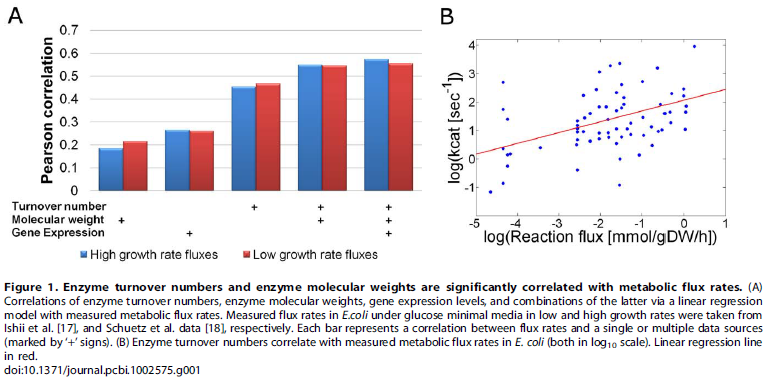
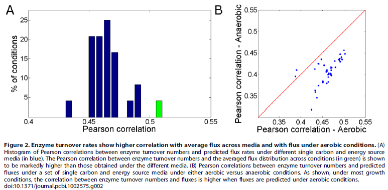
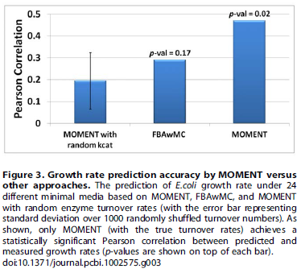
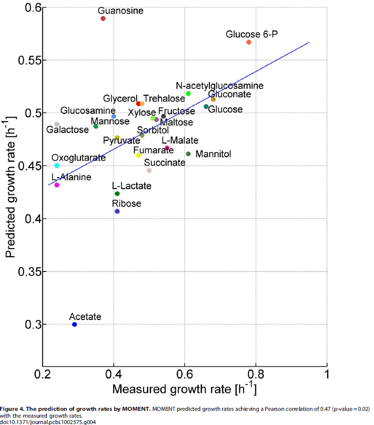

# Prediction of Microbial Growth Rate versus Biomass Yield by a Metabolic Network with Kinetic Parameters

## Abstract

다양한 환경 및 유전적 조건에서 미생물 성장률을 결정하는 요인을 식별하는 것은 시스템 생물학의 주요 과제입니다. 현재의 게놈 규모 대사 모델링 접근법은 최대 생물량 수율을 포함한 다양한 대사 표현형을 성공적으로 예측할 수 있게 해주지만, 실제 성장률의 예측은 오랜 과제입니다. 이 격차는 반응의 화학량론과 방향성에 대한 데이터에만 엄격히 의존하고 효소 동력학적 고려 사항을 고려하지 않기 때문에 발생합니다. 여기서 우리는 효소 회전율 및 효소 분자량에 대한 사전 데이터를 활용하여 영양소 흡수율 측정 없이 대사 플럭스 속도 및 성장률을 예측하는 새로운 대사 네트워크 기반 접근법인 MetabOlic Modeling with ENzyme kineTics (MOMENT)를 제시합니다. 이 방법은 다양한 배지에서 높은 플럭스 반응을 촉매하는 효소가 더 높은 회전율을 가지고 있어 더 효율적이라는 대사 설계 원리에 기반합니다. 게놈 규모 대사 모델링에서 동력학적 데이터를 활용하려는 이전 시도들을 확장하여, 우리의 접근법은 예측된 대사 플럭스 속도를 촉매하기 위해 필요한 특정 효소 농도를 고려하며, 동형효소, 단백질 복합체, 다기능 효소를 고려합니다. MOMENT는 E. coli의 다양한 대사 표현형, 특히 다른 성장률 하에서의 세포 내 플럭스 속도와 유전자 발현 수준 변화를 예측하는 정확성을 크게 향상시키는 것으로 나타났습니다. 가장 중요한 것은, MOMENT가 다양한 배지에서의 E. coli 성장률을 실험적 측정값과 상관관계가 있는 것으로 예측하여, 기존의 최첨단 화학량론적 모델링 접근법을 현저히 능가한다는 것입니다. 이러한 결과는 세포 효소 농도에 대한 생리학적 제한이 미생물 성장률을 결정하는 주요 요인이라는 견해를 지지합니다.

## Introduction

전통적인 대사 모델링 기법은 특정 시스템 내 모든 효소에 대한 효소 동력학 매개변수에 대한 상세한 지식을 바탕으로 동력학 모델을 재구성하는 것을 포함합니다. 이러한 모델은 동력학 상수에 대한 충분한 데이터가 부족하고 모델이 매우 복잡하기 때문에 소규모 시스템에 제한됩니다. 대안적 접근 방식인 제약 기반 모델링(Constraint-Based Modeling, CBM)은 효소 동력학 데이터를 필요로 하지 않고 단순한 물리화학적 제약에만 의존하여 미생물의 게놈 규모에서 특정 정상 상태의 세포 대사 표현형을 예측합니다. 이 접근법은 측정된 특정 속도로 섭취된 영양소가 생체량으로 전환되는 정상 상태의 플럭스 속도(단위: mmol/(g[DW]*h))를 식별합니다. 대사 네트워크에는 필수 생체량 대사물질을 소비하는 생체량 생산 반응이 포함되며, 이 반응의 화학량론적 계수는 단위 세포질량(g[DW])을 생성하는 데 필요한 몰 수(단위: mmol/g[DW])를 나타냅니다. 이 반응의 플럭스 활동은 성장률(단위: 1/h)을 나타냅니다. CBM은 현재 미생물의 대사 공학에서 널리 사용되며, 유전자 결손이 유기체 생존에 미치는 영향을 예측합니다.

플럭스 균형 분석(Flux Balance Analysis, FBA)은 반응의 화학량론과 방향성(즉, 영양소 섭취 속도의 측정 없이)을 기반으로 생체량 생산 수율(단위: 그램 생체량/그램 영양소)을 예측하는 데 널리 사용되는 CBM 접근법입니다. 반응의 화학량론과 방향성에 대한 정보만 주어졌을 때, 생체량 수율의 예측은 탄소 영양소의 섭취 속도에 임의의 상한을 고려하여 생체량 생산 반응을 통한 최대 플럭스를 가진 가능한 플럭스 분포를 찾는 방식으로 작동합니다. FBA가 예측한 최대 생체량 생산 속도는 최적 수율 대사를 반영하며, 가정된 섭취 속도에 최대 생체량 수율을 곱한 값과 같습니다. FBA에 의한 실제 성장률의 예측은 영양소 섭취 속도의 실험적 측정값이 사용되어 모델의 섭취 플럭스를 제한할 때 이론적으로 가능합니다(또는 FBA가 예측한 생체량 수율에 측정된 섭취 속도를 곱함으로써). 그러나 실험 연구들은 미생물이 다양한 조건에서 비최적 수율 대사를 나타낸다는 것을 보여주었습니다. 예를 들어, 과도한 대사(overflow metabolism)의 경우가 이에 해당합니다.

과도한 영양소 섭취가 비효율적으로 대사되는 경우(FBA에 의해 얻어진 성장률 예측치는 많은 경우 비현실적으로 높을 가능성이 있음), 다양한 환경 및 유전적 조건 하에서 영양소 섭취 속도 측정 없이 성장률을 예측하는 것은 더 야심찬 개념적 과제입니다. FBA with Molecular Crowding (FBAwMC)는 최근 개발된 FBA의 확장판으로, 영양소 섭취 속도의 측정 없이 다양한 성장 배지에서 E. coli의 성장률을 예측할 수 있음을 보여주었으며, 과도한 대사 조건에서도 마찬가지입니다. 이는 효소 동력학 상수를 활용하여 촉매된 대사 플럭스에 필요한 효소 농도를 고려함으로써 이루어졌습니다.

이 논문에서는 실험적으로 결정된 흡수율을 요구하지 않고 대사 효소의 최대 세포 용량을 고려하여 대사 플럭스와 성장률을 예측하는 MetabOlic Modeling with ENzyme kineTics (MOMENT) 방법을 제시합니다. FBAwMC를 확장하여, MOMENT는 알려진 동력학 상수를 기반으로 각 대사 반응을 촉매하기 위해 필요한 효소 농도를 정확히 정량화하고, 동형효소, 단백질 복합체 및 다기능 효소를 고려합니다. MOMENT는 다양한 성장 배지에서의 E. coli 성장률을 실험 측정값과 유의하게 상관된 예측값을 제공하며, 영양소 흡수율을 측정하지 않고도 기존의 FBAwMC보다 예측 정확도가 크게 향상되었습니다. 더욱이, MOMENT는 대사 플럭스와 대사 유전자의 발현 수준을 포함한 다양한 대사 표현형의 예측 성능을 현저히 개선하는 것으로 나타났습니다.

## Result

### The evolution of enzyme kinetic parameters optimizes metabolic flux

효소 회전 속도는 효소가 단위 시간당 촉매 부위 당 얼마나 많은 기질 분자를 생성물로 변환할 수 있는지의 최대 수입니다. 우리는 BRENDA [15]와 SABIO-RK [16] 데이터베이스에서 251개의 반응에 대한 효소 회전 속도를 추출했습니다. 유전체 규모의 대사 흐름 속도를 추론하기 위해, 우리는 포도당 최소 배지에서의 다양한 성장률에서의 여러 가지 대사 흐름을 이용하여 [17]과 [18]에서 얻은 것과 같이 대사 네트워크 모델 [19]과 통합했습니다. 이를 위해 예측된 흐름을 측정된 흐름에 맞추기 위해 유클리드 거리를 최소화하는 표준 이차 프로그래밍 최적화를 기반으로 하여 전체 네트워크를 통한 가장 가능성 있는 속도를 추론했습니다 [20]. 특히, 이 분석은 입력으로 키네틱 데이터를 사용하지 않습니다. 전역 흐름 분포를 추론하기 위한 대안적 접근 방법으로는 스토이코메트릭 질량-균형 제약 조건과 최대 생물량 수율 가정에 기반하여 Flux Balance Analysis를 적용한 다음 Flux Variability Analysis를 사용하여 [21] 유일하게 결정될 수 있는 대사 반응을 식별했습니다(두 접근 방법으로 얻은 플럭스 분포에 대한 아래에 설명된 분석에서 전반적으로 유사한 결과를 얻음; 표 S1; 그림 S1).

E. coli의 효소 키네틱 매개변수와 측정된 흐름 속도를 비교했을 때, 높은 플럭스 반응을 촉매하는 효소는 높은 회전 속도를 갖는 것으로 나타났습니다. 낮은 성장률 조건에서 회전율과 플럭스 간의 통계적으로 유의한 피어슨 상관관계가 0.45 (p값 = 7.8e-5)이었고, 높은 성장률 조건에서는 0.46 (p값 = 3.6e-5)였습니다(이때 양쪽의 플럭스와 회전 속도의 밑 10 로그를 고려함). 이러한 상관 관계는 플럭스 반응이 높은 반응을 촉매하는 효소에 대한 효소 효율(즉, 높은 회전율)에 대한 더 높은 선택 압력이 작용한다는 것을 시사합니다. 특히, 우리의 결과는 최근 중심 대사 효소가 이차 대사 효소보다 높은 회전 속도를 갖는다는 결과를 확장하여 [22] 실제 플럭스 속도를 고려함으로써 효소를 일차 및 이차 대사에 묶어 근사적으로 분류하는 대신에 이루어집니다.

효소 분자량은 KEGG [23]에서 추출된 유전체 서열을 기반으로 계산되었습니다. 대사 플럭스 속도와 효소 분자량 사이에도 통계적으로 유의한 피어슨 상관관계인 0.22 (p값 = 3.2e-5)가 발견되었으며, 이는 높은 분자량을 가진 효소에 대해 더 높은 플럭스 속도를 나타냅니다(Figure 1A). 흥미로운 점은 효소 회전 속도와 분자량 모두를 기반으로 대사 플럭스 속도를 설명하려는 간단한 선형 회귀 모델이 대사 플럭스 속도와 0.55의 피어슨 상관관계(p값 = 8.1e-7)를 제공하여 각 매개변수가 독립적으로 플럭스 속도를 설명하는 데 기여한다는 것을 시사합니다(Figure 1A).

효소 키네틱 매개변수는 유전체 규모의 대사 모델링 접근 방식에서 거의 사용되지 않지만, 유전자 발현 데이터는 일반적으로 대사 플럭스 예측의 기반이 됩니다. 그러나 위에서 설명한 플럭스 속도와 유전자 발현 [26] 간의 상관 관계를 계산했을 때, 포도당 최소 배지에서도 측정된 유전자 발현과 동일한 성장 조건에서의 피어슨 상관 관계는 각각 0.26과 0.265였습니다. 후자의 상관 관계는 플럭스 속도와 효소 회전 속도 간에 얻은 상관 관계보다 유의하게 낮습니다. 이는 유전자 발현과 대사 플럭스가 매우 유사한 성장 매체에서 측정되었음에도 불구하고, 키네틱 매개변수가 서로 다른 성장 조건에서도 일정하다는 것을 고려할 때 주목할 만한 결과입니다. 위에서 설명한 회귀 모델에 유전자 발현 데이터를 추가하여도 대사 플럭스 예측에 무의미한 기여를 제공하지 않았습니다(Figure 1A). E. coli에서 측정된 동일한 성장 매체에서 67개의 효소 코딩 유전자에 대한 단백질 농도를 활용하여, 단백질 농도와 대사 플럭스 속도 사이에 유의한 상관 관계를 찾지 못했습니다. 이러한 결과는 대사 플럭스 예측에 대한 주요 데이터 소스로서 효소 키네틱 데이터를 활용하는 중요성을 더욱 강조합니다.

효소 회전 속도가 포도당 최소 배지에서 측정된 플럭스 속도와 유의하게 상관되어 있음을 보여주었으므로, 다양한 종류의 성장 매체에서의 효소 회전 속도와 플럭스 속도 간의 상관 관계를 검토하기로 결정했습니다. 이를 위해 여러 매체에 대한 FBA를 적용하여 가능한 플럭스 분포를 예측하고 ([방법]에 나열된 매체), 실험적 측정치에 대한 성장률을 설정하고 최대 수율을 최적화했습니다. 이를 통해 이러한 매체 간의 평균 피어슨 상관 관계가 0.46임을 발견했습니다(Figure 2A). 다음으로, 성장 매체 전체에서의 효소 당 평균 플럭스 속도와 효소 회전 속도 간의 상관 관계를 계산하여, 개별 매체에서 얻은 상관 관계보다 더 높은 0.52의 피어슨 상관 관계를 발견했습니다. 이 결과는 효소 회전 속도가 여러 매체에서 효과적인 대사를 지원하기 위해 진화할 수 있음을 시사합니다. 대사가 특정 성장 매체에 더 잘 조정되어 있는지 여부를 탐구하기 위해, 유산소와 무산소 조건에서 예측된 플럭스와 효소 회전 속도 간의 상관 관계를 비교했습니다(Figure 2B). 예측된 플럭스와 효소 회전 속도 간의 상관 관계가 유산소 조건에서 유의하게 높음을 발견했습니다(쌍 Wilcoxon 검정 p값 = 3e-15), 이는 유산소 조건에서 효과적인 대사에 대한 더 강한 선택 압력이 있음을 시사합니다. 이러한 결과는 효소 키네틱 데이터와 대사 플럭스가 직접적으로 연관된 분자적 데이터 소스인 코돈 사용 및 유전자 발현 [27] 등을 통해 생물의 자연 환경에 대한 가치 있는 통찰력을 제공할 수 있음을 시사합니다.

### Utilizing enzyme kinetic parameters within genome-scale metabolic modeling

효소의 회전 속도와 효소의 분자량이 대사 흐름 속도와 상관 관계가 있는 사실은, 이후 대사 모델링 접근 방식에서 이러한 데이터 소스를 활용하면 대사 표현형의 예측 정확도를 향상시킬 수 있다는 것을 시사합니다([9,10,11,12]에서도 보여진 바와 같습니다). 이를 위해 우리는 MetabOlic Modeling with ENzyme kineTics (MOMENT)라는 방법을 개발했습니다. 이 방법은 이용 가능한 총 효소 풀의 제약 하에 적용되는 속도론적 매개변수를 활용합니다. 특정 성장 조건이 주어지면 MOMENT는 스토이치오메트릭 질량-균형과 반응 방향성 제약 조건을 만족하는 플럭스 분포를 예측하여 예측된 플럭스를 촉매화하기 위해 필요한 총 효소의 질량이 총 효소 질량에 의해 제한된다는 점을 고려합니다. FBAwMC와 [12,21]에서 사용된 제약 조건과 유사한 제약 조건을 고려합니다(메서드 참조). 효소 회전 속도는 예측된 플럭스를 촉매화하기 위해 필요한 효소 농도의 상한을 계산하는 데 사용되고, 효소 분자량은 농도를 질량 단위로 변환하는 데 사용됩니다. 그러나 FBAwMC와 달리, MOMENT는 동시에 피해야 할 플럭스 분포와 해당하는 효소 농도를 찾습니다. 이것은 동이종 효소, 효소 복합체 및 다기능 효소를 고려하여 이루어집니다. 이를 위해 CBM 모델에서 일반적으로 부울 방정식을 통해 표현되는 상세한 유전자-반응 매핑을 활용합니다(메서드 참조). 이를 통해 이소효소의 경우, 여러 유전자 중 하나의 발현이 특정 반응을 촉매하기 위해 필요하며, 효소 복합체의 경우, 여러 유전자의 공동 발현이 필요합니다. 주목할 점은 전체 유전자-반응 매핑 세트가 더 복잡한 최적화 없이도 재귀적 방법으로 선형 프로그래밍의 일부로 공식화된다는 것입니다. 이러한 매핑을 모델링하는 데 일반적으로 사용되는 혼합 정수 선형 프로그래밍과 같은 보다 복잡한 최적화가 필요하지 않습니다([28,29] 참조). E. coli의 반응 중에서 위에서 설명한 데이터베이스에서 효소 회전 속도가 추출되지 않은 경우, 다른 종으로부터의 평균 회전 속도가 고려되어 총 513개의 효소에 대한 회전 속도 집합이 얻어집니다. 어떤 종에도 회전 속도가 없는 반응의 경우, E.coli의 모든 반응에서의 중앙 회전 속도로 할당됩니다([10]과 동일). E.coli에 대한 측정된 효소 회전 속도만 사용하는 것은 MOMENT 및 다른 계산 접근 방식에 대한 낮은 예측 정확도를 제공했으며, 여전히 예측 정확도에서 MOMENT에 대한 뚜렷한 이점을 보여줍니다(Table S2 참조). MOMENT의 구현은 http://www.cs.technion.ac.il/,tomersh/tools/를 통해 제공됩니다.

### Predicting E. coli’s growth rate across growth media

MOMENT의 미생물 성장률 예측 능력을 평가하기 위해, 우리는 24개의 단일 탄소 및 에너지 소스 배지에서 E. coli의 성장률을 실험적으로 측정하고 예측된 성장률과 측정된 성장률을 비교했습니다 (Methods, Table S3). 예측은 E. coli iAF1260의 게놈 규모 대사 네트워크 모델에 MOMENT를 적용하여 얻었습니다 [19]. MOMENT가 얻은 성장률 예측치는 측정된 성장률과 유의미한 상관관계를 나타냈습니다 (Figure 3 and 4). 피어슨 상관계수는 0.468 (p-value = 0.02), 스피어만 상관계수는 0.473 (p-value = 0.0196)였습니다. 주목할 점은 총 효소 질량의 임계값을 조정하면 예측된 성장률이 선형적으로 변하지만, 예측된 성장률과 측정된 성장률 간의 상관관계는 변하지 않는다는 것입니다 (Text S1).

이전 연구에서는 단백질 질량이 세포 질량의 56%(g enzymes/gDW)를 차지한다고 밝혔습니다 (실험적 측정에 기반한 [30]). 전체 단백질 질량이 대사 효소에 할당된다고 가정하면, 우리는 처음에 평균 성장률을 1.02 (1/h)로 예측했는데, 이는 측정된 평균 성장률 0.47 (1/h)보다 상당히 높았습니다. 측정된 성장률과 예측된 성장률 간의 편차(제곱 차이 측면)를 최소화하는 총 효소 질량의 임계값을 찾은 결과, 27%(g enzymes/gDW)의 임계값을 얻었으며, 이는 단백질 질량의 48%만이 대사 효소에 할당됨을 시사합니다. 따라서, 예측된 성장률을 올바른 범위로 조정하려면 대사 효소의 총 질량에 대한 사전 지식이 사용되어야 합니다. 이 경우, E. coli에서 대사 효소에 할당된 단백질 질량의 비율은 유전자 발현 데이터 분석을 통해 추가로 뒷받침됩니다 [26].

MOMENT에 의해 얻어진 성장률 예측치는 측정된 값과 유의미한 상관관계를 보였지만, 예측된 성장률의 표준 편차(다양한 배지에서)는 측정된 성장률의 표준 편차보다 현저히 낮았습니다 (예측된 값은 0.054, 측정된 값은 0.14). 관찰된 성장률과 예측된 성장률 간의 표준 편차 차이에 대한 잠재적 설명은 고성장률 조건에서 대사 효소에 할당된 단백질 질량의 비율이 증가한다는 것입니다. 주목할 점은 이 가설을 검증하려면 다양한 성장률에서 측정된 고처리 단백질 농도 데이터가 필요하지만, 현재 이러한 데이터는 이용할 수 없습니다. 전반적으로, 특정 성장 조건에서의 총 효소 농도에 대한 추가 실험 데이터를 활용하면 MOMENT의 예측 성능이 더욱 향상될 것으로 기대됩니다.

사용된 효소 회전율의 중요성을 평가하기 위해, 우리는 무작위로 섞인 회전율을 사용하여 MOMENT의 성장률 예측을 반복했으며, 이는 예측 정확도가 크게 떨어지는 결과를 가져왔습니다 (Figure 3; p-value = 0.026, 무작위 샘플링 중 예측된 성장률과 측정된 성장률 간의 상관관계가 더 높은 비율을 나타냄).

우리의 새로운 방법을 벤치마킹하기 위해, 우리는 이전에 개발된 FBAwMC의 예측 성능을 테스트했습니다. 여기서 FBAwMC는 MOMENT에 제공된 것과 동일한 효소 회전율을 사용했으며, Beg et al.에서 설명한 대로 누락된 매개변수를 샘플링하는 절차를 수행했지만, 예측 성능은 향상되지 않았습니다 (데이터는 표시되지 않음). 우리는 FBAwMC가 달성한 성장률 예측이 측정된 값과 유의미한 상관관계를 나타내지 않음을 발견했습니다 (Figure 3; Figure S2; p-value = 0.17). Beg et al.은 10개의 배지에서 측정된 성장률과 예측된 성장률 간에 유의미한 상관관계를 보고했지만, 여기서 고려한 24개의 배지는 더 넓은 범위를 포함하며, 핵산 및 아미노산도 포함합니다. Beg et al.이 연구한 10개의 배지에 대한 성장률 측정에 집중했을 때, FBAwMC와 MOMENT 모두 유의미한 피어슨 상관관계를 나타냈지만, 유의미한 스피어만 상관관계는 나타나지 않았습니다 (Table S4). Wong et al. [31]은 성장률이 성장 수율의 제곱근에 비례한다고 제안했습니다. 우리는 MOMENT의 예측이 이 관계를 만족한다는 것을 발견했으며, 예측된 성장률과 예측된 생물량 수율의 제곱근 간에 유의미한 상관관계가 있음을 확인했습니다 (Pearson R = 0.3953, p-value = 0.05; Spearman R = 0.5046, p-value = 0.01).

## Predicting metabolic flux, gene and enzyme expression levels

MOMENT의 세포 내 플럭스 예측 성능을 평가하기 위해, Schuetz 등 [18]에 의해 지수 성장 단계에서 측정된 E.coli의 28개 반응에 대한 실험적인 플럭스 측정치를 예측된 플럭스와 비교했습니다. MOMENT에 의해 얻은 플럭스 예측은 측정된 플럭스와 0.76의 피어슨 상관관계를 달성하여, 상당히 우수한 성능을 보여주었습니다. 이에 비해 FBAwMC 및 FBA는 각각 0.64 및 0.51의 상관관계를 달성하여, MOMENT의 예측 정확도보다 상당히 낮았습니다. 더하여, 플럭스 제곱의 합당 ATP 수율을 최대화하는 FBA의 변형을 테스트하여 [18]에서 이전에 플럭스 예측 정확도를 향상시키는 것으로 보여진 방법을 추가로 확인했습니다. 이후 접근 방법에 의해 얻은 예측은 측정된 플럭스와 0.68의 피어슨 상관관계를 달성했지만, 이는 여전히 MOMENT의 예측 정확도보다 현저히 낮았습니다. 여기에서도 무작위 샘플링된 효소 회전 속도를 사용하는 것이 예측을 더 악화시켰습니다.

MOMENT의 예측 성능을 더 평가하기 위해, 저그림 최소 배지에서의 저 및 고 성장률 조건 간에 E.coli의 유전자 발현 변화에 관한 [32] 데이터를 추출하여 예측된 효소 농도 변화와 비교했습니다. MOMENT를 적용하여 이러한 저 및 고 성장률 조건 간의 단백질 농도 변화를 예측하면, 성장률 증가로 인한 효소 수준의 예상 증가에서 벗어난 28개 효소를 예측했습니다. 저 및 고 성장률 사이의 이러한 효소 농도 변화는 측정된 유전자 발현 변화와 0.84의 피어슨 상관관계를 달성했습니다. 심지어 유전자 및 단백질 발현 수준이 중간 정도로 상관되는 경향이 있음에도 불구하고 [33]. 여기에서도 FBAwMC의 성능은 이 경우에 상당히 낮았으며, 피어슨 상관관계는 0.34였습니다.

특히, 단순 FBA는 서로 다른 성장률에서의 차이가 있는 대사를 예측할 수 없기 때문에 여기에서 평가되지 않았습니다. 더 나아가, 최근에 개발된 Parsimonious enzyme usage FBA (pFBA)라는 방법을 추가 벤치마크로 사용하여 E. coli의 유전자를 최적의 성장 솔루션에서 사용되는지 여부에 따라 분류했습니다(이 분류는 이전에 E.coli 균주의 성장률을 높이는 데 사용된 실험실 진화 균주의 유전자 발현 변화와 관련되어 있다고 보여졌습니다) [34]. 이러한 유전자 분류와 저 및 고 성장률 조건 간의 유전자 발현 변화 사이의 상관 관계는 매우 약했습니다(Pearson R=0.092, p값 =0.02; Spearman R= 0.074, p값 = 0.06).

## Discussion 

미생물 성장 속도의 계산적 예측은 주요한 도전입니다. 여기서, 우리는 게놈 규모의 대사 모델링과 효소 키네틱 매개변수를 통합하여 이 도전에 대처하는 새로운 계산적 접근 방법인 MOMENT를 제안합니다. MOMENT는 다양한 성장 매체에서의 대장균(E. coli)의 성장 속도를 예측하여 실험적 측정치와 유의하게 상관되는 것으로 나타났으며, 세포 내 플럭스 및 효소 코딩 유전자의 유전자 발현 등 여러 가지 대사 표현현을 예측 정확도를 향상시켰습니다. 이 방법은 대사의 식별된 설계 원리에 기초하며, 다양한 매체에서 고 플럭스 반응을 촉매하는 효소들은 회전 수가 높은 경향이 있습니다.

MOMENT는 게놈 규모의 대사 표현을 가능하게 하지만, 경우에 따라 잘못된 예측을 유발할 수 있는 몇 가지 간소화된 가정을 해야 합니다: (i) MOMENT는 대사 효소에 할당된 총 단백질 농도의 분율 정보를 입력으로 필요로 합니다. 이 정보는 각 모델 조건마다 얻기 어려우므로, 우리는 여기서 이 분율이 다양한 성장 매체에 걸쳐 일정하게 유지된다고 가정했으며, 이는 예측을 편향시킬 것으로 예상됩니다. (ii) MOMENT는 리보솜에 의한 단백질 합성 비용 및 지역 기질 회전 수 등 성장 속도에 영향을 미치는 여러 중요한 요소를 고려하지 않습니다. (iii) MOMENT는 여전히 E. coli의 수백 개의 효소에 대한 효소 키네틱 상수 데이터를 필요로 합니다. 특히, 다양한 막 트랜스포터에 대한 키네틱 데이터가 BRENDA와 SABIO-RK에서 모두 누락되어 있으며, 이는 특정 트랜스포터를 활성화하는 데 필요한 비용 및 트랜스포터를 제거하는 데의 영향에 대한 잘못된 예측을 할 수 있습니다. (iv) MOMENT는 대사물질 농도를 예측하지 않으므로 열역학적 고려 사항(플럭스 방향성에 관한 것)이나 필요한 효소 수준을 계산할 때 효소 포화 고려 사항을 고려하지 않습니다(대부분의 E. coli 효소가 완전히 포화되어 있다고 가정함으로써). 향후 연구에서는 MOMENT를 확장하여 [37]에서 수행된 것처럼 2차 열역학을 만족하면서 대사물질 농도도 예측할 수 있도록 할 것입니다. 애플리케이션 측면에서, MOMENT에 의해 달성된 향상된 대사 모델링 성능은 대사 공학 응용 프로그램 및 특히 최적 균주 설계에 중요한 기여를 할 것으로 예상됩니다. 특히, MOMENT가 예측된 대사 플럭스 속도에 대한 특정 효소 농도 요구에 대한 추가 제약 조건을 통합하여 Opt-Knock, RobustKnock, OptStrain 등의 계산적 대사 공학 방법의 정확도를 향상시킬 수 있습니다. MOMENT가 미생물 성장 속도를 올바르게 예측하는 능력은 세포의 효소 농도에 대한 생리학적 제약이 성장 속도를 결정하는 중요한 요인임을 지원합니다.

## Methods

효소 키네틱과 함께 대사 모델링(MetabOlic Modeling with ENzyme kineTics, MOMENT)은 FBA와 유사하게 실행 가능한 플럭스 분배 벡터 v(mmol/gDW/h)를 찾습니다. 이 벡터는 최대 성장 속도(즉, 생물질 생성 반응을 통한 플럭스)를 충족하는 동시에 다음의 선형 제약 조건을 기반으로 질량 균형 및 반응 방향성 제약 조건을 만족합니다:

(i) $Sv=0$,

(ii) $v_{lb} ≤ v ≤ v_{ub}$,

여기서, S는 N 개의 대사물질과 M 개의 반응으로 구성된 스토이코메트릭 행렬 S(NxM)을 나타내며, (S_ij는 반응 j에서 대사물질 i의 스토이코메트릭 계수에 해당함), v_lb와 v_ub는 플럭스 속도에 대한 알려진 하한 및 상한 값입니다. 여기서 v_lb는 역반응에 대해 2inf로 설정되거나, 불가피한 반응에 대해 0으로 설정되며, v_ub는 모든 반응에 대해 +inf로 설정됩니다. 플럭스 분배뿐만 아니라, MOMENT는 각 v의 플럭스 속도에 충분히 높은 효소 농도를 갖는 벡터인 g(mmol/gDW)를 찾습니다. 플럭스 속도를 효소 농도에 연결하기 위해, 우리는 Feist 등의 E. coli 모델에 포함된 부울 유전자-반응 매핑을 활용합니다. 이는 다음과 같습니다:

1. 특정 효소 i가 촉매되는 반응 j의 경우, 우리는 다음과 같은 방정식을 사용합니다:

$$v_j \leq k_{cat_j} * g_i$$

2. 두 개의 이소효소 a 또는 b에 의해 촉매되는 반응 j의 경우, 우리는 다음과 같은 방정식을 사용합니다:

$$v_j \leq k_{cat_j} * (g_a + g_b)$$

3. 두 유전자 제품 a와 b로 이루어진 효소 복합체에 의해 촉매되는 반응 j의 경우, 우리는 다음과 같은 방정식을 사용합니다:

$$v_j = k_{cat_j} * min(g_a, g_b)$$ 

이와 같은 복잡한 유전자-반응 매핑을 고려하기 위해, 특정 반응을 촉매할 수 있는 여러 대안적 효소 복합체가 있는 경우 위의 규칙을 재귀적으로 적용하고 AND 및 OR 연산자에 대한 보조 변수를 추가합니다. 회전 수가 알려지지 않은 효소에 대해서는 E. coli의 모든 반응을 대상으로 한 회전 수의 중앙값을 사용합니다. 효소의 용매 용량 제약 조건은 다음과 같이 정의됩니다:

$$\sum g_i\cdot MW_i \leq C \left[ \frac{g_{protein}}{g_{DW}}\right]$$

여기서, MW_i는 유전자 i가 코딩하는 단백질의 분자량을 나타내고, C는 단백질의 총 무게를 나타내며, 이는 E. coli 건조 질량의 56%로 가정되었습니다. 마지막으로, 후자의 제약 조건은 분자 혼잡 제약으로 사용되는데, 여기서 유전자-반응 매핑이 고려됩니다.

## Figure description

### Figure 1: 효소 회전율과 효소 분자량이 대사 플럭스 속도와 유의하게 상관되어 있음

이 그림은 효소 회전율, 효소 분자량, 유전자 발현 수준, 및 이들 조합이 대사 플럭스 속도와의 상관관계를 나타낸다. (A) 효소 회전율, 효소 분자량, 유전자 발현 수준, 및 이들의 조합이 측정된 대사 플럭스 속도와의 상관관계를 보여준다. 각 막대는 단일 또는 다중 데이터 소스와의 상관관계를 나타낸다. (B) 효소 회전율과 측정된 대사 플럭스 속도의 상관관계를 나타낸다. 선형 회귀선이 빨간색으로 표시된다.