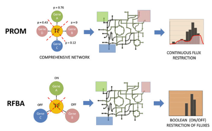

# Probabilistic integrative modeling of genome-scale metabolic and regulatory networks in Escherichia coli and Mycobacterium tuberculosis

## Abstract

**유전적 또는 환경적 변화로 인한 대사 변화를 예측**하는 것은 대사 장애 진단 및 신약 타겟 발견을 포함한 여러 중요한 응용 프로그램이 있습니다. **정확한 예측을 얻는 데 중요한 과제 중 하나는 전사 조절 네트워크를 해당 대사 네트워크와 통합하는 것**입니다. 우리는 이러한 통합을 달성하고 high throughput data를 constraint based 모델링에 자동으로 통합하여, 미연구 생물에 대한 유전체 규모 조절-대사 네트워크 모델을 구축하는 데 이상적인 도구인 확률적 대사 조절(PROM)이라는 방법을 제안합니다. **PROM은 gene states and gene–transcription factor interactions을 나타내기 위해 확률을 도입합니다.** PROM을 사용하여 Escherichia coli 모델 생물에 대한 통합 조절-대사 네트워크를 구축하고, automated inference에 기반한 우리의 방법이 문헌의 manual curation에 기반한 현재의 최첨단 방법보다 정확하고 포괄적임(comprehensive)을 입증했습니다. 이 접근법을 검증한 후에, 우리는 Mycobacterium tuberculosis라는 중요한 인체 병원균을 위한 유전체 규모 통합 대사-조절 모델을 구축하기 위해 PROM을 사용했습니다. 이 연구는 E. coli와 M. tuberculosis에 대한 1,300개 이상의 마이크로어레이, 2,000개의 전사 인자-target 상호 작용을 조절하는 3,300개의 대사 반응 및 1,905개의 KO 표현형 데이터를 포함했습니다. PROM은 95%와 같은 높은 정확도로 KO 표현형을 식별하고, 상관 관계가 0.95인 정량적으로 성장 속도를 예측했습니다. 중요한 것은, PROM은 상향식으로 재구성된 통계적으로 추론된 조절 네트워크를 하향식으로 재구성된, 생화학적으로 상세하게 설명된 대사 네트워크와 성공적으로 통합하여, 양쪽의 중요한 시스템 생물학 모델을 통합하는 것입니다. 이러한 모델은 통상적으로 양적으로 결합되지 않는 두 가지 중요한 클래스의 시스템 생물학 모델을 연결합니다.

## Introduction

시스템 생물학은 다양한 생체 분자 간 상호 작용과 이러한 상호 작용 네트워크에서 발생하는 properties를 연구함으로써 세포 행동을 양적으로 시뮬레이션하려고 합니다. 이에 따라 생물학적 네트워크의 재구성, 시뮬레이션 및 검증은 시스템 생물학에서 주요 behavior를 나타냅니다. 대규모 연구 공동체들은 서로 다른 도구를 주로 사용하여 다양한 네트워크 클래스 주변에 형성되어 왔습니다. **대사 네트워크는 일반적으로 상세한 화학 기반 방법을 사용하여 재구성되고 분석됩니다**. 반면에 전사 조절 네트워크는 일반적으로 high-throughput protein-DNA 상호 작용 데이터를 기반으로 재구성되며, 유전체학 및 전사체학 데이터로부터의 기능적 관계의 통계적 추론에 의해 이루어집니다. 이 두 분야 모두가 상당한 주목을 받았지만, 이 두 종류의 생물학적 네트워크 및 그들을 설명하기 위해 사용되는 다른 스타일의 시스템 모델을 통합하는 데는 아직 많은 작업이 필요합니다. 원활하게 통합된 metabolic-regulatory 네트워크는 유전적 변이와 transcriptional perturbations가 어떻게 대사 수준에서의 flux response로 변환되는지를 더 잘 예측할 수 있도록 할 것입니다. 이러한 노력에서 상당한 성공이 있었지만, 상당한 도전이 남아 있습니다. 현재 대사체의 전사체와 대사를 연결하는 가장 일반적으로 사용되는 유전체 규모 분석 방법은 조절된 플럭스 균형 분석(RFBA)입니다. RFBA는 대사 네트워크의 전통적인 constraint based 모델링 [즉, 플럭스 균형 분석 (FBA)]에 조절 제한을 통합합니다. constraint based 분석에서 네트워크가 선택할 수 있는 기능적 상태는 다양한 물리화학적 제약으로 제한됩니다. 대사 네트워크를 묘사하기 위해 행렬 형식을 사용함으로써, 선형 프로그래밍, 선형 대수 및 convex 분석의 도구를 사용하여 네트워크 특성을 연구할 수 있습니다. RFBA의 경우, 대사 네트워크는 질량, 열역학 및 에너지 제약뿐만 아니라 해당 네트워크를 제어하는 gene 조절 네트워크에 의해도 제한됩니다. Steady-state RFBA (SRFBA) 및 integrated FBA (iFBA)는 boolean 논리를 기반으로 한 유사한 방법입니다. SR-FBA는 RFBA와 동일한 유전체 규모 통합 대사 조절 네트워크를 사용하지만 해당 네트워크의 정상 상태 행동을 특성화하며, iFBA는 일부 조절 네트워크를 모델링하기 위해 미분 방정식을 사용합니다. 확률 모델이나 미분 방정식을 기반으로 한 방법은 일반적으로 작은 시스템을 모델링하기에 제한되어 있으며, 현재로서는 유전체 규모로 확장되지 않았습니다. 

RFBA 및 다른 boolean 논리 기반 방법을 사용하여 통합 모델링을 수행하는 데는 몇 가지 결점이 있습니다. **RFBA 모델은 transcriptome와 metabolite 간의 관계를 binary 프로세스로 단순화하며, 이로 인해 gene와 반응 플럭스는 population에서 켜거나 꺼진 두 가지 상태만 가질 수 있습니다.** 그러나 다양한 종에 걸쳐 RFBA를 사용하여 통합 모델링을 수행하는 데 가장 큰 장애물 중 하나는 **regulator와 해당 target 간의 boolean 규칙을 결정하기 위한 자동 알고리즘의 부재**입니다. manual 프로세스가 대사 조절을 모델링하는 데 정확할 수 있지만, manual reconstitution은 모델링할 수 있는 상호 작용의 수를 크게 제한하므로 매우 적은 양의 유전체 규모 대사-조절 모델이 존재했습니다. 이 프로세스의 manual 특성으로 인해 상호 작용 규칙은 또한 질적인 성격을 가지며, gene가 완전히 켜거나 꺼진 상태가 되며 중간 값을 취할 수 없습니다. 상호 작용의 수가 많기 때문에 boolean 규칙을 작성하고 유전체 규모에서 중요한 상호 작용을 식별하는 것은 매우 어렵습니다. 마지막으로, 이 프로세스는 광범위한 문헌 검색이 필요하기 때문에 처음 두 개의 대사-조절 모델이 매우 잘 연구된 모델 생물인 대장균과 소포자균에 대해 제작되었습니다. 따라서 **자동으로 통합 대사-조절 네트워크를 구축하고 모델링할 수 있는 알고리즘이 절실하게 필요**합니다. 또한 대부분의 새로운 생물에 대해 현재 생성된 데이터가 high throughput data이므로 이러한 데이터를 완전히 활용하는 것이 필수적입니다. 

이러한 요구 사항을 고려하여, 우리는 boolean 규칙을 사용하는 RFBA 및 기타 유사한 방법의 일부 단점을 극복하는 확률적 대사 조절(PROM)이라는 방법을 제안합니다. **PROM은 전사 및 대사 네트워크를 모델링하기 위한 직접적인 통합을 가능하게 하며, high throughput data로부터 상호 작용을 자동으로 quantify하여 boolean 규칙을 manual으로 작성할 필요성을 극복하여 대규모 통합 모델 생성 능력을 크게 높입니다. constraint based 분석을 기반으로 한 모델 프레임워크는 대사 모델링을 위한 운동학 parameter를 필요로하지 않고, 중요한 것은 효소 활성과 mRNA 발현 간의 직접적인 상관 관계를 가정하지 않습니다. PROM은 high throughput data의 잡음에 강하며 네트워크 추론을 위한 자동 알고리즘과 쉽게 통합될 수 있습니다.** PROM 알고리즘은 Shmulevich et al.의 확률적 boolean 네트워크와 유사하게 조건부 확률을 사용하여 전사 조절을 모델링하며, 대사 네트워크를 모델링하기 위해 FBA를 사용합니다. 보다 넓은 의미에서 PROM은 생화학 반응 네트워크와 통계적 추론 네트워크를 통합하는 데 중요한 한 걸음을 나타냅니다.

## Model Framework: Genome-Scale Integrative Modeling Using PROM

PROM을 사용하여 통합 대사-조절 네트워크를 구축하기 위해서는 다음과 같은 것들이 필요합니다: (i) 재구성된 유전체 규모의 대사 네트워크; (ii) 전사 인자(TF) 및 그들의 target으로 구성된 조절 네트워크 구조; (iii) 다양한 환경 및 유전적 요동 하에서 gene 발현 데이터가 풍부한 경우, 트랜스크립톰; 그리고 (iv) 대사 생성물 및 단백질에 의한 효소 조절을 포함한 추가적인 상호 작용. Table 1은 제시된 모델에 대한 데이터 원본 및 기능을 요약합니다. 

**Table 1. Model features and accuracy in predicting KOphenotypes in each organism**

| Feature               | E. coli               | M. tuberculosis           |
|-----------------------|-----------------------|----------------------------|
| Metabolic model       | IAF1260               | iNJ661                     |
| Metabolic reactions   | 2,382                 | 1,028                      |
| Regulatory data       | RegulonDB             | Balazsi et al. (27)        |
| Regulatory interactions | 1,773               | 218                        |
| Microarrays           | 907                   | 437                        |
| Total genes in the model | 1,400               | 691                        |
| Validation data set   | 1,875 growth phenotypes | 30 TF KO                  |
| Accuracy, %           | 85                    | 95                         |
| Sensitivity, %        | 70                    | 83                         |
| Specificity, %        | 91                    | 100          

**PROM은 gene state와 gene-TF 상호 작용을 나타내기 위해 확률을 도입합니다.** **예를 들어, regulating TF B가 꺼져 있을 때 gene A가 켜져 있을 확률은 P(A=1|B=0)로 표시되며, 마찬가지로 B가 켜져 있을 때 A가 켜져 있을 확률은 P(A=1|B=1)입니다. 그런 다음 TF와 target gene 간의 관계는 마이크로어레이 데이터를 사용하여 양적으로 측정됩니다. 이 상호 작용 데이터를 사용하여 PROM을 사용하여 조절 네트워크의 각종 perturbation의 영향을 모델링할 수 있습니다.** TF KO의 gene A에 대한 영향을 예측하려면, 즉 P(A=1|B=0)의 확률을 추정하려면, TF B가 꺼져 있을 때 target gene A가 켜져 있는 마이크로어레이 샘플의 수를 추정합니다. **데이터 세트가 충분히 크면, 해당 상호 작용에 대한 확률의 견고한 추정치를 얻을 수 있습니다.** 따라서 gene가 켜져 있는 확률에 연결된 경우, 0.8이라는 확률이 있다면, 80%의 샘플에서 해당 gene가 켜져 있고, 20%의 샘플에서는 꺼져 있거나 발현되지 않습니다. 유전체 규모에서 KO의 영향을 모델링하기 위해 모든 target gene의 상태가 결정됩니다. **이러한 확률은 그런 다음 target gene에 의해 제어되는 반응을 통한 플럭스를 제한하는 데 사용됩니다.** 앞서 설명한 예에서, **gene A에 의해 조절되는 반응을 통한 플럭스는 켜져 있을 때 최대 플럭스 가능한 플럭스 [즉, 최대 속도 (Vmax)]를 초과하지 않으며, 꺼져 있을 때는 0이 됩니다. 따라서 평균적으로 population에서 반응을 통한 최대 플럭스는 0.8 × Vmax이거나 일반적으로 플럭스의 상한은 p × Vmax이며, 여기서 p는 gene가 켜져 있는 확률입니다. 시스템 반응 Vmax은 플럭스 변동 분석(FVA)을 사용**하여 (SI 방법에 대한) 미조된 대사 모델에서 추정됩니다. translational, post-translational 및 metabolic products 상호 작용과 같은 다른 요소들이 효소 활동에 영향을 줄 수 있으므로, Shlomi et al.의 접근 방식과 유사한 방법을 사용하여 이러한 **제약을 가장 가능성이 높은 플럭스를 결정하기 위한 신호로 사용**합니다. 열역학적 또는 환경적 제약 조건은 위배될 수 없지만, **조절 제약 조건은 "소프트" 제약 조건이므로 시스템은 이러한 제약을 초과하여 성장을 극대화할 수 있지만, 그에 따른 페널티를 받습니다.** 

---
Figure 1은 PROM을 사용하여 대사 및 조절 네트워크를 통합하는 프로세스의 개요를 보여줍니다. 대사 네트워크는 화학량행렬을 사용하여 표현되고, 조절 상호 작용은 확률로 표시됩니다. 전사 인자(TF)의 상태는 환경 조건에 따라 결정됩니다. 이러한 TF 상태는 마이크로어레이 데이터에서 추정된 확률을 기반으로 대상 gene의 켜짐/꺼짐 상태를 결정하는 데 사용됩니다. 이러한 확률은 그런 다음 대사 네트워크를 통한 플럭스를 제약하는 데 사용됩니다.

---

이 절차를 따르면 대부분 또는 모든 조절 제약 조건을 만족하는 최적 모델에 도달합니다. 제약이 설정되면 조절된 네트워크의 최적 성장은 FBA(18)와 같이 선형 최적화 문제를 해결함으로써 결정됩니다. 간단히 말해서, constraint based 분석은 선형 최적화 문제 max wTv를 해결하는 것을 포함합니다. S.v = 0 및 lb ≤ v ≤ ub 제약 조건이 있는 constraint based 분석에서 S는 화학량행렬, v는 특정 플럭스 구성을 나타내는 플럭스 벡터, wT
v는 선형 목적 함수이고, lb와 ub는 각 반응을 통한 최소 및 최대 플럭스를 포함하는 벡터입니다. PROM은 FBA와 동일한 제약 조건과 추가적인 조건을 포함하여 같은 제약 조건을 만족하는 플럭스 분포를 찾습니다. 여기서 최적화 문제는 min(κ.α + κ.β)로, 제약 조건 lb′ − α ≤ v ≤ ub′ + β 및 α,β ≥ 0에 따라 제한됩니다. 여기서 lb′와 ub′는 조절된 제약 조건을 기반으로 하며, α와 β는 해당 제약 조건에서의 이탈을 나타내는 양의 상수이며, κ는 그러한 이탈에 대한 패널티를 나타냅니다. κ의 값이 클수록 조절 제약 조건이 더 강해집니다. κ의 값이 1보다 훨씬 크면 조절 제약 조건은 "하드"가 되고, 0.1보다 작으면 덜 강조됩니다. 모든 시뮬레이션에 대해 κ 값을 1로 선택했으며, 이는 두 극단 사이의 절충안을 나타냅니다. 최적화 문제는 GNU 선형 프로그래밍 킷 솔버를 사용하여 해결되었습니다. PROM에서 사용된 확률적 프레임워크에는 high throughput data에서 쉽게 학습할 수 있다는 점을 제외하고도 많은 장점이 있습니다. 첫째는 생물학적 시스템에 내재된 불확실성(23)을 처리할 수 있는 능력입니다. 즉, gene 발현 수준에서 내재적으로 발생하는 것과 세포 내 다른 구성 요소에 의해 유발되는 것과 같은 외적인 것으로 인한 불확실성이 있습니다. 이로 인해 동일 조건의 세포군에서도 세포 간에 변이가 발생하므로, 두 생물학적 측정값 세트가 동일하지 않습니다. gene를 완전히 켜거나 끄는 것으로 간주함으로써 이러한 변이를 무시합니다. 상호 작용을 양적으로 측정함으로써 우리는 데이터와 세포 내 노이즈의 존재를 간접적으로 고려할 수 있습니다.

RFBA와 달리 PROM에서는 gene state가 중간 값일 수 있습니다. 따라서 여러 TFs B, C 및 D가 있는 gene A의 경우, P(A=1|B=1) = 0.3, P(A=1|C=1) = 0.5 및 P(A=1|D=1) = 0.8이 될 수 있습니다. 따라서 확률의 사용은 강력한 regulator와 약한 regulator를 구별하고 각 TF의 대상에 대한 상대적인 영향을 모델링할 수 있도록 합니다. 

PROM의 확률, constraint based 분석 및 온/오프 형식의 구현은 개별 효소 parameter인 Vmax 및 운동학 상수를 알 필요가 없게 합니다. RFBA 및 PROM 모두에서 반응을 통한 최대 플럭스는 네트워크의 위상에 의해 결정되며, 대사 모델링에 대한 추가적인 parameter가 필요하지 않습니다. 그럼에도 불구하고, 추가 제약 조건은 이용 가능할 때 모델에 통합될 수 있습니다. 확률적 온/오프 형식의 사용의 추가 장점은 mRNA 수준과 효소 수준이 직접적으로 상관되어 있지 않다는 것입니다. 즉, 발현의 변화가 플럭스나 플럭스 바운드에 비례적인 변화를 일으키지 않습니다. 대신 PROM은 효소의 활성을 켜거나 끄는 gene 발현의 변화만을 고려합니다. 특정 단백질을 코딩하는 mRNA가 없는 경우, 해당 단백질이 세포에도 존재하지 않는 것으로 가정하는 것이 합리적입니다. 또한, 모델은 플럭스 상태를 온/오프 확률과 완벽하게 상관시키는 것을 제한하지 않습니다. 그들은 시스템의 최적 상한을 결정하기 위한 신호로만 사용됩니다. 그들은 단지 상한이므로 최적의 플럭스 수준은 상한 아래에 있을 수 있으며, 우리의 경우, 상한이 소프트이므로 일부는 어느 정도 더 높을 수도 있습니다. 효소 활동에 영향을 미치는 다양한 다른 요인의 상태에 대한 제한된 지식을 고려할 때, gene 발현의 사용은 시스템에 강력한 제한을 제공할 것입니다. 우리는 PROM을 사용하여 마이크로어레이에서 파생된 대사 네트워크에 대한 조절 제약을 적용하여 표현형을 질적으로 및 양적으로 예측할 수 있다는 것을 보여줍니다.

## Results and Discussion

### Comparison with RFBA: PROM’s Automated Quantification of Interactions Is More Accurate than Manual Curation in Predicting Phenotypes

우리는 Covert 등의 연구자들의 자료를 사용하여 PROM의 성장 형질을 예측하는 능력을 RFBA와 비교했습니다. Covert 등은 A Systematic Annotation Package (ASAP) for community analysis of genomes 데이터베이스(25)로부터 성장 형질을 예측했습니다. SRFBA 및 RFBA 모델이 모두 동일한 boolean 네트워크를 사용하기 때문에, 우리는 그들이 동일한 형질 결과를 제공할 것으로 기대합니다. ASAP 데이터베이스에는 다양한 조건 하에서 여러 E. coli gene KO의 성장 형질이 있습니다. 데이터베이스에서 우리는 125가지 다른 성장 조건에서 측정된 15개의 TF의 형질을 식별했습니다. PROM은 이러한 성장 형질을 예측하는 데에 RFBA보다 더 정확했습니다. 두 모델이 내린 예측은 거의 동일했으나, TF KO, ilvY와 관련된 형질에서 차이가 있었습니다. RFBA는 gene ilvY가 제거된 125가지 조건 모두에서 형질을 치명적으로 예측했지만, PROM은 33가지 경우에서만 치명적이라고 예측했으며, 실제로 56가지 경우에 치명적이었습니다. PROM의 예측은 RFBA의 것보다 실제 값에 더 가까웠습니다. 전체적으로, RFBA의 정확도는 82.5%였으며 PROM은 85%의 정확도를 보였습니다. 정확도의 차이는 RFBA의 "엄격한" 조절 규칙에서 기인합니다. RFBA에서는 gene가 모집단 내에서 완전히 켜거나 꺼져 있는 것으로만 고려될 수 있습니다. 이러한 엄격한 방법으로 gene state를 결정하기 때문에, RFBA는 몇 가지 KO를 치명적이거나 그 반대로 잘못 예측합니다. 반면에 PROM은 RFBA보다 "유연"하지만, 충분히 민감하여 비최적적이고 치명적인 KO를 식별할 수 있습니다. 이는 앞서 논의된 TF KO에서 명백히 나타납니다. RFBA는 모든 조건에서 형질을 치명적으로 예측했지만, PROM은 형질을 일부 조건에서만 더 정확하게 예측했습니다. Fig. S2에는 RFBA와 PROM에 의한 모든 KO의 형질 예측과 두 모델 간의 기타 작은 차이에 대해 논의한 내용이 포함되어 있습니다.

---
Fig 2. PROM (상단)과 RFBA (하단) 간의 비교: TF에 대한 요동은 해당 TF의 대상 gene의 발현에 변화를 일으킵니다. 이러한 변화는 그런 다음 대사 네트워크에 매핑됩니다. gene state에 따라 반응을 통한 플럭스가 제약되며 최적 성장률은 FBA를 사용하여 결정됩니다. PROM에서 gene 발현에 기반한 제약(빨강)은 최적 플럭스 상태를 얻기 위한 신호로 사용되지만, RFBA에서는 gene와 플럭스가 오직 두 가지 상태(켜짐/꺼짐)만 가질 수 있습니다. 더 나아가, PROM의 자동 추론 및 확률 형식화를 통해 종합적인 모델을 생성할 수 있습니다.

---

PROM의 정확도는 RFBA와 비교했을 때 매우 중요합니다. PROM은 high throughput data를 사용하여 상호 작용을 계산하였으며, 반면 RFBA의 boolean 규칙은 문헌의 상세한 수작업 작성을 통해 구성되었습니다. 우리는 또한 이전에 사용된 동일한 대사 모델 (ijr904)을 사용하여 결과를 비교했고(PROM과 RFBA 모두), PROM이 이전 모델에서도 RFBA를 능가했음을 발견했습니다(Fig. S2). 공정한 비교를 위해 RFBA와 PROM의 KO 예측에 동일한 parameter를 사용했습니다. E. coli PROM 모델에 추가된 유일한 상호 작용은 환경의 대사물질과 관련된 것들이었습니다. 이러한 상호 작용은 Covert 등의 RFBA 모델에서보고된 것과 동일하며, 다양한 성장 조건의 영향을 시뮬레이션할 때 이러한 상호 작용이 중요한 역할을 할 것으로 예상되기 때문에 포함되었습니다.

### Quantitative Phenotype Prediction in E. coli

PROM은 플럭스를 연속적으로 제한하기 때문에 성장 형질을 양적으로 예측하는 데에도 사용될 수 있습니다. 우리는 Covert 등의 연구자들로부터 산소 반응의 주요 전사 regulator에 대한 KO를 포함한 여섯 가지 strain(ΔarcA, ΔappY, Δfnr, ΔoxyR, ΔsoxS 및 이중 KO ΔarcAΔfnr)에 대한 양적인 성장 속도 데이터를 사용했습니다. 그리고 이러한 strain들의 성장률이 공기 중 및 공기 없는 포도당 최소 배지 조건에서 측정되었습니다. PROM은 14가지 KO 형질의 성장률을 정확하게 예측하여 상관 계수가 0.95(P < 1e-3)인 통계적으로 유의미한 결과를 얻었습니다(Table 2). 이 상관 관계는 특히 이러한 TF KO 집합에 대한 예측력을 향상시키기 위해 명시적으로 업데이트된 두 번째 RFBA 모델을 구축하는 반복 과정(8)에서 얻은 것과 동일합니다. 따라서 우리의 결과는 문제의 규모를 고려할 때 매우 중요합니다. 즉, 우리는 TRN의 변조 및 그것이 다른 시스템인 대사 네트워크에 미치는 영향을 예측하고 있으며, 이는 high throughput data를 사용하여 상호 작용을 자동으로 양적으로 평가함으로써 달성되었습니다.

**Table 2. Growth rate predicted by PROM in 16 phenotype conditions**

| Culture    | Actual | PROM   |
|------------|--------|--------|
| WT + O2    | 0.71   | 0.7382 |
| WT − O2    | 0.49   | 0.385  |
| ΔarcA + O2 | 0.69   | 0.7651 |
| ΔarcA − O2 | 0.38   | 0.3224 |
| Δfnr + O2  | 0.63   | 0.5635 |
| Δfnr − O2  | 0.41   | 0.2181 |
| Δfnr/ΔarcA + O2 | 0.65 | 0.6596 |
| Δfnr/ΔarcA − O2 | 0.3  | 0.204  |
| ΔappY + O2 | 0.64   | 0.7152 |
| ΔappY − O2 | 0.48   | 0.3287 |
| ΔoxyR + O2 | 0.64   | 0.7876 |
| ΔoxyR − O2 | 0.48   | 0.3287 |
| ΔsoxS + O2 | 0.72   | 0.7687 |
| ΔsoxS − O2 | 0.46   | 0.379  |

### PROM Helps Create Comprehensive Genome-Scale Cellular Network Models

PROM의 중요한 진전은 동등하거나 향상된 정확도를 보이는 것뿐만 아니라 high throughput data를 활용하여 훨씬 종합적인 모델을 구축할 수 있다는 것입니다. 이 경우, 대장균을 위한 PROM 모델은 136개의 TF가 1,773개의 상호 작용을 통해 708개의 대사 gene를 조절하는 반면, RFBA 모델은 104개의 TF가 724개의 상호 작용을 통해 479개의 대사 gene를 조절합니다. 추가로 생성된 데이터를 사용하여 더 큰 RFBA 모델을 manual으로 재구성할 수 있다는 것은 사실이지만, PROM 접근 방식은 high throughput data에서 유래되었기 때문에 더 넓은 범위의 생물에 대한 통합 대사-조절 네트워크를 신속하게 재구성할 수 있는 매력적인 점이 있습니다. RegulonDB에서 사용된 조절 데이터는 고신뢰 상호 작용이지만, 우리는 Mycobacterium tuberculosis의 후속 모델링에서 노이즈가 많거나 통계적으로 추론된 상호 작용을 사용할 때에도 알고리즘이 잘 작동한다는 것을 증명했습니다.

### Integrative Modeling in M. tuberculosis H37Rv Using PROM

결핵은 제3세계에서 주요 사망 원인 중 하나입니다(26). 그러나 특히 이 병원체의 조절 및 대사 네트워크에 관해 아직 많은 것을 배워야 합니다. PROM은 다양한 high throughput data를 통합하여 이 생물체에 대한 지식을 확장하는 데 도움이 되며, 미 연구된 gene 및 gene 네트워크의 기능과 이를 전역적인 대사에 미치는 영향을 잠재적으로 결정할 수 있습니다. 우리는 PROM을 사용하여 결핵균(M. tuberculosis)을 위한 유전체 규모의 통합된 대사-조절 네트워크를 구축했습니다. M. tuberculosis의 조절 데이터는 Balazsi et al. (27)에 의해 컴파일되었으며, 이는 MTbreglist(28)와 같은 데이터베이스의 gene 조절 상호 작용, 문헌에 기록된 상호 작용을 사용하고, E. coli와 확인된 관계가 있는 고생물의 gene 쌍을 포함하여 이 핵심 네트워크를 확장했습니다. 우리의 지식으로는, 이는 M. tuberculosis의 최대 규모의 전사 조절 네트워크로, 그 유전체의 약 20%를 포함합니다. regulator와 대사 gene 사이의 확률을 추정하기 위해, 우리는 75가지 다른 약물의 영향을 측정한 M. tuberculosis H37Rv의 전유전체 마이크로어레이 데이터를 사용했습니다(29).

이 모델을 사용하여 PROM 알고리즘의 다양한 기능을 보여줍니다. 특히 PROM이 세포 표현현상을 정확하게 예측할 수 있으며, 미 연구된 조절 gene의 기능을 식별하고 대안적인 약물 target을 발견할 수 있음을 보여줍니다. 우리는 M. tuberculosis에서 대사 gene를 조절하는 모든 TF를 체계적으로 제거하고 그들의 표현형을 PROM을 사용하여 예측했습니다. 우리는 이 예측 표현현상을 Sassetti et al. (30), Gao et al. (31) 및 Lamichhane et al. (32)의 결과와 비교했습니다. Sassetti et al.의 데이터 세트(30)는 전이존 부위 하이브리다이제이션 돌연변이법을 사용하여 M. tuberculosis H37Rv 균주의 최적 성장에 필요한 gene를 식별합니다. Gao et al.의 데이터(31)는 다양한 성장 조건 하에서 일관되게 발현되는 gene 세트를 포함하고 있으며, Lamichhane et al.의 데이터(32)는 무작위 돌연변이법을 사용하여 성장에 불필요하거나 대체 가능한 gene를 발견합니다. Gao et al. (31) 및 Sassetti et al. (30) 데이터 간에는 30% 미만의 중복이 있었으므로 두 연구가 모든 필수 gene를 식별하기에 충분하지 않았음을 나타냅니다. 우리는 이 실험적 연구에서 최적 성장에 필요한 gene를 나타내기 위해 용어 "필수"를 사용합니다. 또한, 우리 모델로 시뮬레이션된 성장 조건과는 달리, 인체 내에서의 성장 조건 (체내)은 매우 다르기 때문에 체내에서 성장에 필요한 gene를 포함시키지 않았습니다.

### Genome-Scale in Silico Phenotype Prediction in M. tuberculosis

PROM은 데이터가 있는 24개의 TF KO 중 23개의 표현현상을 정확하게 예측하고 모델에서 최적 성장에 필요한 6개의 TF 중 5개를 식별했습니다(Table S1). PROM이 필수가 아닌 것으로 잘못 예측한 KdpE gene는 세포의 압력을 조절하며, 해당 KO 표현현상은 모델에서 정확하게 예측할 수 없었습니다. PROM은 gene의 대사에 미치는 영향을 기반으로 표현현상을 예측하므로 주요 비대사 기능을 하는 gene의 표현현상을 올바르게 결정할 수 없습니다. 이러한 gene들은 Balazsi et al. (27)에 의해 일부 대사 gene를 규제한다는 것이 발견되었기 때문에 통합 모델에 포함되었습니다.

PROM은 또한 다른 6개의 TF KO를 부적합으로 예측했습니다(Table S1). 이러한 gene들은 Gao et al. (30) 및 Sassetti et al. (31)에 의해 최적 성장에 필수가 아니라고 나타났지만, Lamichhane et al. (32)에 의해 불필요하지 않다고 나타나지 않았습니다. 이 세 데이터 세트 모두 완전하지 않았으며 중복이 거의 없었기 때문에 이 6개의 gene를 필수적인 gene로 고려했습니다. 일부 gene들의 직계 gene(ArgR, lrp/AsnC, SigH)는 E. coli 및 Bacillus subtilis와 같은 잘 연구된 생물에서도 성장에 필수적이었음이 Database of Essential Genes (33)를 통해 확인되었으며, 이는 우리 결과를 더욱 뒷받침합니다. 모델의 전체적인 정확도는 95%였습니다. Table 1은 결핵균에서 모델 결과를 요약합니다.

결핵균에 대한 완전한 생물학적 지식이 부족하더라도 PROM은 여전히 비교적 높은 정확도로 표현현상을 예측할 수 있었습니다. 비슷한 연구(34)에서는 대사 gene KO의 표현현상을 55%의 정확도로 예측했습니다. 따라서 PROM의 예측력은 매우 중요하지만, 명백히 E. coli에서 관측된 종합성을 달성하기 위해 모델을 확장하기 위해 결핵균의 통합된 대사-조절 네트워크에 대한 훨씬 더 많은 지식이 필요합니다. 이전 연구에서 사용된 동일한 대사 네트워크를 사용했지만 통합 모델의 정확도가 높은 이유는 분석에서 대부분의 regulator가 잘 연구된 경로를 통제하며 대사 모델이 해당 경로를 예측하는 데 높은 정확도를 가졌기 때문입니다.

### Modeling Prior Knowledge

마이크로어레이는 조절 상호작용을 식별하는 강력한 도구입니다. 그러나 모든 상호작용을 이를 통해 추론하거나 양적으로 나타낼 수 있는 것은 아닙니다. 칩 칩 또는 KO 실험과 같은 다른 기술은 추가적인 상호작용을 감지할 수 있습니다. 우리 연구에서 사용된 조절 상호작용은 큰 양의 발현 배열, 염색질 면역침강 또는 이와 같은 다른 고속도 방법들을 사용하여 식별되었기 때문에, PROM에 의한 게놈 규모 표현형 예측 분석에서의 일부 잘못된 예측은 사용 가능한 마이크로어레이 데이터를 통해 정확하게 양적으로 나타내기 어려운 상호작용들로 설명될 수 있습니다. 이러한 이유로 PROM은 사용자가 정의된 확률로 모델에 사전 지식을 기반으로 상호작용을 추가할 수 있도록 합니다. 예를 들어, 결핵균 모델은 강력한 문헌 증거에 기반한 모든 상호작용에 대해 사용자가 정의한 확률 0 또는 1을 할당함으로써 모의 시뮬레이션될 수 있습니다. 이러한 추가는 모델이 강력한 문헌 증거를 가진 상호작용에 대해 gene를 완전히 켜거나 끄도록 강제하고 나머지에 대한 확률을 결정하는 데 마이크로어레이를 사용합니다. 수정된 모델은 kdpE를 제외한 모든 필수 gene를 식별할 수 있었으며, 모든 상호작용이 마이크로어레이를 사용하여 추정된 원래 모델과 거의 동일한 정확도를 가졌습니다(Table S2). 따라서 PROM은 사용자가 사전 지식을 기반으로 모델에 높은 신뢰도의 상호작용을 추가할 수 있도록 합니다. 더 나아가, 이 접근법은 모델 정제에도 사용될 수 있습니다. 새로운 상호작용을 추가하고 실험을 통해 그 유효성을 확인할 수 있습니다. 실제 데이터와의 불일치는 모델을 더 정제하고 새로운 가설을 도출하는 데 도움이 될 것입니다. 따라서 PROM은 다양한 출처의 데이터를 통합하는 기회를 제공할 뿐만 아니라 가설을 검증할 수 있는 능력도 제공합니다.

### Predicting Drug Targets Using PROM

전사 인자는 여러 gene와 상호 작용하며 세포 네트워크에서 주요 허브입니다. 이러한 높은 연결 허브를 대상으로 함으로써 전체 세포 네트워크를 교란시키고 세포 사멸을 유발할 수 있습니다. Rv0485 gene를 대상으로 하는 약물은 이 gene의 조절 대상인 glmU, glmS 및 nagA를 영향을 줄 것으로 예상되었는데, 이들은 모두 필수적이었습니다. 추가적인 대상으로는 PROM에 의해 서브옵티멀로 예측된 TF KO인 Rv3575c, Rv3291c, Rv1395 및 argR과 같은 TF가 될 수 있습니다. 이들 gene는 필수적으로 발견된 것들과 함께 치료 대상이 될 수 있습니다. 결핵균에서 필수성을 기반으로 식별된 데이터 세트의 약물 대상 중, PROM은 후보 TF 약물 대상 중 6개 중 5개를 식별했습니다 (초기 하이퍼지오메트릭 테스트, P = 0.0004). 마찬가지로 결핵균 또는 대장균에서 필수성을 기반으로 하는 후보 약물 대상 중 10개 중 7개를 감지했습니다 (초기 하이퍼지오메트릭 P = 0.01). 전반적으로, PROM에 의해 예측된 11개의 필수적인 gene 중 7개는 약물 대상이었으며, 이는 배경과 비교하여 유의미합니다. 모델의 30개 gene 중 10개만이 약물 대상이었습니다. 이러한 gene 중 일부의 필수성은 이미 실험적 증거를 통해 알고 있지만, PROM은 원칙적으로 이러한 방법으로 놓친 후보 필수 gene를 결정하는 데 사용될 수 있으며, 비교적 적은 실험 데이터를 가진 다른 병원체에 대해서도 사용될 수 있습니다.

### PROM for Functional Annotation

PROM는 덜 연구된 gene의 기능을 결정하는 데 도움을 줄 수 있습니다. Tuberculist 데이터베이스(36)에는 Rv0485 및 Rv3575c라는 두 개의 gene가 중요한 기능 주석이 없습니다. 이들의 기능은 서열 정렬을 기반으로 전사 regulator로 추론되었습니다. PROM을 사용하여, 우리는 단백질 Rv3575c가 아마도 염기화 합성 및 글리신/세린 대사에 관여하는 효소를 조절한다는 것을 발견했습니다. 이 regulator의 인공적인 KO는 성장 속도를 50% 감소시키고 아미노산 및 염기화 합성 대사의 흐름 변화를 일으켰습니다. Rv0485 단백질은 조절 데이터를 기반으로 막 생합성에 관여하는 효소를 조절합니다. 이는 미생물의 막 생합성이 대부분의 약물 대상이기 때문에 잠재적인 약물 대상으로 기능할 수 있습니다(37). 이 단백질에 대한 교란은 성장 속도를 20% 감소시켰습니다. Fig. S3은 Rv0485 및 Rv3575c에 의해 조절되는 대사 네트워크를 보여줍니다. 이러한 gene의 예측된 기능을 in vitro 결합 연구를 통해 추론할 수는 있지만, 이러한 상호 작용이 실제로 생체 내에서 발생하는지 확실하지 않습니다. 더 나아가, 만약 우리가 전사 인자가 효소를 조절한다는 결정적인 증거를 가지고 있더라도, 그 효소의 활동 또는 발현 변화가 세포의 대사에 상당한 영향을 미치지 않을 수 있습니다. 대사 네트워크는 교란에 대해 견고하며, 전사 수준에서의 변화가 대사 네트워크 수준에서의 흐름 응답으로 번역되지 않을 수 있습니다. 예를 들어, regulator regX3는 인산 수송체 phoT를 조절한다고 예측되었습니다. regX3가 off 일 때 phoT gene가 on될 확률은 마이크로어레이 데이터를 사용하여 0.53으로 나타났습니다. 그러나 대사 수준에서 이것은 성장 속도에 어떠한 영향도 미치지 않았으며, 이는 세포 내로 인산이 들어가는 대안적인 경로가 있음을 시사합니다. 따라서, PROM은 대사 표현형에 중요한 영향을 미칠 것으로 예상되는 표현 변화와 그렇지 않은 변화를 구별할 수 있어 가치를 더합니다. 이는 또한 PROM에 의해 예측된 흐름 응답이 gene 발현이나 확률과 직접적으로 관련되지 않음을 강조합니다.

## Conclusion

요약하자면, 우리는 PROM이라는 전사 조절 및 대사 네트워크를 통합하는 방법을 만들었습니다. 이 연구에서는 먼저 PROM 알고리즘을 사용하여 E. coli의 대사 및 전사 조절 네트워크를 성공적으로 통합했습니다. 우리의 방법이 최신 기술 수준보다 향상된 정확도를 보여주며, 무엇보다도 고량의 자동화된 high throughput data 통합을 통해 통합적인 조절-대사 모델의 포괄성을 크게 향상시킵니다. 통합된 대사-조절 모델의 (대부분의) 자동 재구성은 지표물질과 표현형 간의 gene형-표현형 관계를 명확히하는 양적이고 검증 가능한 모델을 형성하는 데 중요합니다. PROM 방법은 많은 마이크로어레이 실험이 실행된 모든 조직에 쉽게 확장될 수 있습니다. 개념 증명을 위해, 우리는 이를 사용하여 중요한 인간 병원균인 결핵균에 대한 유전체 규모의 통합적인 조절-대사 모델을 구축했습니다. 우리는 PROM의 특성을 보여주고, 전사 regulator에 대한 교란의 영향을 모델링하고, 이를 통해 다양한 환경 조건에서 미생물의 성장 표현형을 예측하는 데 사용했습니다. PROM은 덜 어노테이티드된 gene의 가설적 기능을 식별하고, 치료를 위한 대안적인 타깃을 발견하는 데도 도움이 될 수 있습니다.