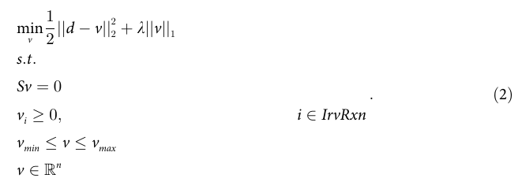
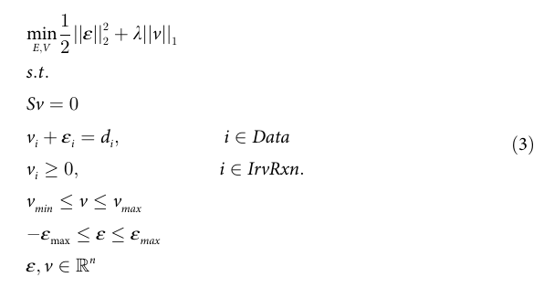
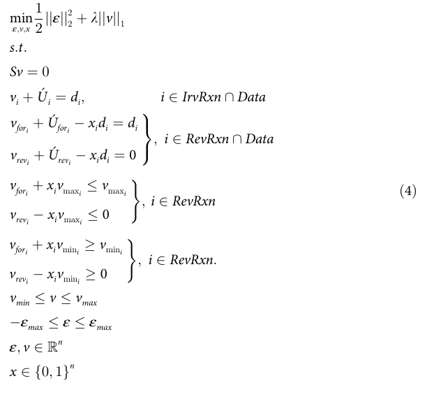
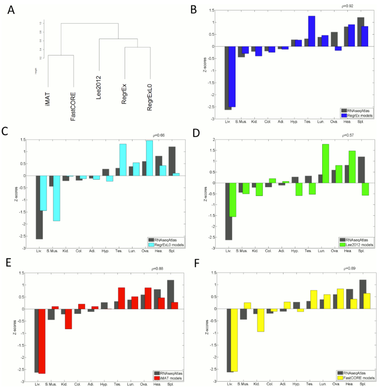
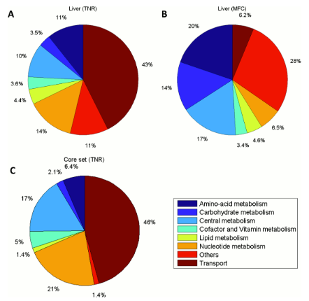
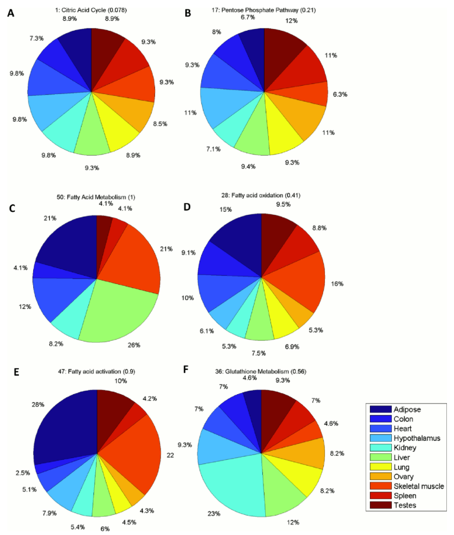
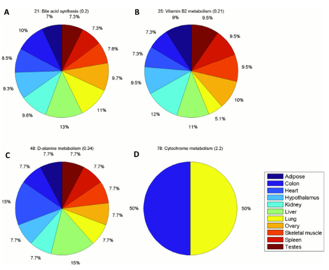

# Context-Specific Metabolic Model Extraction Based on Regularized Least Squares Optimization

## Abstract

Genome-scale metabolic models(게놈 규모 대사 모델)은 세포 생리학을 연구하는 데 매우 유용하게 사용되어 왔습니다. 최근의 발전은 보다 구체적인 시나리오(예: 세포 유형)에서 대사를 설명할 수 있는 문맥별 모델을 추출하는 방법을 개발한 것입니다. 그러나 기존의 계산 접근 방식 중 어느 것도 사용자가 정의한 매개 변수와 독립적으로 완전히 자동화된 모델 추출 및 유속 분포 결정을 허용하지 않습니다. 여기에서 우리는 RegrEx를 제시합니다. RegrEx는 문맥별 데이터만을 활용하며 ℓ1-노름 정규화에만 의존하여 문맥별 모델을 추출하고 해당 모델에 대한 데이터와의 상관 관계를 최대화하는 유속 분포를 제공하는 완전 자동화된 접근 방식입니다. 또한 RegrEx의 공개적으로 사용 가능한 구현은 공개적으로 사용 가능한 RNAseq 발현 프로파일, Recon1 및 최근의 인간 대사 모델 중 하나인 Recon2를 사용하여 11개의 문맥별 인간 모델을 추출하는 데 사용되었습니다. RegrEx와 경쟁 대안들의 성능 비교는 제안된 방법이 구조(즉, 포함된 반응)와 유속 분포 모두가 사용된 데이터와 일치하는 모델을 추출한다는 것을 보여줍니다. 이러한 결과는 문맥별 모델 추출에 사용되지 않은 추가 데이터를 사용하여 유효성 및 방법 성능 비교를 통해 지지됩니다. 따라서 우리의 연구는 대규모 대사 모델링에서 다른 정규화 기술의 응용을 위한 기초를 마련합니다.

## Introduction

세포 대사의 조사와 이해는 지난 20년 동안 고속 방법의 개발로 큰 전환을 겪었습니다. 이로 인해 고전적인 경로 중심적인 관점은 전체적으로 알려진 상호 연결된 생화학 반응 세트를 고려하는 네트워크 주도적인 관점에 양보하게 되었습니다. 이는 세 개의 생명 영역마다 조직된 생물의 게놈 규모 대사 모델(GEMs)의 생성으로 이어졌습니다. GEM은 생물에 대한 지식에 관한 조직화되고 포괄적인 시스템이며, 해당 화학 반응에 대한 계산적 기반을 제공하여 세포 대사에 관한 추론을 가능하게 합니다. 이러한 분석 결과는 대사에 대한 유용한 통찰력을 제공하며, 라벨링 연구에서의 유속 추정의 단점을 우회할 수 있습니다. 또한, 여러 가지 방법이 고속 데이터를 GEM에 통합하는 것을 용이하게 합니다. 이러한 방법의 장점은 유속 예측의 정확도를 향상시키고 부가적인 실험 데이터 분석을 위한 골조 네트워크를 제공한다는 데 있습니다.

그러나 생물의 모든 알려진 생화학 반응을 포함하는 대사 네트워크는 특정한 세포 시나리오에서 현실적이지 않을 수 있습니다. 외부 환경, 발달 단계, 다세포 생물의 세포 유형 또는 병리적 상태(예: 암)와 같은 상황에서 세포가 대사를 조절한다는 증거가 증가하고 있기 때문입니다. 이러한 다른 맥락에서는 일반적으로 일부 반응만 활성화됩니다. 따라서 세포 대사의 문맥별 모델을 재구성하는 방향으로의 전환은 더 정확하고 생물학적으로 의미 있는 통찰력을 제공하는 데 필수적이 되었습니다. 이는 다세포 생물의 생리학을 다룰 때 특히 중요하며, 조직 또는 세포별 대사를 더 잘 이해하는 데 그치지 않고, 여러 전문화된 모델이 상호 연결된 전체 생물/체의 대사 네트워크를 재구성하는 첫 번째 단계로 중요합니다.

이미 많은 방법이 문맥별 네트워크를 결정하는 데 제안되었으며 이미 [9]에서 철저히 검토되었습니다. 일반적으로 주어진 GEM에서 문맥별 모델을 추출하는 방법은 특정 문맥에서의 고속 데이터를 통합하여 해당 활성 반응 집합을 선택합니다. 이러한 방법은 기저 가정 및 수학적 공식에 따라 다르지만, 주로 세 가지 주요 그룹으로 분류할 수 있습니다.

세 번째 그룹은 MBA, mCADRE 및 FastCORE로 구성되어 있습니다. 이 그룹은 먼저 실험 데이터에 따라 주어진 문맥에서 활성화된 핵심 반응 세트를 정의하고, 그런 다음 모델 일관성 조건을 충족시키기 위해 필요한 핵심 외의 최소 반응 세트를 찾습니다(즉, 모델의 모든 반응이 적어도 하나의 허용된 안정 상태 분포에서 0이 아닌 플럭스를 운반할 수 있어야 합니다). 이전 두 그룹의 방법과 달리, 이 방법들은 단지 문맥별 모델을 추출하고 해당 유속 분포를 제공하지 않습니다. 다른 분류 기준에 따르면, 첫 번째 그룹은 최적화할 대사 기능의 정의에 따라 달라지기 때문에 바이어스된 방법(제한 기반 분석 내)에 속합니다. 반면에 두 번째와 세 번째 그룹은 대사 기능에 독립적이므로 편향되지 않은 방법으로 분류됩니다. 그러나 iMAT, MBA 및 FastCORE의 경우에는 여전히 우선적 반응 그룹(선택한 문맥에 대한)이 미리 정의되어 있어야 합니다. 편향되지 않은 방법의 선택은 특히 주어진 문맥에서 최적화할 대사 기능이 얻거나 정당화하기 어려운 경우에 중요합니다. 예를 들어, 이는 다세포 생물에서 여러 세포 유형이 존재하며 (협력하고/또는 경쟁하면서) 단일 일반 기능을 최적화하는 대신 다양한 특수화된 대사 기능을 수행하는 경우에 해당합니다.

그러나 이러한 방법 중 어느 것도 사전 지식 없이 문맥별 기능을 사용하지 않고 데이터 통합 과정에서 반응의 이진화나 사전 분류 없이 완전 자동화된 모델 추출 및 유속 예측을 허용하지 않습니다. 이는 많은 문맥별 모델이 추출되어야 하는 경우나, 상세한 생리학적 연구나 기존 데이터베이스에서 반응의 문맥별 특이성이나 대사 기능에 대한 정보가 없는 잘 알려지지 않은 생물에 대해 더 중요합니다. 여기에 우리는 RegrEx를 제시합니다. 이는 정규화된 최소 제곱 최적화에 기반한 방법으로, 이러한 문맥별 모델을 추출하고 유속 분포를 자동 및 편향되지 않은 방식으로 제공하는 역할을 수행합니다.

## Methods
### Background

정규화는 관찰로부터 고차원 함수(즉, 학습)를 모델링할 때 일반적으로 적용되며 모델 복잡성(즉, 모델에 포함된 변수의 수)을 줄이고 배경 잡음에 대한 과적합을 방지하는 수단으로 사용됩니다. 후자는 예측 성능과 모델 견고성을 상당히 향상시킴이 입증되었습니다. 다수의 정규화 방법이 이미 제안되어 왔으며, 이에는 Dantzig, Ridge 및 Elastic Net 선택자가 포함됩니다. 그러나 특정한 하나, 최소 절대 수축 및 선택 연산자인 LASSO는 n 개의 설명 변수와 m 개의 관측치가 있는 고차원 회귀 문제에서 매우 인기가 있습니다 ($n\gg m$). 이것은 주로 LASSO 선택자의 특징 선택에서(일반적으로 최소한의 설명 변수를 포함하는 희소 모델을 얻음) 더 나은 성능과 함께 연산이 용이한 연산자의 간결함 때문입니다.

LASSO 최적화 문제는 아래 Eq 1에 주어지며, 이 문제에서 response 벡터 $y^m$ 및 변수 $X^{mxn}$과 함께 일반 최소 제곱 회귀에 coefficients의 $ℓ_1$-norm이 가중치로 사용되어 최소화됩니다:

$$\text{min}_{\beta}\frac{1}{2}||y-X\beta||^{2}_{2}+\lambda||\beta||_1 \\
\beta \in \mathbb{R}^n$$

가중치 매개 변수인 λ는 일반적으로 교차 검증을 통해 결정됩니다. 이는 성능 측정(예: 평균 제곱 오차 또는 결정 계수)에 대한 가장 적합한 값을 데이터에 근거한 사용자 정의가 아닌 편향되지 않은 방식으로 찾는 방법을 제공합니다. LASSO의 일반화로 $ℓ_1$-norm을 이용한 정규화는 이미 대사 모델링에서 적용되었습니다. 예를 들어, 시계열 데이터로부터 생화학 네트워크를 재구성하는 데 사용되었으며, 더 계산 비용이 많이 드는 방법 대안으로 네트워크가 변이에 대해 적응하는 것을 연구하는 데 사용되었으며, 최근에는 문맥별 모델을 재구성하기 위한 기존 알고리즘 중 하나인 FastCORE에서 사용되었습니다.

### The RegrEx method

정규화된 문맥별 모델 추출 방법(RegrEx)은 실험 데이터 d(예: 유전자 발현 또는 단백질 수준 프로파일)와 가능한한 가까운 유속 분포 v(즉, 질량 균형, 열역학 및 용량 제약 조건을 만족하는)를 찾는 것을 목표로 합니다. 동시에, 주어진 문맥에 무관한 반응을 유도된 문맥에서 0으로 줄이면서 제외합니다. 이는 v와 d 간의 제곱 유클리드 거리(두 번째 norm)를 최소화함으로써 얻어지며, $ℓ_1$-norm 정규화가 특성 선택을 수행하는 능력을 활용합니다. 이는 셀러 제약 조건으로 보충된 Eq 1의 LASSO 수식과 유사한 최적화 문제를 유도하며, 다음과 같이 주어집니다:

RegrEx (Eq 2)를 기존의 수학적 프로그래밍 솔버에 구현하기 위해 우리는 제곱 프로그램으로 캐스팅합니다. 이는 에러 벡터의 제곱 노름을 최소화하며 ($\epsilon = d-v$), GPR 연관을 통해 데이터가 연관될 수 있는 반응의 하위 집합만을 고려합니다. 또한, 음의 값을 취할 수 있는 역반응을 다루기 위해 특별한 제약 조건을 도입해야 합니다. 이를 위해 역반응을 정반응과 역반응으로 나누어 순방향과 역방향의 차이로 순방향과 역방향을 나타냅니다. 또한, 특정 반응에 대해 순방향 또는 역방향을 선택하기 위해 바이너리 변수 x를 도입합니다. 이는 두 가지의 반응이 동일한 데이터 값으로 제한되어 네트 플럭스가 제로가 되는 문제를 피하기 위한 것입니다.

모든 것을 종합하면, 이것은 RegrEx 방법을 포착하는 혼합 정수 이차 프로그램(MIQP)인 Eq 4를 결과로 가져왔습니다. 여기서 역반응에 대한 순 플럭스의 부호(즉, 두 가지 불가역 반응의 주 방향)가 최적화 문제의 일부이며, 궁극적으로 데이터와의 유사성을 최대화하는 데 의존합니다.
위에서 언급한 바와 같이, 교차 검증은 회귀 문제에 대한 최적의 λ값을 결정하기 위한 표준적인 방법입니다. 그러나 이것은 특정한 특성을 가진 RegrEx에 대해서는 적절한 방법이 아닙니다. 왜냐하면 이 경우 관측값의 연속적인 샘플링은 원래의 대사 모델의 반응 중 일부만이 안정 상태에 있는 것을 의미하기 때문입니다. 이러한 이유로 우리는 λ 선택을 최적화하기 위해 알고리즘을 연속적인 λ값의 시퀀스에 대해 실행하고 플럭스와 데이터 간의 피어슨 곱 산술 상관관계가 가장 높은 값을 취하도록 했습니다. RegrEx는 먼저 λ 값의 굵은 시퀀스(λ 간격 0.1)에 대해 적용되었으며, 모든 반응이 0으로 줄어 들 때까지 수행되었습니다. 그런 다음 첫 번째 최적화에서 찾은 최대 상관관계 영역을 중심으로 미세한 λ 시퀀스(λ 간격 0.01)에 대해 두 번째 최적화가 수행되었습니다.

### RegrEx implementation

우리는 Gurobi 솔버 [30]를 사용하여 RegrEx의 MIQP를 해결했습니다. 최적화를 가속화하기 위해 계산 시간을 MIQP 당 60초로 제한했습니다. 추가로 강건성 분석에서는 더 높은 계산 시간이 성능의 증가에 낮은 영향을 미침을 나타냈습니다(시간 제한을 세 배로 증가시킨 경우, 즉 180초, 모델 간의 평균 상관 관계 증가량은 0.0004만 발생했습니다. 자세한 내용은 표 1 참조).
RegrEx는 MATLAB에서 구현되었으며, 코드는 S1 파일에서 제공됩니다. 구현은 최종 문맥별 모델을 COBRA 도구 상호 호환 형식 [31]으로 제공하므로 쉽게 후속 분석을 할 수 있습니다.

### Context-specific model extraction

**Table 1. Gurobi 솔버에 적용된 다른 시간 제한에 대한 결과 비교.** 조기 종료 기준(60초)에 대한 최적 솔루션의 민감도를 테스트하기 위해 네 가지 다른 시간 제한을 평가했습니다. 모든 경우에 대해 λ 값은 참조 최적값으로 고정되었습니다. 시간 제한이 60초인 경우에 얻은 값입니다. 11개의 문맥에 대한 평균값(괄호 안에 표준 편차)이 표시되어 있으며, 유속 값과 데이터 간의 상관 관계인 $\bar{\rho}$(V,D), 평균 잔차인 $\overline{R}$(V,D), 그리고 추출된 모델의 카디널리티, 즉 반응의 수인 $\overline{Card}$가 표시됩니다.

|      | 30s               | 60s               | 90s               | 180s              |
|--------------|-------------------|-------------------|-------------------|-------------------|
| $\bar{\rho}$(V,D)       | 0.4493 (.068)     | 0.4493 (.068)     | 0.4493 (.068)     | 0.4497 (.068)     |
| $\overline{R}$(V,D)       | 0.2845 (.081)     | 0.2845 (.081)     | 0.2845 (.081)     | 0.2844 (.081)     |
| $\overline{Card}$         | 856.55 (92.124)   | 856.27 (91.153)   | 855.45 (91.35)    | 856.55 (93.17)    |

RegrEx의 성능을 테스트하기 위해 케이스 스터디로 기존의 인간 대사 네트워크 재구성인 Recon 1 [32] 및 다른 알고리즘 [15,19,33]과 함께 사용된 Recon 2 [34]를 선택했습니다. 이 케이스 스터디를 통해 서로 다른 방법으로 추출된 모델을 직접 비교할 수 있습니다. 입력 데이터로는 RNAseq 인간 발현 프로파일을 사용했으며, 이는 RNAseq Atlas [35]에서 온라인으로 게시된 11가지 다른 문맥(즉, 장기 또는 조직)에 대한 것입니다. 차단된 반응을 피하기 위해 COBRA 도구상의 reduceModel 함수를 사용하여 표준 플럭스 변동성 분석을 통해 Recon 1의 일관된 부분(cRecon 1)을 먼저 추출했습니다. 발현 프로파일은 RNAseq Atlas의 RPKM (reads per kilobase per million mapped reads) 정규화로 제공됩니다.

발현 값의 범위는 유전자마다 일반적으로 다르며, 특히 RNAseq 기반 발현 데이터에서는 유전자간의 평균 값의 차이가 여러 단계로 나타날 수 있습니다. 이로 인해 RegrEx가 관련된 유전자의 평균 값이 높은 반응을 선호할 수 있으며, 결과적으로 편향된 방식으로 문맥별 모델을 재구성할 수 있습니다. 이러한 편향을 보정하기 위해 각 유전자 i의 문맥 j에서의 발현 값 t를 고려된 모든 문맥에서의 최대 값으로 정규화했습니다:

$$d_{i,j}=\frac{t_{i,j}}{\text{max}(t_{i,\forall j})} \\

i\in genes, j\in contexts$$

### Performance analysis with competing methods

COBRA 도구 상의 reduceModel 함수의 기존 iMAT 구현을 사용하여 iMAT 모델 추출을 수행했습니다. 누적 분포의 75번째 백분위수를 임계값으로 사용하여 유전자 발현 데이터를 이진화하여 높은 발현 및 낮은 발현 (반응에 연결된 유전자) 그룹을 생성했습니다. Lee2012로 표시된 모델 추출 접근 방식을 분석하는 데 사용된 [36]에서 제공된 구현을 사용했습니다. RNAseq Atlas에서는 분산 측정을 제공하지 않으므로 실험 오차를 보정하기 위한 가중치 계수를 사용하지 않았습니다. 또한, 공정한 비교를 위해 플럭스 값의 상한을 RegrEx와 같이 1로 설정했습니다. 특정 문맥에 대해 절대값이 10^-6보다 큰 반응은 활성으로 간주되었습니다. FastCORE의 경우, [37]에서 제공된 구현을 사용하여 관련 유전자의 발현 값이 75번째 백분위수를 초과하는 반응을 취하여 핵심 반응 세트를 얻었습니다. 따라서, iMAT에서 사용된 고발현 그룹과 동일한 세트를 사용합니다.
모델을 비교하여 생성된 유사성 행렬은 Jaccard 지수를 사용하여 다른 문맥에서 추출된 모델 및 다른 방법으로 추출된 동일한 문맥의 모델을 비교하는 데 사용되었습니다. 이 마지막 경우에는 R 환경의 stats 패키지의 hclust 함수를 사용하여 군집 덴드로그램을 생성하고 평균 연결 기준을 사용했습니다. 우리는 각 문맥의 Jaccard 유사성의 합을 나머지 문맥에 정규화했습니다 (즉, 거리 행렬의 각 열의 합). 따라서 해당 z 점수는 주어진 문맥이 나머지와 얼마나 다른지를 정량화합니다.

    Fig 1. 평가된 방법을 군집화한 덴드로그램과 문맥 간 차이를 정량화하는 데이터 및 모델 유도 z 점수의 비교입니다. (A) 덴드로그램은 다양한 방법 간에 모델이 가진 자카드 유사도에서 얻어집니다. 두 개의 주요 클러스터가 형성되는데, 한쪽에는 iMAT 및 FastCORE가 있고, 다른 쪽에는 Lee2012, RegrEx-λ0 및 RegrEx가 있습니다. 두 번째 클러스터에서 RegrEx와 RegrEx-λ0이 하위 클러스터를 형성합니다. (B-F) 데이터 및 모델 유도 z 점수가 각각 RegrEx, RegrEx-λ0, Lee2012, iMAT 및 FastCORE에 대해 비교됩니다. 두 시리즈 간의 상관 값은 각 경우 오른쪽 상단에 표시됩니다.

### Model agreement with human protein expression data

단백질 발현 프로파일은 인간 단백질 아틀라스 [38]에서 가져왔습니다. 여기서 11개의 문맥 중 10개가 나타납니다(항문을 제외하고, 따라서 평가에 포함시키지 않았습니다. 또한 지방 조직의 경우, 세포 유형인 지방세포의 데이터를 사용했습니다). 인간 단백질 아틀라스에서 단백질 발현 수준은 고, 중, 저로 분류되며 면역 조직 염색에 의해 유래됩니다. Recon 1은 Entrez 유전자 식별자를 사용하는 반면, 인간 단백질 아틀라스의 단백질 코딩 유전자는 Ensembl 표기법을 따릅니다. 따라서 Ensembl 식별자를 Recon 1에 매핑하기 위해 Ensembl의 BioMart 데이터 마이닝 도구를 사용했습니다.

## Results and Discussion
### Evaluation of RegrEx performance

우리는 사례 연구로, RegrEx를 적용하여 지방 조직, 대장, 심장, 하이포탈라무스, 신장, 간, 폐, 난소, 골격 근육, 비장 및 고환이라는 11가지 문맥별 인간 모델을 추출하고 해당 플럭스 분포를 얻었습니다. 시작점 GEM은 Recon 1 재구성 [32]이었으며, 일관된 부분으로 축소되었습니다 (즉, 어떤 현실적인 안정된 분포에서도 플럭스를 운반할 수 없는 차단된 반응이 제거되었습니다). 이 전처리는 GEM에 차단된 반응이 존재하는 경우 화합물의 불일치로 이어질 수 있기 때문에 RegrEx의 성능을 향상시킵니다. 우리는 문맥별 데이터로서 11개의 인간 조직의 RNAseq 발현 프로파일을 사용했습니다. 유전자 발현이 대사 플럭스 상태의 좋은 대리자가 아닐 수 있다는 것이 입증되었지만 [40,41], 여전히 대부분의 유전자에 대한 양적 데이터를 일반적으로 제공하여 커버리지와 품질 면에서 최상의 데이터 소스를 구성합니다.

우리는 문맥별 모델 추출 및 플럭스 예측을 위해 RegrEx의 성능을 다른 기존 방법과 비교했습니다. 즉, iMAT [14], Lee et al., 2012에서 제안된 방법(여기서 Lee2012라고 함) 및 RegrEx의 비정규화 버전(RegrEx-λ0)을 특별한 경우로 RegrEx 방법이 λ = 0으로 설정됩니다. 또한 FastCORE를 비교에 포함했지만, FastCORE는 문맥별 모델 (즉, 활성 반응 집합) 만 제공하므로 추출된 모델의 구조 수준에서만 비교에 포함했습니다. 각 경우에 우리는 Recon 1의 일관된 부분과 RNAseq Atlas의 동일한 유전자 발현 데이터를 사용하여 편향되지 않고 공정한 비교를 제공했습니다.

Lee2012는 원래 문맥별 모델을 추출하기 위해 개발되지 않았습니다. 그러나 RegrEx는 RNAseq 발현 프로파일과 플럭스 값 사이의 절대 거리를 최소화하여 플럭스 예측을 향상시키기 위해 Lee2012와 유사한 형태를 갖고 있습니다. 이러한 이유로 우리는 비교 분석에 Lee2012를 포함시켰습니다. 그러나 RegrEx는 정규화와 역반응 반응의 처리에 있어서 Lee2012와 다릅니다. Lee2012는 반복적인 접근 방식을 적용하는데, 최적화 문제가 먼저 반대로 작용할 수 있는 불가능한 반응의 하위 집합으로 시작하고, 이후 추가 최적화 문제를 풀어 순차적으로 역반응 반응을 추가합니다. 이 마지막 단계는 각 역반응 반응당 두 개의 최적화 문제를 포함하므로 시간이 많이 소요됩니다. 반면에 RegrEx는 이진 변수를 사용하여 한 번에 역반응 반응의 방향을 선택하므로 계산 시간이 줄어듭니다. 또한 RegrEx는 역반응 반응이 추가되는 순서에 대해 편향되지 않으며, 이는 Lee2012에서 해결되지 않은 단점입니다.

성능 분석은 두 부분으로 나뉘었습니다. 먼저, 모델을 추출하는 데 사용된 발현 데이터와의 유사성이 평가되었습니다. 이 평가에는 예측된 플럭스와 데이터 값 사이의 상관 관계 (FastCORE 제외) 및 각 문맥의 발현 데이터의 상관 관계 행렬과 추출된 모델의 자카드 거리 행렬 간의 일치 수준이 포함되었습니다 (두 모델 간의 거리를 활성 반응의 집합을 기준으로 정량화). 두 번째로, 추출된 모델의 독립적인 유효성 검사를 수행하여 인간 단백질 아틀라스 [38]에서 가져온 단백질 발현 데이터와의 일치 수준을 측정했습니다.

### Main characteristics of extracted models by the evaluated methods

**Table 2. 네 가지 평가된 경쟁 방법으로 추출된 모델들의 비교**: 다양한 맥락에서의 평균 값. 모델의 전반적인 특성은 자동 결정된 λ를 적용한 RegrEx, 정규화되지 않은 RegrEx-λ0, Lee2012, iMAT 및 FastCORE를 적용하여 도출되었습니다.
약어의 의미는 다음과 같습니다: Card는 평균 기수를 나타내며, OR은 평균 데이터 고아 비율을, r(V,D)는 데이터와 예측된 플럭스 값 간의 평균 상관 관계를, R(V,D)는 플럭스와 데이터 간의 평균 잔여 값을 나타냅니다. IJ는 다른 모든 맥락에 대한 평균 자카드 지수를, Shared는 모든 맥락 간에 공유되는 반응의 수를, Total Exclusive는 모든 맥락에 독점적으로 맥락 특정 반응의 총 수를 나타냅니다. 괄호 안의 값은 표준 편차에 해당합니다.

|    | Card      | $O_R$      | $\rho$(V,D)    | $R_{\text{(V,D)}}$    | $I_J$        | Shared | Total Exclusive | Total Card |
|----------|-----------|----------|-----------|-----------|-----------|--------|-----------------|------------|
| RegrEx   | 842.91(55.14) | 0.34(0.05) | 0.42(0.07) | 0.29(0.08) | 0.56(0.04) | 299    | 332             | 1618       |
| RegrExλ_0 | 1030.30(76.32) | 0.47(0.04) | 0.38(0.08) | 0.28(0.08) | 0.65(0.03) | 490    | 239             | 1711       |
| Lee2012  | 784.6 (26.53)  | 0.28(0.03) | 0.13(0.05) | -         | 0.77(0.01) | 509    | 140             | 1092       |
| FastCORE | 1357.9(39.03)  | 0.50(0.04) | -         | -         | 0.61(0.05) | 503    | 230             | 2232       |
| iMAT     | 1411(41.62)    | 0.42(0.04) | -0.17(0.03)| -         | 0.65(0.04) | 611    | 210             | 2205       |

각 방법에 의해 추출된 모델의 일반적인 특성은 Table 2에 요약되어 있으며, S1 테이블에 상세히 기록되어 있습니다. 기본 세트 크기 측면에서는 Lee2012가 가장 낮은 평균 기본 세트 크기를 생성합니다(평균적으로 모델 당 약 785개의 반응). 그 뒤를 이어 RegrEx와 RegrEx-λ0가 따르며(평균적으로 각각 약 843개 및 1030개의 반응이 포함됨), 이에 반해 FastCORE와 iMAT는 해당 문맥에 대해 현저히 큰 모델을 생성합니다(평균적으로 각각 약 1358개 및 1411개의 반응이 포함됨). 특정 방법에 의해 추출된 각 문맥별 모델 세트에는 모든 문맥에서 공유되는 코어 반응 세트가 있습니다. 또한 각 문맥에는 독점적인 반응 세트가 있습니다(즉, 해당 문맥에서만 존재하는 반응). 이런 의미에서 RegrEx로 추출된 모델은 가장 작은 공유 반응 세트를 가지고 있으며(299개의 반응) 전체적으로 독점적인 반응 수가 가장 큽니다(즉, 모든 문맥에서 독점적인 반응), 332개의 반응이 있습니다. 이 두 가지 특성은 RegrEx로 추출된 모델이 다른 방법으로 추출된 모델보다 실제로 문맥 특정적임을 보여주며, 이는 모델 간 평균 자카드 유사도로 확인됩니다. 자카드 유사도는 RegrEx의 경우 가장 낮으며(IJRegrEx = 0.56, 표준 편차 σIJRegrEx = 0.04), 이전 주장을 지원합니다. 반면에 Lee2012는 평균적으로 가장 큰 코어 세트를 생성합니다. 509개의 공유 반응을 가지며, 총 독점적 반응 수는 140개입니다. 이로 인해 Lee2012 모델은 가장 문맥 특정적이지 않습니다(IJLee2012 = 0.77, 표준 편차 σILee2012 = 0.01). 

문맥 특정 모델을 추출할 때 일반적으로 원래(문맥이 명시되지 않은) GEM의 일부 반응의 플럭스는 데이터에 의해 제한되지 않을 수 있습니다. 이는 GPR 규칙이 없거나(반응이 효소로 촉매되지 않거나 유전자-단백질 연관이 주석되지 않은 경우) 해당 반응에 대한 실험 데이터가 없는 경우가 될 수 있습니다. 어느 경우에든지 연관된 데이터가없는 포함된 반응의 수를 최소화하는 것이 흥미로울 수 있습니다. 여기서는 추출된 각 모델의 데이터 고아 비율(즉, 연관된 및 연관되지 않은 실험 데이터와 포함된 반응 수 간의 비율)을 계산하여 해당 속성을 평가했습니다. RegrEx로 추출된 모델은 모든 방법 중에서 가장 낮은 평균 데이터 고아 비율을 보여줍니다(ORRegrEx = 0.34, 표준 편차 σRegrEx = 0.05), 이는 Lee2012에 뒤이어 두 번째로 낮습니다(ORLee2012 = 0.28, 표준 편차 σLee2012 = 0.03), 특이하게도 이는 정규화된 추출을 사용할 때만 유효합니다. RegrEx-λ0의 경우 데이터 고아 비율이 FastCORE에 뒤이어 두 번째로 나쁜 위치를 차지하며, 평균 고아 비율은 각각 0.47 및 0.50입니다. 줄어든 데이터 고아 비율은 RegrEx가 Lee2012에 비해 뒤쳐지지만, 여전히 데이터 고아(불확실) 반응의 수가 최소화된 조밀한 모델을 추출할 수 있음을 나타냅니다.

Recon 1에 나타난 반응 집합을 통해, 총 기수라고 불리는 모든 맥락에서의 반응을 고려할 때, RegrEx 모델은 총 2469개의 반응 중에서 고유한 1618개의 반응을 모았습니다. 따라서, RegrEx 모델은 1092개의 총 고유 반응을 보유한 Lee2012 모델과 2205개 및 2232개의 총 반응을 갖는 iMAT 및 FastCORE 모델 사이에서 중간 위치에 있습니다. 총 기수 및 평균 기수 간의 차이는 평가된 방법들이 취하는 두 가지 주요 목표에 의해 설명될 수 있습니다. 즉, 데이터와 플럭스 값 간의 거리를 최소화하는 것이 Lee2012 및 RegrEx(-λ0)의 경우와 같은 목표이거나, FastCORE 및 iMAT에서처럼 특정 맥락을 위해 미리 정의된 핵심 집합의 전체 또는 대다수를 포함하는 것입니다. 이 두 방법은 여기에서 동일하게 적용되었습니다(방법 섹션 참조).

실제로, 같은 맥락에서 다른 방법에 의해 추출된 모델 간의 유사성을 비교할 때, 결과는 모든 맥락에서 유사했습니다. iMAT 및 FastCORE에서 파생된 모델들은 높은 자카드 유사성 지수(맥락별 평균값, IJiMAT/FastCORE = 0.81, 표준편차 σIJiMAT/FastCORE = 0.02)에 따라 많은 반응을 공유하고 있으며, 따라서 Fig 1의 해당 덴드로그램에서 함께 그룹화됩니다. 반면에, RegrEx, RegrEx-λ0 및 Lee2012는 다른 클러스터를 형성하며, RegrEx 및 RegrEx-λ0에 의해 추출된 모델이 함께 그룹화되며, Lee2012에 의해 추출된 모델은 RegrEx-λ0에 더 가깝습니다.

### Similarity to data evaluation

데이터 값과 예측된 플럭스 간의 상관 관계를 검토할 때, RegrEx가 첫 번째 위치를 차지했습니다(평균 상관 관계, rRegrEx = 0.42, σρRegrEx = 0.07), 다음으로 RegrEx-λ0 및 Lee2012 (각각 평균 상관 관계 0.38 및 0.13)이 따랐습니다. 또한, iMAT은 평균 상관 관계 값이 -0.17로 가장 낮았습니다(FastCORE는 이전에 언급한대로 플럭스 값을 제공하지 않으므로 이 기준에 대해 평가되지 않았습니다). 그러나 이러한 상관 관계의 차이는 iMAT가 따르는 다른 접근 방식에 의해 설명될 수 있습니다. 이 경우에는 방법이 데이터와 플럭스 값 사이의 거리를 최소화하려고 하지 않기 때문입니다.

비교 분석에서 FastCORE를 포함하기 위해 다른 방법으로 데이터와의 유사성을 검토했습니다: 플럭스 값을 고려하는 대신, 이제 각 맥락별로 활성 반응의 집합을 비교했습니다. 이 기준은 추출된 대사 네트워크의 구조적 측면을 포착합니다. 다른 맥락에서 활성 반응 집합을 사용하여 Jaccard 지수를 사용하여 유사성 행렬을 계산했고, 이를 Rv 계수를 사용하여 모든 맥락의 유전자 발현 값에 대응되는 상관 관계 행렬과 비교했습니다. 이 두 행렬 간의 합의 수준은 실제로 RegrEx, iMAT 및 FastCORE에 대해 매우 높았으며, 이를 지지하는 Rv 계수 값이 각각 0.9, 0.92 및 0.93였습니다. 합의 수준은 RegrEx-λ0 (Rv = 0.76) 및 Lee2012 (Rv = 0.69)의 경우에는 현저하게 낮았습니다. 이 결과는 두 가지 주장을 뒷받침합니다: 첫째, FastCORE는 플럭스를 제공하지 않고 iMAT은 플럭스와 데이터 값 간의 상관 관계가 매우 낮지만, 여전히 표현 데이터에 수집된 맥락 간의 일반적인 차이를 포착할 수 있습니다. 둘째, RegrEx도 이 차이를 포착할 수 있지만 추출된 모델당 평균 기수가 낮습니다. 다시 말해, 평균적으로 더 적은 반응으로도 RegrEx에 의해 추출된 모델은 여전히 유전자 발현 데이터에 포함된 주요 활성 반응의 주요 차이를 포착할 수 있습니다. 이 사실은 실험적 관측에서 모델을 학습할 때 규제를 고려하는 것이 목적을 잘 요약합니다: 관측치를 설명하는 데 중요하지 않은 변수(즉, 반응)를 제거합니다.

이전에 보고된 Rv 계수 값은 유사성 및 상관 관계 행렬 간의 전반적인 합의를 측정합니다. 다음으로이 결과를 각 다른 맥락에 대해 분해했습니다. 이를 위해 두 행렬의 z-점수를 계산했습니다(세부 사항은 방법을 참조하십시오). 이런 의미에서, RegrEx는 유전자 발현의 패턴을 포착하는 데 iMAT 및 FastCORE보다 더 잘 수행되었으며, 추출된 모델의 z-점수 값과 데이터의 z-점수 값 간의 상관 관계 값이 0.92인 반면, iMAT 및 FastCORE는 각각 0.88 및 0.89의 값을 가졌습니다. 이러한 상관 관계의 개선은 RegrEx의 데이터 z-점수 값의 부호와 추출된 모델의 부호 간의 불일치 수에 통해 더 잘 확인됩니다. 구체적으로, RegrEx는 평균 유사성보다 ovary 모델의 경우만 실패하고 있으며, 해당 표현 데이터가 평균을 넘어 있기 때문에 부정적인 z-점수를 가지고 있습니다. 그러나 iMAT 및 FastCORE는 세 가지 불일치(피부근, 신장 및 대장에 대한 FastCORE와 피부근, 지방 조직 및 사상체에 대한 FastCORE)를 저질렀습니다. 기대와 같이 RegrEx-λ0 및 Lee2012의 성능은 다른 방법보다 다시 나쁘며 상관 관계 값은 각각 0.66 및 0.57입니다. 흥미롭게도, 간은 활성 반응 측면에서 가장 다른 맥락으로 보이며, 이는 모든 방법에서 포착되었습니다(RegrEx-λ0는 제외). 이는 간이 대사 능력이 더 뛰어난 장기로 잘 알려져 있기 때문에 놀라운 일이 아닙니다.

이 섹션을 마무리하며, 레그렉스의 성능을 규제되지 않은 버전인 레그렉스-λ0와 비교하는 것이 주목할 만합니다. 두 접근 방식의 유일한 차이점은 규제의 적용 및 최적의 λ값을 결정하기 위한 최적화 단계의 포함입니다. 정확히 말하면 규제를 고려하면 레그렉스는 산출된 모델을 더 간결하게 추출할 수 있을 뿐 아니라 데이터와 플럭스 값 간의 상관 관계를 높이고 데이터-고아 비율을 줄이며 다른 맥락의 대사 상태에 대한 일반적인 유사성과 차이를 크게 향상시킵니다. RV 계수 및 z-점수 값으로 나타냅니다.

### Models evaluation by human protein profiles

**Table 3. 각 추출된 모델이 인간 단백질 데이터베이스와 얼마나 일치하는지에 대한 비교**. 각 Mann-Whitman-Wilconxon 테스트의 p-값(대안 가설 H>M, M>L 및 H>L)이 여기에 수집되어 있습니다. 귀무 가설을 기각하는 데 0.05의 유의 수준이 사용되었습니다(p-값 < 0.05는 굵게 표시됨).

| Method    | H>M    | M>L    | H>L    |
|-----------|--------|--------|--------|
| RegrEx    | 0.0445 | 0.0262 | 0.0034 |
| RegrExL0  | 0.0045 | 0.1763 | 0.0006 |
| iMAT      | 0.1399 | 0.0444 | 0.0319 |
| Lee2012   | 0.3421 | 0.4559 | 0.2179 |
| FastCORE  | 0.0525 | 0.1575 | 0.0216 |

우리는 모든 평가된 방법으로 추출된 모델의 생물학적 신뢰성에 대한 독립적인 테스트를 수행했습니다. 이를 위해 Human Protein Atlas [38]에서 가져온 단백질 발현 프로파일과 각 모델의 합의 수준을 비교했습니다(이 데이터베이스에는 hypothalamus가 누락되어 있어 비교에서 제외해야 했습니다. 방법 참조). 단백질 발현 데이터는 반정량적이며, 즉, 고, 중, 저 세 가지 범주적 수준만 제공합니다. 이를 고려하기 위해 모델이 해당 기관/조직에 대한 단백질을 코딩하는 유전자 그룹이 다른 두 범주와 비교하여 고 표현 카테고리에 풍부하게 포함되어 있는지, 그리고 중 표현 값을 포함하는 유전자가 낮은 표현 유전자와 비교하여 풍부하게 포함되어 있는지를 평가했습니다.

이 가설을 검정하기 위해 각 맥락에서 각 그룹의 유전자 수, 즉 모든 기관/조직에 대한 고, 중 및 저 유전자 수를 결정하고, 이러한 분포에 대해 Mann-Whitman-Wilconxon 검정을 적용하여 그 차이의 통계적 유의성을 결정했습니다. 이 검정은 각 평가된 방법에 대해 적용되었습니다. Table 3에서 관찰할 수 있듯이, RegrEx 추출된 모델은 모두 0.05의 유의 수준 아래인 모든 세 가지 비교의 p-값인 고 그룹의 유전자 수가 중 그룹보다 큼, H>M, 중 그룹이 저보다 더 많음, M>L 및 고가 저보다 더 많음, H>L에서 신뢰 임계값 아래로 유의하게 풍부합니다. RegrEx-λ0 및 iMAT의 경우, 두 가지 비교 중 하나만 유의미하며, 각각 H>M 및 H>L입니다. FastCORE의 경우, 모델은 저보다 고 표현 유전자가 풍부하며 Lee2012의 경우, 비교 중 하나도 유의하지 않습니다. 이러한 결과는 레그렉스에 의해 추출된 모델이 다음 두 가지 주요 이유로 추가적인 실험적 지원을 제공하며, 근소한 범위로는 RegrEx-λ0, iMAT 및 FastCORE에 의한 모델도 마찬가지입니다. 추가 실험 데이터는 추출 중에 사용된 데이터와는 다른 (독립적인) 데이터베이스에서 나옵니다. 또한, 대사 플럭스를 제어하는 인과적 연쇄의 하위 수준에 의존하며, 즉 유전자 발현 대신 단백질 발현에 기초합니다.

### Functional analysis of RegrEx extracted models

RegrEx 추출된 모델을 평가하는 다음 단계는 각 맥락에서 중요한 대사 기능을 결정하기 위해 기능 분석을 수행하는 것이었습니다. 이를 위해 모델의 모든 반응의 플럭스 용량을 계산했습니다. 이는 Flux Variability Analysis [42]에서 얻은 해당 반응의 최대 및 최소 플럭스 값 간의 차이에 의해 결정되었습니다(이 경우 최대 플럭스 콘에 대한 경계 조건과 열역학적 제약을 준수하기 위한 임의의 상한 및 하한 값만 제한으로 설정되었습니다). 여기서 정의된 플럭스 용량 값은 해당 반응이 주어진 네트워크에서 취할 수 있는 플럭스 값의 이론적 범위만을 측정합니다. 따라서 특정 대사 시나리오에서 반응의 실제 플럭스 범위가 이론적인 것과 일치할 필요는 없습니다. 그러나 반응의 플럭스 용량은 추출된 대사 네트워크의 위상에 따라 달라지므로 특정 맥락에서 어떤 반응이 우선되는지를 평가하는 신뢰할 수 있는 대리자입니다. 대안적으로, 네트워크 간의 차이에 영향을 받지 않는 반응(다양한 맥락에서 공유되는 핵심 반응 세트에 속하는 강건한 반응)을 평가하는 것도 가능합니다.

분석을 용이하게 하기 위해 우리는 부분 시스템을 8가지 넓은 대사 범주로 그룹화했습니다: 중심 대사, 아미노산 대사, 탄수화물 대사, 보조 요소 및 비타민 대사, 지질 대사, 뉴클레오타이드 대사, 수송 및 기타(참조: S2 테이블). 또한 Recon 1의 각 대사 부분 및 각 이전에 정의된 대사 범주의 반응의 플럭스 용량을 평균하여 각 부분 시스템 또는 범주당 평균 플럭스 용량(MFC)을 얻었습니다. 또한 각 범주의 총 반응 수(TNR)를 계산하여 추출된 네트워크에서의 대사적 중요성을 대안적으로 측정했습니다.

각 대사 범주 당 반응 수를 세는 결과와 플럭스 용량을 평균하는 결과를 비교할 때 뚜렷한 차이가 나타났습니다. 예를 들어, 모든 추출된 모델(모든 방법을 사용하여)에서 반응 수가 가장 많은 범주는 수송이었습니다. 그러나 MFC를 살펴보면 수송은 일반적으로 겸손한 위치를 차지했으며, 종합적인 대사 범주 중에서 가장 높은 MFC를 가진 기타 범주와 자주 비교됩니다. 구체적으로 간에서 약 43%의 반응이 수송에 할당되는 반면, 수송은 추출된 모델의 총 MFC에 6.2%만 기여합니다. 마찬가지로, 뉴클레오타이드 대사는 총 반응 수의 14%에 해당하면서도 간의 총 MFC에는 6.5%만 기여합니다. 반면, 아미노산 및 탄수화물 대사와 같이 반응 수가 적은 시스템(각각 11% 및 3.5%)은 총 MFC에 더 많이 기여합니다(각각 20% 및 14%). 완전한 비교를 위해 각 맥락에 대한 Fig 2 및 S1 Fig를 참조하세요.

    Fig 2. RegrEx로 추출된 11개 모델의 공유 반응의 핵심 세트 및 간 모델에 표시된 대사 범주의 선택적 비교를 보여주는 파이 차트입니다. (A) 간 모델의 대사 범주당 총 반응 수(TNR) 분포(모든 범주에 걸쳐 총 821개의 반응 포함). (B) 간 모델에서 각 대사 범주의 평균 플럭스 용량(MFC) 값 분포, 본문에서 설명한대로, A에 표시된 분포와는 다른 차이점이 나타납니다. (C) 대사 범주별로 분할된 공유 반응의 핵심 세트의 반응 내용(TNR), 본문에서 설명한대로, 수송, 중심 및 뉴클레오타이드 대사가 세 가지 우세한 범주입니다. 대사 범주 이름은 색상 막대 범례에 표시됩니다.

이전에 언급했듯이, 모든 맥락별 모델은 RegrEx 추출 모델의 경우 핵심 세트인 299개의 반응을 공유합니다. 각 대사 범주별 TNR을 고려하면 Fig 2에 표시된 것과 같은 분포를 얻을 수 있습니다. 핵심은 수송 반응(46%)이 우세하며, 이를 뉴클레오타이드 대사(21%)와 중심 대사(17%)가 이어 따르며, 나머지 범주는 상대적으로 적은 범위로 나타납니다. 또한 핵심의 각 개별 반응에 대한 MFC를 계산할 때, 실제로 대부분(80%)이 사실상 견고한 반응임을 알 수 있습니다. 이는 플럭스 용량이 맥락을 초과하여 유지되는 것을 의미합니다. 그러나 핵심의 미비한 부분(나머지 20%)은 비견고 반응으로 구성됩니다. 이는 모든 맥락에서 공유되지만 변동하는 플럭스 용량을 나타내는 반응입니다. 이 그룹에는 최고의 변동 계수(CV) 값인 0.49의 슈퍼옥사이드 디스뮤타제(ROS 디톡시피케이션)와 같은 반응들이 포함됩니다. 흥미롭게도, 핵심에 존재하는 펜토스 인산 경로에 속하는 모든 반응도 여기에 속합니다.

이러한 관찰은 핵심의 모든 반응이 유사한 방식으로 작용하는 것이 아니라는 것을 보여줍니다. 반대로, 이것을 맥락의 변형에 독립적인 반응의 하위 집합과 맥락에 따라 더 많거나 덜 두드러지는 반응의 하위 집합으로 분할할 수 있습니다.

RegrEx 추출 모델의 기능적 타당성을 더 평가하기 위해 이전에 계산된 MFC를 사용하여 각 맥락에서 특정 하위 시스템의 중요성을 조사했습니다. 또한 각 하위 시스템의 MFC 값 분포의 변동 계수(CV)에 따라 하위 시스템을 순위로 나열했습니다. 이는 CV가 낮은 하위 시스템이 다양한 맥락에 균등하게 나타나는 반면, CV가 증가함에 따라 이러한 하위 시스템이 특정 맥락에 더 많이 나타나는 경향이 있음을 의미합니다. 예를 들어, 중심 대사에 속하는 모든 하위 시스템이 모든 세포 유형에서 중요한 역할을 하기 때문에 예상대로 중심 대사의 서브시스템이 순위에서 최상위를 차지합니다. 시트르산 회로는 CV 값이 0.078인 순위에서 첫 번째입니다. 반면 펜토스 인산 경로는 CV 값이 0.21인 순위에서 중심 대사에서 가장 높은 CV 값을 가진 하위 시스템입니다. 그러나 이것은 전체 순위에 대한 맥락에서는 낮은 것으로 간주될 수 있으며, 핵심의 나머지 하위 시스템과 달리 핵심의 모든 반응이 비견고하다는 사실로 설명할 수 있습니다. Fig 3을 참고하세요. 이러한 하위 시스템 외에도 상위 순위에 있는 기타 근본적인 경로들도 NAD, 엽산 및 비타민 A 대사(모두 비타민 및 비타민 대사 범주), 세포 외 및 미토콘드리아 수송 또는 뉴클레오타이드 대사를 포함합니다. 흥미로운 점은 마지막 세 가지 하위 시스템이 이전에 정의된 견고한 반응의 수가 가장 많은 것입니다.

    Fig 3. 선택된 Recon 1 하위 시스템을 파이 차트 형식으로 보여주는 그림으로, 여러 문맥에서의 평균 플럭스 용량(MFC) 값의 분포를 보여줍니다. 패널 A-B는 중심 대사에서 CV 관점에서 두 가지 극단적인 대사 하위 시스템을 나타냅니다. 시트르산 회로 (A)는 가장 낮은 CV 값을 보입니다(중심 대사 및 Recon 1 하위 시스템 전체에서도). 인과 페이트웨이 (B)는 중심 대사에서 가장 높은 CV 값을 보입니다. (C-E)는 지방 대사에 대한 MFC 값의 분포를 보여줍니다 (C), 이것은 주로 간, 지방 조직 및 스켈레톤 근육에서 표현됩니다. 지방산 산화 (D) 및 지방산 활성화 (E)는 주로 지방 조직 및 스켈레톤 근육에서 주로 나타납니다. (F) 문맥 별로 MFC 분포가 그림에 나타나며, 여기서 이 하위 시스템은 문맥에서 가장 높은 MFC 값을 얻습니다. 전체 MFC 값의 23%를 구성합니다. 자세한 내용은 본문을 참조하십시오. 모든 경우에 하위 시스템 이름 앞에 오는 첫 번째 숫자는 CV 값으로 생성된 순위에서 해당합니다. 문맥 이름은 색상 막대기 범례에 표시됩니다.

지방 대사는 다양한 맥락에서 중간 수준의 전문화를 나타내며 순위에서 중간 위치를 차지합니다. 따라서 이 결과는 지방 대사가 우세한 일부 조직이 있다는 것을 의미합니다. 예를 들어, 지방산 대사는 지방 조직, 간 및 골격 근육에서 우세합니다. 또한, 지방산 산화 및 지방산 활성화는 지방 조직 및 골격 근육에서 주로 발생합니다. 이는 이러한 맥락의 알려진 기능과 일치합니다. 지방 조직과 간은 지방산 대사의 주요 위치이며, 지방산 산화는 산화 근육 수축에 필요한 에너지 공급을 제공합니다. 또한 CV가 0.6인 글루타티온 대사(기타 범주에 할당됨)가 중간 위치에 있으며, 이것은 신장에서 각이로 강조됩니다. 이러한 마지막 특징은 추출된 모델의 유효성을 확인하는 데도 기여합니다. 글루타티온 대사가 신장에서 적절한 기능을 수행하는 데 필수적임이 잘 알려져 있기 때문입니다. 마지막으로, 마지막 위치는 주로 비타민 및 비타민 대사 및 기타 잡다한 범주 "기타"로 구성됩니다. 예를 들어 케라틴 황화물 분해, 헤메 생합성 및 분해 또는 담즙산 생합성 등입니다.

가장 큰 CV 값을 가진 하위 시스템에는 극단적인 행동을 나타내는 하위 시스템이 포함됩니다. 즉, 이러한 하위 시스템은 단일 맥락에서만 활성화될 것으로 예측됩니다. 이 범주에는 담즙산 생합성, 비오틴, 리보플라빈, 비타민 B6, 비타민 D, CYP, 메티오닌 및 D-알라닌 대사 등이 포함됩니다. 이러한 행동을 설명할 수 있는 것은 각 하위 시스템의 반응과 관련된 원래 유전자 발현 값에 반영됩니다. 예를 들어 담즙산 생합성의 경우, 맥락별 하위 시스템의 총 발현 값 분포를 살펴보면 간이 극단적인 값을 가집니다(z-score = 2.9). 이 사용된 데이터의 특성이 이 현상을 설명하는 데 충분한지 또는 Recon 1의 네트워크 토폴로지가 이 관찰에 기여하는지를 확인하고자 합니다. 후자의 경우, 다른 맥락에서 담즙산 생합성 반응을 포함하면서도 형상이 안정 상태 조건을 충족하는 데 중요한 반응이 Recon 1에 부족할 수 있습니다. 이 가설을 테스트하기 위해, 용량 확장된 Recon 1 모델의 최신 확장 버전인 Recon 2에 RegrEx를 적용했습니다(즉, Recon 1의 2469개의 반응 대비 Recon 2의 5317개의 반응, 모두 차단된 반응을 제거한 후). 맥락별 모델을 추출한 후, 각 하위 시스템의 MFC 값의 CV 값을 기준으로 순위를 매겼습니다. 그 결과, 이러한 하위 시스템의 대부분이 이제 둘 이상의 맥락에서 나타나는 것으로 나타났습니다. 예를 들어 담즙산 생합성(Recon 2에서 담즙산 합성이라고 함)은 모든 맥락에서 존재하지만 간에서 최대 MFC 값을 가집니다. Fig 4를 참조하세요.

    Fig 4. 선택된 서브시스템의 Recon 2에서의 다양한 맥락에 걸친 MFC 값 분포입니다. 담즙산 합성 (A), 비타민 B2 대사 (B, Recon 1에서 리보플라빈 대사와 동등함) 및 D-알라닌 대사 (C)는 Recon 2의 모든 맥락에서 나타납니다. 사이토크롬 대사 (D, Recon 1에서 CYP와 동등함)는 Recon 2에서는 폐 및 대장 두 가지 맥락에서만 나타납니다. 모든 경우에 서브시스템 이름 앞에 오는 첫 번째 숫자는 CV 값에 따라 생성된 순위표에서 해당합니다. 맥락 이름은 옆에 있는 색상 막대에 표시됩니다. 자세한 내용은 본문을 참조하십시오.

### Computation time comparison

**Table 4. Computation time of the evaluated methods.** Mean computation times per model extraction, type of mathematical program solved and the used
commercial solver are displayed for each evaluated method.
| Method    | Formulation | Solver | Mean Time ± SEM |
|-----------|-------------|--------|-----------------|
| iMAT      | MILP        | Gurobi | 0.1652 ± 0.0038 |
| FastCORE  | LP          | CPLEX  | 0.2976 ± 0.0101 |
| RegrEx-λ0 | MIQP        | Gurobi | 60.0785 ± 0.0025 |
| Lee2012   | LP          | Gurobi | 571.2108 ± 24.8921 |
| RegrEx    | MIQP        | Gurobi | 928.5313 ± 2.3079 |

RegrEx의 컴퓨터 성능도 평가되었으며 다른 방법들과 비교되었습니다. FastCORE를 제외한 모든 경우에 Gurobi [30] 솔버를 사용했습니다. FastCORE에서는 Gurobi 대신 CPLEX [45]를 사용했습니다. 이는 CPLEX가 [37]에서 제공된 코드의 기본 솔버이며, FastCORE에서 LP 문제를 해결할 때 Gurobi와 CPLEX 간의 계산 시간 차이가 무시할 만큼 미미하다고 믿기 때문입니다.

표 4는 평가된 방법들의 계산 시간 및 문제 정의의 차이를 요약합니다. 특히, iMAT은 모델 추출 당 평균 0.16초로 매우 좋은 계산 시간을 보입니다(iMAT을 사용할 때 GLPK를 솔버로 사용하는 경우, 평균 네트워크 추출 시간은 일반적으로 1분 이상으로 변경됩니다). 이 계산 시간은 FastCORE에서 얻은 계산 시간과 비교할 만합니다. Lee2012는 추출 당 약 10분의 계산 시간을 보입니다(Lee2012를 사용할 때 GLPK를 솔버로 사용하는 경우, 컨텍스트 당 계산 시간이 몇 시간에 달할 수 있습니다). RegrEx가 고정된 λ-값으로 평가될 때(즉, RegrEx-λ0), 계산 시간은 모델 추출 당 약 60초로 고정됩니다. 이는 메소드에서 논의된 것처럼 Gurobi 솔버에 부과된 시간 제한 제약 때문입니다. 시간 제한이 부과되지 않으면 RegrEx가 평가된 방법들 중에서 최악의 위치를 차지합니다. 이는 Recon 1과 같은 대규모 네트워크에서 MIQP를 해결하는 복잡성에 기인할 수 있습니다. 그러나 시간 제한 감도 분석에 따르면 시간 제한을 늘림으로써 얻는 개선이 추가 시간을 소비할 가치가 없을 수 있으며, 비슷한 결과를 얻기 위해 30초로 줄일 수도 있습니다(메소드의 표 1 참조).

마지막으로, RegrEx의 경우 전체 계산 시간은 최적의 λ-값을 찾아내는 최적화 단계에서 평가된 λ-값의 수에 따라 달라집니다. 예를 들어, 이 경우에는 최적화에 15개의 λ-값 시퀀스를 사용하기 때문에 모델 추출 당 평균 계산 시간은 약 15분입니다. RegrEx가 필요로 하는 이러한 더 큰 계산 시간은 추출 중에 정규화를 제어하기 위한 최적의 λ-값을 찾아야 한다는 필요성에 기인합니다. 그러나 RegrEx에 의해 소요된 총 계산 시간은 여전히 합리적인 범위 내에 있으며 결과에서 확인된 바와 같이 정규화를 포함하는 것이 전반적인 성능을 향상시키는 데 필수적입니다.

## Conclusion

우리는 RegrEx를 소개했습니다. 이는 문맥별 대사 모델을 추출하고 실험 데이터와 가장 일치하는 플럭스 분포를 제공합니다. RegrEx는 경쟁하는 다른 방법들 중에서 가장 높은 상관관계 값을 가진 문맥별 플럭스 분포를 생성했으며, 반응들의 더 작은 모델을 추출했습니다. 중요한 점은 정규화를 적용하지 않고 문맥별 추출을 수행할 때(즉, λ = 0일 때, 여기서는 RegrEx-λ0로 부릅니다), RegrEx의 성능이 심각하게 저하됩니다. 더 구체적으로, 정규화를 사용하지 않고 얻은 모델은 각 특정 문맥에 덜 특정되며, 더 많은 반응을 공유하고 다른 문맥의 모델에 비해 덜 독점적인 반응을 포함합니다. 이는 비교된 모든 문맥별 모델 쌍에 대한 평균 자카드 지수가 더 높음을 지원합니다. 또한, 정규화되지 않은 추출에서 평균 고아 비율이 더 높으며, 이는 연구 결과로 예측된 플럭스와 데이터 간의 평균 상관관계 값도 작습니다. 이 모든 관측 결과는 문맥별 모델 추출에서 성능을 향상시키기 위해 정규화를 포함하는 중요성을 뒷받침합니다.

RegrEx는 여기에서 평가된 대안들 중에서 적절한 방법임이 입증되었습니다. 예측된 플럭스와 실험 데이터 간의 상관관계를 더 크게 제공하는 것뿐만 아니라, 데이터가 표현하는 다양한 맥락 간의 반응 활동의 일반적인 패턴을 포착하는 모델을 제공합니다. RegrEx에 의해 추출된 모델은 독립적인 데이터 소스, 단백질 발현을 기반으로 하는 것과 일치하며, 이 기준에 대한 경쟁 방법을 능가하는 높은 표현된 단백질과 관련된 유전자를 선호적으로 포함합니다. 여기에서 제시된 사례 연구에서는 유전자 발현 프로파일을 실험 데이터로 사용했습니다. 그러나 RegrEx는 다른 데이터 소스를 지원할 수 있습니다. 단백질 프로파일은 쉽게 통합될 수 있으며(예: 질량 분석 기반 접근 방법을 통해 생성됨), 보통 단백질 프로파일에서 제시되는 데이터 지원에 대한 갭을 채우기 위해 유전자 발현 데이터를 함께 통합할 수 있습니다. 또한, 특정 문맥에서 특정 반응의 존재를 강력하게 지원하는 강력한 실험 증거가있는 경우, 해당 반응의 하한 값을 임의의 양수 값으로 설정할 수 있습니다(즉, 역반응을 분할할 때 $V_{min}>\epsilon$). 비슷하게, 대사 생성물의 존재에 대한 증거가 있는 경우 해당 생성물을 생산하는 반응의 합계를 제한하여 해당 생성물을 포함시킬 수 있으므로 대사체학 데이터를 질적으로 통합할 수 있습니다.

RegrEx는 MATLAB에서 제공된 파일을 통해 쉽게 사용할 수 있습니다. 또한 사용자가 선택해야하는 매개 변수가 없습니다. 단일 매개 변수인 λ는 RegrEx에 의해 자동으로 결정되므로 사용자는 관련(문맥별) 데이터 소스와 문맥별 모델을 추출할 GEM만 제공하면 됩니다. 나머지 운영 과정은 완전히 자동화됩니다. 마지막으로, RegrEx는 특정 문맥에서의 대사 기능에 대한 사전 지식이 필요하지 않습니다. 이러한 방법이 편향되지 않은 방법이며, 공동체, 다중 세포 생물에서 다룰 때 강조되는 세포 혹은 조직이 특정 기능에 특화되어 있으며 아직 매우 잘 이해되지 않는 경우와 같이 실험자가 데이터의 유사성(예: 상관 관계의 의미에서)을 적절하다고 판단할 때 중요한 특성일 수 있습니다.

