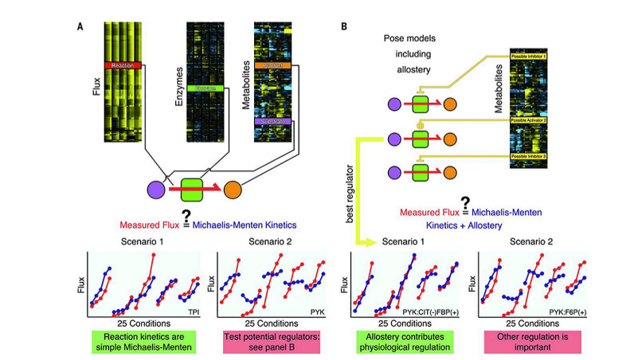
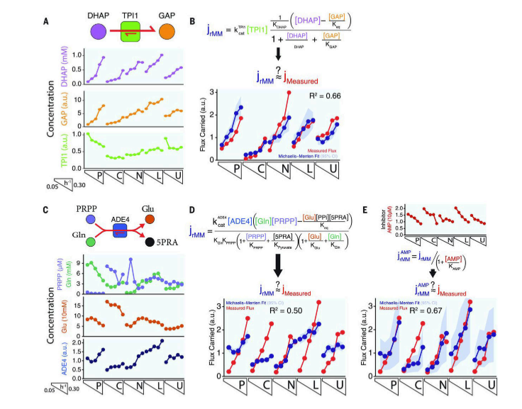
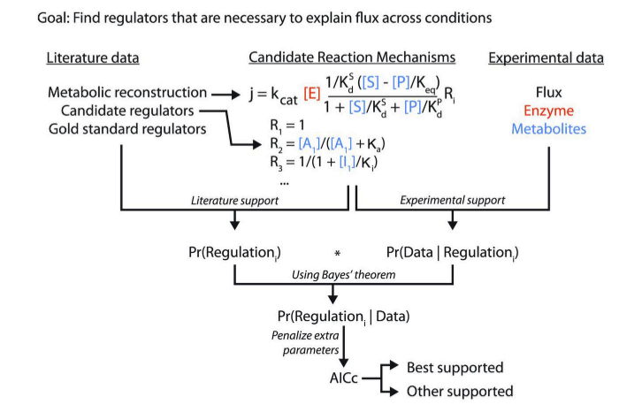
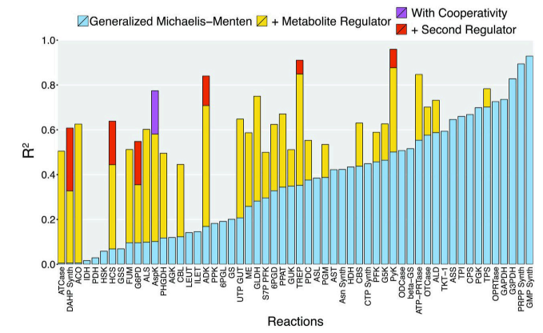
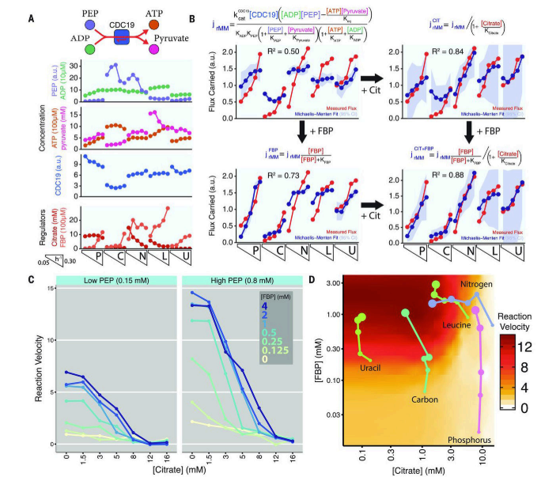
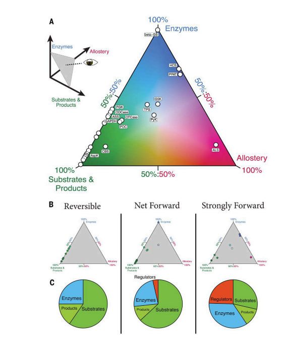

# Systems-level analysis of mechanisms regulating yeast metabolic flux

## Abstract

세포의 metabolic fluxes는 enzyme activities와 metabolite abundances에 의해 결정됩니다. 생화학적 접근법은 특정 substrate이나 regulators가 enzyme kinetics에 미치는 영향을 밝혀내지만, **생리적 상태에 따라 metabolite와 효소 농도가 얼마나 변하는지, 따라서 세포 반응이 어떻게 조절되는지에 대해서는 잘 설명하지 못합니다**. 우리는 25개의 steady states에 있는 효모 배양에서 **효소와 metabolite abundances 및 metabolic fluxes를 측정**했습니다. 그런 다음 **효소, substrate, 생성물, 잠재적 regulators 농도 간의 Michaelis-Menten 관계를 통해 플럭스를 설명할 수 있는 정도를 평가**했습니다. 이를 통해 우리는 생화학적으로 검증한 세 가지 새로운 교차 경로 조절 사례를 발견했습니다. 여기에는 질소가 제한된 효모에서 시트르산이 축적되어 해당작용의 유출을 억제하는 피루브산 키나제 억제가 포함되었습니다. 전반적으로, **substrate 농도가 세포 대사 반응의 순속도의 가장 강력한 결정 요인이었으며, metabolite abundances는 효소보다 두 배 이상의 생리적 영향을 미쳤습니다.**

## Introduction

20세기 생화학의 가장 큰 성과 중 하나는 생물체가 다양한 영양소를 에너지와 생체 물질로 전환하는 효소 반응을 규명한 것입니다. 이러한 광범위한 대사 반응 네트워크에 대한 지식에도 불구하고, metabolic reaction rates(플럭스)가 어떻게 조절되는지는 고도로 연구된 모델 미생물에서도 완전히 이해되지 않았습니다. **대부분의 metabolic regulatory 메커니즘은 시험관 내에서 분리된 효소의 동력학을 연구하여 도출되었습니다. 이러한 환원주의적 접근법은 특정 regulatory interactions을 발견하는 데는 강력하지만, 세포 내에서 조절의 영향을 밝히는 데는 덜 효과적이었습니다.** 생체 내 metabolic regulatory은 enzyme kinetics뿐만 아니라 **생리적 상태에 따라 substrate과 생성물 농도가 얼마나 변하는지, 그리고 다른 metabolite의 생리적 농도에서 효소가 어떻게 반응하는지에 달려 있습니다.**

세포 내 metabolic fluxes 조절을 체계적이고 정량적으로 조사하는 하나의 프레임워크는 metabolic regulatory analysis입니다. **이 접근법에서는 enzyme activities가 pathway fluxes에 미치는 영향을 flux control coefficients($C^J_E$)로 포착하며, 이는 enzyme activities(E)의 변화에 대한 pathway fluxes(J)의 변화 비율을 반영합니다** $C^J_E = (dJ/J)/(dE/E)$. 이론적으로는 우아하지만, 플럭스 조절의 실험적 할당은 어려운 것으로 입증되었습니다. 가장 직접적인 접근법은 enzyme activities을 하나씩 조절하는 것인데, 이는 특히 플럭스 조절이 pathway enzymes 자체보다는 distal cellular reactions에 존재할 수 있기 때문에 부담이 큽니다. 예를 들어, 해당작용 플럭스의 속도는 해당작용 효소 발현보다는 세포 전체 ATP 수요에 의해 결정될 수 있습니다.

시스템 수준의 데이터가 증가함에 따라, metabolic dynamics의 미분 방정식 모델링이라는 대안적 접근법이 있습니다. 실험적 대사 농도 데이터를 맞추면, 이러한 접근법은 정량적 동력학적 parameter(kcat, Km, Ki)뿐만 아니라 regulatory interactions을 식별할 수 있습니다. **그러나 parameter 및 regulators 식별은 high-dimensional space에서의 global non-linear 탐색을 필요로 하며, 따라서 대사 네트워크가 크거나 불완전할 때는 잘 작동하지 않습니다. 따라서 견고하고 확장 가능한 새로운 접근법이 필요합니다.**

우리는 이를 위해 "Systematic Identification of Meaningful Metabolic Enzyme Regulation (SIMMER)"라는 방법을 개발했습니다. **이 방법은 steady states의 proteomic, metabolitc, fluxomic 데이터를 결합하여 반응별로 플럭스 조절의 생리적 메커니즘을 정량적으로 평가합니다.** **구체적으로, 다양한 steady states에서 플럭스, metabolite, 효소를 측정한 데이터를 바탕으로, SIMMER는 개별 반응의 플럭스를 substrate, 생성물, 효소 농도 간의 Michaelis-Menten 관계로 설명할 수 있는지를 테스트합니다** (Fig. 1A). **불일치가 관찰되면, 이를 크게 수정할 수 있는 잠재적 regulators를 탐색합니다** (Fig. 1B). parameter와 regulators는 한 번에 하나의 반응에 대해 식별되므로, 이 접근법은 확장 가능합니다. **결과적으로, 이 접근법은 individual reaction fluxes (net reaction rate)를 결정하는 요인을 설명합니다.** SIMMER를 적용하기 위해 우리는 25가지 다른 steady states 조건에서 효모의 metabolite, proteomic, 플럭스체를 분석했습니다. SIMMER는 효모 metabolic regulatory의 많은 부분을 재현했으며, 이전에 인식되지 않았던 조절도 밝혀냈습니다. 또한, substrate, 생성물, 효소, 알로스테릭 효과기 농도가 세포 metabolic reaction rates 조절에 미치는 정량적 기여를 밝혀냈으며, 소분자 metabolite가 플럭스 결정에 중요한 역할을 한다는 점을 확인했습니다.

## Results

### Metabolite and enzyme concentrations and metabolic fluxes in nutrient-limited yeast

### 제한된 영양소 환경에서의 효모의 대사체 및 효소 농도와 대사 플럭스

효모는 탄소(glucose), 질소(ammonia), 인(phosphate) 또는 (적절한 auxotrophs (영양 결핍 돌연변이체)에서) 류신 또는 우라실이 제한된 조건의 chemostats에서 다섯 가지 다른 특정 성장 속도로 배양되었습니다. 단일 chemostats에서 복제된 실험적 측정이 이루어졌습니다. 플럭스를 결정하기 위해, 우리는 영양소 섭취, waste excretion, biomass generation을 실험적으로 측정한 값에 의해 제약된 플럭스 균형 분석을 사용했습니다. 여기에는 조건에 따라 크게 달라지는 biomass 구성의 상세한 분석이 포함됩니다. 예를 들어, 핵산 함량(주로 리보솜 RNA의 형태)은 빠른 특정 성장 속도에서 더 높았고, 지방과 폴리인산은 질소가 제한된 경우에 축적되었습니다. 몇 가지 중요한 예외를 제외하고, 류신이 제한된 경우의 더 많은 아미노산 생합성 및 glucose이 제한된 경우의 적은 해당작용 플럭스와 같은 플럭스는 특정 성장 속도와 강하게 상관되었습니다. 실험적 관찰과 동일하게 호환되는 플럭스 범위는 플럭스 변동성 분석에 의해 결정되어, 233개의 대사 반응에 대한 오류 추정치와 함께 플럭스를 제공합니다.

이 실험적으로 constraint FBA 및 FVA에 의해 결정된 플럭스를 "measured fluxes"라고 하며, 이는 대사체 및 효소 농도에 기초한 이후의 플럭스 예측과 구별됩니다. 이 measured fluxes는 탄소 제한 효모에서 13C-추적기를 사용하여 플럭스를 결정한 최근 문헌과 잘 일치합니다.

이러한 chemostats 조건에서 106개의 대사체의 상대 농도는 LC-MS/MS에 의해 이전에 측정되었습니다. 우리는 동위원소 비율 기반 접근법을 사용하여 절대 대사체 농도를 결정함으로써 이러한 관찰을 보완했습니다. 전반적으로, 대사체의 풍부함은 제한된 영양소에 크게 의존했습니다. 제한된 영양소에서 유래된 생성물(예: 인 제한 시 뉴클레오타이드 삼인산)은 느린 특정 성장 속도에서 고갈된 반면, 제한된 원소가 없는 관련 대사체(예: 인 제한 시 뉴클레오사이드)는 축적되었습니다.

또한 우리는 동위원소 비율 기반 LC-MS/MS 접근법을 사용하여 단백질체를 분석했습니다. 조건 간 상대 단백질 농도를 결정하기 위해 각 실험 샘플을 공통의 15N-표지 내부 참조 샘플과 비교했습니다. 20,000개 이상의 펩타이드에서 1,187개의 단백질에 대해 양호한 재현성을 갖는 정량적 데이터를 얻었습니다. 대사체와 달리, 많은 단백질, 특히 리보솜 단백질의 풍부함은 제한된 영양소와 관계없이 특정 성장 속도에 주로 의존했습니다. 정량적으로, 단백질체에 대해 특정 성장 속도만으로 설명되는 농도 변화의 비율은 대사체보다 크지만, 전사체보다는 작았습니다. 측정된 단백질에는 효소 정량화를 위해 선택적 반응 모니터링(SRM) 기반 접근법을 사용하여 다루어진 370개의 대사 효소가 포함되어 있었으며, 이는 선택된 반응 모니터링(SRM) 기반 접근법을 사용하여 효소 정량화에 대해 다루어진 것의 90% 이상을 나타냅니다. 대사체의 풍부함과 마찬가지로, 대사 효소의 양은 제한된 영양소에 따라 크게 달라졌습니다. 단백질 전체와 비교하여, 대사 효소는 특정 성장 속도보다는 제한된 영양소에 더 많이 의존했습니다. 주목할 만한 영양소 특정 경향으로는 탄소 제한 시 해당작용 효소의 다운레귤레이션과 TCA 효소의 업레귤레이션, 류신 제한 시 아미노산 생합성 효소의 증가가 포함됩니다. 따라서, 전사체나 단백질 전체와 비교하여, 대사체와 대사 효소의 풍부함은 특정 영양 환경과 더 강하게 연결되어 있습니다. 대사체의 경우, 이는 직접적인 질량 작용을 반영할 수 있으며, 대사 효소의 경우, 이는 영양소의 양과 따라서 대사체의 양이 변할 때 적절한 플럭스를 유지하기 위한 조절을 반영할 수 있습니다.

### Integration of concentration and flux data through SIMMER

**SIMMER를 통한 농도 및 플럭스 데이터 통합**

총 56개의 반응에 대해 SIMMER 분석에 필요한 데이터(플럭스, 효소 농도, substrate 농도, 선택적으로 생성물 농도)를 확보했습니다. **모든 반응에 대해, 우리는 random-order의 효소 메커니즘과 substrate 및 생성물의 경쟁적 결합을 가정하는 가역적 Michaelis-Menten 속도 법칙을 적용했습니다.** **Kinetic parameter는 비선형 최적화를 통해 Michaelis-Menten 출력(측정된 효소 및 metabolite abundances 기반)과 measured fluxes 간의 일관성을 최대화하기 위해 식별되었습니다. 반응의 50%에서 Michaelis-Menten 동력학은 생리적 플럭스 변동의 대부분을 설명했습니다**(R^2 > 0.35).

예를 들어, 해당과정에서 디하이드록시아세톤 인산(DHAP)을 글리세르알데하이드 3-인산(GAP)으로 전환하는 triose-phosphate isomerase(Tpi1) 반응을 살펴보겠습니다. 탄소가 제한된 경우 triose-phosphate isomerase 반응 플럭스는 가장 낮았지만, 특정 성장 속도와 상관관계가 있었습니다. 이는 탄소가 제한된 경우 낮은 효소량과 빠르게 성장하는 세포에서 높은 substrate 농도로 설명되었습니다(Figure 2, A and B).

**triose-phosphate isomerase의 경우, 피트가 완벽하지는 않았지만, ATP 또는 포스포엔올피루브산과 같은 생화학적으로 주석된 효소 억제제를 반응 regulators로 포함하는 것은 적합성을 크게 향상시키지 못했습니다. 다른 반응의 경우, regulators를 포함하면 적합성이 향상되었습니다.** 예를 들어, 퓨린 생합성의 첫 번째 헌신 단계인 amidophosphoribosyltransferase(Ade4)에서, 우리의 metabolite 측정에는 효모에서 하나, 다른 생물에서 여덟 개의 추정 regulators가 포함되었습니다. 이들 중, **AMP(adenosine monophosphate)에 의한 억제는 적합성을 크게 향상시켰습니다**(p < 0.00003; q < 0.02) (Figure 2, C through E). 다른 추정 regulators는 통계적으로 지지되지 않았습니다(p > 0.05). AMP에 의한 퓨린 생합성 첫 번째 헌신 단계의 억제는 효모에서 전형적인 피드백 회로입니다. 따라서, 대사에 대한 사전 지식을 기반으로 한 후보 세트에서 SIMMER는 효모 퓨린 생합성의 생리학적으로 관련 있는 규제를 식별했습니다.

우리는 이 접근법이 이전에 인식되지 않은 규제를 식별할 수 있는지 여부에 관심을 가졌습니다. **이론적으로, 측정된 모든 metabolite는 각 반응의 잠재적 활성제 또는 억제자로 테스트될 수 있습니다. 이 접근법의 주요 잠재적 어려움은 metabolite 간의 상관관계로 인해 발생하는 거짓 양성의 생성입니다.** 이 문제를 탐색하기 위해, 우리는 문헌을 검토하여 알려진 생리적 대사 규제 이벤트를 식별했습니다. 우리는 16개의 다른 반응에서 발생하는 20개의 "gold standard" 규제를 식별했습니다. 모든 metabolite를 활성제와 억제자로 종합적으로 테스트한 결과, **반응당 평균 49개의 regulators가 플럭스 적합성을 크게 향상시켰습니다**(q < 0.1 by likelihood ratio test). 식별된 규제는 20개의 gold standard 규제 이벤트 중 10개(50%)를 포함했으며, 이는 다른 보고된 생화학적 효소 규제(24%) 및 모든 다른 metabolite가 활성제 및 억제제로 테스트된 경우(24%)에 비해 상당히 높았습니다(p < 0.02; Fisher's exact test). 그러나 예측의 특이성은 낮았습니다.

많은 metabolite의 정량적 영향을 구별할 수 없기 때문에, 우리는 BRENDA 데이터베이스에서 얻은, 생리학적으로 의미 있는 regulators 후보에 집중했습니다. 이를 통해 우리는 효모에서 이전에 인식되지 않은 규제를 식별할 수 있었습니다. 이를 위해 우리는 20개의 gold standard 규제 이벤트로 훈련된 베이지안 접근법을 사용했습니다. 특히, 우리는 Bayes' 정리를 사용하여 실험 데이터를 바탕으로 각 규제 상호작용의 확률을 결정했습니다. Pr(Data | Regulation)과 Pr(Regulation)에 기초한 추가 parameter에 대한 페널티를 Akaike 정보 기준(AICc)에 따라 포함했습니다(Figure 3).

우리는 위의 전략을 사용하여 충분한 데이터를 확보한 56개의 반응에 대한 729개의 문헌 후보 조절자를 평가했습니다. 하나 이상의 조절자가 개별적으로 지지된 반응에 대해서는 조절자들의 협동 결합(cooperative binding)과 이차 조절자의 포함을 테스트했습니다. 17개의 반응에서는 일반화된 Michaelis-Menten 동력학이 데이터를 잘 맞추었고(R² > 0.35), 어떤 규제보다도 지지되었습니다. 또한, 29개의 반응에서는 생리학적으로 관련 있는 조절이 지지되었으며, 이 중 6개의 반응은 두 개의 생리학적 조절자로 가장 잘 설명되었고, 1개의 반응은 협동 조절로 가장 잘 설명되었습니다. 총 35개의 조절 상호작용이 식별되었습니다(Fig. 4 및 Table S2). 추가로, 22개의 대안 조절자도 지지되었는데, 이는 규제되지 않은 것보다 낮은 AICc를 가지며, 각각이 개별적으로 적합성을 유의하게 향상시켰습니다(p < 0.01). 상위 예측과 이차 예측 간의 차이는 대체로 미미했지만, 조절자의 측정이 소음으로 인한 것은 아닙니다(Fig. S10). 가장 지지된 조절자와 대안 조절자는 모두 gold standard 규제 상호작용에서 크게 풍부하게 나타났으며, 각각 총 20개의 중 5개를 포함했습니다(p < 0.002, Fisher의 정확 검정). 이는 SIMMER 접근법 전체를 검증합니다(Tables S3, S4, S5). 각 기질과 각 규제 인스턴스에 대해, Michaelis-Menten 적합성은 세포 데이터에만 기반하여 대사체 친화도(Km/i/a)를 결정했습니다. 이러한 세포 친화도 상수는 생화학 문헌의 대응 값과 상관관계가 있었으며(Fig. S11), 추가 검증을 제공했습니다(31). 효모의 5개의 gold standard 규제 사례 외에도(33-35), 35개의 가장 지지된 조절 상호작용에는 효모에서 강한 시험관 내 지지를 받았으나 생리학적 중요성에 대한 이전 증거가 없었던 4개의 조절자가 포함되었습니다(37-40). 예측된 조절 중 대부분은 이전에 S. cerevisiae에서 제안된 적이 없었습니다.

### Biochemical confirmation of three previously unrecognized instances of yeast allosteric regulation

**이전에 인식되지 않은 효모 알로스테릭 조절의 세 가지 사례에 대한 생화학적 확인**

SIMMER의 새로운 효모 regulatory interactions 발견 능력을 평가하기 위해, 우리는 상위 예측 중 10개를 생화학적으로 테스트하여 그 중 3가지를 확인했습니다: 알라닌에 의한 오르니틴 트랜스카바밀라제(Arg3) 억제, 페닐피루브산에 의한 피루브산 탈카복실화효소(Pdc1) 억제, 그리고 시트르산에 의한 피루브산 키나제(Cdc19) 억제입니다. 이 상대적으로 낮은 검증률은 실제 regulatory interactions이 드물다는 사실에 부분적으로 기인합니다(최고 예측의 거짓 양성률은 3%에 불과함). 또한 이는 상관된 metabolite들 중에서 올바른 진정한 regulators를 선택하는 어려움을 반영합니다. 예를 들어, 우리는 DAHP 합성효소의 regulators로 페닐피루브산을 잘못 예측했으며, 실제 regulators인 페닐알라닌은 페닐피루브산과 상관되어 대안으로 예측되었습니다.

오르니틴 트랜스카바밀라제는 카바모일 포스페이트를 아르기닌 대 피리미딘으로 분기하는 지점에 위치합니다. Arg3 활동은 발현을 통해 조절되는 것으로 알려져 있지만, SIMMER는 알라닌이 생리학적 억제제라고 예측했고, 우리는 억제 상수 Ki가 15 mM인 억제를 생화학적으로 확인했습니다. 이는 효모 내 알라닌의 일반적인 농도 이하입니다(Figure S12). 알라닌 농도는 아미노산이 뉴클레오타이드보다 더 풍부한 영양 상태(예: 인 또는 우라실의 극한 제한)에서 증가합니다. 따라서 알라닌에 의한 Arg3 억제는 피리미딘이 더 필요할 때 아르기닌 합성을 감소시키는 역할을 합니다.

피루브산 탈카복실화효소(Pdc; Pdc1,5,6)는 효모 발효 동안 피루브산을 에탄올로 전환합니다. 피루브산은 중심 대사의 가장 중요한 분기점 중 하나에 위치해 있지만, 피루브산 탈카복실화효소의 생리학적 조절에 대해서는 거의 알려져 있지 않습니다. 부패 효모인 Saccharomycetaceae 계열의 Z. bisporus에서는 페닐피루브산이 피루브산 탈카복실화효소의 대체 substrate로 작용하며, 이는 피루브산 탈카복실화를 억제합니다(Ki 약 5 mM). 우리는 Z. bisporus Pdc와 유사하게 S. cerevisiae Pdc1이 페닐피루브산으로부터 페닐아세트알데하이드를 생성할 수 있으며, 이는 또한 피루브산을 사용한 반응을 억제한다는 것을 확인했습니다(Ki는 1에서 4 mM 사이) (Figure S13). 이러한 억제는 구조적으로 관련된 metabolite인 페닐알라닌 또는 α-케토글루타르산과는 공유되지 않았습니다. 페닐아세트알데하이드 생성물인 페닐에탄올은 질소가 제한된 효모에서 포식 행동을 촉진하는 군집 감지 분자로 배출됩니다. 페닐피루브산 농도는 질소나 류신이 제한된 조건에서 높으며, 이러한 억제는 탄소 낭비를 제한하는 역할을 합니다. 따라서 SIMMER는 효모에서 탄소와 질소 대사를 조정하는 새로운 방법을 밝혀냈습니다.

SIMMER는 또한 해당작용의 마지막 효소인 피루브산 키나제(Cdc19; glucose을 먹는 세포에서는 Pyk2가 미세한 동형효소)를 통해 피루브산 생산을 억제하는 후보로 시트르산을 식별했습니다. 해당작용 조절과 인간 암에서의 태아 동형효소 Pkm2로의 전환 역할 때문에, 피루브산 키나제는 가장 많이 연구된 대사 효소 중 하나입니다. 인간 Pkm2와 효모 Cdc19는 모두 과당 1,6-이중인산(FBP)에 의해 강하게 활성화됩니다. 효모에서, glucose 제거 시, FBP 농도가 급격히 감소하여 피루브산 키나제가 차단되고, 따라서 세포가 glucose신생합성에 대비하게 됩니다. 그러나 glucose을 섭취한 세포에서의 높은 FBP 농도에서는, 우리는 Cdc19가 FBP 농도에 대해 중간 정도의 민감성을 보였습니다(Figure 5, A and B). 이는 피루브산 키나제 플럭스를 조절할 대체 모드가 존재할 수 있음을 시사하며, SIMMER는 시트르산(또는 metabolite학적 방법에서 공출된 이소시트르산)을 지목했습니다. 세포 내에서 시트르산은 이소시트르산보다 더 풍부하며, 또한 더 강력한 Cdc19 억제제(Ki 약 5 mM)로 밝혀졌습니다(Figure 5C). 시트르산 농도는 인, 질소, 또는 류신이 제한된 경우 높습니다. 인이 제한된 경우, 특정 성장 속도에 따라 피루브산 키나제의 풍부함이 높고, 시트르산 농도가 높아 균형을 이루며, FBP의 증가로 인해 플럭스가 증가합니다(Figure 5D). 반면, 질소나 류신이 제한된 경우, 시트르산의 감소로 인해 플럭스가 증가합니다(Figure 5D). 따라서 시트르산에 의한 피루브산 키나제 억제는 피루브산 키나제의 풍부함과 FBP의 양을 조절하여 다른 필수 원소 영양소의 가용성과 함께 glucose 이화작용을 조정하는 역할을 합니다.

위의 세 가지 새로운 생리학적 regulatory interactions의 공통점은 각각 경로를 넘나든다는 것입니다. 이는 SIMMER가 재확인한 효모 규제의 아홉 가지 사례(동일 경로 내에서 metabolite와 효소 간의 상호작용을 포함하는 다섯 가지 표준 피드백 억제를 포함함)와 대조됩니다. 따라서 이러한 새로운 발견들은 개별적 중요성을 넘어서, 교차 경로 조절이 현재 인식된 것보다 더 일반적이고 중요할 수 있음을 시사합니다.

### Quantitative analysis of physiological flux control

**생리학적 플럭스 조절의 정량적 분석**

반응 regulators를 밝혀내는 것 외에도, SIMMER는 세포 metabolic reaction rates를 조절하는 메커니즘을 평가할 수 있는 정량적 속도 법칙을 제공합니다. 생리적 조건에 따른 효소 및 metabolite abundances의 변화가 반응 플럭스에 미치는 영향을 평가하기 위해, 우리는 조건 간 플럭스의 전체 변동성을 개별 생화학적 성분의 기여도로 분할할 수 있습니다. 특정 생화학적 성분(substrate, 생성물, 효소, 알로스테릭 regulators)의 영향은 생리적 조건 간 농도 변동성과 농도에 대한 net reaction rate의 민감도에 따라 달라집니다. 전체 변동성에 대한 비율로 정규화하면, net reaction rate 조절에 대한 성분의 기여도를 알 수 있습니다. 우리는 이러한 정규화된 생리적 반응 속도 조절 분할을 "대사 레버리지"라고 부릅니다.

$$\psi_k = \frac{\left(\frac{\partial v}{\partial \bar{s_k}}\right)^2Var(s_k)}{\sum^{n}_{i=1}\left(\frac{\partial v}{\partial \bar{s_i}^2}\right)^2Var(S_i)}$$

조절이 없는 반응 방정식이나 생화학적으로 검증된 조절을 포함하는 29개의 대사 반응 각각에 대해, substrate 및 생성물 농도, 알로스테릭 regulators 수준, 효소 농도의 상대적 대사 레버리지를 Figure 6A에 나타냈습니다(모든 SIMMER 예측을 포함한 유사한 분석은 Figure S14 참조). 관찰된 대사 레버리지 분포는 모든 잘 맞는 parameter 세트에서 일관되었습니다(Figure S15 및 Table S8 참조). 환경 조건에 따라 순 방향이 바뀔 수 있는 반응("가역 반응")의 경우, 대사 레버리지는 substrate, 생성물 및 효소 간에 나뉘었으며, 알로스테릭 조절에 의한 기여는 없었고 대부분의 레버리지는 substrate에만 있었습니다(Figure 6, B 및 C). 순 방향이 바뀌지 않지만 어느 정도 가역적인 반응의 경우, 알로스테릭 조절의 기여도는 작았지만 강하게 순방향으로 구동되는 반응(ΔrG°’ < -5 kJ/mol)의 경우에는 증가하였고, 효소, substrate 및 알로스테릭 regulators가 각각 주요 역할을 했습니다(Figure 6, B 및 C). 전체적으로, metabolite(substrate, 생성물, 알로스테릭 효과기)의 결합된 영향은 효소의 두 배 이상이었습니다.

시스템 수준의 측정 기술이 꾸준히 발전함에 따라, 대규모 데이터에서 구체적인 규제 통찰을 제공할 수 있는 방법의 필요성이 증가하고 있습니다. 이전에는 metabolite abundances 변화를 시스템의 미분 방정식으로 맞추어 metabolic regulatory을 추론하려는 시도가 있었습니다. 이 접근법은 작은 네트워크에서는 잘 작동하지만, 시스템의 규모가 커질수록 부정확한 반응 설명이 전체 오류로 이어지기 때문에 확장성이 떨어집니다. metabolite abundances 변화를 기반으로 플럭스를 추론하기보다는 플럭스를 측정함으로써, 규제는 시스템의 규모와 상관없이 반응별로 평가될 수 있습니다. 각 반응 방정식을 독립적으로 평가하면 빠른 parameter 식별이 가능하며, regulatory interactions을 발견하는 데 용이합니다. 반응 속도가 세포에서 측정되기 때문에, 이 접근법은 다른 metabolite의 생리적 농도에 의존하는 규제를 식별하는 데 적합합니다. 우리는 이 접근법을 사용하여 생리학적으로 관련 있는 규제를 식별했으며, 효모에서 세 가지 이전에 인식되지 않은 교차 경로 대사 규제를 발견했습니다.

여기에는 피루브산 흐름을 조절하는 새로운 방법이 포함됩니다: 질소 제한 중에 시트르산에 의해 주 피루브산 키나제 동형효소 Cdc19가 억제되고, 페닐피루브산에 의해 피루브산 탈카복실화효소가 억제되는 것입니다. E. coli에서는 α-케토산을 포함한 α-케토글루타르산이 낮은 질소 조건에서 탄소 대사를 억제하며, 부분적으로는 Enzyme I의 직접 억제를 통해 작동합니다. 이러한 억제는 상부 해당작용으로의 흐름과 하부 해당작용의 유출을 동시에 차단하여, 중간체 농도의 변화 없이 해당작용 플럭스를 조절할 수 있게 합니다. 우리는 유사한 조절 메커니즘이 효모에서 작동하여 상부와 하부 해당작용을 균형 있게 맞추는 것을 발견했습니다. 시트르산은 FBP 생산과 PEP 소비를 모두 억제하여 glucose 이화작용을 다른 필수 영양소의 가용성과 맞추는 데 기여합니다. 시트르산은 또한 인이 제한될 때도 풍부하여, glucose이 제한될 때는 주로 FBP가 피루브산 키나제의 주요 regulators로 작용하지만, 질소가 제한될 때는 시트르산이 주요 regulators로 전환됩니다.

새로운 regulatory interactions을 식별하는 것 외에도, 우리는 효모의 개별 대사 반응의 생리학적 속도를 조절하는 전체 메커니즘을 평가하여, substrate 농도가 중요한 역할을 한다는 점을 밝혔습니다. 이는 효모와 다른 미생물에서의 이전 연구와 일치하며, 전사체와 proteomic의 변화가 플럭스 변화를 설명하는 데 충분하지 않다는 점을 보여줍니다.

경로 수준의 플럭스 조절은 개별 반응 속도가 어떻게 결정되는지(대사 레버리지로 평가됨)와 반응이 어떻게 상호작용하는지(flux control coefficients로 평가됨)에 따라 다릅니다. 높은 가역성 반응의 경우, 순 플럭스는 substrate 대 생성물 비율의 작은 변화에 민감합니다. 이러한 반응은 다른 반응에 반응하며, pathway fluxes 조절에 큰 영향을 미치지 않습니다. substrate 및 생성물 농도가 대사 레버리지를 지배합니다. 반면, 강하게 열역학적으로 순방향으로 구동되는 반응은 pathway fluxes 조절이 더 크며, 알로스테릭 regulators의 주요 표적입니다. 우리는 substrate 농도가 이러한 반응을 통해 플럭스를 결정하는 데 중요한 역할을 한다는 것을 발견했으며, metabolite(substrate, 생성물 및 알로스테릭 효과기)가 효소의 두 배 이상 역할을 한다는 점을 확인했습니다.

## Discussion

시스템 수준의 측정 기술이 꾸준히 발전함에 따라, 대규모 데이터에서 구체적인 규제 통찰을 제공하는 방법이 필요성이 증가하고 있습니다. 이전에는 metabolite abundances 변화를 시스템의 미분 방정식으로 맞추어 metabolic regulatory을 추론하려는 시도가 있었습니다. 이 접근법은 작은 네트워크에서는 잘 작동하지만, 시스템의 규모가 커질수록 부정확한 반응 설명이 전체 오류로 이어지기 때문에 확장성이 떨어집니다. metabolite abundances 변화를 기반으로 플럭스를 추론하기보다는 플럭스를 측정함으로써, 규제는 시스템의 규모와 상관없이 반응별로 평가될 수 있습니다. 각 반응 방정식을 독립적으로 평가하면 빠른 parameter 식별이 가능하며, regulatory interactions을 발견하는 데 용이합니다. 반응 속도가 세포에서 측정되기 때문에, 이 접근법은 다른 metabolite의 생리적 농도에 의존하는 규제를 식별하는 데 적합합니다. 우리는 이 접근법을 사용하여 생리학적으로 관련 있는 규제를 식별했으며, 효모에서 세 가지 이전에 인식되지 않은 교차 경로 대사 규제를 발견했습니다.

이 중에는 피루브산 흐름을 조절하는 새로운 방법이 포함됩니다: 질소 제한 중에 시트르산에 의해 주 피루브산 키나제 동형효소 Cdc19가 억제되고, 페닐피루브산에 의해 피루브산 탈카복실화효소가 억제되는 것입니다. E. coli에서는 α-케토산을 포함한 α-케토글루타르산이 낮은 질소 조건에서 탄소 대사를 억제하며, 부분적으로는 Enzyme I의 직접 억제를 통해 작동합니다. 이러한 억제는 상부 해당작용으로의 흐름과 하부 해당작용의 유출을 동시에 차단하여, 중간체 농도의 변화 없이 해당작용 플럭스를 조절할 수 있게 합니다. 우리는 유사한 조절 메커니즘이 효모에서 작동하여 상부와 하부 해당작용을 균형 있게 맞추는 것을 발견했습니다. 시트르산은 FBP 생산과 PEP 소비를 모두 억제하여 glucose 이화작용을 다른 필수 영양소의 가용성과 맞추는 데 기여합니다. 시트르산은 또한 인이 제한될 때도 풍부하여, glucose이 제한될 때는 주로 FBP가 피루브산 키나제의 주요 regulators로 작용하지만, 질소가 제한될 때는 시트르산이 주요 regulators로 전환됩니다.

새로운 regulatory interactions을 식별하는 것 외에도, 우리는 효모의 개별 대사 반응의 생리학적 속도를 조절하는 전체 메커니즘을 평가하여, substrate 농도가 중요한 역할을 한다는 점을 밝혔습니다. 이는 효모와 다른 미생물에서의 이전 연구와 일치하며, 전사체와 proteomic의 변화가 플럭스 변화를 설명하는 데 충분하지 않다는 점을 보여줍니다. substrate 농도의 변화가 전체 플럭스 변화에 주요 기여를 한다는 최근 연구 결과와도 일치합니다.

경로 수준의 플럭스 조절은 개별 반응 속도가 어떻게 결정되는지(대사 레버리지로 평가됨)와 반응이 어떻게 상호작용하는지(flux control coefficients로 평가됨)에 따라 다릅니다. 높은 가역성 반응의 경우, 순 플럭스는 substrate 대 생성물 비율의 작은 변화에 민감합니다. 이러한 반응은 다른 반응에 반응하며, pathway fluxes 조절에 큰 영향을 미치지 않습니다. substrate 및 생성물 농도가 대사 레버리지를 지배합니다. 반면, 강하게 열역학적으로 순방향으로 구동되는 반응은 pathway fluxes 조절이 더 크며, 알로스테릭 regulators의 주요 표적입니다. 우리는 substrate 농도가 이러한 반응을 통해 플럭스를 결정하는 데 중요한 역할을 한다는 것을 발견했으며, metabolite(substrate, 생성물 및 알로스테릭 효과기)가 효소의 두 배 이상 역할을 한다는 점을 확인했습니다.

우리의 관찰이 metabolite abundances가 효소보다 더 많은 대사 레버리지를 가진다는 점은 얼마나 일반적인지에 대한 중요한 질문이 있습니다. 이 관찰은 영양 환경이 다른 steady states의 효모 배양에서 이루어졌습니다. steady states에서 작업함으로써, 우리는 원칙적으로 효소 농도의 조절과 같은 느린 조절 이벤트를 선호해야 하며, 따라서 metabolite abundances가 더 큰 역할을 한다는 것은 특히 주목할 만합니다. 이는 효소 활용의 비효율성을 나타냅니다. 만약 효소가 모든 조건에서 Vmax 근처에서 작동한다면, 플럭스를 조절하는 유일한 방법은 효소 농도를 통해서만 가능합니다. 대신, 영양소가 제한된 효모는 효소를 과잉 발현하는 것처럼 보입니다. 이는 영양 조건이 개선될 때 빠르게 성장할 수 있도록 하기 위함입니다. 이러한 과도한 효소 용량은 대사에 유연성을 부여하여 대사 레버리지를 substrate, 생성물 및 알로스테릭 효과기로 이동시킵니다. 풍부한 영양 조건에서는 효소 효율성이 더 중요할 것이며, 이러한 환경에서는 효소의 대사 레버리지가 더 클 것입니다. 환경 영양 조건의 변동 없이 대사 변동이 발생하는 경우(예: 혈류에서 동일한 영양소가 공급되는 포유동물의 장기 간), 효소 농도가 더 중요한 역할을 할 가능성이 큽니다. 그럼에도 불구하고, 이러한 설정에서도 많은 반응 속도는 metabolite abundances에 의해 주로 결정될 수 있으며, 이는 개별 효소 농도를 정밀하게 조절하지 않고도 적절한 플럭스를 달성할 수 있게 합니다. 실제로, 효모 효소 농도를 조절하는 메커니즘은 종종 전체 경로 수준에서 작동하며(예: Arg80, Arg81 및 Arg82) 심지어 여러 경로에서 작동하기도 합니다(예: Gcn4). 이는 효소 효율성보다 강인성과 유연성을 우선시하는 진화적 우선순위를 반영할 수 있습니다. 또는 개별 효소 농도를 더 정밀하게 조절하는 기계를 만드는 것보다 약간의 과잉 효소를 만드는 것이 "저렴"하기 때문일 수 있습니다.

우리는 비교적 포괄적인 대사 데이터 세트를 제공하고 이를 활용하여 효모에서 기존의 규제를 확인하고 이전에 인식되지 않은 규제를 예측했지만, 대부분의 SIMMER 예측은 검증되지 않았습니다. 규제를 예측하는 것은 어렵습니다. 대부분의 metabolite는 주어진 효소의 생리적 regulators가 아니며, 잘못된 예측은 측정되지 않았거나 잘못 측정된 변수 또는 잠재적 regulators 간의 구별 불가능성으로 인해 쉽게 발생할 수 있습니다. 안정 동위원소 표지 실험을 통한 보다 정확한 플럭스 측정, 더 깊은 metabolite 범위 및 효소의 번역 후 조절 및 세포 내 위치 평가를 통해 플럭스 조절 메커니즘을 더 완벽하게 이해할 수 있을 것입니다. 또한, 연구 조건을 추가적인 영양소(예: 다른 탄소원) 및 유전적 변형(예: 유전자 결손)으로 확장하면 metabolite 간의 상관 관계를 분해하여 regulators를 더 신뢰성 있게 구별할 수 있는 가능성을 제공합니다. 충분한 추가 데이터가 있다면, BRENDA의 후보에 의존하지 않고 모든 metabolite를 잠재적 regulators로 취급할 수 있을 것입니다.

SIMMER 접근법은 metabolite와 효소 농도 및 플럭스를 여러 조건에서 측정할 수 있는 모든 유사-steady states 대사 시스템에 적용될 수 있습니다. 이는 덜 연구된 미생물에서 metabolic regulatory 메커니즘을 식별할 수 있을 것입니다. 생물 종 특유의 사전 지식 요구가 없기 때문에, SIMMER는 chemostats에서 배양할 수 있는 대부분의 미생물에 적용할 수 있습니다. 한편, 산업적 유용성을 갖춘 효모의 중요성 때문에, 효모의 metabolic regulatory 메커니즘에 대한 우리의 정량적 통찰은 대사 공학에 즉각적으로 활용될 수 있을 것입니다.

## Methods

### SIMMER 개요

Systematic Identification of Meaningful Metabolic Enzyme Regulation (SIMMER)는 '옴닉스' 데이터를 사용하여 개별 대사 반응의 동력학을 조사하는 방법입니다. SIMMER 방법을 구성하는 네 가지 주요 단계는 다음과 같습니다:

1. **다양한 조건에서 metabolite(M), 효소(E) 및 플럭스(jF)의 상대 농도를 측정합니다.** metabolite와 효소는 질량분석법으로 직접 측정할 수 있지만, 플럭스는 직접 측정할 수 없으므로 대사 네트워크 화학양론에 대한 다른 실험 데이터로부터 유추합니다.

2. **관심 있는 각 반응에 대해, 측정된 metabolite(M: substrate, 생성물 및 추정 regulators), 효소(E) 및 동력학적 parameter(Ω)와 반응 플럭스(jP = g(M, E, Ω))를 관련시키는 하나 이상의 반응식을 생성합니다.** 이 연구에서는 반응식(g)이 Michaelis-Menten 동력학에 기반하며, regulators의 포함 여부에 따라 달라집니다.

3. **각 반응식을 맞추어 각 반응식의 예측치(ĵp)가 measured fluxes(jF)와 얼마나 일치하는지 평가합니다.**

4. **대체 반응식을 비교하여 어느 모델이 가장 잘 지지되는지 확인합니다.** 문헌을 사용하여 각 모델의 그럴듯함을 평가하여, 사전적으로 덜 가능성이 높은 모델은 더 강한 정량적 증거가 필요합니다.

SIMMER는 다양한 steady states에서 효모의 metabolite, proteomic 및 플럭스를 분석함으로써 Michaelis-Menten 관계를 통해 individual reaction fluxes 를 설명할 수 있는지 테스트합니다. regulators가 필요할 경우 이를 식별하여 플럭스 변동의 요인을 밝혀냅니다. SIMMER는 생리학적으로 관련 있는 규제를 식별하고, substrate, 생성물, 효소 및 알로스테릭 regulators의 농도가 세포 metabolic reaction rates에 미치는 정량적 기여를 평가합니다.

### 제약 기반 접근법을 사용한 전체 metabolic fluxes 추론

효모 반응의 화학양론 및 방향성은 수정된 YEASTNET 7 Saccharomyces cerevisiae 게놈 규모 모델에서 가져왔습니다. 우리는 폴리인산 합성을 허용하는 반응(폴리인산 키나제: (ATP + (PO3)n → ADP + (PO3)n+1)과 오로트산 배출을 실험적으로 관찰하여 추가했습니다. ATP 소비는 세 가지 경로로 이루어졌습니다: 
i) 세포 질량에 비례하는 최소 ATP 유지 플럭스(1 mmol/gDW/h), 
ii) 성장 관련 반응, 
iii) 모델에 수동으로 추가된 비생산적 ATP 가수분해 반응. 

우리의 실험 조건에서는 플럭스를 가질 수 있는 1,843개의 metabolite를 포함한 2,787개의 반응이 있었습니다. 이 개수는 각기 다른 구획에 중복된 동등한 반응과 동일한 metabolite를 포함합니다. 2,787개의 반응의 화학양론은 화학양론 행렬(S)에 의해 정의됩니다.

각 실험적 chemostats 조건에 대한 대사 전체 플럭스를 결정하기 위해, 우리는 실험적으로 결정된 경계 플럭스(ĵ)를 최대한 가깝게 따르는 균형 플럭스 분포(j such that Sj = 0)를 결정했습니다. 이는 실험적 측정치(σ-2)의 정밀도에 따라 가중치를 부여한 최소 제곱 회귀와 유사하게, 잔차 제곱(ĵ–j)을 실험적 정밀도로 가중치 적용하여 측정된 것입니다. 비생산적 대사 사이클을 최소화하기 위해, 절대 플럭스 |j|는 특정 값 c(1) 또는 c(2)로 벌칙을 부여했습니다. c(1)은 높은 플럭스 반응(해당과정, TCA 사이클, 경계 플럭스 및 관련 수송 반응과 비생산적 ATP 가수분해 반응)에 사용되었고, c(2)는 모든 다른 반응에 사용되었습니다. 벌칙은 주로 실험적 측정의 오차를 최소화하는 데 중점을 두었습니다. 최적의 벡터 j는 이차 프로그래밍을 통해 찾을 수 있습니다:

$$\text{min} \ \theta = \sum_{k} \left( \frac{(ĵ_k - j_k)^2}{σ_k^2} \right) + c(1) \sum_{k \in \text{high-flux}} |j_k| + c(2) \sum_{k \notin \text{high-flux}} |j_k|$$

여러 최적 해(j)가 있을 수 있으므로, 우리는 플럭스 변동성 분석을 사용하여 각 반응(i)을 통해 동일한 최소 비용(θ)을 제공하는 플럭스 범위를 결정했습니다. 이 범위는 실험적으로 관찰된 플럭스 범위로 간주되었습니다. 이 접근법은 θ를 제약으로 간주하여 각 반응의 플럭스를 개별적으로 최소화 및 최대화함으로써 플럭스 변동성을 분석합니다:

$$\text{min/max} \ j_i \ \text{subject to} \ \theta = \text{constant}$$

이 최적화 문제는 Gurobi Optimizer를 사용하여 구현되었습니다. 플럭스 추정을 재현하기 위한 코드는 GitHub에서 사용할 수 있습니다.

총 233개의 반응이 일부 조건에서 비영 플럭스를 가지며, 플럭스 변동성 분석에 기반하여 잘 제약되었습니다. 이러한 233개의 반응은 추가 동력학적 분석 후보로 간주되었습니다.

## Figure 설명

### Figure 1 설명

Figure 1은 대사 플럭스를 예측하고 조절 메커니즘을 밝히기 위해 SIMMER 방법론을 적용한 개요를 나타냅니다. 그림의 주요 요소와 설명은 다음과 같습니다:

1. **데이터 수집 및 전처리**:
   - 다양한 조건에서 효모를 배양하고, 각각의 안정 상태에서 대사체, 효소, 플럭스를 측정합니다. 이 데이터는 대사 경로의 다양한 조건을 반영합니다.

2. **Michaelis-Menten 동력학 모델링**:
   - 각 반응에 대해 Michaelis-Menten 동력학을 적용하여 기질, 생성물, 효소, 잠재적 조절자의 농도 간 관계를 모델링합니다.
   - 동력학적 매개변수는 비선형 최적화를 통해 Michaelis-Menten 출력(측정된 효소 및 대사체 농도 기반)과 measured fluxes 간의 일관성을 최대화하도록 식별됩니다.

3. **조절자 식별 및 검증**:
   - measured fluxes와 모델 예측 사이의 불일치를 분석하여 잠재적 조절자를 식별합니다.
   - 실험적 검증을 통해 조절자의 생리학적 의미를 확인합니다.

4. **대사 레버리지 평가**:
   - 조건 간 플럭스 변동성을 기질, 생성물, 효소, 조절자의 기여도로 분할하여 반응 속도 조절 메커니즘을 평가합니다.
   - 대사 레버리지를 통해 기질과 생성물 농도가 플럭스 결정에 중요한 역할을 한다는 것을 정량적으로 분석합니다.

5. **결과 및 통찰**:
   - 새로운 조절 메커니즘을 식별하고, 특정 대사 반응의 조절 메커니즘을 밝힙니다.
   - 효모의 대사 네트워크에 대한 정량적 통찰을 제공합니다.

각 패널은 다음과 같이 구성되어 있습니다:

- **패널 A**: 다양한 조건에서 효모 배양 및 대사체, 효소, 플럭스 측정 과정.
- **패널 B**: Michaelis-Menten 동력학 모델링을 통한 플럭스 예측 및 조절자 식별.
- **패널 C**: 실험적 검증 및 대사 레버리지 분석을 통한 조절 메커니즘 평가.
- **패널 D**: 결과 통합 및 새로운 조절 메커니즘의 발견.

Figure 1은 SIMMER 방법론의 전체적인 흐름과 주요 단계를 시각적으로 요약하여, 효모 대사 플럭스를 예측하고 조절 메커니즘을 밝히는 과정을 보여줍니다.

### Figure 2 설명

Figure 2는 triose-phosphate isomerase(Tpi1) 반응과 amidophosphoribosyltransferase(Ade4) 반응에서 SIMMER 방법론을 적용하여 얻은 결과를 보여줍니다.

#### 패널 A: triose-phosphate isomerase(Tpi1) 반응의 플럭스와 기질 농도
- **상단 그래프**: 다양한 조건에서 측정된 triose-phosphate isomerase(Tpi1) 반응의 플럭스.
  - X축: 다양한 조건 (탄소 제한, 질소 제한 등)
  - Y축: 플럭스 값 (nmol/min/mg)
  - 각 점은 특정 조건에서의 측정값을 나타내며, 점 사이의 선은 조건 간의 플럭스 변화를 시각화합니다.
- **하단 그래프**: 동일 조건에서 측정된 기질 (DHAP) 농도.
  - X축: 다양한 조건
  - Y축: DHAP 농도 (µM)
  - 각 점은 특정 조건에서의 기질 농도를 나타냅니다.

#### 패널 B: Tpi1 반응의 Michaelis-Menten 모델링
- **그래프**: Tpi1 반응의 플럭스와 기질 농도의 관계를 Michaelis-Menten 모델로 피팅한 결과.
  - X축: DHAP 농도 (µM)
  - Y축: 플럭스 (nmol/min/mg)
  - 실험 데이터 포인트는 점으로 표시되며, Michaelis-Menten 모델 피팅 결과는 곡선으로 표시됩니다.
  - 모델 피팅의 적합도를 나타내는 R^2 값도 함께 표시됩니다.

#### 패널 C: amidophosphoribosyltransferase(Ade4) 반응의 플럭스와 조절자 농도
- **상단 그래프**: 다양한 조건에서 측정된 Ade4 반응의 플럭스.
  - X축: 다양한 조건 (탄소 제한, 질소 제한 등)
  - Y축: 플럭스 값 (nmol/min/mg)
  - 각 점은 특정 조건에서의 측정값을 나타내며, 점 사이의 선은 조건 간의 플럭스 변화를 시각화합니다.
- **하단 그래프**: 동일 조건에서 측정된 조절자 (AMP) 농도.
  - X축: 다양한 조건
  - Y축: AMP 농도 (µM)
  - 각 점은 특정 조건에서의 조절자 농도를 나타냅니다.

#### 패널 D: Ade4 반응의 Michaelis-Menten 모델링
- **그래프**: Ade4 반응의 플럭스와 조절자 농도의 관계를 Michaelis-Menten 모델로 피팅한 결과.
  - X축: AMP 농도 (µM)
  - Y축: 플럭스 (nmol/min/mg)
  - 실험 데이터 포인트는 점으로 표시되며, Michaelis-Menten 모델 피팅 결과는 곡선으로 표시됩니다.
  - 모델 피팅의 적합도를 나타내는 R^2 값도 함께 표시됩니다.

#### 패널 E: Ade4 반응의 조절자 영향 평가
- **그래프**: 조절자(AMP)가 Ade4 반응에 미치는 영향을 분석한 결과.
  - X축: AMP 농도 (µM)
  - Y축: 플럭스 (nmol/min/mg)
  - 여러 조건에서 AMP 농도가 Ade4 반응에 미치는 억제 효과를 시각화합니다.

Figure 2는 SIMMER 방법론을 통해 triose-phosphate isomerase와 amidophosphoribosyltransferase 반응을 모델링하고, 조절 메커니즘을 분석한 과정을 자세히 보여줍니다. 각 반응의 플럭스와 기질/조절자 농도 간의 관계를 Michaelis-Menten 모델로 피팅하여, 조절자의 생리학적 의미를 확인합니다.

