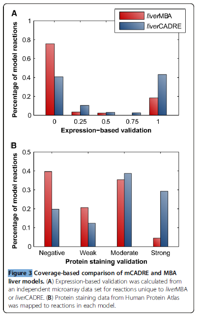
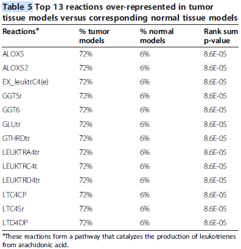
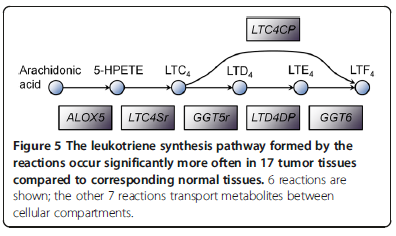

# Reconstruction of genome-scale metabolic models for 126 human tissues using mCADRE

## Abstract

배경: 인간 조직은 다양한 대사 기능을 수행합니다. 이러한 조직 특이적 기능을 유전체 규모 모델에서 매핑하면 다양한 생리학적 및 병리학적 과정의 대사 기초를 이해하는 데 도움이 됩니다. 인간 대사 기능의 글로벌 지식 베이스(Human Recon 1)는 풍부한 고속 데이터와 결합되어 조직 특이적 대사 모델을 재구성하는 것이 가능합니다. 그러나 대사 기능은 매우 다양하기 때문에 사용 가능한 조직 특이적 모델의 수는 인간 조직의 다양성과 비교할 때 부족합니다.

결과: 우리는 mCADRE(Metabolic Context-specificity Assessed by Deterministic Reaction Evaluation)라는 방법론을 개발했습니다. mCADRE는 **유전자 발현 데이터와 대사 네트워크 토폴로지를 기반으로 조직 특이적 네트워크를 추론할 수 있으며, 모델 구축 중 기능적 능력을 평가**합니다. mCADRE는 기존 방법보다 유사하거나 더 나은 기능을 가진 모델을 생성하고, 컴퓨터 처리 속도를 크게 향상시킵니다. 우리의 방법을 사용하여, 우리는 126가지 인간 조직 및 세포 유형에 대한 초안 유전체 규모 대사 모델을 재구성했습니다. 이 중에는 26가지 종양 조직과 그 정상 대조군, 그리고 30가지 다른 뇌 조직이 포함되어 있습니다. 우리는 이러한 조직 특이적 모델의 경로 수준 분석을 수행하고, 특히 아라키돈산에서 르코트리엔을 생성하는 반응을 촉진하는 아이코산 대사 경로를 종양 조직을 선택적으로 영향을 주는 잠재적인 약물 타깃으로 식별했습니다.

결론: 이러한 126가지 유전체 규모 대사 모델의 대규모 컬렉션은 다양한 조직에서 다양한 인간 질병의 대사 기초를 연구하는 데 유용한 자원을 제공합니다. 결과 모델의 기능성과 mCADRE 알고리즘의 빠른 컴퓨터 처리 속도는 조직 특이적 대사 모델을 구축하고 업데이트하는 데 유용한 도구로 만듭니다.

키워드: 자동 대사 네트워크 재구성, 뇌, 암 대사, 조직 특이적 대사 모델, 제한 기반 모델링

## Background

대사 기능 장애는 비만, 당뇨병, 대사의 선천적인 오류, 신경퇴행성 질환 및 암과 같은 다양한 인간 질병과 관련되어 있다는 것이 알려져 있습니다. 최근에 인간 대사의 유전체 규모 모델이 재구성되었으며, 이는 인간 생리학 및 병리학의 대사 관련 측면에 대한 체계적 분석에 중요한 생화학적 기초를 제공합니다. 대사 자체가 많은 대사 경로가 서로 복잡하게 연결된 분자 변환 과정이기 때문에 이러한 체계적 접근은 중요합니다. 그러나 인간 몸은 많은 다양한 조직과 세포 유형으로 구성되어 있으며, 각각은 유전체에 인코딩된 많은 metabolic gene 중 일부만을 발현합니다. 환경 조건 및 외부 자극으로 인한 추가적인 변이도 있습니다. 일반적인 인간 대사 모델만으로는 이러한 다양성을 완전히 설명할 수 없습니다. 따라서 유전체 규모 생화학 네트워크의 일부가 작동하는 맥락 - 예를 들어 유전체, 해부학, 환경 또는 시간적 맥락 - 을 고려하는 것은 많은 인간 질병의 분자적 기초를 이해하는 데 필수적입니다.

질병에서 조직 특이적 맥락의 중요성은 서로 다른 조직에서 발생하는 암의 구별되는 대사 프로필에서 명확합니다. 예를 들어 MYC 온코젠에 의해 유도된 간종양은 글루타민 흡수가 증가하는 반면, MYC에 의해 유도된 폐종양은 글루타민 분비가 나타납니다. 다른 연구에서는 렉테이트 탈수소효소 A가 유방암, 신경아세포종 및 B-세포 종양 세포에 중요하지만, MYC에 의해 유도된 림프종증에는 필수적이지 않음을 보여주었습니다. 비슷한 결과가 유방암 및 피부암과 MYC에 의해 유도된 림프종증에서 포스포글리세럴데하이드로게나아제에 대해서도 관찰되었습니다. 중요한 것은 암 대사도 일반적으로 비만 및 당뇨병과 같은 정상 생리학 및 대사 질환과 비교하여 독특한 환경 및 신호 전달 맥락에서 작동한다는 것입니다.

대사 네트워크가 작동하는 맥락은 서로 종속적일 수 있으며 여러 단계에서 볼 수 있습니다. 대개 대사 모델과 관련된 가장 넓은 수준은 유전체 맥락입니다. 즉, 유전체에 인코딩된 모든 효소 능력입니다. 유전체는 모든 일반적인 생물 모델을 구성하는 출발점이므로 여기서는 더 이상 고려하지 않겠습니다. 고등 생물에서(특히 인간 조직에서) 유전체 규모 모델에 대한 보다 중요한 맥락 고려는 **주어진 시간에 발현되는 (예: 전사체에 표현된) 대사 효소의 하위 집합**입니다. 전사 조절 상태는 활성화되는 대사 효소 및 경로의 하위 집합을 지배하며, 다음과 같이 표현됩니다. (i) **조직 또는 세포 유형에 대한 특정 발현 프로그램**; 또는 (ii) **세포 내 또는 환경 조건에 대한 조직 또는 세포 반응**. 이러한 맥락적 차이를 모델링하기 위한 이상적인 전략은 일반적인 유전체 규모 모델(예: Human Recon 1)을 상세한, 맥락별 전사 조절 네트워크(TRN)와 통합하는 것입니다. 이러한 TRN은 아직 인간 세포에서 완전히 정확하게 재구성되고 모델링되지 않았기 때문에 최근에는 맥락별 발현 데이터를 사용하여 특정 인간 조직과 세포 유형에서 활성 대사를 대표하는 모델을 생성하는 데 주력하고 있습니다. 이러한 맥락에서 "조직 특이적"이란 조직의 활성 대사 네트워크를 나타내는 것을 의미하고, "조건 특이적"이란 조직 특이적 모델의 특정 네트워크 상태(예: 저산소 상태, 약물 처리)를 의미합니다. 또한 더 높은 해상도의 데이터가 사용 가능한 경우 조직 특이적 모델을 더 세분화하여 지역 또는 세포 유형별 모델(예: 뇌의 다른 영역, 다른 뉴런 하위 유형)로 분할할 수 있습니다. 예측 모델링을 위해서는 조건별 모델보다 조직 특이적 모델이 일반적으로 더 바람직합니다. 왜냐하면 대사 네트워크에 내재된 유연성과 중복성을 유지하기 때문입니다. 특정 조건은 후속적으로 모델 제약 조건을 정의함으로써 직접 시뮬레이션될 수 있습니다. 조건 특이적 모델을 생성하는 것은 여전히 매우 유용할 수 있으며, 실험 데이터와 결합하여 테스트 및 유효성 검사에 사용될 수 있습니다. **iMAT 및 GIMME와 같은 방법은 특정 병리생리학적 조건 하에서 조직의 대사 상태를 추정하는 데 성공적으로 사용**되었습니다. 조직 특이적 대사 모델의 필요성은 강력하지만, 사용 가능한 모델 수는 아직 적습니다. 중요한 것은 일반적인 모델을 충분한 엄격성으로 조직 특이적 모델로 축소하기 위해 상당한 지식과 데이터가 필요하다는 것입니다. 다양한 생리적 조건의 스펙트럼을 대표할 수 있는 조직 모델을보다 빠르게 생성할 수 있는 컴퓨터 도구는 다양한 질병에서의 대사 기능 장애를 조사하는 데 매우 유용할 것입니다.

현재 조직 특이적 대사 모델을 구축하기 위한 최첨단 계산 방법인 모델 구축 알고리즘(**MBA**)은 현재 간, 일반 암 및 두 가지 종류의 암 세포 라인 대사 모델을 구축하는 데 사용되었습니다. **결과 모델은 잠재적인 약물 타깃을 예측하고 대사 플럭스 예측을 개선하는 데 사용되었습니다. MBA의 핵심 집합은 유전자 발현이나 문헌 증거에 기반하여 결정되고, non-core reactions의 순위 및 포함은 다양한 무작위 반응 순서에 대한 반복적인 모델 시뮬레이션을 기반으로 합니다.** MBA의 무작위 샘플링은 발표된 연구에서 1000회 정도의 반복으로 제한되어 있으며, 가능한 순서의 큰 공간을 커버하지 못하므로 조직 특이적 모델의 정확성에 영향을 줄 수 있습니다. 이러한 문제는 대부분의 경우 MBA에서 모델 일관성에 대한 엄격한 요구 사항(즉, 최종 조직 특이적 모델에 있는 모든 반응은 플럭스를 운반할 수 있어야 함)에 의해 대부분 회피됩니다. **그러나 non-core reaction의 결정적이고 시뮬레이션에 독립적인 순위 매기기는 모델 구축 시간을 현저하게 단축할 수 있는데, 이를 위해 우리는 metabolic Contextspecificity Assessed by Deterministic Reaction Evaluation(mCADRE)라는 방법을 개발했습니다.**

mCADRE는 유전자 발현 증거, 네트워크 구조 및 대사 기능을 활용하여 automated, deterministic, and high-throughput fashion으로 대사 모델을 구축합니다. **MBA와 유사하게, mCADRE는 조직 특이적 발현 증거에 기초하여 일반적인 유전체 규모 모델에서 고신뢰도 핵심 집합의 포함을 강조합니다.** **non-core reactions은 자체 발현 증거와 네트워크 내 다른 반응과의 가중 연결성에 따라 명시적으로 순위가 매겨지고, 그 순서의 역순으로 순차적으로 제거됩니다.** 각 제거의 확인 또는 거부 여부는 핵심 반응의 후속 플럭스 용량 및 대사 기능의 보편적 테스트에 의해 결정됩니다.

우리의 방법의 성능을 평가하기 위해 새로운 간 모델을 재구성하고 MBA에 의해 구축된 간 모델과 결과를 비교했습니다: **mCADRE는 높은 증거 반응의 유사한 커버리지를 달성하고 대사 기능을 향상시키고 현저한 속도 향상을 이루었습니다.** mCADRE의 결정론적 의사 결정 방식과 데이터 수집 및 처리의 자동화된 파이프라인은 연구자들이 공개적으로 사용 가능한 발현 데이터로부터 정확하고 견고한 초기 모델을 효율적으로 생성할 수 있도록 합니다.

mCADRE의 능력을 보여주기 위해 우리는 인간 유전자 발현 바코드 프로젝트의 데이터를 활용하여 126가지 인간 조직 및 세포 라인에 대한 초안 유전체 규모 대사 모델을 자동으로 재구성했습니다. 이를 통해 Tissue-Specific Encyclopedia of Metabolism(TSEM)이라고 불리는 모든 126개의 대사 모델, mCADRE 코드 및 입력 데이터가 추가 파일에 [21]로 제공됩니다. 또한 보충 자료에서도 사용할 수 있습니다. 우리는 TSEM의 30가지 뇌 조직 모델에서 아미노산 대사 경로가 풍부하게 함을 확인했습니다. 이는 아미노산이 뉴로전달물질 대사에 중요한 역할을 함을 알려줍니다. TSEM에서 종양과 정상 대사 네트워크를 비교하여 종양 대사에서 알려진 역할을 하는 경로를 식별했습니다. 특히, 우리는 종양 조직을 선택적으로 타겟팅하는 잠재적인 표적으로 에이코사노이드 대사 경로 일부를 식별했습니다. TSEM에서 대사 네트워크를 추가적으로 분석함으로써 조절 네트워크와 다양한 옴 니 데이터와 통합할 수 있으며, 이는 다양한 질병의 대사적 측면에 대한 새로운 통찰력을 제공할 수 있습니다.

## Result and Discussion
### Method overview and advantageous features of mCADRE

mCADRE는 주로 유전자 발현 데이터와 대사 네트워크 토폴로지에 기반하여 일반적인 인간 대사 모델에서 조직 특이적 모델을 구축합니다 (Figure 1). MBA와 마찬가지로, 우리는 조직 모델에서 존재하고 활성화되어야 할 핵심 반응 세트를 정의합니다 (즉, 플럭스를 운반할 수 있어야 함). 핵심 반응 세트는 유전자 발현에 따라 결정되며, non-core reactions은 표현 및 연결성 증거의 조합에 따라 평가 및 순위가 매겨집니다 (자세한 설명은 방법에 나와 있습니다). 조직 특이적 모델의 기본 기능을 보장하기 위해 mCADRE는 모델 구축 과정에서 대사 기능 테스트를 포함합니다. 구체적으로, 현재 모델이 포도당에서 주요 대사체를 생성하는 능력을 테스트하는 checkModelFunction 모듈이 포함됩니다. 이 모듈은 이전에 이러한 모델을 보편적으로 평가하기 위해 사용된 기준을 기반으로 합니다. 이 목록은 문헌 증거 또는 메타놀로믹스 데이터 (사용 가능한 경우)를 기반으로 조직 특이적 대사체나 조직 또는 세포 유형의 알려진 기능을 포함할 수 있습니다. 우리는 결정된 순서대로 일반 모델에서 non-core reactions을 순차적으로 제거하며, 해당 제거가 핵심 반응 세트를 통한 플럭스 또는 포도당에서 주요 대사체의 생성에 영향을 미치지 않는 경우에만 제거합니다. 후자의 요구 사항은 연결된 유전자가 어떠한 조직 샘플에서도 발현되지 않을 때 non-core reactions을 제거할 때 면제됩니다. 일반 모델에서 제거된 각 반응에 대해, 모든 결과적으로 비활성화된 반응도 제거됩니다.

#### Allowing for a flexible core reaction set increases tissuespecificity of metabolic pathways

#### mCADRE significantly reduces computation time to generate context-specific models

### Coverage-based and functional validation of a mCADREconstructed liver model

mCADRE 방법의 초기 유효성 검증으로, 우리는 알고리즘을 사용하여 간 모델(liverCADRE, 부록 5)을 재구성하고, 이를 초기에 MBA 논문에서의 간 모델(liverMBA로 이후 지칭)과 비교했습니다. 현재까지 가장 잘 알려진 MBA 생성 조직 모델입니다. 우리는 간 모델을 23개의 정상 간 마이크로어레이 샘플을 기반으로 liver-CADRE 모델을 구축했습니다(추가 파일 3: 테이블 S3). **주목할 점은 mCADRE와 MBA가 일관된 최종 조직 모델을 결과로 낸다는 것이며**, 따라서 검토된 모든 간 모델 반응이 플럭스를 운반할 수 있습니다(Table 1). liverCADRE는 liverMBA의 1826개 중 1763개의 반응을 포함하지만, **두 모델은 1473개의 반응을 공유하여 상당한 중복이 있습니다**(초기 기하 분포에 따르면 1473개 이상의 중복 반응을 관측할 확률은 1.54×10-12입니다; N = 2469, Recon 1의 총 플럭스 운반 반응 수); 이러한 중복 반응은 각 모델의 모든 반응의 80% 이상을 구성하여, mCADRE로 생성된 모델의 품질에 대한 신뢰를 확립하는 방법 간의 상당한 수렴을 확인할 수 있습니다. 새로운 조직 특이 모델을 생성하기 위한 mCADRE 및 MBA의 성능을 보다 직접적으로 평가하기 위해, 우리는 MBA를 사용하여 우리의 간 발현 훈련 데이터로부터 모델을 구축했으며(liverCADRE와 동일한 훈련 데이터를 사용하여 구축된 새로운 MBA 모델과 비교), **liverCADRE는 비슷하거나 더 나은 커버리지와 증가된 기능성을 나타냈습니다.**

#### mCADRE-constructed liver model improves coverage of highly expressed genes and proteins

두 모델은 대부분의 반응을 공유하지만, 우리는 각 모델에 고유한 유전자 관련 반응을 더 자세히 탐색하기로 결정했습니다. liverCADRE와 liverMBA에 각각 고유한 유전자 관련 반응이 각각 194개와 169개 있습니다. 각 반응 세트에 대해, 우리는 먼저 독립적인 데이터 세트(test data set, 부록 3: 테이블 S5)에서 높은 발현 metabolic gene의 커버리지를 조사했습니다. 이 데이터는 liver 모델을 구축하는 데 사용되지 않았으며, mCADRE가 사용한 훈련 데이터와는 다른 마이크로어레이 플랫폼을 기반으로 합니다. 강한 발현 기반 유효성 검증을 갖는 반응(연관된 metabolic gene가 새로운 조직 특이 샘플 전체에서 가장 보편적으로 발현되는 경우)이 간에 존재할 가능성이 더 높다고 가정합니다. **mCADRE 모델에 unique한 set of gene-associated reactions는 liverMBA에 unique한 set of gene-associated reactions보다 더 높은 발현 기반 유효성 검증 점수를 갖습니다**(Wilcoxon 순위 합 검정 p-값: 6.02 × 10-9; 그림 3A). **liverCADRE는 MBA 모델보다 higher expression-based validation score를 갖는 반응을 더 많이 포함하고 있으며(46% vs. 18%), liverMBA보다 xpression-based validation score가 낮거나 없는 반응은 더 적습니다**(47% vs. 76%; 그림 3A).

포유류 세포에서 mRNA 및 단백질 수준은 보통 상관 관계가 있지만 [30], 우리는 두 간 모델의 **단백질 발현 수준에서의 커버리지도 비교**했습니다. 우리는 Human Protein Atlas (HPA) [23]에서 560개의 Recon 1에 있는 metabolic gene에 대한 단백질 염색 데이터를 수집했습니다(추가 파일 3: 테이블 S6). 단백질 staining strength는 HPA에 의해 네 가지 수준으로 나뉩니다: 강한, 보통, 약한, 부정적. 우리는 HPA 데이터를 반응에 대응되는 gene-reaction associations에 따라 매핑하고,**각 반응에 대해 연관된 metabolic gene의 staining strength를 기반으로 점수를 할당**했습니다. 그림 3B에서 볼 수 있듯이 liverCADRE에 고유한 유전자 관련 반응의 29%는 강한 protein staining support를 받으며, 20%는 부정적인 염색 지원을 받습니다. 비교적, liverMBA에 고유한 반응의 4%만이 강한 protein staining support를 받고, 40%가 부정적인 protein staining support를 받습니다. 또한, **liverCADRE에 고유한 유전자 관련 반응은 liverMBA보다 유의하게 높은 점수를 갖습니다**(Wilcoxon 순위 합 검정 p-값: 1.25 × 10-5).

### mCADRE for high-throughput model generation

#### Tissue-specific Encyclopedia of Metabolism enables global analysis of human tissues

#### Distributions of TSEM model reactions correspond to known features of brain and tumor tissues

우리는 뇌 조직 모델에서 풍부한 경로를 확인했습니다. 즉, 정상 뇌 조직에서 정상 비뇨기관 조직보다 더 많은 반응을 나타내는 경로입니다(표 3). 뇌에서 가장 풍부한 경로 중에는 타우린 및 하이포타우린 대사, 아로마틱 아미노산 생합성, 시스테인 대사, 알라닌 및 아스파르테이트 대사, 글루타메이트 대사, 발린, 로이신 및 이소류신 대사가 포함됩니다. 많은 아미노산이 뉴로트랜스미터 또는 뉴로트랜스미터 합성의 중간체입니다. 뇌는 다른 조직보다 장사체 지방산 (PUFAs)의 농도가 높은 것으로 알려져 있으며, 뇌 혈관 내피와 아스트로 사이트 모두 장사체 PUFAs의 전구체를 연장하고 포화시킵니다. 따라서 지방산 연장 경로에는 뇌 조직에서 더 많은 반응이 포함됩니다. 뇌 조직 모델에서 더 많이 풍부한 경로는 알려진 뇌 특이적 대사 기능과 일치하여 이러한 모델의 품질을 입증합니다.

우리는 또한 **종양 조직에서 정상 조직과 비교하여 풍부한 경로를 확인**했습니다(동일한 정상 조직에서 발생하는 두 가지 다른 종양을 포함; 표 4). 포락산 대사, 이코사노이드 대사, 지방산 활성화 및 뉴클레오티드 대사를 비롯한 이러한 경로의 반응이 종양 조직 모델에서 풍부하게 나타납니다. 포락산 대사는 뉴클레오티드 합성에 필요합니다. 이러한 경로 및 뉴클레오티드 경로의 반응이 종양 조직 모델에서 풍부하게 나타나는 것은 뉴클레오티드 합성이 증식종양 세포에서 더 활발하기 때문이며 많은 뉴클레오티드 합성 효소는 고전적인 항암 치료 목표입니다.

게다가 종양은 지방산 신합효소(FASN)를 과발현하고 상당한 신규 지방산 합성을 겪습니다. -FASN은 많은 종양에서 약물 표적으로 확인되었습니다. [36]. 지방산 활성화 반응은 FASN의 하류에서 작용하는 아실-CoA 신합효소 (ACS)에 의해 촉매되며 장사 체인 지방산을 아실-CoA로 변환합니다. 지방산 활성화는 몇 가지 지질 대사 경로, 포스포 지질 및 트리아 실 글리세 들 합성을 포함한 중요한 단계입니다. 이러한 경로의 일부 유전자 (예 : ACSL4 및 ACSL5)는 특정 종류의 암에서 과발현되며 이러한 유전자의 억제는 암 세포에서 세포 사멸을 유도합니다. [37]. 또한 이코사노이드 대사가 두 번째로 종양에 풍부한 경로임을 유의하십시오. 이코사노이드는 불안정 자극에 의해 유도되는 립산 사이클로 옥시다 제, 리포 옥시제 및 P450 에포 옥시 다제로부터 유래하는 생물 활성 리 팁입니다. 염증 및 암에 관련된 [37]. 생물학적으로 활성화된 스핑고 리피드는 암 병인으로 참여합니다. 세라 미드는 종양 억제자 리피드로 작용하고 스핑고 신-1-인산은 종양 촉진 리피드로 작용합니다. 이것은 종양 대사 네트워크에서 sphingolipid 경로가 풍부한 것으로 확인됩니다.

비교를 위해 우리는 뇌 및 종양 풍부한 경로에 대한 이러한 모델 기반 접근 방식만 사용하여 **발현 데이터만 사용하여 풍부한 통계를 계산**했습니다. Recon 1의 유전자-반응-경로 주석을 사용하여 경로에서 대사 유전자의 평균 일반성 점수를 계산하고 뇌 대 정상 비뇨기관 및 종양 대 정상 조직에 대한 위의 경로의 값과 비교했습니다. 추가 파일 3 : 표 S12에 표시된 바와 같이 모델 기반 접근 방식으로 식별된 10 개의 뇌 풍부 경로 중 4 개 및 표시된 종양 풍부 경로 중 9 개 중 1 개만 발현 데이터로도 찾을 수 있습니다. 이는 모델 기반 접근 방식을 통해 추출 할 수있는 신호의 증가를 보여줍니다.
우리는 종양 조직 모델에서 정상 조직보다 유의하게 더 자주 발생하는 개별 반응을 식별하기 위해 분석을 반복했습니다. **흥미롭게도 가장 크게 다른 반응들(표 5)은 모두 이코사노이드 대사 경로의 일부입니다.** **arachidonic acid에서 leukotriene A4, C4, D4, E4 및 F4로의 변환(그림 5)**. 처음 두 반응은 염증 자극에 의해 유도되고 다양한 종양에서 일반적으로 발현되는 5-리포 옥시다 제에 의해 촉매됩니다. [37]. 또한 5-리포 옥시다 제의 억제는 세포 증식 및 신생 혈관 형성을 줄이고 다른 약물의 항 종양 활동을 강화하는 것으로 나타났습니다. [40]. leukotriene은 천식, 심혈관 질환 및 암과 같은 다양한 질병에 연관되어 있습니다. [41]. 예를 들어, leukotriene C4 및 D4는 혈관 신생을 촉진합니다 [42]. leukotriene D4는 장 상피 세포 이동을 촉진합니다 [43]. 이코사노이드 대사 경로 및 반응 수준 분석에서 관련 유전자 및 대사물질의 관여는 일부 암에서 보고되었지만이 경로가 많은 다양한 종양에서 유래한 것으로 나타났습니다.

## Conclusion